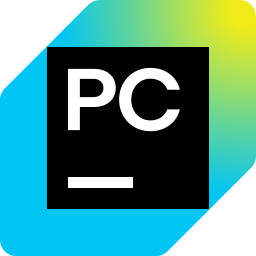
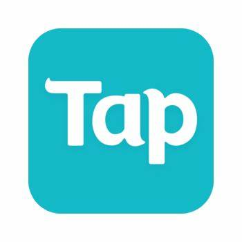

# Websites

This article showcases 115 websites bookmarked by abc202306.

Keywords: awesome list, website, github repo

## category

> [!Note]
> 
> | \# | [Category](#category) | [Site-Items](#site-items) | Icon |
> | --- | --- | --- | --- |
> | 1 | [acg](#1-acg) | [jiong-ci-yuan](#1-1-jiong-ci-yuan), [anidb](#1-2-anidb), [myanimelist](#1-3-myanimelist), [e-hentai](#1-4-e-hentai), [nhentai](#1-5-nhentai), [jmcomic](#1-6-jmcomic), [picaacg](#1-7-picaacg), [manhuaren](#1-8-manhuaren), [mihon](#1-9-mihon), [lanraragi](#1-10-lanraragi), [moegirl](#1-11-moegirl), [hmoegirl](#1-12-hmoegirl), [pixiv](#1-13-pixiv), [iwara](#1-14-iwara), [hanime](#1-15-hanime) |  |
> | 2 | [ai-chatbot](#2-ai-chatbot) | [deepseek](#2-1-deepseek), [microsoft-copilot](#2-2-microsoft-copilot), [chatgpt](#2-3-chatgpt), [gemini](#2-4-gemini), [claude](#2-5-claude), [github-copilot](#2-6-github-copilot), [quark-browser](#2-7-quark-browser), [tencent-yuanbao](#2-8-tencent-yuanbao), [doubao](#2-9-doubao), [qianwen](#2-10-qianwen), [bohrium](#2-11-bohrium), [kimi](#2-12-kimi), [bohrium](#2-13-bohrium) |  |
> | 3 | [appstore](#3-appstore) | [microsoft-store](#3-1-microsoft-store), [huorong-app-store](#3-2-huorong-app-store), [apkpure](#3-3-apkpure), [arora-store](#3-4-arora-store), [google-play](#3-5-google-play), [f-driod](#3-6-f-driod), [tencent-appstore](#3-7-tencent-appstore), [360-appstore](#3-8-360-appstore) |  |
> | 4 | [archive](#4-archive) | [e-hentai](#4-1-e-hentai), [nhentai](#4-2-nhentai), [jmcomic](#4-3-jmcomic), [picaacg](#4-4-picaacg) |  |
> | 5 | [authenticator](#5-authenticator) | [microsoft-authenticator](#5-1-microsoft-authenticator), [google-authenticator](#5-2-google-authenticator) |  |
> | 6 | [browser](#6-browser) | [google-chrome](#6-1-google-chrome), [microsoft-edge](#6-2-microsoft-edge), [mozilla-firefox](#6-3-mozilla-firefox), [tor-browser](#6-4-tor-browser), [uc-browser](#6-5-uc-browser), [quark-browser](#6-6-quark-browser) |  |
> | 7 | [cloud-disk](#7-cloud-disk) | [onedrive](#7-1-onedrive), [baidu-netdisk](#7-2-baidu-netdisk) |  |
> | 8 | [community](#8-community) | [pixiv](#8-1-pixiv) |  |
> | 9 | [database](#9-database) | [anidb](#9-1-anidb), [myanimelist](#9-2-myanimelist) |  |
> | 10 | [editor](#10-editor) | [typora](#10-1-typora), [visual-studio-code](#10-2-visual-studio-code), [visual-studio](#10-3-visual-studio), [vim](#10-4-vim), [intellij-idea](#10-5-intellij-idea), [pycharm](#10-6-pycharm), [webstorm](#10-7-webstorm), [android-studio](#10-8-android-studio), [hbuilder](#10-9-hbuilder), [cursor](#10-10-cursor), [trae](#10-11-trae), [emacs](#10-12-emacs) |  |
> | 11 | [email](#11-email) | [gmail](#11-1-gmail), [outlook-com](#11-2-outlook-com), [mail-ru](#11-3-mail-ru), [qq-mail](#11-4-qq-mail), [netease-mail](#11-5-netease-mail) |  |
> | 12 | [encyclopedia](#12-encyclopedia) | [wikipedia](#12-1-wikipedia), [baidu-baike](#12-2-baidu-baike), [moegirl](#12-3-moegirl), [hmoegirl](#12-4-hmoegirl), [wikihow](#12-5-wikihow), [mbalib-wiki](#12-6-mbalib-wiki), [noteapps-info](#12-7-noteapps-info) |  |
> | 13 | [forum](#13-forum) | [reddit](#13-1-reddit), [tieba](#13-2-tieba) |  |
> | 14 | [gallery](#14-gallery) | [e-hentai](#14-1-e-hentai), [nhentai](#14-2-nhentai), [jmcomic](#14-3-jmcomic), [picaacg](#14-4-picaacg), [manhuaren](#14-5-manhuaren) |  |
> | 15 | [gamestore](#15-gamestore) | [taptap](#15-1-taptap), [steam](#15-2-steam), [qqgame](#15-3-qqgame), [kuaiwan](#15-4-kuaiwan) |  |
> | 16 | [hentai](#16-hentai) | [e-hentai](#16-1-e-hentai), [nhentai](#16-2-nhentai), [jmcomic](#16-3-jmcomic), [picaacg](#16-4-picaacg), [iwara](#16-5-iwara), [hanime](#16-6-hanime) |  |
> | 17 | [instant-messaging](#17-instant-messaging) | [telegram](#17-1-telegram), [tencent-qq](#17-2-tencent-qq), [tencent-wechat](#17-3-tencent-wechat), [simplex](#17-4-simplex), [session](#17-5-session), [tamtam](#17-6-tamtam), [potato](#17-7-potato), [discord](#17-8-discord), [slack](#17-9-slack), [dingtalk](#17-10-dingtalk), [tencent-meeting](#17-11-tencent-meeting), [nekogram](#17-12-nekogram) |  |
> | 18 | [microblogging](#18-microblogging) | [twitter](#18-1-twitter), [misskey](#18-2-misskey), [nijimiss](#18-3-nijimiss) |  |
> | 19 | [note-taking](#19-note-taking) | [obsidian](#19-1-obsidian), [logseq](#19-2-logseq), [tiddlywiki](#19-3-tiddlywiki), [siyuan](#19-4-siyuan), [anytype](#19-5-anytype), [notion](#19-6-notion) |  |
> | 20 | [operating-system](#20-operating-system) | [windows-os](#20-1-windows-os), [macos](#20-2-macos), [linux](#20-3-linux), [ios](#20-4-ios), [android](#20-5-android) |  |
> | 21 | [password-manager](#21-password-manager) | [keepass](#21-1-keepass), [1password](#21-2-1password), [bitwardon](#21-3-bitwardon) |  |
> | 22 | [qa-system](#22-qa-system) | [quora](#22-1-quora), [zhihu](#22-2-zhihu) |  |
> | 23 | [reader](#23-reader) | [mihon](#23-1-mihon), [lanraragi](#23-2-lanraragi) |  |
> | 24 | [search-engine](#24-search-engine) | [google-search](#24-1-google-search), [baidu-search](#24-2-baidu-search), [bing-search](#24-3-bing-search), [yandex-search](#24-4-yandex-search), [chongbuluo-search](#24-5-chongbuluo-search), [saucenao-search](#24-6-saucenao-search), [soutubot-search](#24-7-soutubot-search) |  |
> | 25 | [version-control](#25-version-control) | [github](#25-1-github) |  |
> | 26 | [video-streaming](#26-video-streaming) | [jiong-ci-yuan](#26-1-jiong-ci-yuan), [youtube](#26-2-youtube), [bilibili](#26-3-bilibili), [iwara](#26-4-iwara), [hanime](#26-5-hanime), [douyin](#26-6-douyin), [kuaishou](#26-7-kuaishou) |  |
> | 27 | [web-hosting](#27-web-hosting) | [github](#27-1-github) |  |

### 1-acg

> [!Note]
> 
> #### Filter: [Category](#category): **acg**
> 
> | \# | [Site-Items](#site-items) | [Category](#category) | Icon |
> | --- | --- | --- | --- |
> | 1 | [jiong-ci-yuan](#1-1-jiong-ci-yuan) | [acg](#1-acg), [video-streaming](#26-video-streaming) |  |
> | 2 | [anidb](#1-2-anidb) | [acg](#1-acg), [database](#9-database) |  |
> | 3 | [myanimelist](#1-3-myanimelist) | [acg](#1-acg), [database](#9-database) |  |
> | 4 | [e-hentai](#1-4-e-hentai) | [acg](#1-acg), [archive](#4-archive), [gallery](#14-gallery), [hentai](#16-hentai) |  |
> | 5 | [nhentai](#1-5-nhentai) | [acg](#1-acg), [archive](#4-archive), [gallery](#14-gallery), [hentai](#16-hentai) |  |
> | 6 | [jmcomic](#1-6-jmcomic) | [acg](#1-acg), [archive](#4-archive), [gallery](#14-gallery), [hentai](#16-hentai) |  |
> | 7 | [picaacg](#1-7-picaacg) | [acg](#1-acg), [archive](#4-archive), [gallery](#14-gallery), [hentai](#16-hentai) |  |
> | 8 | [manhuaren](#1-8-manhuaren) | [acg](#1-acg), [gallery](#14-gallery) |  |
> | 9 | [mihon](#1-9-mihon) | [acg](#1-acg), [reader](#23-reader) |  |
> | 10 | [lanraragi](#1-10-lanraragi) | [acg](#1-acg), [reader](#23-reader) |  |
> | 11 | [moegirl](#1-11-moegirl) | [encyclopedia](#12-encyclopedia), [acg](#1-acg) |  |
> | 12 | [hmoegirl](#1-12-hmoegirl) | [encyclopedia](#12-encyclopedia), [acg](#1-acg) |  |
> | 13 | [pixiv](#1-13-pixiv) | [acg](#1-acg), [community](#8-community) |  |
> | 14 | [iwara](#1-14-iwara) | [video-streaming](#26-video-streaming), [acg](#1-acg), [hentai](#16-hentai) |  |
> | 15 | [hanime](#1-15-hanime) | [video-streaming](#26-video-streaming), [acg](#1-acg), [hentai](#16-hentai) |  |

#### 1-1-jiong-ci-yuan

> see: [囧次元](https://jcyapp.org/)

Jiongciyuan (囧次元) is an Android video streaming app focused on Japanese animation, allowing for real-time comments and interaction.  You can avoid frequent ads by watching free advertisements to earn temporary membership.

Categories: [acg](#1-acg), [video-streaming](#26-video-streaming)

#### 1-2-anidb

> see: [AniDB](https://anidb.net/)

Looking for information about Anime? AniDB is the right place for you. AniDB is a not-for-profit anime database providing you with all information reg...

Categories: [acg](#1-acg), [database](#9-database)

#### 1-3-myanimelist

> see: [MyAnimeList.net - Anime and Manga Database and Community](https://myanimelist.net/)

Welcome to MyAnimeList, the world's most active online anime and manga community and database. Join the online community, create your anime and manga list, read reviews, explore the forums, follow news, and so much more!   `{"keywords":"anime, myanimelist, anime news, manga"}`

Categories: [acg](#1-acg), [database](#9-database)

#### 1-4-e-hentai

> see: [E-Hentai Galleries - The Free Hentai Doujinshi, Manga and Image Gallery System](https://e-hentai.org/)

With more than a million absolutely free hentai doujinshi, manga, cosplay and CG galleries, E-Hentai Galleries is the world's largest free Hentai archive.

Categories: [acg](#1-acg), [archive](#4-archive), [gallery](#14-gallery), [hentai](#16-hentai)

#### 1-5-nhentai

> see: [nhentai: hentai doujinshi and manga](https://nhentai.net/)

nhentai is a free hentai manga and doujinshi reader with over 575,000 galleries to read and download. 

Categories: [acg](#1-acg), [archive](#4-archive), [gallery](#14-gallery), [hentai](#16-hentai)

#### 1-6-jmcomic

> see: [免費A漫 - 禁漫天堂](https://18comic.vip/)

免費A漫 - 免費成人H漫線上看

Categories: [acg](#1-acg), [archive](#4-archive), [gallery](#14-gallery), [hentai](#16-hentai)

#### 1-7-picaacg

> see: [嗶咔漫畫](https://www.picacomic.com/)

嗶咔漫畫讓你可以輕鬆看到不同的本子，介面美觀易用，分類齊全，每天更新，紳士必備！

Categories: [acg](#1-acg), [archive](#4-archive), [gallery](#14-gallery), [hentai](#16-hentai)

#### 1-8-manhuaren

> see: [漫画人 - 为爱漫画的人而生](https://www.manhuaren.com/)

漫画人：给你最好的掌上漫画应用体验，速度最快、最专业的漫画应用。  `{"author":"漫画人:为爱漫画的人而生、manhuaren.com","keywords":"漫画人：最好的掌上漫画应用"}`

Categories: [acg](#1-acg), [gallery](#14-gallery)

#### 1-9-mihon

> see: [Home | Mihon](https://mihon.app/)

Discover and read manga, webtoons, comics, and more – easier than ever on your Android device.

Categories: [acg](#1-acg), [reader](#23-reader)

#### 1-10-lanraragi

> see: [Difegue/LANraragi: Web application for archival and reading of manga/doujinshi. Lightweight and Docker-ready for NAS/servers.](https://github.com/Difegue/LANraragi)

application for archival and reading of manga/doujinshi. Lightweight and Docker-ready for NAS/servers.  `{"link":"lrr.tvc-16.science","Topics": "docker server perl management manga comics reader mojolicious opds doujinshi nas hacktoberfest sadpanda"}`

Categories: [acg](#1-acg), [reader](#23-reader)

#### 1-11-moegirl

> see: [萌娘百科 万物皆可萌的百科全书 - zh.moegirl.org.cn](https://mzh.moegirl.org.cn/Mainpage#/topics)

`{"keywords":"萌娘,百科,wiki,梗,娘化,萝莉,动画,漫画,动漫,游戏,音乐,宅腐,ACG,anime,comic,game,GalGame"}`

Categories: [encyclopedia](#12-encyclopedia), [acg](#1-acg)

#### 1-12-hmoegirl

> see: [H萌娘:关于 - H萌娘](https://hmoegirl.cyou/zh-hans/H%E8%90%8C%E5%A8%98:%E5%85%B3%E4%BA%8E)

H萌娘是一个关于H萌的wiki。  H萌娘的收录的条目要满足两点：既属于**H**（hentai/エロ）又属于**萌**（二次元）。  目前主要由 User:BakeWater 为H萌娘提供服务器方面的支持。

Categories: [encyclopedia](#12-encyclopedia), [acg](#1-acg)

#### 1-13-pixiv

> see: [插畫、漫畫、小說作品交流服務 [pixiv]](https://www.pixiv.net/)

Pixiv[a] (Japanese: ピクシブ, Hepburn: Pikushibu) is a Japanese online community for artists.

Categories: [acg](#1-acg), [community](#8-community)

#### 1-14-iwara

> see: [Iwara.tv will return](https://iwara.tv/)

Iwara.tv is niche website for MMD (MikuMikuDance) and R18 models.

Categories: [video-streaming](#26-video-streaming), [acg](#1-acg), [hentai](#16-hentai)

#### 1-15-hanime

> see: [Hanime1.me - H動漫/裏番/線上看](https://hanime1.me/)

Hanime1.me 帶給你最完美的H動漫、H動畫、裏番、里番、成人色情卡通片的線上看體驗，絕對沒有天殺的片頭廣告！

Categories: [video-streaming](#26-video-streaming), [acg](#1-acg), [hentai](#16-hentai)

### 2-ai-chatbot

> [!Note]
> 
> #### Filter: [Category](#category): **ai-chatbot**
> 
> | \# | [Site-Items](#site-items) | [Category](#category) | Icon |
> | --- | --- | --- | --- |
> | 1 | [deepseek](#2-1-deepseek) | [ai-chatbot](#2-ai-chatbot) |  |
> | 2 | [microsoft-copilot](#2-2-microsoft-copilot) | [ai-chatbot](#2-ai-chatbot) |  |
> | 3 | [chatgpt](#2-3-chatgpt) | [ai-chatbot](#2-ai-chatbot) |  |
> | 4 | [gemini](#2-4-gemini) | [ai-chatbot](#2-ai-chatbot) |  |
> | 5 | [claude](#2-5-claude) | [ai-chatbot](#2-ai-chatbot) |  |
> | 6 | [github-copilot](#2-6-github-copilot) | [ai-chatbot](#2-ai-chatbot) |  |
> | 7 | [quark-browser](#2-7-quark-browser) | [browser](#6-browser), [ai-chatbot](#2-ai-chatbot) |  |
> | 8 | [tencent-yuanbao](#2-8-tencent-yuanbao) | [ai-chatbot](#2-ai-chatbot) |  |
> | 9 | [doubao](#2-9-doubao) | [ai-chatbot](#2-ai-chatbot) |  |
> | 10 | [qianwen](#2-10-qianwen) | [ai-chatbot](#2-ai-chatbot) |  |
> | 11 | [bohrium](#2-11-bohrium) | [ai-chatbot](#2-ai-chatbot) |  |
> | 12 | [kimi](#2-12-kimi) | [ai-chatbot](#2-ai-chatbot) |  |
> | 13 | [bohrium](#2-13-bohrium) | [ai-chatbot](#2-ai-chatbot) |  |

#### 2-1-deepseek

> see: [DeepSeek | 深度求索](https://www.deepseek.com/)

深度求索（DeepSeek），成立于2023年，专注于研究世界领先的通用人工智能底层模型与技术，挑战人工智能前沿性难题。基于自研训练框架、自建智算集群和万卡算力等资源，深度求索团队仅用半年时间便已发布并开源多个百亿级参数大模型，如DeepSeek-LLM通用大语言模型、DeepSeek-Coder代码大模型，并在2024年1月率先开源国内首个MoE大模型（DeepSeek-MoE），各大模型在公开评测榜单及真实样本外的泛化效果均有超越同级别模型的出色表现。和 DeepSeek AI 对话，轻松接入 API。

Categories: [ai-chatbot](#2-ai-chatbot)

#### 2-2-microsoft-copilot

> see: [Microsoft Copilot: Your AI companion](https://copilot.microsoft.com/)

Microsoft Copilot is your companion to inform, entertain and inspire. Get advice, feedback and straightforward answers. Try Copilot now.

Categories: [ai-chatbot](#2-ai-chatbot)

#### 2-3-chatgpt

> see: [ChatGPT](https://chatgpt.com/)

ChatGPT helps you get answers, find inspiration, and be more productive.

Categories: [ai-chatbot](#2-ai-chatbot)

#### 2-4-gemini

> see: [Google Gemini](https://gemini.google.com/app)

Meet Gemini, Google’s AI assistant. Get help with writing, planning, brainstorming, and more. Experience the power of generative AI.

Categories: [ai-chatbot](#2-ai-chatbot)

#### 2-5-claude

> see: [Claude](https://claude.ai/onboarding)

Talk with Claude, an AI assistant from Anthropic

Categories: [ai-chatbot](#2-ai-chatbot)

#### 2-6-github-copilot

> see: [GitHub Copilot · Your AI pair programmer](https://github.com/features/copilot)

GitHub Copilot works alongside you directly in your editor, suggesting whole lines or entire functions for you.

Categories: [ai-chatbot](#2-ai-chatbot)

#### 2-7-quark-browser

> see: [夸克_阿里AI旗舰应用官网](https://www.quark.cn/)

夸克pc/app为你带来极速、智能、安全、高效的搜索体验,找答案,找资料,找工具,办公,学习,工作必备应用。夸克提供浏览器搜索引擎、网盘、AI扫描王工具及小说阅读等高效功能，为你提供稳定,安全,流畅的浏览环境和优质的产品服务体验

Categories: [browser](#6-browser), [ai-chatbot](#2-ai-chatbot)

#### 2-8-tencent-yuanbao

> see: [元宝-体验DeepSeek全新版-高效AI助手](https://yuanbao.tencent.com/)

来元宝，感受「DeepSeek+」智能新体验！联网搜索公众号、视频号等优质腾讯生态信源，搜得更准、答得更全；智能识图、拍题答疑等丰富能力，让工作学习生活更轻松高效

Categories: [ai-chatbot](#2-ai-chatbot)

#### 2-9-doubao

> see: [豆包 - 字节跳动旗下 AI 智能助手](https://www.doubao.com/chat/)

豆包是你的 AI 聊天智能对话问答助手，写作文案翻译编程全能工具。豆包为你答疑解惑，提供灵感，辅助创作，也可以和你畅聊任何你感兴趣的话题。

Categories: [ai-chatbot](#2-ai-chatbot)

#### 2-10-qianwen

> see: [千问-Qwen最新模型体验-通义千问](https://www.qianwen.com/)

千问是阿里通义千问大模型打造的AI对话助手，通义千问支持问答、写作、代码、翻译、录音、PPT创作、文档处理、音视频速读。

Categories: [ai-chatbot](#2-ai-chatbot)

#### 2-11-bohrium

> see: [Bohrium | AI for Science with Global Scientists](https://www.bohrium.com/)

Bohrium — AI for Science with global scientists. An AI-powered all-in-one research hub offering powerful academic search, comprehensive resources, and collaborative tools for reproducible research.

Categories: [ai-chatbot](#2-ai-chatbot)

#### 2-12-kimi

> see: [Kimi - K2长思考上线](https://www.kimi.com/)

Kimi K2长思考模式来了！支持多轮工具调用与思考，擅长数理逻辑难题，让搜索更广更准，帮你把想法化为清晰、富于创意、可用性高的文字与代码

Categories: [ai-chatbot](#2-ai-chatbot)

#### 2-13-bohrium

> see: [Bohrium | AI for Science with Global Scientists](https://www.bohrium.com/)

Bohrium — AI for Science with global scientists. An AI-powered all-in-one research hub offering powerful academic search, comprehensive resources, and collaborative tools for reproducible research.

Categories: [ai-chatbot](#2-ai-chatbot)

### 3-appstore

> [!Note]
> 
> #### Filter: [Category](#category): **appstore**
> 
> | \# | [Site-Items](#site-items) | [Category](#category) | Icon |
> | --- | --- | --- | --- |
> | 1 | [microsoft-store](#3-1-microsoft-store) | [appstore](#3-appstore) |  |
> | 2 | [huorong-app-store](#3-2-huorong-app-store) | [appstore](#3-appstore) |  |
> | 3 | [apkpure](#3-3-apkpure) | [appstore](#3-appstore) |  |
> | 4 | [arora-store](#3-4-arora-store) | [appstore](#3-appstore) |  |
> | 5 | [google-play](#3-5-google-play) | [appstore](#3-appstore) |  |
> | 6 | [f-driod](#3-6-f-driod) | [appstore](#3-appstore) |  |
> | 7 | [tencent-appstore](#3-7-tencent-appstore) | [appstore](#3-appstore) |  |
> | 8 | [360-appstore](#3-8-360-appstore) | [appstore](#3-appstore) |  |

#### 3-1-microsoft-store

> see: [Microsoft Store - Download apps, games & more for your Windows PC](https://apps.microsoft.com/home?hl=en-US&gl=US)

Explore the Microsoft Store for apps and games on Windows. Enjoy exclusive deals, new releases, and your favorite content all in one place.

Categories: [appstore](#3-appstore)

#### 3-2-huorong-app-store

> see: [应用商店-火绒安全](https://www.huorong.cn/app_store.html)

火绒应用商店是一款由火绒安全团队推出的一站式应用软件管理平台，秉持 “安全下载，绿色体验” 的理念，为用户提供干净、安全、可靠的应用下载管理服务。

Categories: [appstore](#3-appstore)

#### 3-3-apkpure

> see: [APKPure: Download APK on Android with Free APK Downloader](https://apkpure.com/)

APKPure is a free APK downloader for Android. It is safe, reliable, and virus-free. Use APKPure to easily download trending apps and games, and install APK/XAPK files to your Android device.

Categories: [appstore](#3-appstore)

#### 3-4-arora-store

> see: [Aurora](https://auroraoss.com/aurora-store)

Aurora OSS - Abode of opensource android apps

Categories: [appstore](#3-appstore)

#### 3-5-google-play

> see: [Android Apps on Google Play](https://play.google.com/store/games?device=windows)

Enjoy millions of the latest Android apps, games, music, movies, TV, books, magazines & more. Anytime, anywhere, across your devices.

Categories: [appstore](#3-appstore)

#### 3-6-f-driod

> see: [F-Droid - Free and Open Source Android App Repository](https://f-droid.org/)

F-Droid is an installable catalogue of FOSS (Free and Open Source Software) applications for the Android platform. The client makes it easy to browse, install, and keep track of updates on your device.

Categories: [appstore](#3-appstore)

#### 3-7-tencent-appstore

> see: [应用宝官网-全网最新最热手机应用游戏下载](https://sj.qq.com/)

应用宝是腾讯旗下官方手机app应用商店，致力于为您提供海量、优质、安全、最新的安卓应用游戏下载！

Categories: [appstore](#3-appstore)

#### 3-8-360-appstore

> see: [360手机助手](https://sj.360.cn/index.html)

360手机助手，8亿用户使用的安卓应用分发平台，年轻人都爱玩的手机助手。

Categories: [appstore](#3-appstore)

### 4-archive

> [!Note]
> 
> #### Filter: [Category](#category): **archive**
> 
> | \# | [Site-Items](#site-items) | [Category](#category) | Icon |
> | --- | --- | --- | --- |
> | 1 | [e-hentai](#4-1-e-hentai) | [acg](#1-acg), [archive](#4-archive), [gallery](#14-gallery), [hentai](#16-hentai) |  |
> | 2 | [nhentai](#4-2-nhentai) | [acg](#1-acg), [archive](#4-archive), [gallery](#14-gallery), [hentai](#16-hentai) |  |
> | 3 | [jmcomic](#4-3-jmcomic) | [acg](#1-acg), [archive](#4-archive), [gallery](#14-gallery), [hentai](#16-hentai) |  |
> | 4 | [picaacg](#4-4-picaacg) | [acg](#1-acg), [archive](#4-archive), [gallery](#14-gallery), [hentai](#16-hentai) |  |

#### 4-1-e-hentai

> see: [E-Hentai Galleries - The Free Hentai Doujinshi, Manga and Image Gallery System](https://e-hentai.org/)

With more than a million absolutely free hentai doujinshi, manga, cosplay and CG galleries, E-Hentai Galleries is the world's largest free Hentai archive.

Categories: [acg](#1-acg), [archive](#4-archive), [gallery](#14-gallery), [hentai](#16-hentai)

#### 4-2-nhentai

> see: [nhentai: hentai doujinshi and manga](https://nhentai.net/)

nhentai is a free hentai manga and doujinshi reader with over 575,000 galleries to read and download. 

Categories: [acg](#1-acg), [archive](#4-archive), [gallery](#14-gallery), [hentai](#16-hentai)

#### 4-3-jmcomic

> see: [免費A漫 - 禁漫天堂](https://18comic.vip/)

免費A漫 - 免費成人H漫線上看

Categories: [acg](#1-acg), [archive](#4-archive), [gallery](#14-gallery), [hentai](#16-hentai)

#### 4-4-picaacg

> see: [嗶咔漫畫](https://www.picacomic.com/)

嗶咔漫畫讓你可以輕鬆看到不同的本子，介面美觀易用，分類齊全，每天更新，紳士必備！

Categories: [acg](#1-acg), [archive](#4-archive), [gallery](#14-gallery), [hentai](#16-hentai)

### 5-authenticator

> [!Note]
> 
> #### Filter: [Category](#category): **authenticator**
> 
> | \# | [Site-Items](#site-items) | [Category](#category) | Icon |
> | --- | --- | --- | --- |
> | 1 | [microsoft-authenticator](#5-1-microsoft-authenticator) | [authenticator](#5-authenticator) |  |
> | 2 | [google-authenticator](#5-2-google-authenticator) | [authenticator](#5-authenticator) |  |

#### 5-1-microsoft-authenticator

> see: [Microsoft Authenticator - Apps on Google Play](https://play.google.com/store/apps/details?id=com.azure.authenticator&hl=en_US)

Safety starts with understanding how developers collect and share your data. Data privacy and security practices may vary based on your use, region, and age. The developer provided this information and may update it over time.

Categories: [authenticator](#5-authenticator)

#### 5-2-google-authenticator

> see: [Google Authenticator - Apps on Google Play](https://play.google.com/store/apps/details?id=com.google.android.apps.authenticator2&hl=en_US)

Safety starts with understanding how developers collect and share your data. Data privacy and security practices may vary based on your use, region, and age. The developer provided this information and may update it over time.

Categories: [authenticator](#5-authenticator)

### 6-browser

> [!Note]
> 
> #### Filter: [Category](#category): **browser**
> 
> | \# | [Site-Items](#site-items) | [Category](#category) | Icon |
> | --- | --- | --- | --- |
> | 1 | [google-chrome](#6-1-google-chrome) | [browser](#6-browser) |  |
> | 2 | [microsoft-edge](#6-2-microsoft-edge) | [browser](#6-browser) |  |
> | 3 | [mozilla-firefox](#6-3-mozilla-firefox) | [browser](#6-browser) |  |
> | 4 | [tor-browser](#6-4-tor-browser) | [browser](#6-browser) |  |
> | 5 | [uc-browser](#6-5-uc-browser) | [browser](#6-browser) |  |
> | 6 | [quark-browser](#6-6-quark-browser) | [browser](#6-browser), [ai-chatbot](#2-ai-chatbot) |  |

#### 6-1-google-chrome

> see: [Google Chrome – Download the fast, secure browser from Google](https://www.google.com/intl/en_uk/chrome/)

Get more done with the new Google Chrome. A more simple, secure and faster web browser than ever, with Google’s smarts built in. Download now.

Categories: [browser](#6-browser)

#### 6-2-microsoft-edge

> see: [Download Microsoft Edge: Windows, macOS, iOS & Android](https://www.microsoft.com/en-us/edge/download?form=MA13FJ)

Download Microsoft Edge for your computer or smartphone. Experience the cutting-edge AI Edge browser on your Windows, macOS, iOS, and Android device.

Categories: [browser](#6-browser)

#### 6-3-mozilla-firefox

> see: [Get Firefox for desktop — Firefox (US)](https://www.firefox.com/en-US/)

Mozilla Firefox, or simply Firefox, is a free and open source[12] web browser developed by the Mozilla Foundation and its subsidiary, the Mozilla Corporation.

Categories: [browser](#6-browser)

#### 6-4-tor-browser

> see: [Tor Project | Download](https://www.torproject.la/en/download/)

Download | Defend yourself against tracking and surveillance. Circumvent censorship.

Categories: [browser](#6-browser)

#### 6-5-uc-browser

> see: [UC Browser](https://www.ucweb.com/index.shtml)

Download UC Browser today and enjoy a faster, safer, and more private online experience. With built-in VPN protection and advanced ad blocking, we set a new standard for secure browsing.

Categories: [browser](#6-browser)

#### 6-6-quark-browser

> see: [夸克_阿里AI旗舰应用官网](https://www.quark.cn/)

夸克pc/app为你带来极速、智能、安全、高效的搜索体验,找答案,找资料,找工具,办公,学习,工作必备应用。夸克提供浏览器搜索引擎、网盘、AI扫描王工具及小说阅读等高效功能，为你提供稳定,安全,流畅的浏览环境和优质的产品服务体验

Categories: [browser](#6-browser), [ai-chatbot](#2-ai-chatbot)

### 7-cloud-disk

> [!Note]
> 
> #### Filter: [Category](#category): **cloud-disk**
> 
> | \# | [Site-Items](#site-items) | [Category](#category) | Icon |
> | --- | --- | --- | --- |
> | 1 | [onedrive](#7-1-onedrive) | [cloud-disk](#7-cloud-disk) |  |
> | 2 | [baidu-netdisk](#7-2-baidu-netdisk) | [cloud-disk](#7-cloud-disk) |  |

#### 7-1-onedrive

> see: [Home - OneDrive](https://onedrive.live.com/)

Microsoft OneDrive is a file-hosting service operated by Microsoft. First released as SkyDrive in August 2007, it allows registered users to store, share, back-up and synchronize their files. OneDrive also works as the storage backend of the web version of Microsoft 365. OneDrive offers 5 gigabytes of storage space free of charge, with 100 GB, 1 TB, and 6 TB storage options available, either separately or with Microsoft 365 subscriptions.

Categories: [cloud-disk](#7-cloud-disk)

#### 7-2-baidu-netdisk

> see: [百度网盘](https://pan.baidu.com/disk/main#/index?category=all)

百度网盘为您提供文件的网络备份、同步和分享服务。空间大、速度快、安全稳固，支持教育网加速，支持手机端。注册使用百度网盘即可享受免费存储空间

Categories: [cloud-disk](#7-cloud-disk)

### 8-community

> [!Note]
> 
> #### Filter: [Category](#category): **community**
> 
> | \# | [Site-Items](#site-items) | [Category](#category) | Icon |
> | --- | --- | --- | --- |
> | 1 | [pixiv](#8-1-pixiv) | [acg](#1-acg), [community](#8-community) |  |

#### 8-1-pixiv

> see: [插畫、漫畫、小說作品交流服務 [pixiv]](https://www.pixiv.net/)

Pixiv[a] (Japanese: ピクシブ, Hepburn: Pikushibu) is a Japanese online community for artists.

Categories: [acg](#1-acg), [community](#8-community)

### 9-database

> [!Note]
> 
> #### Filter: [Category](#category): **database**
> 
> | \# | [Site-Items](#site-items) | [Category](#category) | Icon |
> | --- | --- | --- | --- |
> | 1 | [anidb](#9-1-anidb) | [acg](#1-acg), [database](#9-database) |  |
> | 2 | [myanimelist](#9-2-myanimelist) | [acg](#1-acg), [database](#9-database) |  |

#### 9-1-anidb

> see: [AniDB](https://anidb.net/)

Looking for information about Anime? AniDB is the right place for you. AniDB is a not-for-profit anime database providing you with all information reg...

Categories: [acg](#1-acg), [database](#9-database)

#### 9-2-myanimelist

> see: [MyAnimeList.net - Anime and Manga Database and Community](https://myanimelist.net/)

Welcome to MyAnimeList, the world's most active online anime and manga community and database. Join the online community, create your anime and manga list, read reviews, explore the forums, follow news, and so much more!   `{"keywords":"anime, myanimelist, anime news, manga"}`

Categories: [acg](#1-acg), [database](#9-database)

### 10-editor

> [!Note]
> 
> #### Filter: [Category](#category): **editor**
> 
> | \# | [Site-Items](#site-items) | [Category](#category) | Icon |
> | --- | --- | --- | --- |
> | 1 | [typora](#10-1-typora) | [editor](#10-editor) |  |
> | 2 | [visual-studio-code](#10-2-visual-studio-code) | [editor](#10-editor) |  |
> | 3 | [visual-studio](#10-3-visual-studio) | [editor](#10-editor) |  |
> | 4 | [vim](#10-4-vim) | [editor](#10-editor) |  |
> | 5 | [intellij-idea](#10-5-intellij-idea) | [editor](#10-editor) |  |
> | 6 | [pycharm](#10-6-pycharm) | [editor](#10-editor) |  |
> | 7 | [webstorm](#10-7-webstorm) | [editor](#10-editor) |  |
> | 8 | [android-studio](#10-8-android-studio) | [editor](#10-editor) |  |
> | 9 | [hbuilder](#10-9-hbuilder) | [editor](#10-editor) |  |
> | 10 | [cursor](#10-10-cursor) | [editor](#10-editor) |  |
> | 11 | [trae](#10-11-trae) | [editor](#10-editor) |  |
> | 12 | [emacs](#10-12-emacs) | [editor](#10-editor) |  |

#### 10-1-typora

> see: [Typora — simple yet powerful Markdown reader.](https://typora.io/)

Typora is a cross-platform minimal markdown editor, providing seamless experience for both markdown readers and writers.

Categories: [editor](#10-editor)

#### 10-2-visual-studio-code

> see: [Visual Studio Code - The open source AI code editor](https://code.visualstudio.com/)

Visual Studio Code redefines AI-powered coding with GitHub Copilot for building and debugging modern web and cloud applications. Visual Studio Code is free and available on your favorite platform - Linux, macOS, and Windows.

Categories: [editor](#10-editor)

#### 10-3-visual-studio

> see: [Visual Studio: IDE and Code Editor for Software Development](https://visualstudio.microsoft.com/)

Visual Studio dev tools & services make app development easy for any developer, on any platform & language. Develop with our code editor or IDE anywhere for free.

Categories: [editor](#10-editor)

#### 10-4-vim

> see: [welcome home : vim online](https://www.vim.org/)

Vim is a highly configurable text editor built to make creating and changing any kind of text very efficient. It is included as "vi" with most UNIX systems and with Apple OS X.

Categories: [editor](#10-editor)

#### 10-5-intellij-idea

> see: [The Leading IDE for Professional Java and Kotlin Development](https://www.jetbrains.com/idea/)

IntelliJ IDEA is the JetBrains IDE for pro development in Java and Kotlin. Built for your comfort, it unlocks productivity, ensures quality code, supports cutting-edge tech, and protects your privacy.

Categories: [editor](#10-editor)

#### 10-6-pycharm

> see: [PyCharm: The only Python IDE you need](https://www.jetbrains.com/pycharm/)

Built for web, data, and AI/ML professionals. Supercharged with an AI-enhanced IDE experience.

Categories: [editor](#10-editor)

#### 10-7-webstorm

> see: [WebStorm: The JavaScript and TypeScript IDE, by JetBrains](https://www.jetbrains.com/webstorm/)

Make development more productive and enjoyable with WebStorm, the IDE for JavaScript and related technologies.

Categories: [editor](#10-editor)

#### 10-8-android-studio

> see: [Download Android Studio & App Tools - Android Developers](https://developer.android.com/studio)

Android Studio provides app builders with an integrated development environment (IDE) optimized for Android apps. Download Android Studio today.

Categories: [editor](#10-editor)

#### 10-9-hbuilder

> see: [HBuilderX - a superpowered IDE for Vue](https://www.dcloud.io/hbuilderx.html)

HBuilderX is the fastest HTML development tool. Powerful code assistant helps you complete development quickly. The complete syntax library and browser compatibility function will improve your development efficiency.

Categories: [editor](#10-editor)

#### 10-10-cursor

> see: [Cursor](https://cursor.com/)

Built to make you extraordinarily productive, Cursor is the best way to code with AI.

Categories: [editor](#10-editor)

#### 10-11-trae

> see: [TRAE - The Real AI Engineer | TRAE - The Real AI Engineer](https://www.trae.cn/)

TRAE AI IDE | 国内首款 AI 原生集成开发环境，深度集成 Doubao-1.5-pro 与 DeepSeek 模型，支持中文自然语言一键生成完整代码框架，实时预览前端效果并智能修复 BUG。首创 Builder 模式实现需求到代码的自动化开发，兼容 Windows/macOS 系统，官网下载即用。

Categories: [editor](#10-editor)

#### 10-12-emacs

> see: [GNU Emacs - GNU Project](https://www.gnu.org/software/emacs/)

An extensible, customizable, free/libre text editor — and more. At its core is an interpreter for Emacs Lisp, a dialect of the Lisp programming language with extensions to support text editing.

Categories: [editor](#10-editor)

### 11-email

> [!Note]
> 
> #### Filter: [Category](#category): **email**
> 
> | \# | [Site-Items](#site-items) | [Category](#category) | Icon |
> | --- | --- | --- | --- |
> | 1 | [gmail](#11-1-gmail) | [email](#11-email) |  |
> | 2 | [outlook-com](#11-2-outlook-com) | [email](#11-email) |  |
> | 3 | [mail-ru](#11-3-mail-ru) | [email](#11-email) |  |
> | 4 | [qq-mail](#11-4-qq-mail) | [email](#11-email) |  |
> | 5 | [netease-mail](#11-5-netease-mail) | [email](#11-email) |  |

#### 11-1-gmail

> see: [Gmail: Private and secure email at no cost | Google Workspace](https://workspace.google.com/gmail/)

Discover how Gmail keeps your account & emails encrypted, private and under your control with the largest secure email service in the world.

Categories: [email](#11-email)

#### 11-2-outlook-com

> see: [What is Outlook? - Microsoft Support](https://support.microsoft.com/en-us/office/what-is-outlook-10f1fa35-f33a-4cb7-838c-a7f3e6228b20)

With Outlook on your PC, Mac or mobile device, you can:<ul><li>Organize email to let you focus on the messages that matter most.</li><li>Manage and share your calendar to schedule meetings with ease.</li><li>Share files from the cloud so recipients always have the latest version.</li><li>Stay connected and productive wherever you are.</li></ul>

Categories: [email](#11-email)

#### 11-3-mail-ru

> see: [Mail: Почта, Облако, Календарь, Заметки, Покупки — сервисы для работы и жизни](https://mail.ru/)

Mail — безопасные сервисы для жизни и работы: бесплатная Почта, память для всего в Облаке, лёгкое планирование в Календаре и быстрые записи в Заметках. Мобильная версия и приложение — используйте, как удобно

Categories: [email](#11-email)

#### 11-4-qq-mail

> see: [登录QQ邮箱](https://wx.mail.qq.com/)

QQ邮箱，提供qq.com、foxmail.com后缀的安全、稳定、快速、便捷的免费电子邮箱。强大的反垃圾邮件过滤，10G超大附件发送，便捷记事和日历功能，轻松管理所有电子发票，尽在QQ邮箱。

Categories: [email](#11-email)

#### 11-5-netease-mail

> see: [网易免费邮箱 - 你的专业电子邮局](https://email.163.com/)

网易免费邮箱，你的专业电子邮局，提供以 @163.com、@126.com和@yeah.net 为后缀的免费邮箱。超过20年邮箱运营经验，系统快速稳定安全，支持超大附件和网盘服务。网易邮箱官方App“邮箱大师”帮您高效处理邮件，支持所有邮箱，并可在手机、Windows和Mac上多端协同使用。

Categories: [email](#11-email)

### 12-encyclopedia

> [!Note]
> 
> #### Filter: [Category](#category): **encyclopedia**
> 
> | \# | [Site-Items](#site-items) | [Category](#category) | Icon |
> | --- | --- | --- | --- |
> | 1 | [wikipedia](#12-1-wikipedia) | [encyclopedia](#12-encyclopedia) |  |
> | 2 | [baidu-baike](#12-2-baidu-baike) | [encyclopedia](#12-encyclopedia) |  |
> | 3 | [moegirl](#12-3-moegirl) | [encyclopedia](#12-encyclopedia), [acg](#1-acg) |  |
> | 4 | [hmoegirl](#12-4-hmoegirl) | [encyclopedia](#12-encyclopedia), [acg](#1-acg) |  |
> | 5 | [wikihow](#12-5-wikihow) | [encyclopedia](#12-encyclopedia) |  |
> | 6 | [mbalib-wiki](#12-6-mbalib-wiki) | [encyclopedia](#12-encyclopedia) |  |
> | 7 | [noteapps-info](#12-7-noteapps-info) | [encyclopedia](#12-encyclopedia) |  |

#### 12-1-wikipedia

> see: [Wikipedia](https://www.wikipedia.org/)

Wikipedia is a free online encyclopedia, created and edited by volunteers around the world and hosted by the Wikimedia Foundation.

Categories: [encyclopedia](#12-encyclopedia)

#### 12-2-baidu-baike

> see: [百度百科_全球领先的中文百科全书](https://baike.baidu.com/)

百度百科是一部内容开放、自由的网络百科全书，旨在创造一个涵盖所有领域知识，服务所有互联网用户的中文知识性百科全书。在这里你可以参与词条编辑，分享贡献你的知识。  `{"keywords":"百科, 百度百科, 中文百科, 百科全书"}`

Categories: [encyclopedia](#12-encyclopedia)

#### 12-3-moegirl

> see: [萌娘百科 万物皆可萌的百科全书 - zh.moegirl.org.cn](https://mzh.moegirl.org.cn/Mainpage#/topics)

`{"keywords":"萌娘,百科,wiki,梗,娘化,萝莉,动画,漫画,动漫,游戏,音乐,宅腐,ACG,anime,comic,game,GalGame"}`

Categories: [encyclopedia](#12-encyclopedia), [acg](#1-acg)

#### 12-4-hmoegirl

> see: [H萌娘:关于 - H萌娘](https://hmoegirl.cyou/zh-hans/H%E8%90%8C%E5%A8%98:%E5%85%B3%E4%BA%8E)

H萌娘是一个关于H萌的wiki。  H萌娘的收录的条目要满足两点：既属于**H**（hentai/エロ）又属于**萌**（二次元）。  目前主要由 User:BakeWater 为H萌娘提供服务器方面的支持。

Categories: [encyclopedia](#12-encyclopedia), [acg](#1-acg)

#### 12-5-wikihow

> see: [wikiHow: How-to instructions you can trust.](https://www.wikihow.com/Main-Page)

Learn how to do anything with wikiHow, the world's most popular how-to website. Easy, well-researched, and trustworthy instructions for everything you want to know.

Categories: [encyclopedia](#12-encyclopedia)

#### 12-6-mbalib-wiki

> see: [MBA智库百科，全球专业中文经管百科](https://wiki.mbalib.com/wiki/%E9%A6%96%E9%A1%B5)

MBA智库百科，专注于经济管理领域知识的创建与分享。包括企业管理、市场营销、管理咨询、人力资源、战略管理、MBA案例、财务会计、广告、品牌、经济、金融、法律、博弈论、证券、股票以及公司企业、商学院、经管人物等介绍。  `{"keywords":"首页,2023年诺贝尔经济学奖,2024年《福布斯》全球亿万富豪排行榜,5W2H分析法,GTD,INFJ,Warren Buffett,东方甄选“小作文”事件,乔尔·莫基尔,价值共创,传统能源,MBA,MBA智库,管理,营销,经济,金融,人力资源,管理咨询,广告,财务,会计,品牌,证券,股票,物流,贸易,商学院,法律,人物"}`

Categories: [encyclopedia](#12-encyclopedia)

#### 12-7-noteapps-info

> see: [NoteApps.info: 41 best note taking apps analyzed over 343 features](https://noteapps.info/)

Encyclopedia of note taking apps: Screenshots, feature lists, and pricing for popular note taking apps.

Categories: [encyclopedia](#12-encyclopedia)

### 13-forum

> [!Note]
> 
> #### Filter: [Category](#category): **forum**
> 
> | \# | [Site-Items](#site-items) | [Category](#category) | Icon |
> | --- | --- | --- | --- |
> | 1 | [reddit](#13-1-reddit) | [forum](#13-forum) |  |
> | 2 | [tieba](#13-2-tieba) | [forum](#13-forum) |  |

#### 13-1-reddit

> see: [Reddit - The heart of the internet](https://www.reddit.com/)

Reddit is where millions of people gather for conversations about the things they care about, in over 100,000 subreddit communities.

Categories: [forum](#13-forum)

#### 13-2-tieba

> see: [百度贴吧——全球领先的中文社区](https://tieba.baidu.com/)

百度贴吧——全球领先的中文社区。贴吧的使命是让志同道合的人相聚。不论是大众话题还是小众话题，都能精准地聚集大批同好网友，展示自我风采，结交知音，搭建别具特色的“兴趣主题“互动平台。贴吧目录涵盖游戏、地区、文学、动漫、娱乐明星、生活、体育、电脑数码等方方面面，是全球领先的中文交流平台，它为人们提供一个表达和交流思想的自由网络空间，并以此汇集志同道合的网友。

Categories: [forum](#13-forum)

### 14-gallery

> [!Note]
> 
> #### Filter: [Category](#category): **gallery**
> 
> | \# | [Site-Items](#site-items) | [Category](#category) | Icon |
> | --- | --- | --- | --- |
> | 1 | [e-hentai](#14-1-e-hentai) | [acg](#1-acg), [archive](#4-archive), [gallery](#14-gallery), [hentai](#16-hentai) |  |
> | 2 | [nhentai](#14-2-nhentai) | [acg](#1-acg), [archive](#4-archive), [gallery](#14-gallery), [hentai](#16-hentai) |  |
> | 3 | [jmcomic](#14-3-jmcomic) | [acg](#1-acg), [archive](#4-archive), [gallery](#14-gallery), [hentai](#16-hentai) |  |
> | 4 | [picaacg](#14-4-picaacg) | [acg](#1-acg), [archive](#4-archive), [gallery](#14-gallery), [hentai](#16-hentai) |  |
> | 5 | [manhuaren](#14-5-manhuaren) | [acg](#1-acg), [gallery](#14-gallery) |  |

#### 14-1-e-hentai

> see: [E-Hentai Galleries - The Free Hentai Doujinshi, Manga and Image Gallery System](https://e-hentai.org/)

With more than a million absolutely free hentai doujinshi, manga, cosplay and CG galleries, E-Hentai Galleries is the world's largest free Hentai archive.

Categories: [acg](#1-acg), [archive](#4-archive), [gallery](#14-gallery), [hentai](#16-hentai)

#### 14-2-nhentai

> see: [nhentai: hentai doujinshi and manga](https://nhentai.net/)

nhentai is a free hentai manga and doujinshi reader with over 575,000 galleries to read and download. 

Categories: [acg](#1-acg), [archive](#4-archive), [gallery](#14-gallery), [hentai](#16-hentai)

#### 14-3-jmcomic

> see: [免費A漫 - 禁漫天堂](https://18comic.vip/)

免費A漫 - 免費成人H漫線上看

Categories: [acg](#1-acg), [archive](#4-archive), [gallery](#14-gallery), [hentai](#16-hentai)

#### 14-4-picaacg

> see: [嗶咔漫畫](https://www.picacomic.com/)

嗶咔漫畫讓你可以輕鬆看到不同的本子，介面美觀易用，分類齊全，每天更新，紳士必備！

Categories: [acg](#1-acg), [archive](#4-archive), [gallery](#14-gallery), [hentai](#16-hentai)

#### 14-5-manhuaren

> see: [漫画人 - 为爱漫画的人而生](https://www.manhuaren.com/)

漫画人：给你最好的掌上漫画应用体验，速度最快、最专业的漫画应用。  `{"author":"漫画人:为爱漫画的人而生、manhuaren.com","keywords":"漫画人：最好的掌上漫画应用"}`

Categories: [acg](#1-acg), [gallery](#14-gallery)

### 15-gamestore

> [!Note]
> 
> #### Filter: [Category](#category): **gamestore**
> 
> | \# | [Site-Items](#site-items) | [Category](#category) | Icon |
> | --- | --- | --- | --- |
> | 1 | [taptap](#15-1-taptap) | [gamestore](#15-gamestore) |  |
> | 2 | [steam](#15-2-steam) | [gamestore](#15-gamestore) |  |
> | 3 | [qqgame](#15-3-qqgame) | [gamestore](#15-gamestore) |  |
> | 4 | [kuaiwan](#15-4-kuaiwan) | [gamestore](#15-gamestore) |  |

#### 15-1-taptap

> see: [TapTap - 发现好游戏](https://www.taptap.cn/)

TapTap 专为中国手游玩家打造的推荐高品质手游的分享社区。我们拥有超过 2 万款可玩游戏，超过 1 亿玩家在我们平台上完成了 30 亿次游戏下载，发布了超过 3500 万条真实客观的游戏评价，并为玩家提供了 50 万篇优质内容。目前已有超过 10 万个游戏开发者入驻了 TapTap 玩家社区。立即下载 TapTap，与我们一起体验最顶级的手游乐趣吧！

Categories: [gamestore](#15-gamestore)

#### 15-2-steam

> see: [Welcome to Steam](https://store.steampowered.com/)

Steam is the ultimate destination for playing, discussing, and creating games.

Categories: [gamestore](#15-gamestore)

#### 15-3-qqgame

> see: [QQ游戏_QQ游戏大全_游戏下载_QQ游戏官网](https://qqgame.qq.com/)

QQ游戏大厅官网，下载QQ游戏大厅，玩QQ游戏全游戏；

Categories: [gamestore](#15-gamestore)

#### 15-4-kuaiwan

> see: [kuaiwan-快玩-快玩游戏-快玩网页游戏-最齐全的网页游戏大全-我电脑里的全能网页游戏机]](https://www.kuaiwan.com/)

快玩网页游戏是最齐全的网页游戏大全，这里有最好玩的网页游戏，以及最新网页游戏开服信息，凡人修真2，神曲，王者召唤，神魔仙界，武林叁，醉西游，大侠传，神仙道，龙将，热血海贼王，斗破苍穹2，侠武英雄传，英雄远征，英雄王座，梦幻飞仙，百炼成仙，梦幻修仙，

Categories: [gamestore](#15-gamestore)

### 16-hentai

> [!Note]
> 
> #### Filter: [Category](#category): **hentai**
> 
> | \# | [Site-Items](#site-items) | [Category](#category) | Icon |
> | --- | --- | --- | --- |
> | 1 | [e-hentai](#16-1-e-hentai) | [acg](#1-acg), [archive](#4-archive), [gallery](#14-gallery), [hentai](#16-hentai) |  |
> | 2 | [nhentai](#16-2-nhentai) | [acg](#1-acg), [archive](#4-archive), [gallery](#14-gallery), [hentai](#16-hentai) |  |
> | 3 | [jmcomic](#16-3-jmcomic) | [acg](#1-acg), [archive](#4-archive), [gallery](#14-gallery), [hentai](#16-hentai) |  |
> | 4 | [picaacg](#16-4-picaacg) | [acg](#1-acg), [archive](#4-archive), [gallery](#14-gallery), [hentai](#16-hentai) |  |
> | 5 | [iwara](#16-5-iwara) | [video-streaming](#26-video-streaming), [acg](#1-acg), [hentai](#16-hentai) |  |
> | 6 | [hanime](#16-6-hanime) | [video-streaming](#26-video-streaming), [acg](#1-acg), [hentai](#16-hentai) |  |

#### 16-1-e-hentai

> see: [E-Hentai Galleries - The Free Hentai Doujinshi, Manga and Image Gallery System](https://e-hentai.org/)

With more than a million absolutely free hentai doujinshi, manga, cosplay and CG galleries, E-Hentai Galleries is the world's largest free Hentai archive.

Categories: [acg](#1-acg), [archive](#4-archive), [gallery](#14-gallery), [hentai](#16-hentai)

#### 16-2-nhentai

> see: [nhentai: hentai doujinshi and manga](https://nhentai.net/)

nhentai is a free hentai manga and doujinshi reader with over 575,000 galleries to read and download. 

Categories: [acg](#1-acg), [archive](#4-archive), [gallery](#14-gallery), [hentai](#16-hentai)

#### 16-3-jmcomic

> see: [免費A漫 - 禁漫天堂](https://18comic.vip/)

免費A漫 - 免費成人H漫線上看

Categories: [acg](#1-acg), [archive](#4-archive), [gallery](#14-gallery), [hentai](#16-hentai)

#### 16-4-picaacg

> see: [嗶咔漫畫](https://www.picacomic.com/)

嗶咔漫畫讓你可以輕鬆看到不同的本子，介面美觀易用，分類齊全，每天更新，紳士必備！

Categories: [acg](#1-acg), [archive](#4-archive), [gallery](#14-gallery), [hentai](#16-hentai)

#### 16-5-iwara

> see: [Iwara.tv will return](https://iwara.tv/)

Iwara.tv is niche website for MMD (MikuMikuDance) and R18 models.

Categories: [video-streaming](#26-video-streaming), [acg](#1-acg), [hentai](#16-hentai)

#### 16-6-hanime

> see: [Hanime1.me - H動漫/裏番/線上看](https://hanime1.me/)

Hanime1.me 帶給你最完美的H動漫、H動畫、裏番、里番、成人色情卡通片的線上看體驗，絕對沒有天殺的片頭廣告！

Categories: [video-streaming](#26-video-streaming), [acg](#1-acg), [hentai](#16-hentai)

### 17-instant-messaging

> [!Note]
> 
> #### Filter: [Category](#category): **instant-messaging**
> 
> | \# | [Site-Items](#site-items) | [Category](#category) | Icon |
> | --- | --- | --- | --- |
> | 1 | [telegram](#17-1-telegram) | [instant-messaging](#17-instant-messaging) |  |
> | 2 | [tencent-qq](#17-2-tencent-qq) | [instant-messaging](#17-instant-messaging) |  |
> | 3 | [tencent-wechat](#17-3-tencent-wechat) | [instant-messaging](#17-instant-messaging) |  |
> | 4 | [simplex](#17-4-simplex) | [instant-messaging](#17-instant-messaging) |  |
> | 5 | [session](#17-5-session) | [instant-messaging](#17-instant-messaging) |  |
> | 6 | [tamtam](#17-6-tamtam) | [instant-messaging](#17-instant-messaging) |  |
> | 7 | [potato](#17-7-potato) | [instant-messaging](#17-instant-messaging) |  |
> | 8 | [discord](#17-8-discord) | [instant-messaging](#17-instant-messaging) |  |
> | 9 | [slack](#17-9-slack) | [instant-messaging](#17-instant-messaging) |  |
> | 10 | [dingtalk](#17-10-dingtalk) | [instant-messaging](#17-instant-messaging) |  |
> | 11 | [tencent-meeting](#17-11-tencent-meeting) | [instant-messaging](#17-instant-messaging) |  |
> | 12 | [nekogram](#17-12-nekogram) | [instant-messaging](#17-instant-messaging) |  |

#### 17-1-telegram

> see: [Telegram Messenger](https://telegram.org/)

Fast. Secure. Powerful.

Categories: [instant-messaging](#17-instant-messaging)

#### 17-2-tencent-qq

> see: [QQ-轻松做自己](https://im.qq.com/index/)

腾讯QQ，全新版本QQ9上线了！ QQ9，不仅是轻松聊天，更是兴趣社区的聚集地。欢迎下载体验最新版本QQ，体验最新功能！欢迎访问QQ官网，下载新版QQ，了解QQ最新功能就在im.qq.com。

Categories: [instant-messaging](#17-instant-messaging)

#### 17-3-tencent-wechat

> see: [WeChat - Free messaging and calling app](https://www.wechat.com/)

Available for all kinds of platforms; enjoy group chat; support voice, photo, video and text messages.

Categories: [instant-messaging](#17-instant-messaging)

#### 17-4-simplex

> see: [SimpleX Chat: private and secure messenger without any user IDs (not even random)](https://simplex.chat/)

SimpleX Chat - a private and encrypted messenger without any user IDs (not even random ones)! Make a private connection via link / QR code to send messages and make calls.

Categories: [instant-messaging](#17-instant-messaging)

#### 17-5-session

> see: [Session | Send Messages, Not Metadata. | Private Messenger](https://getsession.org/)

Session is a private messenger that aims to remove any chance of metadata collection by routing all messages through an onion routing network.

Categories: [instant-messaging](#17-instant-messaging)

#### 17-6-tamtam

> see: [About messenger | TamTam](https://about.tamtam.chat/en/)

General info about TamTam messenger

Categories: [instant-messaging](#17-instant-messaging)

#### 17-7-potato

> see: [Potato](https://www.potato.im/)

Potato is an instant messenger focused on security. It is faster, more secure, more open and completely free. Available on IOS, Android, Windows , MacOS and Linux. You can create super groups with 200,000 members, super channels, support voice and video calls, send photos, send videos, stickers and Gifs, and there is no file size limit, etc. It provides you with full privacy settings and the most secure and stable chat environment. Moreover, Potato is an expert in protecting your digital currency.

Categories: [instant-messaging](#17-instant-messaging)

#### 17-8-discord

> see: [Discord - Group Chat That’s All Fun & Games](https://discord.com/)

Discord is great for playing games and chilling with friends, or even building a worldwide community. Customize your own space to talk, play, and hang out.

Categories: [instant-messaging](#17-instant-messaging)

#### 17-9-slack

> see: [Slack | AI Work Platform & Productivity Tools](https://slack.com/)

Boost productivity and save time with Slack‌ — ‌the AI work platform for managing projects, automating workflows, and connecting teams securely. Start working smarter today.

Categories: [instant-messaging](#17-instant-messaging)

#### 17-10-dingtalk

> see: [DingTalk, Make It Happen](https://www.dingtalk.com/en)

DingTalk — The AI Workplace Platform for Teams; DingTalk is an AI-powered collaboration platform trusted by over 700 million users and 26 million organizations worldwide.

Categories: [instant-messaging](#17-instant-messaging)

#### 17-11-tencent-meeting

> see: [腾讯会议官方——腾讯会议 会开会](https://meeting.tencent.com/)

基于腾讯20多年音视频通讯经验，腾讯会议提供一站式音视频会议解决方案，让您能随时随地体验高清流畅的会议以及会议协作。

Categories: [instant-messaging](#17-instant-messaging)

#### 17-12-nekogram

> see: [Nekogram | Open-source third-party Telegram client with few but useful mods](https://nekogram.app/)

Open-source third-party Telegram client with few but useful mods

Categories: [instant-messaging](#17-instant-messaging)

### 18-microblogging

> [!Note]
> 
> #### Filter: [Category](#category): **microblogging**
> 
> | \# | [Site-Items](#site-items) | [Category](#category) | Icon |
> | --- | --- | --- | --- |
> | 1 | [twitter](#18-1-twitter) | [microblogging](#18-microblogging) |  |
> | 2 | [misskey](#18-2-misskey) | [microblogging](#18-microblogging) |  |
> | 3 | [nijimiss](#18-3-nijimiss) | [microblogging](#18-microblogging) |  |

#### 18-1-twitter

> see: [About X | Our company and priorities](https://about.x.com/en)

We serve the public conversation. Learn more about X the company, and how we ensure people have a free and safe place to talk.

Categories: [microblogging](#18-microblogging)

#### 18-2-misskey

> see: [Misskey Hub – Official website of the Misskey Project](https://misskey-hub.net/en/)

This is the official site for Misskey, a decentralized social networking software. Find out how to get started, a list of servers, and lots more information about Misskey!

Categories: [microblogging](#18-microblogging)

#### 18-3-nijimiss

> see: [にじみす.moe](https://nijimiss.moe/)

💞あらゆる好きが交差する💞  好きを語れるオープンコミュニティ  好きなことを堂々と胸を張って好きといえる空間を作りたい。 そういった思いから生まれたSNSです。

Categories: [microblogging](#18-microblogging)

### 19-note-taking

> [!Note]
> 
> #### Filter: [Category](#category): **note-taking**
> 
> | \# | [Site-Items](#site-items) | [Category](#category) | Icon |
> | --- | --- | --- | --- |
> | 1 | [obsidian](#19-1-obsidian) | [note-taking](#19-note-taking) |  |
> | 2 | [logseq](#19-2-logseq) | [note-taking](#19-note-taking) |  |
> | 3 | [tiddlywiki](#19-3-tiddlywiki) | [note-taking](#19-note-taking) |  |
> | 4 | [siyuan](#19-4-siyuan) | [note-taking](#19-note-taking) |  |
> | 5 | [anytype](#19-5-anytype) | [note-taking](#19-note-taking) |  |
> | 6 | [notion](#19-6-notion) | [note-taking](#19-note-taking) |  |

#### 19-1-obsidian

> see: [Obsidian - Sharpen your thinking](https://obsidian.md/)

The free and flexible app for your private thoughts.

Categories: [note-taking](#19-note-taking)

#### 19-2-logseq

> see: [Logseq: A privacy-first, open-source knowledge base](https://logseq.com/)

A privacy-first, open-source platform for knowledge management and collaboration.

Categories: [note-taking](#19-note-taking)

#### 19-3-tiddlywiki

> see: [TiddlyWiki  v5.3.8](https://tiddlywiki.com/)

a non-linear personal web notebook

Categories: [note-taking](#19-note-taking)

#### 19-4-siyuan

> see: [SiYuan - Privacy-first personal knowledge management system that supports Markdown, block-level ref, and bidirectional links](https://b3log.org/siyuan/en/)

SiYuan - Privacy-first personal knowledge management system that supports Markdown, block-level ref, and bidirectional links

Categories: [note-taking](#19-note-taking)

#### 19-5-anytype

> see: [anytype — the everything app](https://anytype.io/)

for those who celebrate trust & autonomy.

Categories: [note-taking](#19-note-taking)

#### 19-6-notion

> see: [The AI workspace that works for you. | Notion](https://www.notion.com/product)

Build custom agents, search across all your apps, and automate busywork. The AI workspace where teams get more done, faster.

Categories: [note-taking](#19-note-taking)

### 20-operating-system

> [!Note]
> 
> #### Filter: [Category](#category): **operating-system**
> 
> | \# | [Site-Items](#site-items) | [Category](#category) | Icon |
> | --- | --- | --- | --- |
> | 1 | [windows-os](#20-1-windows-os) | [operating-system](#20-operating-system) |  |
> | 2 | [macos](#20-2-macos) | [operating-system](#20-operating-system) |  |
> | 3 | [linux](#20-3-linux) | [operating-system](#20-operating-system) |  |
> | 4 | [ios](#20-4-ios) | [operating-system](#20-operating-system) |  |
> | 5 | [android](#20-5-android) | [operating-system](#20-operating-system) |  |

#### 20-1-windows-os

> see: [Experience the Power of AI with Windows 11 OS, Computers, & Apps | Microsoft Windows](https://www.microsoft.com/en-us/windows/)

Experience the latest Microsoft Windows 11 features. Learn how our latest Windows OS gives you more ways to work, play, and create.

Categories: [operating-system](#20-operating-system)

#### 20-2-macos

> see: [OS - macOS Tahoe - Apple](https://www.apple.com/os/macos/)

macOS Tahoe with a new design, more ways to work seamlessly across devices, and new features to turbocharge productivity every day.

Categories: [operating-system](#20-operating-system)

#### 20-3-linux

> see: [Download Linux | Linux.org](https://www.linux.org/pages/download/)

Links to popular distribution download pages

Categories: [operating-system](#20-operating-system)

#### 20-4-ios

> see: [OS - iOS 26 - Apple](https://www.apple.com/os/ios/)

iOS 26 for iPhone with a new design, more helpful Apple Intelligence, polls and backgrounds in Messages, and features that make every day effortless.

Categories: [operating-system](#20-operating-system)

#### 20-5-android

> see: [Android Open Source Project](https://source.android.com/)

Android unites the world! Use the open source Android operating system to power your device.

Categories: [operating-system](#20-operating-system)

### 21-password-manager

> [!Note]
> 
> #### Filter: [Category](#category): **password-manager**
> 
> | \# | [Site-Items](#site-items) | [Category](#category) | Icon |
> | --- | --- | --- | --- |
> | 1 | [keepass](#21-1-keepass) | [password-manager](#21-password-manager) |  |
> | 2 | [1password](#21-2-1password) | [password-manager](#21-password-manager) |  |
> | 3 | [bitwardon](#21-3-bitwardon) | [password-manager](#21-password-manager) |  |

#### 21-1-keepass

> see: [KeePass Password Safe](https://keepass.info/)

KeePass is a free open source password manager. Passwords can be stored in an encrypted database, which can be unlocked with one master key.

Categories: [password-manager](#21-password-manager)

#### 21-2-1password

> see: [Password Manager & Extended Access Management - 1Password - 1Password](https://1password.com/)

More than a password manager and leader in Extended Access Management. Secure all sign-ins to every application from any device with 1Password.

Categories: [password-manager](#21-password-manager)

#### 21-3-bitwardon

> see: [Best Password Manager for Business, Enterprise & Personall - Bitwarden](https://bitwarden.com/)

Bitwarden is the most trusted password manager for passwords and passkeys at home or at work, on any browser or device. Start with a free trial.

Categories: [password-manager](#21-password-manager)

### 22-qa-system

> [!Note]
> 
> #### Filter: [Category](#category): **qa-system**
> 
> | \# | [Site-Items](#site-items) | [Category](#category) | Icon |
> | --- | --- | --- | --- |
> | 1 | [quora](#22-1-quora) | [qa-system](#22-qa-system) |  |
> | 2 | [zhihu](#22-2-zhihu) | [qa-system](#22-qa-system) |  |

#### 22-1-quora

> see: [Quora](https://www.quora.com/)

Quora is an American social question-and-answer website and online knowledge market headquartered in Mountain View, California. It was founded on June 25, 2009, and made available to the public on June 21, 2010. Users can post questions, answer questions, and comment on answers that have been submitted by other users. As of 2020, the website was visited by 300 million users a month.

Categories: [qa-system](#22-qa-system)

#### 22-2-zhihu

> see: [知乎 - 有问题，就会有答案](https://www.zhihu.com/)

知乎，中文互联网高质量的问答社区和创作者聚集的原创内容平台，于 2011 年 1 月正式上线，以「让人们更好的分享知识、经验和见解，找到自己的解答」为品牌使命。知乎凭借认真、专业、友善的社区氛围、独特的产品机制以及结构化和易获得的优质内容，聚集了中文互联网科技、商业、影视、时尚、文化等领域最具创造力的人群，已成为综合性、全品类、在诸多领域具有关键影响力的知识分享社区和创作者聚集的原创内容平台，建立起了以社区驱动的内容变现商业模式。

Categories: [qa-system](#22-qa-system)

### 23-reader

> [!Note]
> 
> #### Filter: [Category](#category): **reader**
> 
> | \# | [Site-Items](#site-items) | [Category](#category) | Icon |
> | --- | --- | --- | --- |
> | 1 | [mihon](#23-1-mihon) | [acg](#1-acg), [reader](#23-reader) |  |
> | 2 | [lanraragi](#23-2-lanraragi) | [acg](#1-acg), [reader](#23-reader) |  |

#### 23-1-mihon

> see: [Home | Mihon](https://mihon.app/)

Discover and read manga, webtoons, comics, and more – easier than ever on your Android device.

Categories: [acg](#1-acg), [reader](#23-reader)

#### 23-2-lanraragi

> see: [Difegue/LANraragi: Web application for archival and reading of manga/doujinshi. Lightweight and Docker-ready for NAS/servers.](https://github.com/Difegue/LANraragi)

application for archival and reading of manga/doujinshi. Lightweight and Docker-ready for NAS/servers.  `{"link":"lrr.tvc-16.science","Topics": "docker server perl management manga comics reader mojolicious opds doujinshi nas hacktoberfest sadpanda"}`

Categories: [acg](#1-acg), [reader](#23-reader)

### 24-search-engine

> [!Note]
> 
> #### Filter: [Category](#category): **search-engine**
> 
> | \# | [Site-Items](#site-items) | [Category](#category) | Icon |
> | --- | --- | --- | --- |
> | 1 | [google-search](#24-1-google-search) | [search-engine](#24-search-engine) |  |
> | 2 | [baidu-search](#24-2-baidu-search) | [search-engine](#24-search-engine) |  |
> | 3 | [bing-search](#24-3-bing-search) | [search-engine](#24-search-engine) |  |
> | 4 | [yandex-search](#24-4-yandex-search) | [search-engine](#24-search-engine) |  |
> | 5 | [chongbuluo-search](#24-5-chongbuluo-search) | [search-engine](#24-search-engine) |  |
> | 6 | [saucenao-search](#24-6-saucenao-search) | [search-engine](#24-search-engine) |  |
> | 7 | [soutubot-search](#24-7-soutubot-search) | [search-engine](#24-search-engine) |  |

#### 24-1-google-search

> see: [Google](https://www.google.com)

Google Search (also known simply as Google or Google.com) is a search engine operated by Google. It allows users to search for information on the Internet by entering keywords or phrases. Google Search uses algorithms to analyze and rank websites based on their relevance to the search query. It is the most popular search engine worldwide.

Categories: [search-engine](#24-search-engine)

#### 24-2-baidu-search

> see: [百度一下，你就知道](https://www.baidu.com/)

全球领先的中文搜索引擎、致力于让网民更便捷地获取信息，找到所求。百度超过千亿的中文网页数据库，可以瞬间找到相关的搜索结果。

Categories: [search-engine](#24-search-engine)

#### 24-3-bing-search

> see: [Search - Microsoft Bing](https://www.bing.com/)

Search with Microsoft Bing and use the power of AI to find information, explore webpages, images, videos, maps, and more. A smart search engine for the forever curious.

Categories: [search-engine](#24-search-engine)

#### 24-4-yandex-search

> see: [Yandex — fast Internet search](https://yandex.com)

Yandex is a technology company that builds intelligent products and services powered by machine learning.

Categories: [search-engine](#24-search-engine)

#### 24-5-chongbuluo-search

> see: [虫部落 - 让搜索更简单](https://www.chongbuluo.com/)

虫部落是一个纯粹的搜索知识、技术和经验分享平台，虫部落快搜、虫部落学术搜索等搜索聚合工具均为虫部落原创出品，搜索世界的乐趣，就在虫部落！

Categories: [search-engine](#24-search-engine)

#### 24-6-saucenao-search

> see: [About SauceNAO](https://saucenao.com/about.html)

SauceNAO is a reverse image search engine. The name 'SauceNAO' is derived from a slang form of "Need to know the source of this Now!" which has found common usage on image boards and other similar sites.

Categories: [search-engine](#24-search-engine)

#### 24-7-soutubot-search

> see: [搜图Bot酱](https://soutubot.moe/)

大家好（ﾉ>ω<)ﾉ这里是搜图bot酱网页版~ 可局部搜图NH内的本子，欢迎大家来测试~  如果大家觉得好用的话就请麻烦宣传和赞助一下吧~

Categories: [search-engine](#24-search-engine)

### 25-version-control

> [!Note]
> 
> #### Filter: [Category](#category): **version-control**
> 
> | \# | [Site-Items](#site-items) | [Category](#category) | Icon |
> | --- | --- | --- | --- |
> | 1 | [github](#25-1-github) | [web-hosting](#27-web-hosting), [version-control](#25-version-control) |  |

#### 25-1-github

> see: [GitHub · Change is constant. GitHub keeps you ahead.](https://github.com/home)

Join the world's most widely adopted, AI-powered developer platform where millions of developers, businesses, and the largest open source community build software that advances humanity.

Categories: [web-hosting](#27-web-hosting), [version-control](#25-version-control)

### 26-video-streaming

> [!Note]
> 
> #### Filter: [Category](#category): **video-streaming**
> 
> | \# | [Site-Items](#site-items) | [Category](#category) | Icon |
> | --- | --- | --- | --- |
> | 1 | [jiong-ci-yuan](#26-1-jiong-ci-yuan) | [acg](#1-acg), [video-streaming](#26-video-streaming) |  |
> | 2 | [youtube](#26-2-youtube) | [video-streaming](#26-video-streaming) |  |
> | 3 | [bilibili](#26-3-bilibili) | [video-streaming](#26-video-streaming) |  |
> | 4 | [iwara](#26-4-iwara) | [video-streaming](#26-video-streaming), [acg](#1-acg), [hentai](#16-hentai) |  |
> | 5 | [hanime](#26-5-hanime) | [video-streaming](#26-video-streaming), [acg](#1-acg), [hentai](#16-hentai) |  |
> | 6 | [douyin](#26-6-douyin) | [video-streaming](#26-video-streaming) |  |
> | 7 | [kuaishou](#26-7-kuaishou) | [video-streaming](#26-video-streaming) |  |

#### 26-1-jiong-ci-yuan

> see: [囧次元](https://jcyapp.org/)

Jiongciyuan (囧次元) is an Android video streaming app focused on Japanese animation, allowing for real-time comments and interaction.  You can avoid frequent ads by watching free advertisements to earn temporary membership.

Categories: [acg](#1-acg), [video-streaming](#26-video-streaming)

#### 26-2-youtube

> see: [YouTube](https://www.youtube.com/)

Enjoy the videos and music you love, upload original content, and share it all with friends, family, and the world on YouTube.

Categories: [video-streaming](#26-video-streaming)

#### 26-3-bilibili

> see: [哔哩哔哩 (゜-゜)つロ 干杯~-bilibili](https://www.bilibili.com/)

哔哩哔哩（bilibili.com)是国内知名的视频弹幕网站，这里有及时的动漫新番，活跃的ACG氛围，有创意的Up主。大家可以在这里找到许多欢乐。

Categories: [video-streaming](#26-video-streaming)

#### 26-4-iwara

> see: [Iwara.tv will return](https://iwara.tv/)

Iwara.tv is niche website for MMD (MikuMikuDance) and R18 models.

Categories: [video-streaming](#26-video-streaming), [acg](#1-acg), [hentai](#16-hentai)

#### 26-5-hanime

> see: [Hanime1.me - H動漫/裏番/線上看](https://hanime1.me/)

Hanime1.me 帶給你最完美的H動漫、H動畫、裏番、里番、成人色情卡通片的線上看體驗，絕對沒有天殺的片頭廣告！

Categories: [video-streaming](#26-video-streaming), [acg](#1-acg), [hentai](#16-hentai)

#### 26-6-douyin

> see: [抖音-记录美好生活](https://www.douyin.com/)

海量优质视频内容，涵盖游戏、二次元、美食、音乐、知识、体育运动、旅行、生活等各类题材，系列合集内容连续看，有用又有趣，无论是休闲解压、消遣下饭，还是发现爱好、获取知识，你想要的好内容，都在抖音精选。

Categories: [video-streaming](#26-video-streaming)

#### 26-7-kuaishou

> see: [快手](https://www.kuaishou.com/new-reco)

快手是一款国民级短视频App，了解真实世界，认识有趣的人，记录真实而有趣的自己，拥抱每一种生活。

Categories: [video-streaming](#26-video-streaming)

### 27-web-hosting

> [!Note]
> 
> #### Filter: [Category](#category): **web-hosting**
> 
> | \# | [Site-Items](#site-items) | [Category](#category) | Icon |
> | --- | --- | --- | --- |
> | 1 | [github](#27-1-github) | [web-hosting](#27-web-hosting), [version-control](#25-version-control) |  |

#### 27-1-github

> see: [GitHub · Change is constant. GitHub keeps you ahead.](https://github.com/home)

Join the world's most widely adopted, AI-powered developer platform where millions of developers, businesses, and the largest open source community build software that advances humanity.

Categories: [web-hosting](#27-web-hosting), [version-control](#25-version-control)

## site-items

> [!Note]
> 
> | \# | [Site-Items](#site-items) | [Category](#category) | Icon |
> | --- | --- | --- | --- |
> | 1 | [1password](#0-1-1password) | [password-manager](#21-password-manager) |  |
> | 2 | [360-appstore](#0-2-360-appstore) | [appstore](#3-appstore) |  |
> | 3 | [android](#0-3-android) | [operating-system](#20-operating-system) |  |
> | 4 | [android-studio](#0-4-android-studio) | [editor](#10-editor) |  |
> | 5 | [anidb](#0-5-anidb) | [acg](#1-acg), [database](#9-database) |  |
> | 6 | [anytype](#0-6-anytype) | [note-taking](#19-note-taking) |  |
> | 7 | [apkpure](#0-7-apkpure) | [appstore](#3-appstore) |  |
> | 8 | [arora-store](#0-8-arora-store) | [appstore](#3-appstore) |  |
> | 9 | [baidu-baike](#0-9-baidu-baike) | [encyclopedia](#12-encyclopedia) |  |
> | 10 | [baidu-netdisk](#0-10-baidu-netdisk) | [cloud-disk](#7-cloud-disk) |  |
> | 11 | [baidu-search](#0-11-baidu-search) | [search-engine](#24-search-engine) |  |
> | 12 | [bilibili](#0-12-bilibili) | [video-streaming](#26-video-streaming) |  |
> | 13 | [bing-search](#0-13-bing-search) | [search-engine](#24-search-engine) |  |
> | 14 | [bitwardon](#0-14-bitwardon) | [password-manager](#21-password-manager) |  |
> | 15 | [bohrium](#0-15-bohrium) | [ai-chatbot](#2-ai-chatbot) |  |
> | 16 | [chatgpt](#0-16-chatgpt) | [ai-chatbot](#2-ai-chatbot) |  |
> | 17 | [chongbuluo-search](#0-17-chongbuluo-search) | [search-engine](#24-search-engine) |  |
> | 18 | [claude](#0-18-claude) | [ai-chatbot](#2-ai-chatbot) |  |
> | 19 | [cursor](#0-19-cursor) | [editor](#10-editor) |  |
> | 20 | [deepseek](#0-20-deepseek) | [ai-chatbot](#2-ai-chatbot) |  |
> | 21 | [dingtalk](#0-21-dingtalk) | [instant-messaging](#17-instant-messaging) |  |
> | 22 | [discord](#0-22-discord) | [instant-messaging](#17-instant-messaging) |  |
> | 23 | [doubao](#0-23-doubao) | [ai-chatbot](#2-ai-chatbot) |  |
> | 24 | [douyin](#0-24-douyin) | [video-streaming](#26-video-streaming) |  |
> | 25 | [e-hentai](#0-25-e-hentai) | [acg](#1-acg), [archive](#4-archive), [gallery](#14-gallery), [hentai](#16-hentai) |  |
> | 26 | [emacs](#0-26-emacs) | [editor](#10-editor) |  |
> | 27 | [f-driod](#0-27-f-driod) | [appstore](#3-appstore) |  |
> | 28 | [gemini](#0-28-gemini) | [ai-chatbot](#2-ai-chatbot) |  |
> | 29 | [github](#0-29-github) | [web-hosting](#27-web-hosting), [version-control](#25-version-control) |  |
> | 30 | [github-copilot](#0-30-github-copilot) | [ai-chatbot](#2-ai-chatbot) |  |
> | 31 | [gmail](#0-31-gmail) | [email](#11-email) |  |
> | 32 | [google-authenticator](#0-32-google-authenticator) | [authenticator](#5-authenticator) |  |
> | 33 | [google-chrome](#0-33-google-chrome) | [browser](#6-browser) |  |
> | 34 | [google-play](#0-34-google-play) | [appstore](#3-appstore) |  |
> | 35 | [google-search](#0-35-google-search) | [search-engine](#24-search-engine) |  |
> | 36 | [hanime](#0-36-hanime) | [video-streaming](#26-video-streaming), [acg](#1-acg), [hentai](#16-hentai) |  |
> | 37 | [hbuilder](#0-37-hbuilder) | [editor](#10-editor) |  |
> | 38 | [hmoegirl](#0-38-hmoegirl) | [encyclopedia](#12-encyclopedia), [acg](#1-acg) |  |
> | 39 | [huorong-app-store](#0-39-huorong-app-store) | [appstore](#3-appstore) |  |
> | 40 | [intellij-idea](#0-40-intellij-idea) | [editor](#10-editor) |  |
> | 41 | [ios](#0-41-ios) | [operating-system](#20-operating-system) |  |
> | 42 | [iwara](#0-42-iwara) | [video-streaming](#26-video-streaming), [acg](#1-acg), [hentai](#16-hentai) |  |
> | 43 | [jiong-ci-yuan](#0-43-jiong-ci-yuan) | [acg](#1-acg), [video-streaming](#26-video-streaming) |  |
> | 44 | [jmcomic](#0-44-jmcomic) | [acg](#1-acg), [archive](#4-archive), [gallery](#14-gallery), [hentai](#16-hentai) |  |
> | 45 | [keepass](#0-45-keepass) | [password-manager](#21-password-manager) |  |
> | 46 | [kimi](#0-46-kimi) | [ai-chatbot](#2-ai-chatbot) |  |
> | 47 | [kuaishou](#0-47-kuaishou) | [video-streaming](#26-video-streaming) |  |
> | 48 | [kuaiwan](#0-48-kuaiwan) | [gamestore](#15-gamestore) |  |
> | 49 | [lanraragi](#0-49-lanraragi) | [acg](#1-acg), [reader](#23-reader) |  |
> | 50 | [linux](#0-50-linux) | [operating-system](#20-operating-system) |  |
> | 51 | [logseq](#0-51-logseq) | [note-taking](#19-note-taking) |  |
> | 52 | [macos](#0-52-macos) | [operating-system](#20-operating-system) |  |
> | 53 | [mail-ru](#0-53-mail-ru) | [email](#11-email) |  |
> | 54 | [manhuaren](#0-54-manhuaren) | [acg](#1-acg), [gallery](#14-gallery) |  |
> | 55 | [mbalib-wiki](#0-55-mbalib-wiki) | [encyclopedia](#12-encyclopedia) |  |
> | 56 | [microsoft-authenticator](#0-56-microsoft-authenticator) | [authenticator](#5-authenticator) |  |
> | 57 | [microsoft-copilot](#0-57-microsoft-copilot) | [ai-chatbot](#2-ai-chatbot) |  |
> | 58 | [microsoft-edge](#0-58-microsoft-edge) | [browser](#6-browser) |  |
> | 59 | [microsoft-store](#0-59-microsoft-store) | [appstore](#3-appstore) |  |
> | 60 | [mihon](#0-60-mihon) | [acg](#1-acg), [reader](#23-reader) |  |
> | 61 | [misskey](#0-61-misskey) | [microblogging](#18-microblogging) |  |
> | 62 | [moegirl](#0-62-moegirl) | [encyclopedia](#12-encyclopedia), [acg](#1-acg) |  |
> | 63 | [mozilla-firefox](#0-63-mozilla-firefox) | [browser](#6-browser) |  |
> | 64 | [myanimelist](#0-64-myanimelist) | [acg](#1-acg), [database](#9-database) |  |
> | 65 | [nekogram](#0-65-nekogram) | [instant-messaging](#17-instant-messaging) |  |
> | 66 | [netease-mail](#0-66-netease-mail) | [email](#11-email) |  |
> | 67 | [nhentai](#0-67-nhentai) | [acg](#1-acg), [archive](#4-archive), [gallery](#14-gallery), [hentai](#16-hentai) |  |
> | 68 | [nijimiss](#0-68-nijimiss) | [microblogging](#18-microblogging) |  |
> | 69 | [noteapps-info](#0-69-noteapps-info) | [encyclopedia](#12-encyclopedia) |  |
> | 70 | [notion](#0-70-notion) | [note-taking](#19-note-taking) |  |
> | 71 | [obsidian](#0-71-obsidian) | [note-taking](#19-note-taking) |  |
> | 72 | [onedrive](#0-72-onedrive) | [cloud-disk](#7-cloud-disk) |  |
> | 73 | [outlook-com](#0-73-outlook-com) | [email](#11-email) |  |
> | 74 | [picaacg](#0-74-picaacg) | [acg](#1-acg), [archive](#4-archive), [gallery](#14-gallery), [hentai](#16-hentai) |  |
> | 75 | [pixiv](#0-75-pixiv) | [acg](#1-acg), [community](#8-community) |  |
> | 76 | [potato](#0-76-potato) | [instant-messaging](#17-instant-messaging) |  |
> | 77 | [pycharm](#0-77-pycharm) | [editor](#10-editor) |  |
> | 78 | [qianwen](#0-78-qianwen) | [ai-chatbot](#2-ai-chatbot) |  |
> | 79 | [qq-mail](#0-79-qq-mail) | [email](#11-email) |  |
> | 80 | [qqgame](#0-80-qqgame) | [gamestore](#15-gamestore) |  |
> | 81 | [quark-browser](#0-81-quark-browser) | [browser](#6-browser), [ai-chatbot](#2-ai-chatbot) |  |
> | 82 | [quora](#0-82-quora) | [qa-system](#22-qa-system) |  |
> | 83 | [reddit](#0-83-reddit) | [forum](#13-forum) |  |
> | 84 | [saucenao-search](#0-84-saucenao-search) | [search-engine](#24-search-engine) |  |
> | 85 | [session](#0-85-session) | [instant-messaging](#17-instant-messaging) |  |
> | 86 | [simplex](#0-86-simplex) | [instant-messaging](#17-instant-messaging) |  |
> | 87 | [siyuan](#0-87-siyuan) | [note-taking](#19-note-taking) |  |
> | 88 | [slack](#0-88-slack) | [instant-messaging](#17-instant-messaging) |  |
> | 89 | [soutubot-search](#0-89-soutubot-search) | [search-engine](#24-search-engine) |  |
> | 90 | [steam](#0-90-steam) | [gamestore](#15-gamestore) |  |
> | 91 | [tamtam](#0-91-tamtam) | [instant-messaging](#17-instant-messaging) |  |
> | 92 | [taptap](#0-92-taptap) | [gamestore](#15-gamestore) |  |
> | 93 | [telegram](#0-93-telegram) | [instant-messaging](#17-instant-messaging) |  |
> | 94 | [tencent-appstore](#0-94-tencent-appstore) | [appstore](#3-appstore) |  |
> | 95 | [tencent-meeting](#0-95-tencent-meeting) | [instant-messaging](#17-instant-messaging) |  |
> | 96 | [tencent-qq](#0-96-tencent-qq) | [instant-messaging](#17-instant-messaging) |  |
> | 97 | [tencent-wechat](#0-97-tencent-wechat) | [instant-messaging](#17-instant-messaging) |  |
> | 98 | [tencent-yuanbao](#0-98-tencent-yuanbao) | [ai-chatbot](#2-ai-chatbot) |  |
> | 99 | [tiddlywiki](#0-99-tiddlywiki) | [note-taking](#19-note-taking) |  |
> | 100 | [tieba](#0-100-tieba) | [forum](#13-forum) |  |
> | 101 | [tor-browser](#0-101-tor-browser) | [browser](#6-browser) |  |
> | 102 | [trae](#0-102-trae) | [editor](#10-editor) |  |
> | 103 | [twitter](#0-103-twitter) | [microblogging](#18-microblogging) |  |
> | 104 | [typora](#0-104-typora) | [editor](#10-editor) |  |
> | 105 | [uc-browser](#0-105-uc-browser) | [browser](#6-browser) |  |
> | 106 | [vim](#0-106-vim) | [editor](#10-editor) |  |
> | 107 | [visual-studio](#0-107-visual-studio) | [editor](#10-editor) |  |
> | 108 | [visual-studio-code](#0-108-visual-studio-code) | [editor](#10-editor) |  |
> | 109 | [webstorm](#0-109-webstorm) | [editor](#10-editor) |  |
> | 110 | [wikihow](#0-110-wikihow) | [encyclopedia](#12-encyclopedia) |  |
> | 111 | [wikipedia](#0-111-wikipedia) | [encyclopedia](#12-encyclopedia) |  |
> | 112 | [windows-os](#0-112-windows-os) | [operating-system](#20-operating-system) |  |
> | 113 | [yandex-search](#0-113-yandex-search) | [search-engine](#24-search-engine) |  |
> | 114 | [youtube](#0-114-youtube) | [video-streaming](#26-video-streaming) |  |
> | 115 | [zhihu](#0-115-zhihu) | [qa-system](#22-qa-system) |  |

### 0-1-1password

> see: [Password Manager & Extended Access Management - 1Password - 1Password](https://1password.com/)

More than a password manager and leader in Extended Access Management. Secure all sign-ins to every application from any device with 1Password.

Categories: [password-manager](#21-password-manager)

### 0-2-360-appstore

> see: [360手机助手](https://sj.360.cn/index.html)

360手机助手，8亿用户使用的安卓应用分发平台，年轻人都爱玩的手机助手。

Categories: [appstore](#3-appstore)

### 0-3-android

> see: [Android Open Source Project](https://source.android.com/)

Android unites the world! Use the open source Android operating system to power your device.

Categories: [operating-system](#20-operating-system)

### 0-4-android-studio

> see: [Download Android Studio & App Tools - Android Developers](https://developer.android.com/studio)

Android Studio provides app builders with an integrated development environment (IDE) optimized for Android apps. Download Android Studio today.

Categories: [editor](#10-editor)

### 0-5-anidb

> see: [AniDB](https://anidb.net/)

Looking for information about Anime? AniDB is the right place for you. AniDB is a not-for-profit anime database providing you with all information reg...

Categories: [acg](#1-acg), [database](#9-database)

### 0-6-anytype

> see: [anytype — the everything app](https://anytype.io/)

for those who celebrate trust & autonomy.

Categories: [note-taking](#19-note-taking)

### 0-7-apkpure

> see: [APKPure: Download APK on Android with Free APK Downloader](https://apkpure.com/)

APKPure is a free APK downloader for Android. It is safe, reliable, and virus-free. Use APKPure to easily download trending apps and games, and install APK/XAPK files to your Android device.

Categories: [appstore](#3-appstore)

### 0-8-arora-store

> see: [Aurora](https://auroraoss.com/aurora-store)

Aurora OSS - Abode of opensource android apps

Categories: [appstore](#3-appstore)

### 0-9-baidu-baike

> see: [百度百科_全球领先的中文百科全书](https://baike.baidu.com/)

百度百科是一部内容开放、自由的网络百科全书，旨在创造一个涵盖所有领域知识，服务所有互联网用户的中文知识性百科全书。在这里你可以参与词条编辑，分享贡献你的知识。  `{"keywords":"百科, 百度百科, 中文百科, 百科全书"}`

Categories: [encyclopedia](#12-encyclopedia)

### 0-10-baidu-netdisk

> see: [百度网盘](https://pan.baidu.com/disk/main#/index?category=all)

百度网盘为您提供文件的网络备份、同步和分享服务。空间大、速度快、安全稳固，支持教育网加速，支持手机端。注册使用百度网盘即可享受免费存储空间

Categories: [cloud-disk](#7-cloud-disk)

### 0-11-baidu-search

> see: [百度一下，你就知道](https://www.baidu.com/)

全球领先的中文搜索引擎、致力于让网民更便捷地获取信息，找到所求。百度超过千亿的中文网页数据库，可以瞬间找到相关的搜索结果。

Categories: [search-engine](#24-search-engine)

### 0-12-bilibili

> see: [哔哩哔哩 (゜-゜)つロ 干杯~-bilibili](https://www.bilibili.com/)

哔哩哔哩（bilibili.com)是国内知名的视频弹幕网站，这里有及时的动漫新番，活跃的ACG氛围，有创意的Up主。大家可以在这里找到许多欢乐。

Categories: [video-streaming](#26-video-streaming)

### 0-13-bing-search

> see: [Search - Microsoft Bing](https://www.bing.com/)

Search with Microsoft Bing and use the power of AI to find information, explore webpages, images, videos, maps, and more. A smart search engine for the forever curious.

Categories: [search-engine](#24-search-engine)

### 0-14-bitwardon

> see: [Best Password Manager for Business, Enterprise & Personall - Bitwarden](https://bitwarden.com/)

Bitwarden is the most trusted password manager for passwords and passkeys at home or at work, on any browser or device. Start with a free trial.

Categories: [password-manager](#21-password-manager)

### 0-15-bohrium

> see: [Bohrium | AI for Science with Global Scientists](https://www.bohrium.com/)

Bohrium — AI for Science with global scientists. An AI-powered all-in-one research hub offering powerful academic search, comprehensive resources, and collaborative tools for reproducible research.

Categories: [ai-chatbot](#2-ai-chatbot)

### 0-16-chatgpt

> see: [ChatGPT](https://chatgpt.com/)

ChatGPT helps you get answers, find inspiration, and be more productive.

Categories: [ai-chatbot](#2-ai-chatbot)

### 0-17-chongbuluo-search

> see: [虫部落 - 让搜索更简单](https://www.chongbuluo.com/)

虫部落是一个纯粹的搜索知识、技术和经验分享平台，虫部落快搜、虫部落学术搜索等搜索聚合工具均为虫部落原创出品，搜索世界的乐趣，就在虫部落！

Categories: [search-engine](#24-search-engine)

### 0-18-claude

> see: [Claude](https://claude.ai/onboarding)

Talk with Claude, an AI assistant from Anthropic

Categories: [ai-chatbot](#2-ai-chatbot)

### 0-19-cursor

> see: [Cursor](https://cursor.com/)

Built to make you extraordinarily productive, Cursor is the best way to code with AI.

Categories: [editor](#10-editor)

### 0-20-deepseek

> see: [DeepSeek | 深度求索](https://www.deepseek.com/)

深度求索（DeepSeek），成立于2023年，专注于研究世界领先的通用人工智能底层模型与技术，挑战人工智能前沿性难题。基于自研训练框架、自建智算集群和万卡算力等资源，深度求索团队仅用半年时间便已发布并开源多个百亿级参数大模型，如DeepSeek-LLM通用大语言模型、DeepSeek-Coder代码大模型，并在2024年1月率先开源国内首个MoE大模型（DeepSeek-MoE），各大模型在公开评测榜单及真实样本外的泛化效果均有超越同级别模型的出色表现。和 DeepSeek AI 对话，轻松接入 API。

Categories: [ai-chatbot](#2-ai-chatbot)

### 0-21-dingtalk

> see: [DingTalk, Make It Happen](https://www.dingtalk.com/en)

DingTalk — The AI Workplace Platform for Teams; DingTalk is an AI-powered collaboration platform trusted by over 700 million users and 26 million organizations worldwide.

Categories: [instant-messaging](#17-instant-messaging)

### 0-22-discord

> see: [Discord - Group Chat That’s All Fun & Games](https://discord.com/)

Discord is great for playing games and chilling with friends, or even building a worldwide community. Customize your own space to talk, play, and hang out.

Categories: [instant-messaging](#17-instant-messaging)

### 0-23-doubao

> see: [豆包 - 字节跳动旗下 AI 智能助手](https://www.doubao.com/chat/)

豆包是你的 AI 聊天智能对话问答助手，写作文案翻译编程全能工具。豆包为你答疑解惑，提供灵感，辅助创作，也可以和你畅聊任何你感兴趣的话题。

Categories: [ai-chatbot](#2-ai-chatbot)

### 0-24-douyin

> see: [抖音-记录美好生活](https://www.douyin.com/)

海量优质视频内容，涵盖游戏、二次元、美食、音乐、知识、体育运动、旅行、生活等各类题材，系列合集内容连续看，有用又有趣，无论是休闲解压、消遣下饭，还是发现爱好、获取知识，你想要的好内容，都在抖音精选。

Categories: [video-streaming](#26-video-streaming)

### 0-25-e-hentai

> see: [E-Hentai Galleries - The Free Hentai Doujinshi, Manga and Image Gallery System](https://e-hentai.org/)

With more than a million absolutely free hentai doujinshi, manga, cosplay and CG galleries, E-Hentai Galleries is the world's largest free Hentai archive.

Categories: [acg](#1-acg), [archive](#4-archive), [gallery](#14-gallery), [hentai](#16-hentai)

### 0-26-emacs

> see: [GNU Emacs - GNU Project](https://www.gnu.org/software/emacs/)

An extensible, customizable, free/libre text editor — and more. At its core is an interpreter for Emacs Lisp, a dialect of the Lisp programming language with extensions to support text editing.

Categories: [editor](#10-editor)

### 0-27-f-driod

> see: [F-Droid - Free and Open Source Android App Repository](https://f-droid.org/)

F-Droid is an installable catalogue of FOSS (Free and Open Source Software) applications for the Android platform. The client makes it easy to browse, install, and keep track of updates on your device.

Categories: [appstore](#3-appstore)

### 0-28-gemini

> see: [Google Gemini](https://gemini.google.com/app)

Meet Gemini, Google’s AI assistant. Get help with writing, planning, brainstorming, and more. Experience the power of generative AI.

Categories: [ai-chatbot](#2-ai-chatbot)

### 0-29-github

> see: [GitHub · Change is constant. GitHub keeps you ahead.](https://github.com/home)

Join the world's most widely adopted, AI-powered developer platform where millions of developers, businesses, and the largest open source community build software that advances humanity.

Categories: [web-hosting](#27-web-hosting), [version-control](#25-version-control)

### 0-30-github-copilot

> see: [GitHub Copilot · Your AI pair programmer](https://github.com/features/copilot)

GitHub Copilot works alongside you directly in your editor, suggesting whole lines or entire functions for you.

Categories: [ai-chatbot](#2-ai-chatbot)

### 0-31-gmail

> see: [Gmail: Private and secure email at no cost | Google Workspace](https://workspace.google.com/gmail/)

Discover how Gmail keeps your account & emails encrypted, private and under your control with the largest secure email service in the world.

Categories: [email](#11-email)

### 0-32-google-authenticator

> see: [Google Authenticator - Apps on Google Play](https://play.google.com/store/apps/details?id=com.google.android.apps.authenticator2&hl=en_US)

Safety starts with understanding how developers collect and share your data. Data privacy and security practices may vary based on your use, region, and age. The developer provided this information and may update it over time.

Categories: [authenticator](#5-authenticator)

### 0-33-google-chrome

> see: [Google Chrome – Download the fast, secure browser from Google](https://www.google.com/intl/en_uk/chrome/)

Get more done with the new Google Chrome. A more simple, secure and faster web browser than ever, with Google’s smarts built in. Download now.

Categories: [browser](#6-browser)

### 0-34-google-play

> see: [Android Apps on Google Play](https://play.google.com/store/games?device=windows)

Enjoy millions of the latest Android apps, games, music, movies, TV, books, magazines & more. Anytime, anywhere, across your devices.

Categories: [appstore](#3-appstore)

### 0-35-google-search

> see: [Google](https://www.google.com)

Google Search (also known simply as Google or Google.com) is a search engine operated by Google. It allows users to search for information on the Internet by entering keywords or phrases. Google Search uses algorithms to analyze and rank websites based on their relevance to the search query. It is the most popular search engine worldwide.

Categories: [search-engine](#24-search-engine)

### 0-36-hanime

> see: [Hanime1.me - H動漫/裏番/線上看](https://hanime1.me/)

Hanime1.me 帶給你最完美的H動漫、H動畫、裏番、里番、成人色情卡通片的線上看體驗，絕對沒有天殺的片頭廣告！

Categories: [video-streaming](#26-video-streaming), [acg](#1-acg), [hentai](#16-hentai)

### 0-37-hbuilder

> see: [HBuilderX - a superpowered IDE for Vue](https://www.dcloud.io/hbuilderx.html)

HBuilderX is the fastest HTML development tool. Powerful code assistant helps you complete development quickly. The complete syntax library and browser compatibility function will improve your development efficiency.

Categories: [editor](#10-editor)

### 0-38-hmoegirl

> see: [H萌娘:关于 - H萌娘](https://hmoegirl.cyou/zh-hans/H%E8%90%8C%E5%A8%98:%E5%85%B3%E4%BA%8E)

H萌娘是一个关于H萌的wiki。  H萌娘的收录的条目要满足两点：既属于**H**（hentai/エロ）又属于**萌**（二次元）。  目前主要由 User:BakeWater 为H萌娘提供服务器方面的支持。

Categories: [encyclopedia](#12-encyclopedia), [acg](#1-acg)

### 0-39-huorong-app-store

> see: [应用商店-火绒安全](https://www.huorong.cn/app_store.html)

火绒应用商店是一款由火绒安全团队推出的一站式应用软件管理平台，秉持 “安全下载，绿色体验” 的理念，为用户提供干净、安全、可靠的应用下载管理服务。

Categories: [appstore](#3-appstore)

### 0-40-intellij-idea

> see: [The Leading IDE for Professional Java and Kotlin Development](https://www.jetbrains.com/idea/)

IntelliJ IDEA is the JetBrains IDE for pro development in Java and Kotlin. Built for your comfort, it unlocks productivity, ensures quality code, supports cutting-edge tech, and protects your privacy.

Categories: [editor](#10-editor)

### 0-41-ios

> see: [OS - iOS 26 - Apple](https://www.apple.com/os/ios/)

iOS 26 for iPhone with a new design, more helpful Apple Intelligence, polls and backgrounds in Messages, and features that make every day effortless.

Categories: [operating-system](#20-operating-system)

### 0-42-iwara

> see: [Iwara.tv will return](https://iwara.tv/)

Iwara.tv is niche website for MMD (MikuMikuDance) and R18 models.

Categories: [video-streaming](#26-video-streaming), [acg](#1-acg), [hentai](#16-hentai)

### 0-43-jiong-ci-yuan

> see: [囧次元](https://jcyapp.org/)

Jiongciyuan (囧次元) is an Android video streaming app focused on Japanese animation, allowing for real-time comments and interaction.  You can avoid frequent ads by watching free advertisements to earn temporary membership.

Categories: [acg](#1-acg), [video-streaming](#26-video-streaming)

### 0-44-jmcomic

> see: [免費A漫 - 禁漫天堂](https://18comic.vip/)

免費A漫 - 免費成人H漫線上看

Categories: [acg](#1-acg), [archive](#4-archive), [gallery](#14-gallery), [hentai](#16-hentai)

### 0-45-keepass

> see: [KeePass Password Safe](https://keepass.info/)

KeePass is a free open source password manager. Passwords can be stored in an encrypted database, which can be unlocked with one master key.

Categories: [password-manager](#21-password-manager)

### 0-46-kimi

> see: [Kimi - K2长思考上线](https://www.kimi.com/)

Kimi K2长思考模式来了！支持多轮工具调用与思考，擅长数理逻辑难题，让搜索更广更准，帮你把想法化为清晰、富于创意、可用性高的文字与代码

Categories: [ai-chatbot](#2-ai-chatbot)

### 0-47-kuaishou

> see: [快手](https://www.kuaishou.com/new-reco)

快手是一款国民级短视频App，了解真实世界，认识有趣的人，记录真实而有趣的自己，拥抱每一种生活。

Categories: [video-streaming](#26-video-streaming)

### 0-48-kuaiwan

> see: [kuaiwan-快玩-快玩游戏-快玩网页游戏-最齐全的网页游戏大全-我电脑里的全能网页游戏机]](https://www.kuaiwan.com/)

快玩网页游戏是最齐全的网页游戏大全，这里有最好玩的网页游戏，以及最新网页游戏开服信息，凡人修真2，神曲，王者召唤，神魔仙界，武林叁，醉西游，大侠传，神仙道，龙将，热血海贼王，斗破苍穹2，侠武英雄传，英雄远征，英雄王座，梦幻飞仙，百炼成仙，梦幻修仙，

Categories: [gamestore](#15-gamestore)

### 0-49-lanraragi

> see: [Difegue/LANraragi: Web application for archival and reading of manga/doujinshi. Lightweight and Docker-ready for NAS/servers.](https://github.com/Difegue/LANraragi)

application for archival and reading of manga/doujinshi. Lightweight and Docker-ready for NAS/servers.  `{"link":"lrr.tvc-16.science","Topics": "docker server perl management manga comics reader mojolicious opds doujinshi nas hacktoberfest sadpanda"}`

Categories: [acg](#1-acg), [reader](#23-reader)

### 0-50-linux

> see: [Download Linux | Linux.org](https://www.linux.org/pages/download/)

Links to popular distribution download pages

Categories: [operating-system](#20-operating-system)

### 0-51-logseq

> see: [Logseq: A privacy-first, open-source knowledge base](https://logseq.com/)

A privacy-first, open-source platform for knowledge management and collaboration.

Categories: [note-taking](#19-note-taking)

### 0-52-macos

> see: [OS - macOS Tahoe - Apple](https://www.apple.com/os/macos/)

macOS Tahoe with a new design, more ways to work seamlessly across devices, and new features to turbocharge productivity every day.

Categories: [operating-system](#20-operating-system)

### 0-53-mail-ru

> see: [Mail: Почта, Облако, Календарь, Заметки, Покупки — сервисы для работы и жизни](https://mail.ru/)

Mail — безопасные сервисы для жизни и работы: бесплатная Почта, память для всего в Облаке, лёгкое планирование в Календаре и быстрые записи в Заметках. Мобильная версия и приложение — используйте, как удобно

Categories: [email](#11-email)

### 0-54-manhuaren

> see: [漫画人 - 为爱漫画的人而生](https://www.manhuaren.com/)

漫画人：给你最好的掌上漫画应用体验，速度最快、最专业的漫画应用。  `{"author":"漫画人:为爱漫画的人而生、manhuaren.com","keywords":"漫画人：最好的掌上漫画应用"}`

Categories: [acg](#1-acg), [gallery](#14-gallery)

### 0-55-mbalib-wiki

> see: [MBA智库百科，全球专业中文经管百科](https://wiki.mbalib.com/wiki/%E9%A6%96%E9%A1%B5)

MBA智库百科，专注于经济管理领域知识的创建与分享。包括企业管理、市场营销、管理咨询、人力资源、战略管理、MBA案例、财务会计、广告、品牌、经济、金融、法律、博弈论、证券、股票以及公司企业、商学院、经管人物等介绍。  `{"keywords":"首页,2023年诺贝尔经济学奖,2024年《福布斯》全球亿万富豪排行榜,5W2H分析法,GTD,INFJ,Warren Buffett,东方甄选“小作文”事件,乔尔·莫基尔,价值共创,传统能源,MBA,MBA智库,管理,营销,经济,金融,人力资源,管理咨询,广告,财务,会计,品牌,证券,股票,物流,贸易,商学院,法律,人物"}`

Categories: [encyclopedia](#12-encyclopedia)

### 0-56-microsoft-authenticator

> see: [Microsoft Authenticator - Apps on Google Play](https://play.google.com/store/apps/details?id=com.azure.authenticator&hl=en_US)

Safety starts with understanding how developers collect and share your data. Data privacy and security practices may vary based on your use, region, and age. The developer provided this information and may update it over time.

Categories: [authenticator](#5-authenticator)

### 0-57-microsoft-copilot

> see: [Microsoft Copilot: Your AI companion](https://copilot.microsoft.com/)

Microsoft Copilot is your companion to inform, entertain and inspire. Get advice, feedback and straightforward answers. Try Copilot now.

Categories: [ai-chatbot](#2-ai-chatbot)

### 0-58-microsoft-edge

> see: [Download Microsoft Edge: Windows, macOS, iOS & Android](https://www.microsoft.com/en-us/edge/download?form=MA13FJ)

Download Microsoft Edge for your computer or smartphone. Experience the cutting-edge AI Edge browser on your Windows, macOS, iOS, and Android device.

Categories: [browser](#6-browser)

### 0-59-microsoft-store

> see: [Microsoft Store - Download apps, games & more for your Windows PC](https://apps.microsoft.com/home?hl=en-US&gl=US)

Explore the Microsoft Store for apps and games on Windows. Enjoy exclusive deals, new releases, and your favorite content all in one place.

Categories: [appstore](#3-appstore)

### 0-60-mihon

> see: [Home | Mihon](https://mihon.app/)

Discover and read manga, webtoons, comics, and more – easier than ever on your Android device.

Categories: [acg](#1-acg), [reader](#23-reader)

### 0-61-misskey

> see: [Misskey Hub – Official website of the Misskey Project](https://misskey-hub.net/en/)

This is the official site for Misskey, a decentralized social networking software. Find out how to get started, a list of servers, and lots more information about Misskey!

Categories: [microblogging](#18-microblogging)

### 0-62-moegirl

> see: [萌娘百科 万物皆可萌的百科全书 - zh.moegirl.org.cn](https://mzh.moegirl.org.cn/Mainpage#/topics)

`{"keywords":"萌娘,百科,wiki,梗,娘化,萝莉,动画,漫画,动漫,游戏,音乐,宅腐,ACG,anime,comic,game,GalGame"}`

Categories: [encyclopedia](#12-encyclopedia), [acg](#1-acg)

### 0-63-mozilla-firefox

> see: [Get Firefox for desktop — Firefox (US)](https://www.firefox.com/en-US/)

Mozilla Firefox, or simply Firefox, is a free and open source[12] web browser developed by the Mozilla Foundation and its subsidiary, the Mozilla Corporation.

Categories: [browser](#6-browser)

### 0-64-myanimelist

> see: [MyAnimeList.net - Anime and Manga Database and Community](https://myanimelist.net/)

Welcome to MyAnimeList, the world's most active online anime and manga community and database. Join the online community, create your anime and manga list, read reviews, explore the forums, follow news, and so much more!   `{"keywords":"anime, myanimelist, anime news, manga"}`

Categories: [acg](#1-acg), [database](#9-database)

### 0-65-nekogram

> see: [Nekogram | Open-source third-party Telegram client with few but useful mods](https://nekogram.app/)

Open-source third-party Telegram client with few but useful mods

Categories: [instant-messaging](#17-instant-messaging)

### 0-66-netease-mail

> see: [网易免费邮箱 - 你的专业电子邮局](https://email.163.com/)

网易免费邮箱，你的专业电子邮局，提供以 @163.com、@126.com和@yeah.net 为后缀的免费邮箱。超过20年邮箱运营经验，系统快速稳定安全，支持超大附件和网盘服务。网易邮箱官方App“邮箱大师”帮您高效处理邮件，支持所有邮箱，并可在手机、Windows和Mac上多端协同使用。

Categories: [email](#11-email)

### 0-67-nhentai

> see: [nhentai: hentai doujinshi and manga](https://nhentai.net/)

nhentai is a free hentai manga and doujinshi reader with over 575,000 galleries to read and download. 

Categories: [acg](#1-acg), [archive](#4-archive), [gallery](#14-gallery), [hentai](#16-hentai)

### 0-68-nijimiss

> see: [にじみす.moe](https://nijimiss.moe/)

💞あらゆる好きが交差する💞  好きを語れるオープンコミュニティ  好きなことを堂々と胸を張って好きといえる空間を作りたい。 そういった思いから生まれたSNSです。

Categories: [microblogging](#18-microblogging)

### 0-69-noteapps-info

> see: [NoteApps.info: 41 best note taking apps analyzed over 343 features](https://noteapps.info/)

Encyclopedia of note taking apps: Screenshots, feature lists, and pricing for popular note taking apps.

Categories: [encyclopedia](#12-encyclopedia)

### 0-70-notion

> see: [The AI workspace that works for you. | Notion](https://www.notion.com/product)

Build custom agents, search across all your apps, and automate busywork. The AI workspace where teams get more done, faster.

Categories: [note-taking](#19-note-taking)

### 0-71-obsidian

> see: [Obsidian - Sharpen your thinking](https://obsidian.md/)

The free and flexible app for your private thoughts.

Categories: [note-taking](#19-note-taking)

### 0-72-onedrive

> see: [Home - OneDrive](https://onedrive.live.com/)

Microsoft OneDrive is a file-hosting service operated by Microsoft. First released as SkyDrive in August 2007, it allows registered users to store, share, back-up and synchronize their files. OneDrive also works as the storage backend of the web version of Microsoft 365. OneDrive offers 5 gigabytes of storage space free of charge, with 100 GB, 1 TB, and 6 TB storage options available, either separately or with Microsoft 365 subscriptions.

Categories: [cloud-disk](#7-cloud-disk)

### 0-73-outlook-com

> see: [What is Outlook? - Microsoft Support](https://support.microsoft.com/en-us/office/what-is-outlook-10f1fa35-f33a-4cb7-838c-a7f3e6228b20)

With Outlook on your PC, Mac or mobile device, you can:<ul><li>Organize email to let you focus on the messages that matter most.</li><li>Manage and share your calendar to schedule meetings with ease.</li><li>Share files from the cloud so recipients always have the latest version.</li><li>Stay connected and productive wherever you are.</li></ul>

Categories: [email](#11-email)

### 0-74-picaacg

> see: [嗶咔漫畫](https://www.picacomic.com/)

嗶咔漫畫讓你可以輕鬆看到不同的本子，介面美觀易用，分類齊全，每天更新，紳士必備！

Categories: [acg](#1-acg), [archive](#4-archive), [gallery](#14-gallery), [hentai](#16-hentai)

### 0-75-pixiv

> see: [插畫、漫畫、小說作品交流服務 [pixiv]](https://www.pixiv.net/)

Pixiv[a] (Japanese: ピクシブ, Hepburn: Pikushibu) is a Japanese online community for artists.

Categories: [acg](#1-acg), [community](#8-community)

### 0-76-potato

> see: [Potato](https://www.potato.im/)

Potato is an instant messenger focused on security. It is faster, more secure, more open and completely free. Available on IOS, Android, Windows , MacOS and Linux. You can create super groups with 200,000 members, super channels, support voice and video calls, send photos, send videos, stickers and Gifs, and there is no file size limit, etc. It provides you with full privacy settings and the most secure and stable chat environment. Moreover, Potato is an expert in protecting your digital currency.

Categories: [instant-messaging](#17-instant-messaging)

### 0-77-pycharm

> see: [PyCharm: The only Python IDE you need](https://www.jetbrains.com/pycharm/)

Built for web, data, and AI/ML professionals. Supercharged with an AI-enhanced IDE experience.

Categories: [editor](#10-editor)

### 0-78-qianwen

> see: [千问-Qwen最新模型体验-通义千问](https://www.qianwen.com/)

千问是阿里通义千问大模型打造的AI对话助手，通义千问支持问答、写作、代码、翻译、录音、PPT创作、文档处理、音视频速读。

Categories: [ai-chatbot](#2-ai-chatbot)

### 0-79-qq-mail

> see: [登录QQ邮箱](https://wx.mail.qq.com/)

QQ邮箱，提供qq.com、foxmail.com后缀的安全、稳定、快速、便捷的免费电子邮箱。强大的反垃圾邮件过滤，10G超大附件发送，便捷记事和日历功能，轻松管理所有电子发票，尽在QQ邮箱。

Categories: [email](#11-email)

### 0-80-qqgame

> see: [QQ游戏_QQ游戏大全_游戏下载_QQ游戏官网](https://qqgame.qq.com/)

QQ游戏大厅官网，下载QQ游戏大厅，玩QQ游戏全游戏；

Categories: [gamestore](#15-gamestore)

### 0-81-quark-browser

> see: [夸克_阿里AI旗舰应用官网](https://www.quark.cn/)

夸克pc/app为你带来极速、智能、安全、高效的搜索体验,找答案,找资料,找工具,办公,学习,工作必备应用。夸克提供浏览器搜索引擎、网盘、AI扫描王工具及小说阅读等高效功能，为你提供稳定,安全,流畅的浏览环境和优质的产品服务体验

Categories: [browser](#6-browser), [ai-chatbot](#2-ai-chatbot)

### 0-82-quora

> see: [Quora](https://www.quora.com/)

Quora is an American social question-and-answer website and online knowledge market headquartered in Mountain View, California. It was founded on June 25, 2009, and made available to the public on June 21, 2010. Users can post questions, answer questions, and comment on answers that have been submitted by other users. As of 2020, the website was visited by 300 million users a month.

Categories: [qa-system](#22-qa-system)

### 0-83-reddit

> see: [Reddit - The heart of the internet](https://www.reddit.com/)

Reddit is where millions of people gather for conversations about the things they care about, in over 100,000 subreddit communities.

Categories: [forum](#13-forum)

### 0-84-saucenao-search

> see: [About SauceNAO](https://saucenao.com/about.html)

SauceNAO is a reverse image search engine. The name 'SauceNAO' is derived from a slang form of "Need to know the source of this Now!" which has found common usage on image boards and other similar sites.

Categories: [search-engine](#24-search-engine)

### 0-85-session

> see: [Session | Send Messages, Not Metadata. | Private Messenger](https://getsession.org/)

Session is a private messenger that aims to remove any chance of metadata collection by routing all messages through an onion routing network.

Categories: [instant-messaging](#17-instant-messaging)

### 0-86-simplex

> see: [SimpleX Chat: private and secure messenger without any user IDs (not even random)](https://simplex.chat/)

SimpleX Chat - a private and encrypted messenger without any user IDs (not even random ones)! Make a private connection via link / QR code to send messages and make calls.

Categories: [instant-messaging](#17-instant-messaging)

### 0-87-siyuan

> see: [SiYuan - Privacy-first personal knowledge management system that supports Markdown, block-level ref, and bidirectional links](https://b3log.org/siyuan/en/)

SiYuan - Privacy-first personal knowledge management system that supports Markdown, block-level ref, and bidirectional links

Categories: [note-taking](#19-note-taking)

### 0-88-slack

> see: [Slack | AI Work Platform & Productivity Tools](https://slack.com/)

Boost productivity and save time with Slack‌ — ‌the AI work platform for managing projects, automating workflows, and connecting teams securely. Start working smarter today.

Categories: [instant-messaging](#17-instant-messaging)

### 0-89-soutubot-search

> see: [搜图Bot酱](https://soutubot.moe/)

大家好（ﾉ>ω<)ﾉ这里是搜图bot酱网页版~ 可局部搜图NH内的本子，欢迎大家来测试~  如果大家觉得好用的话就请麻烦宣传和赞助一下吧~

Categories: [search-engine](#24-search-engine)

### 0-90-steam

> see: [Welcome to Steam](https://store.steampowered.com/)

Steam is the ultimate destination for playing, discussing, and creating games.

Categories: [gamestore](#15-gamestore)

### 0-91-tamtam

> see: [About messenger | TamTam](https://about.tamtam.chat/en/)

General info about TamTam messenger

Categories: [instant-messaging](#17-instant-messaging)

### 0-92-taptap

> see: [TapTap - 发现好游戏](https://www.taptap.cn/)

TapTap 专为中国手游玩家打造的推荐高品质手游的分享社区。我们拥有超过 2 万款可玩游戏，超过 1 亿玩家在我们平台上完成了 30 亿次游戏下载，发布了超过 3500 万条真实客观的游戏评价，并为玩家提供了 50 万篇优质内容。目前已有超过 10 万个游戏开发者入驻了 TapTap 玩家社区。立即下载 TapTap，与我们一起体验最顶级的手游乐趣吧！

Categories: [gamestore](#15-gamestore)

### 0-93-telegram

> see: [Telegram Messenger](https://telegram.org/)

Fast. Secure. Powerful.

Categories: [instant-messaging](#17-instant-messaging)

### 0-94-tencent-appstore

> see: [应用宝官网-全网最新最热手机应用游戏下载](https://sj.qq.com/)

应用宝是腾讯旗下官方手机app应用商店，致力于为您提供海量、优质、安全、最新的安卓应用游戏下载！

Categories: [appstore](#3-appstore)

### 0-95-tencent-meeting

> see: [腾讯会议官方——腾讯会议 会开会](https://meeting.tencent.com/)

基于腾讯20多年音视频通讯经验，腾讯会议提供一站式音视频会议解决方案，让您能随时随地体验高清流畅的会议以及会议协作。

Categories: [instant-messaging](#17-instant-messaging)

### 0-96-tencent-qq

> see: [QQ-轻松做自己](https://im.qq.com/index/)

腾讯QQ，全新版本QQ9上线了！ QQ9，不仅是轻松聊天，更是兴趣社区的聚集地。欢迎下载体验最新版本QQ，体验最新功能！欢迎访问QQ官网，下载新版QQ，了解QQ最新功能就在im.qq.com。

Categories: [instant-messaging](#17-instant-messaging)

### 0-97-tencent-wechat

> see: [WeChat - Free messaging and calling app](https://www.wechat.com/)

Available for all kinds of platforms; enjoy group chat; support voice, photo, video and text messages.

Categories: [instant-messaging](#17-instant-messaging)

### 0-98-tencent-yuanbao

> see: [元宝-体验DeepSeek全新版-高效AI助手](https://yuanbao.tencent.com/)

来元宝，感受「DeepSeek+」智能新体验！联网搜索公众号、视频号等优质腾讯生态信源，搜得更准、答得更全；智能识图、拍题答疑等丰富能力，让工作学习生活更轻松高效

Categories: [ai-chatbot](#2-ai-chatbot)

### 0-99-tiddlywiki

> see: [TiddlyWiki  v5.3.8](https://tiddlywiki.com/)

a non-linear personal web notebook

Categories: [note-taking](#19-note-taking)

### 0-100-tieba

> see: [百度贴吧——全球领先的中文社区](https://tieba.baidu.com/)

百度贴吧——全球领先的中文社区。贴吧的使命是让志同道合的人相聚。不论是大众话题还是小众话题，都能精准地聚集大批同好网友，展示自我风采，结交知音，搭建别具特色的“兴趣主题“互动平台。贴吧目录涵盖游戏、地区、文学、动漫、娱乐明星、生活、体育、电脑数码等方方面面，是全球领先的中文交流平台，它为人们提供一个表达和交流思想的自由网络空间，并以此汇集志同道合的网友。

Categories: [forum](#13-forum)

### 0-101-tor-browser

> see: [Tor Project | Download](https://www.torproject.la/en/download/)

Download | Defend yourself against tracking and surveillance. Circumvent censorship.

Categories: [browser](#6-browser)

### 0-102-trae

> see: [TRAE - The Real AI Engineer | TRAE - The Real AI Engineer](https://www.trae.cn/)

TRAE AI IDE | 国内首款 AI 原生集成开发环境，深度集成 Doubao-1.5-pro 与 DeepSeek 模型，支持中文自然语言一键生成完整代码框架，实时预览前端效果并智能修复 BUG。首创 Builder 模式实现需求到代码的自动化开发，兼容 Windows/macOS 系统，官网下载即用。

Categories: [editor](#10-editor)

### 0-103-twitter

> see: [About X | Our company and priorities](https://about.x.com/en)

We serve the public conversation. Learn more about X the company, and how we ensure people have a free and safe place to talk.

Categories: [microblogging](#18-microblogging)

### 0-104-typora

> see: [Typora — simple yet powerful Markdown reader.](https://typora.io/)

Typora is a cross-platform minimal markdown editor, providing seamless experience for both markdown readers and writers.

Categories: [editor](#10-editor)

### 0-105-uc-browser

> see: [UC Browser](https://www.ucweb.com/index.shtml)

Download UC Browser today and enjoy a faster, safer, and more private online experience. With built-in VPN protection and advanced ad blocking, we set a new standard for secure browsing.

Categories: [browser](#6-browser)

### 0-106-vim

> see: [welcome home : vim online](https://www.vim.org/)

Vim is a highly configurable text editor built to make creating and changing any kind of text very efficient. It is included as "vi" with most UNIX systems and with Apple OS X.

Categories: [editor](#10-editor)

### 0-107-visual-studio

> see: [Visual Studio: IDE and Code Editor for Software Development](https://visualstudio.microsoft.com/)

Visual Studio dev tools & services make app development easy for any developer, on any platform & language. Develop with our code editor or IDE anywhere for free.

Categories: [editor](#10-editor)

### 0-108-visual-studio-code

> see: [Visual Studio Code - The open source AI code editor](https://code.visualstudio.com/)

Visual Studio Code redefines AI-powered coding with GitHub Copilot for building and debugging modern web and cloud applications. Visual Studio Code is free and available on your favorite platform - Linux, macOS, and Windows.

Categories: [editor](#10-editor)

### 0-109-webstorm

> see: [WebStorm: The JavaScript and TypeScript IDE, by JetBrains](https://www.jetbrains.com/webstorm/)

Make development more productive and enjoyable with WebStorm, the IDE for JavaScript and related technologies.

Categories: [editor](#10-editor)

### 0-110-wikihow

> see: [wikiHow: How-to instructions you can trust.](https://www.wikihow.com/Main-Page)

Learn how to do anything with wikiHow, the world's most popular how-to website. Easy, well-researched, and trustworthy instructions for everything you want to know.

Categories: [encyclopedia](#12-encyclopedia)

### 0-111-wikipedia

> see: [Wikipedia](https://www.wikipedia.org/)

Wikipedia is a free online encyclopedia, created and edited by volunteers around the world and hosted by the Wikimedia Foundation.

Categories: [encyclopedia](#12-encyclopedia)

### 0-112-windows-os

> see: [Experience the Power of AI with Windows 11 OS, Computers, & Apps | Microsoft Windows](https://www.microsoft.com/en-us/windows/)

Experience the latest Microsoft Windows 11 features. Learn how our latest Windows OS gives you more ways to work, play, and create.

Categories: [operating-system](#20-operating-system)

### 0-113-yandex-search

> see: [Yandex — fast Internet search](https://yandex.com)

Yandex is a technology company that builds intelligent products and services powered by machine learning.

Categories: [search-engine](#24-search-engine)

### 0-114-youtube

> see: [YouTube](https://www.youtube.com/)

Enjoy the videos and music you love, upload original content, and share it all with friends, family, and the world on YouTube.

Categories: [video-streaming](#26-video-streaming)

### 0-115-zhihu

> see: [知乎 - 有问题，就会有答案](https://www.zhihu.com/)

知乎，中文互联网高质量的问答社区和创作者聚集的原创内容平台，于 2011 年 1 月正式上线，以「让人们更好的分享知识、经验和见解，找到自己的解答」为品牌使命。知乎凭借认真、专业、友善的社区氛围、独特的产品机制以及结构化和易获得的优质内容，聚集了中文互联网科技、商业、影视、时尚、文化等领域最具创造力的人群，已成为综合性、全品类、在诸多领域具有关键影响力的知识分享社区和创作者聚集的原创内容平台，建立起了以社区驱动的内容变现商业模式。

Categories: [qa-system](#22-qa-system)

