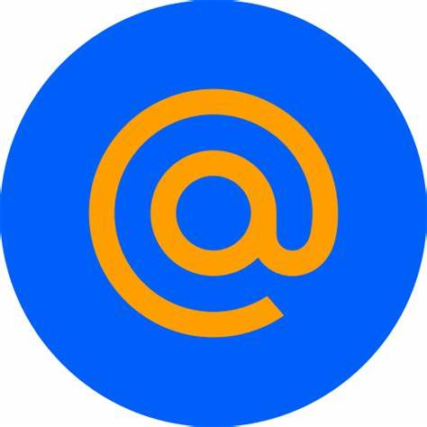

# Websites

## Abstract

This article showcases 61 websites bookmarked by abc202306.

Keywords: awesome list, website, github repo

## Contents

- [Abstract](#abstract)
- [Contents](#contents)
- [Introduction](#introduction)
- [1 ACG](#1-acg)
  - [1.1 Anime Websites](#11-anime-websites)
    - [1.1.1 JiongCiYuan](#111-jiongciyuan)
  - [1.2 Anime Database Websites](#12-anime-database-websites)
    - [1.2.1 MyAnimeList](#121-myanimelist)
    - [1.2.2 AniDB](#122-anidb)
  - [1.3 Hentai Comic Websites](#13-hentai-comic-websites)
    - [1.3.1 e-hentai](#131-e-hentai)
    - [1.3.2 nhentai](#132-nhentai)
    - [1.3.3 jmcomic](#133-jmcomic)
    - [1.3.4 picapicacomic](#134-picapicacomic)
  - [1.4 Normal Comic Websites](#14-normal-comic-websites)
    - [1.4.1 manhuaren](#141-manhuaren)
  - [1.5 Comic Reader Websites](#15-comic-reader-websites)
    - [1.5.1 Mihon](#151-mihon)
    - [1.5.2 LANraragi](#152-lanraragi)
- [2 Academy](#2-academy)
  - [2.1 Encyclopedia Websites](#21-encyclopedia-websites)
    - [2.1.1 Wikipedia](#211-wikipedia)
    - [2.1.2 Baidu Baike](#212-baidu-baike)
    - [2.1.3 MoeGirl](#213-moegirl)
    - [2.1.4 HMoeGirl](#214-hmoegirl)
    - [2.1.5 WikiHow](#215-wikihow)
    - [2.1.6 MBALib Wiki](#216-mbalib-wiki)
    - [2.1.7 NoteApps.info](#217-noteappsinfo)
  - [2.2 Note-taking App Websites](#22-note-taking-app-websites)
    - [2.2.1 Obsidian](#221-obsidian)
    - [2.2.2 Notion](#222-notion)
    - [2.2.3 Anytype](#223-anytype)
    - [2.2.4 TiddlyWiki](#224-tiddlywiki)
    - [2.2.5 Logseq](#225-logseq)
    - [2.2.6 SiYuan](#226-siyuan)
  - [2.3 Search Engine Websites](#23-search-engine-websites)
    - [2.3.1 Google Search](#231-google-search)
    - [2.3.2 Bing Search](#232-bing-search)
    - [2.3.3 Yandex Search](#233-yandex-search)
    - [2.3.4 Baidu Search](#234-baidu-search)
    - [2.3.5 Chong BuLuo](#235-chong-buluo)
    - [2.3.6 SauceNAO](#236-saucenao)
    - [2.3.7 SoutuBot.moe](#237-soutubotmoe)
- [3 DigitalLife](#3-digitallife)
  - [3.1 Password Manager](#31-password-manager)
    - [3.1.1 KeePass](#311-keepass)
    - [3.1.2 1Password](#312-1password)
    - [3.1.3 BitWardon](#313-bitwardon)
  - [3.2 Authenticator Software](#32-authenticator-software)
    - [3.2.1 Microsoft Authenticator](#321-microsoft-authenticator)
    - [3.2.2 Google Authenticator](#322-google-authenticator)
  - [3.3 Browser software](#33-browser-software)
    - [3.3.1 Google Chrome](#331-google-chrome)
    - [3.3.2 Microsoft Edge](#332-microsoft-edge)
    - [3.3.3 Mozilla Firefox](#333-mozilla-firefox)
    - [3.3.4 Tor Browser](#334-tor-browser)
    - [3.3.5 UC Browser](#335-uc-browser)
    - [3.3.6 Quark Browser](#336-quark-browser)
- [4 SocialMedia](#4-socialmedia)
  - [4.1 Instant Messaging](#41-instant-messaging)
    - [4.1.1 Telegram](#411-telegram)
    - [4.1.2 Tencent QQ](#412-tencent-qq)
    - [4.1.3 Tencent WeChat](#413-tencent-wechat)
  - [4.2 Microblogging](#42-microblogging)
    - [4.2.1 Twitter](#421-twitter)
    - [4.2.2 Misskey](#422-misskey)
    - [4.2.3 Nijimiss](#423-nijimiss)
  - [4.3 Email service](#43-email-service)
    - [4.3.1 Gmail](#431-gmail)
    - [4.3.2 Outlook.com](#432-outlookcom)
    - [4.3.3 Mail.ru](#433-mailru)
    - [4.3.4 QQ Mail](#434-qq-mail)
    - [4.3.5 NetEase Mail](#435-netease-mail)
  - [4.4 Q\&A software](#44-qa-software)
    - [4.4.1 Quora](#441-quora)
    - [4.4.2 Zhihu](#442-zhihu)
  - [4.5 Forum](#45-forum)
    - [4.5.1 Reddit](#451-reddit)
    - [4.5.2 Baidu Tieba](#452-baidu-tieba)
  - [4.6 Virtual Community](#46-virtual-community)
    - [4.6.1 Pixiv](#461-pixiv)
- [5 FileHostingService](#5-filehostingservice)
  - [5.1 Online Video Platform](#51-online-video-platform)
    - [5.1.1 YouTube](#511-youtube)
    - [5.1.2 Bilibili](#512-bilibili)
  - [5.2 Cloud Disk](#52-cloud-disk)
    - [5.2.1 OneDrive](#521-onedrive)
  - [5.3 Net Disk](#53-net-disk)
    - [5.3.1 Baidu NetDisk](#531-baidu-netdisk)
- [Conclusion](#conclusion)
- [Appendix A Topic Index](#appendix-a-topic-index)
- [Appendix B Exercises](#appendix-b-exercises)

## Introduction

| 🟠 | Name | Description |
| :--- | :--- | :--- |
| 📦 | [Abstract](#abstract) | |
| 📦 | [Contents](#contents) | |
| 📦 | [Introduction](#introduction) | |
| 📦 | **[1 ACG](#1-acg)** | **Anime, Comic & Game**  see [ACG (subculture) - Wikipedia](https://en.wikipedia.org/wiki/ACG_(subculture)) |
| 📁 | [1.1 Anime Websites](#11-anime-websites) |  |
| 📁 | [1.2 Anime Database Websites](#12-anime-database-websites) |   |
| 📁 | [1.3 Hentai Comic Websites](#13-hentai-comic-websites) |     |(#134-picapicacomic) |  |
| 📁 | [1.4 Normal Comic Websites](#14-normal-comic-websites) |  |
| 📁 | [1.5 Comic Reader Websites](#15-comic-reader-websites) |   |
| 📦 | **[2 Academy](#2-academy)** | **Education & Research** see [Academy - Wikipedia](https://en.wikipedia.org/wiki/Academy) |
| 📁 | [2.1 Encyclopedia Websites](#21-encyclopedia-websites) |        |
| 📁 | [2.2 Note-taking App Websites](#22-note-taking-app-websites) |       |
| 📁 | [2.3 Search Engine Websites](#23-search-engine-websites) |        |
| 📦 | **[3 DigitalLife](#3-digitallife)** | **Useful Tools** see [Information Age - Wikipedia](https://en.wikipedia.org/wiki/Information_Age) |
| 📁 | [3.1 Password Manager](#31-password-manager) |    |
| 📁 | [3.2 Authenticator Software](#32-authenticator-software) |   |
| 📁 | [3.3 Browser software](#33-browser-software) |       |
| 📦 | **[4 SocialMedia](#4-socialmedia)** | **Communication** see [Social media - Wikipedia](https://en.wikipedia.org/wiki/Social_media) |
| 📁 | [4.1 Instant Messaging](#41-instant-messaging) |    |
| 📁 | [4.2 Microblogging](#42-microblogging) |    |
| 📁 | [4.3 Email service](#43-email-service) |      |
| 📁 | [4.4 Q&A software](#44-qa-software) |   |
| 📁 | [4.5 Forum](#45-forum) |   |
| 📁 | [4.6 Virtual Community](#46-virtual-community) |  |
| 📦 | **[5 FileHostingService](#5-filehostingservice)** | **File sharing** see [File-hosting service - Wikipedia](https://en.wikipedia.org/wiki/File-hosting_service) |
| 📁 | [5.1 Online Video Platform](#51-online-video-platform) |   |
| 📁 | [5.2 Cloud Disk](#52-cloud-disk) |  |
| 📁 | [5.3 Net Disk](#53-net-disk) |  |
| 📦 | [Conclusion](#conclusion) | |
| 📦 | [Appendix A Topic Index](#appendix-a-topic-index) | |
| 📦 | [Appendix B Exercises](#appendix-b-exercises) | |

## 1 ACG

> **Anime, Comic & Game** 
> see [ACG (subculture) - Wikipedia](https://en.wikipedia.org/wiki/ACG_(subculture))

### 1.1 Anime Websites

> see [Streaming media - Wikipedia](https://en.wikipedia.org/wiki/Streaming_media)

#### 1.1.1 JiongCiYuan

| Icon | Link | Description |
| :--- | :--- | :--- |
|  | [囧次元](https://jcyapp.org/) | Jiongciyuan (囧次元) is an Android video streaming app focused on Japanese animation, allowing for real-time comments and interaction.  You can avoid frequent ads by watching free advertisements to earn temporary membership. |

### 1.2 Anime Database Websites

> see [Database - Wikipedia](https://en.wikipedia.org/wiki/Database)

#### 1.2.1 MyAnimeList

| Icon | Link | Description |
| :--- | :--- | :--- |
|  | [MyAnimeList.net - Panel ](https://myanimelist.net/) | Welcome to MyAnimeList, the world's most active online anime and manga community and database. Join the online community, create your anime and manga list, read reviews, explore the forums, follow news, and so much more!   `{"keywords":"anime, myanimelist, anime news, manga"}` |

#### 1.2.2 AniDB

| Icon | Link | Description |
| :--- | :--- | :--- |
|  | [AniDB](https://anidb.net/) | Looking for information about Anime? AniDB is the right place for you. AniDB is a not-for-profit anime database providing you with all information reg... |

### 1.3 Hentai Comic Websites

> see [Hentai - Wikipedia](https://en.wikipedia.org/wiki/Hentai)

- by-region
  - region/western-region
    - [e-hentai](#131-e-hentai)
    - [nhentai](#132-nhentai)
  - region/eastern-region
    - [jmcomic](#133-jmcomic)
    - [picapicacomic](#134-picapicacomic)

#### 1.3.1 e-hentai

| Icon | Link | Description |
| :--- | :--- | :--- |
|  | [E-Hentai Galleries - The Free Hentai Doujinshi, Manga and Image Gallery System](https://e-hentai.org/) | With more than a million absolutely free hentai doujinshi, manga, cosplay and CG galleries, E-Hentai Galleries is the world's largest free Hentai archive. |
|  | [ExHentai.org](https://exhentai.org/) | |

#### 1.3.2 nhentai

| Icon | Link | Description |
| :--- | :--- | :--- |
|  | [nhentai (@nhentaiOfficial) / X](https://x.com/nhentaiOfficial) | nhentais goal is to organize the world’s hentai and make it universally accessible and goonable  `{"location":"The 9th Circle of Hell","link":"nhentai.net","joined":"2014-06"}` |
|  | [nhentai: hentai doujinshi and manga](https://nhentai.net/) | nhentai is a free hentai manga and doujinshi reader with over 575,000 galleries to read and download. |

#### 1.3.3 jmcomic

| Icon | Link | Description |
| :--- | :--- | :--- |
|  | [免費A漫 - 禁漫天堂](https://18comic.vip/) | 免費A漫 - 免費成人H漫線上看 |
|  | [禁漫天堂發布頁 \| Android iOS APP軟件下載](https://jmcmomic.github.io/)  | |
|  | [禁漫天堂發布頁-APP下載 回家的路](https://jmcomicws.cc/) | |

#### 1.3.4 picapicacomic

| Icon | Link | Description |
| :--- | :--- | :--- |
|  | [嗶咔漫畫 (@picapicacomic) / X](https://x.com/picapicacomic) | 嗶咔漫畫讓你可以輕鬆看到不同的本子，介面美觀易用，分類齊全，每天更新，紳士必備！  https://picacomic.com https://picacomic.xyz  `{"category":"移动应用程序","link":"picacomic.com","joined":"2025-01"}` |

### 1.4 Normal Comic Websites

> see [Comics - Wikipedia](https://en.wikipedia.org/wiki/Comics)

#### 1.4.1 manhuaren

| Icon | Link | Description |
| :--- | :--- | :--- |
|  | [漫画人 - 为爱漫画的人而生](https://www.manhuaren.com/) | 漫画人：给你最好的掌上漫画应用体验，速度最快、最专业的漫画应用。  `{"author":"漫画人:为爱漫画的人而生、manhuaren.com","keywords":"漫画人：最好的掌上漫画应用"}` | |

### 1.5 Comic Reader Websites

> see [Digital asset management - Wikipedia](https://en.wikipedia.org/wiki/Digital_asset_management)

#### 1.5.1 Mihon

| Icon | Link | Description |
| :--- | :--- | :--- |
|  | [Home \| Mihon](https://mihon.app/) | Discover and read manga, webtoons, comics, and more – easier than ever on your Android device. |

#### 1.5.2 LANraragi

| Icon | Link | Description |
| :--- | :--- | :--- |
|  | [Difegue/LANraragi: Web application for archival and reading of manga/doujinshi. Lightweight and Docker-ready for NAS/servers.](https://github.com/Difegue/LANraragi) |  application for archival and reading of manga/doujinshi. Lightweight and Docker-ready for NAS/servers.  `{"link":"lrr.tvc-16.science","Topics": "docker server perl management manga comics reader mojolicious opds doujinshi nas hacktoberfest sadpanda"}` |

## 2 Academy

> **Education & Research** 
> see [Academy - Wikipedia](https://en.wikipedia.org/wiki/Academy)

### 2.1 Encyclopedia Websites

> see [Encyclopedia - Wikipedia](https://en.wikipedia.org/wiki/Encyclopedia)

- by-encyclopedia-type
  - encyclopedia-type/general
    - [Wikipedia](#211-wikipedia)
    - [Baidu Baike](#212-baidu-baike)
  - encyclopedia-type/acg
    - [MoeGirl](#213-moegirl)
    - [HMoeGirl](#214-hmoegirl)
  - encyclopedia-type/vertical-domains
    - [WikiHow](#215-wikihow)
    - [MBALib Wiki](#216-mbalib-wiki)
    - [NoteApps.info](#217-noteappsinfo)

#### 2.1.1 Wikipedia

| Icon | Link | Description |
| :--- | :--- | :--- |
|  | [Wikipedia](https://www.wikipedia.org/) | Wikipedia is a free online encyclopedia, created and edited by volunteers around the world and hosted by the Wikimedia Foundation. |

#### 2.1.2 Baidu Baike

| Icon | Link | Description |
| :--- | :--- | :--- |
|  | [百度百科_全球领先的中文百科全书](https://baike.baidu.com/) | 百度百科是一部内容开放、自由的网络百科全书，旨在创造一个涵盖所有领域知识，服务所有互联网用户的中文知识性百科全书。在这里你可以参与词条编辑，分享贡献你的知识。  `{"keywords":"百科, 百度百科, 中文百科, 百科全书"}` |

#### 2.1.3 MoeGirl

| Icon | Link | Description |
| :--- | :--- | :--- |
|  | [萌娘百科 万物皆可萌的百科全书 - zh.moegirl.org.cn](https://mzh.moegirl.org.cn/Mainpage#/topics) | `{"keywords":"萌娘,百科,wiki,梗,娘化,萝莉,动画,漫画,动漫,游戏,音乐,宅腐,ACG,anime,comic,game,GalGame"}` |

#### 2.1.4 HMoeGirl

| Icon | Link | Description |
| :--- | :--- | :--- |
|  | [H萌娘:关于 - H萌娘](https://hmoegirl.cyou/zh-hans/H%E8%90%8C%E5%A8%98:%E5%85%B3%E4%BA%8E) | H萌娘是一个关于H萌的wiki。  H萌娘的收录的条目要满足两点：既属于**H**（hentai/エロ）又属于**萌**（二次元）。  目前主要由 User:BakeWater 为H萌娘提供服务器方面的支持。 |

#### 2.1.5 WikiHow

| Icon | Link | Description |
| :--- | :--- | :--- |
|  | [wikiHow: How-to instructions you can trust.](https://www.wikihow.com/Main-Page) | Learn how to do anything with wikiHow, the world's most popular how-to website. Easy, well-researched, and trustworthy instructions for everything you want to know. |

#### 2.1.6 MBALib Wiki

| Icon | Link | Description |
| :--- | :--- | :--- |
|  | [MBA智库百科，全球专业中文经管百科](https://wiki.mbalib.com/wiki/%E9%A6%96%E9%A1%B5) | MBA智库百科，专注于经济管理领域知识的创建与分享。包括企业管理、市场营销、管理咨询、人力资源、战略管理、MBA案例、财务会计、广告、品牌、经济、金融、法律、博弈论、证券、股票以及公司企业、商学院、经管人物等介绍。  `{"keywords":"首页,2023年诺贝尔经济学奖,2024年《福布斯》全球亿万富豪排行榜,5W2H分析法,GTD,INFJ,Warren Buffett,东方甄选“小作文”事件,乔尔·莫基尔,价值共创,传统能源,MBA,MBA智库,管理,营销,经济,金融,人力资源,管理咨询,广告,财务,会计,品牌,证券,股票,物流,贸易,商学院,法律,人物"}` |

#### 2.1.7 NoteApps.info

| Icon | Link | Description |
| :--- | :--- | :--- |
|  | [NoteApps.info: 41 best note taking apps analyzed over 343 features](https://noteapps.info/) | Encyclopedia of note taking apps: Screenshots, feature lists, and pricing for popular note taking apps.

### 2.2 Note-taking App Websites

> see [Note-taking - Wikipedia](https://en.wikipedia.org/wiki/Note-taking)

- by-text-type
  - text-type/pure-text
    - [Obsidian](#221-obsidian)
    - [Logseq](#225-logseq)
    - [TiddlyWiki](#224-tiddlywiki)
  - text-type/rich-text
    - [Notion](#222-notion)
    - [AnyType](#223-anytype)
    - [SiYuan](#226-siyuan)
- by-storage-type
  - storage-type/local-first
    - [Obsidian](#221-obsidian)
    - [Logseq](#225-logseq)
    - [TiddlyWiki](#224-tiddlywiki)
    - [AnyType](#223-anytype)
    - [SiYuan](#226-siyuan)
  - storage-type/cloud-first
    - [Notion](#222-notion)

#### 2.2.1 Obsidian

| Icon | Link | Description |
| :--- | :--- | :--- |
|  | [Obsidian - Sharpen your thinking](https://obsidian.md/) | The free and flexible app for your private thoughts. |

#### 2.2.2 Notion

| Icon | Link | Description |
| :--- | :--- | :--- |
|  | [Why we built Notion – About](https://notion.so/about) | A story of tools, the future of work, and how we want to blend your workflow into an all-in-one workspace. |

#### 2.2.3 Anytype

| Icon | Link | Description |
| :--- | :--- | :--- |
|  | [anytype — the everything app](https://anytype.io/) | for those who celebrate trust & autonomy. |

#### 2.2.4 TiddlyWiki

| Icon | Link | Description |
| :--- | :--- | :--- |
|  | [TiddlyWiki  v5.3.8](https://tiddlywiki.com/) | a non-linear personal web notebook |

#### 2.2.5 Logseq

| Icon | Link | Description |
| :--- | :--- | :--- |
|  | [Logseq: A privacy-first, open-source knowledge base](https://logseq.com/) | A privacy-first, open-source platform for knowledge management and collaboration. |

#### 2.2.6 SiYuan

| Icon | Link | Description |
| :--- | :--- | :--- |
|  | [SiYuan - Privacy-first personal knowledge management system that supports Markdown, block-level ref, and bidirectional links](https://b3log.org/siyuan/en/) | SiYuan - Privacy-first personal knowledge management system that supports Markdown, block-level ref, and bidirectional links |

### 2.3 Search Engine Websites

> see [Search engine - Wikipedia](https://en.wikipedia.org/wiki/Search_engine)

- by-search-type
  - search-type/general-search
    - [Google Search](#231-google-search)
    - [Bing Search](#232-bing-search)
    - [Yandex Search](#233-yandex-search)
    - [Baidu Search](#234-baidu-search)
  - search-type/aggregated-search
    - [Chong BuLuo](#235-chong-buluo)
  - search-type/image-search
    - [SauceNAO](#236-saucenao)
    - [SoutuBot.moe](#237-soutubotmoe)

#### 2.3.1 Google Search

| Icon | Link | Description |
| :--- | :--- | :--- |
|  | [Google](https://www.google.com/) | Google Search (also known simply as Google or Google.com) is a search engine operated by Google. It allows users to search for information on the Internet by entering keywords or phrases. Google Search uses algorithms to analyze and rank websites based on their relevance to the search query. It is the most popular search engine worldwide. |

#### 2.3.2 Bing Search

| Icon | Link | Description |
| :--- | :--- | :--- |
|  | [Search - Microsoft Bing](https://www.bing.com/) | Search with Microsoft Bing and use the power of AI to find information, explore webpages, images, videos, maps, and more. A smart search engine for the forever curious. |

#### 2.3.3 Yandex Search

| Icon | Link | Description |
| :--- | :--- | :--- |
|  | [Yandex — fast Internet search](https://yandex.com) | Yandex is a technology company that builds intelligent products and services powered by machine learning. |

#### 2.3.4 Baidu Search

| Icon | Link | Description |
| :--- | :--- | :--- |
|  | [百度一下，你就知道](https://www.baidu.com/) | 全球领先的中文搜索引擎、致力于让网民更便捷地获取信息，找到所求。百度超过千亿的中文网页数据库，可以瞬间找到相关的搜索结果。 |

#### 2.3.5 Chong BuLuo

| Icon | Link | Description |
| :--- | :--- | :--- |
|  | [虫部落 - 让搜索更简单](https://www.chongbuluo.com/) | 虫部落是一个纯粹的搜索知识、技术和经验分享平台，虫部落快搜、虫部落学术搜索等搜索聚合工具均为虫部落原创出品，搜索世界的乐趣，就在虫部落！|

#### 2.3.6 SauceNAO

| Icon | Link | Description |
| :--- | :--- | :--- |
|  | [About SauceNAO](https://saucenao.com/about.html) | SauceNAO is a reverse image search engine. The name 'SauceNAO' is derived from a slang form of "Need to know the source of this Now!" which has found common usage on image boards and other similar sites. |

#### 2.3.7 SoutuBot.moe

| Icon | Link | Description |
| :--- | :--- | :--- |
|  | [搜图Bot酱](https://soutubot.moe/) | 大家好（ﾉ>ω<)ﾉ这里是搜图bot酱网页版~ 可局部搜图NH内的本子，欢迎大家来测试~  如果大家觉得好用的话就请麻烦宣传和赞助一下吧~ |

## 3 DigitalLife

> **Useful Tools** 
> see [Information Age - Wikipedia](https://en.wikipedia.org/wiki/Information_Age)

### 3.1 Password Manager

> see [Password manager - Wikipedia](https://en.wikipedia.org/wiki/Password_manager)

#### 3.1.1 KeePass

| Icon | Link | Description |
| :--- | :--- | :--- |
|  | [KeePass Password Safe](https://keepass.info/) | KeePass is a free open source password manager. Passwords can be stored in an encrypted database, which can be unlocked with one master key. |

#### 3.1.2 1Password

| Icon | Link | Description |
| :--- | :--- | :--- |
|  | [Password Manager & Extended Access Management - 1Password - 1Password](https://1password.com/) | More than a password manager and leader in Extended Access Management. Secure all sign-ins to every application from any device with 1Password. |

#### 3.1.3 BitWardon

| Icon | Link | Description |
| :--- | :--- | :--- |
|  | [Best Password Manager for Business, Enterprise & Personall - Bitwarden](https://bitwarden.com/) | Bitwarden is the most trusted password manager for passwords and passkeys at home or at work, on any browser or device. Start with a free trial. |

### 3.2 Authenticator Software

> see [Authenticator - Wikipedia](https://en.wikipedia.org/wiki/Authenticator)

#### 3.2.1 Microsoft Authenticator

| Icon | Link | Description |
| :--- | :--- | :--- |
|  | [Microsoft Authenticator - Apps on Google Play](https://play.google.com/store/apps/details?id=com.azure.authenticator&hl=en_US) | Safety starts with understanding how developers collect and share your data. Data privacy and security practices may vary based on your use, region, and age. The developer provided this information and may update it over time. |

#### 3.2.2 Google Authenticator

| Icon | Link | Description |
| :--- | :--- | :--- |
|  | [Google Authenticator - Apps on Google Play](https://play.google.com/store/apps/details?id=com.google.android.apps.authenticator2&hl=en_US) | Google Authenticator adds an extra layer of security to your online accounts by adding a second step of verification when you sign in. |

### 3.3 Browser software

> see [Web browser - Wikipedia](https://en.wikipedia.org/wiki/Web_browser)

- by-region
  - region/western-region
    - [Google Chrome](#331-google-chrome)
    - [Microsoft Edge](#332-microsoft-edge)
    - [Mozilla Firefox](#333-mozilla-firefox)
    - [Tor Browser](#334-tor-browser)
  - region/eastern-region
    - [UC Browser](#335-uc-browser)
    - [Quark Browser](#336-quark-browser)

#### 3.3.1 Google Chrome

| Icon | Link | Description |
| :--- | :--- | :--- |
|  | [Google Chrome – Download the fast, secure browser from Google](https://www.google.com/intl/en_uk/chrome/) | Get more done with the new Google Chrome. A more simple, secure and faster web browser than ever, with Google’s smarts built in. Download now. |

#### 3.3.2 Microsoft Edge

| Icon | Link | Description |
| :--- | :--- | :--- |
|  | [Download Microsoft Edge: Windows, macOS, iOS & Android](https://www.microsoft.com/en-us/edge/download?form=MA13FJ) | Download Microsoft Edge for your computer or smartphone. Experience the cutting-edge AI Edge browser on your Windows, macOS, iOS, and Android device. |

#### 3.3.3 Mozilla Firefox

| Icon | Link | Description |
| :--- | :--- | :--- |
|  | [Get Firefox for desktop — Firefox (US)](https://www.firefox.com/en-US/) | Mozilla Firefox, or simply Firefox, is a free and open source[12] web browser developed by the Mozilla Foundation and its subsidiary, the Mozilla Corporation. |

#### 3.3.4 Tor Browser

| Icon | Link | Description |
| :--- | :--- | :--- |
|  | [Tor Project \| Download](https://www.torproject.la/en/download/) | Download \| Defend yourself against tracking and surveillance. Circumvent censorship. |

#### 3.3.5 UC Browser

| Icon | Link | Description |
| :--- | :--- | :--- |
|  | [UC Browser](https://www.ucweb.com/index.shtml) | Download UC Browser today and enjoy a faster, safer, and more private online experience. With built-in VPN protection and advanced ad blocking, we set a new standard for secure browsing. |

#### 3.3.6 Quark Browser

| Icon | Link | Description |
| :--- | :--- | :--- |
|  | [夸克_阿里AI旗舰应用官网](https://www.quark.cn/) | 夸克pc/app为你带来极速、智能、安全、高效的搜索体验,找答案,找资料,找工具,办公,学习,工作必备应用。夸克提供浏览器搜索引擎、网盘、AI扫描王工具及小说阅读等高效功能，为你提供稳定,安全,流畅的浏览环境和优质的产品服务体验 |

## 4 SocialMedia

> **Communication** 
> see [Social media - Wikipedia](https://en.wikipedia.org/wiki/Social_media)

### 4.1 Instant Messaging

> see [Instant messaging - Wikipedia](https://en.wikipedia.org/wiki/Instant_messaging)

| Icon | Link | Description |
| :--- | :--- | :--- |

#### 4.1.1 Telegram

| Icon | Link | Description |
| :--- | :--- | :--- |
|  | [Telegram Messenger](https://telegram.org/) | Fast. Secure. Powerful. |

#### 4.1.2 Tencent QQ

| Icon | Link | Description |
| :--- | :--- | :--- |
|  | [QQ-轻松做自己](https://im.qq.com/index/) | 腾讯QQ，全新版本QQ9上线了！ QQ9，不仅是轻松聊天，更是兴趣社区的聚集地。欢迎下载体验最新版本QQ，体验最新功能！欢迎访问QQ官网，下载新版QQ，了解QQ最新功能就在im.qq.com。 |

#### 4.1.3 Tencent WeChat

| Icon | Link | Description |
| :--- | :--- | :--- |
|  | [WeChat - Free messaging and calling app](https://www.wechat.com/) | Available for all kinds of platforms; enjoy group chat; support voice, photo, video and text messages. | 

### 4.2 Microblogging

> see [Microblogging - Wikipedia](https://en.wikipedia.org/wiki/Microblogging)

#### 4.2.1 Twitter

| Icon | Link | Description |
| :--- | :--- | :--- |
|  | [About X \| Our company and priorities](https://about.x.com/en) | We serve the public conversation. Learn more about X the company, and how we ensure people have a free and safe place to talk. |

#### 4.2.2 Misskey

| Icon | Link | Description |
| :--- | :--- | :--- |
|  | [Misskey Hub – Official website of the Misskey Project](https://misskey-hub.net/en/) | This is the official site for Misskey, a decentralized social networking software. Find out how to get started, a list of servers, and lots more information about Misskey! |

#### 4.2.3 Nijimiss

| Icon | Link | Description |
| :--- | :--- | :--- |
|  | [にじみす.moe](https://nijimiss.moe/) | 💞あらゆる好きが交差する💞  好きを語れるオープンコミュニティ  好きなことを堂々と胸を張って好きといえる空間を作りたい。 そういった思いから生まれたSNSです。 |

### 4.3 Email service

> see [Email - Wikipedia](https://en.wikipedia.org/wiki/Email)

- by-region
  - region/western-region
    - [Gmail](#431-gmail)
    - [Outlook.com](#432-outlookcom)
    - [Mail.ru](#433-mailru)
  - region/eastern-region
    - [QQ Mail](#434-qq-mail)
    - [NetEase Mail](#435-netease-mail)

#### 4.3.1 Gmail

| Icon | Link | Description |
| :--- | :--- | :--- |
|  | [Gmail: Private and secure email at no cost \| Google Workspace](https://workspace.google.com/gmail/) | Discover how Gmail keeps your account & emails encrypted, private and under your control with the largest secure email service in the world. |

#### 4.3.2 Outlook.com

| Icon | Link | Description |
| :--- | :--- | :--- |
|  | [What is Outlook? - Microsoft Support](https://support.microsoft.com/en-us/office/what-is-outlook-10f1fa35-f33a-4cb7-838c-a7f3e6228b20) | With Outlook on your PC, Mac or mobile device, you can:<ul><li>Organize email to let you focus on the messages that matter most.</li><li>Manage and share your calendar to schedule meetings with ease.</li><li>Share files from the cloud so recipients always have the latest version.</li><li>Stay connected and productive wherever you are.</li></ul> |

#### 4.3.3 Mail.ru

| Icon | Link | Description |
| :--- | :--- | :--- |
|  | [Mail: Почта, Облако, Календарь, Заметки, Покупки — сервисы для работы и жизни](https://mail.ru/) | Mail — безопасные сервисы для жизни и работы: бесплатная Почта, память для всего в Облаке, лёгкое планирование в Календаре и быстрые записи в Заметках. Мобильная версия и приложение — используйте, как удобно |

#### 4.3.4 QQ Mail

| Icon | Link | Description |
| :--- | :--- | :--- |
|  | [登录QQ邮箱](https://wx.mail.qq.com/) | QQ邮箱，提供qq.com、foxmail.com后缀的安全、稳定、快速、便捷的免费电子邮箱。强大的反垃圾邮件过滤，10G超大附件发送，便捷记事和日历功能，轻松管理所有电子发票，尽在QQ邮箱。 |

#### 4.3.5 NetEase Mail

| Icon | Link | Description |
| :--- | :--- | :--- |
|  | [网易免费邮箱 - 你的专业电子邮局](https://email.163.com/) | 网易免费邮箱，你的专业电子邮局，提供以 @163.com、@126.com和@yeah.net 为后缀的免费邮箱。超过20年邮箱运营经验，系统快速稳定安全，支持超大附件和网盘服务。网易邮箱官方App“邮箱大师”帮您高效处理邮件，支持所有邮箱，并可在手机、Windows和Mac上多端协同使用。 |

### 4.4 Q&A software

> see [Question and answer system - Wikipedia](https://en.wikipedia.org/wiki/Question_and_answer_system)

#### 4.4.1 Quora

| Icon | Link | Description |
| :--- | :--- | :--- |
|  | [Quora](https://www.quora.com/) | Quora is an American social question-and-answer website and online knowledge market headquartered in Mountain View, California. It was founded on June 25, 2009, and made available to the public on June 21, 2010. Users can post questions, answer questions, and comment on answers that have been submitted by other users. As of 2020, the website was visited by 300 million users a month. |

#### 4.4.2 Zhihu

| Icon | Link | Description |
| :--- | :--- | :--- |
|  | [知乎 - 有问题，就会有答案](https://www.zhihu.com/) | 知乎，中文互联网高质量的问答社区和创作者聚集的原创内容平台，于 2011 年 1 月正式上线，以「让人们更好的分享知识、经验和见解，找到自己的解答」为品牌使命。知乎凭借认真、专业、友善的社区氛围、独特的产品机制以及结构化和易获得的优质内容，聚集了中文互联网科技、商业、影视、时尚、文化等领域最具创造力的人群，已成为综合性、全品类、在诸多领域具有关键影响力的知识分享社区和创作者聚集的原创内容平台，建立起了以社区驱动的内容变现商业模式。 |

### 4.5 Forum

> see [Internet forum - Wikipedia](https://en.wikipedia.org/wiki/Internet_forum)

#### 4.5.1 Reddit

| Icon | Link | Description |
| :--- | :--- | :--- |
|  | [Reddit - The heart of the internet](https://www.reddit.com/) | Reddit is where millions of people gather for conversations about the things they care about, in over 100,000 subreddit communities. |

#### 4.5.2 Baidu Tieba

| Icon | Link | Description |
| :--- | :--- | :--- |
|  | [百度贴吧——全球领先的中文社区](https://tieba.baidu.com/) | 百度贴吧——全球领先的中文社区。贴吧的使命是让志同道合的人相聚。不论是大众话题还是小众话题，都能精准地聚集大批同好网友，展示自我风采，结交知音，搭建别具特色的“兴趣主题“互动平台。贴吧目录涵盖游戏、地区、文学、动漫、娱乐明星、生活、体育、电脑数码等方方面面，是全球领先的中文交流平台，它为人们提供一个表达和交流思想的自由网络空间，并以此汇集志同道合的网友。 |

### 4.6 Virtual Community

> see [Virtual community - Wikipedia](https://en.wikipedia.org/wiki/Virtual_community)

#### 4.6.1 Pixiv

| Icon | Link | Description |
| :--- | :--- | :--- |
|  | [插畫、漫畫、小說作品交流服務 [pixiv]](https://www.pixiv.net/) | Pixiv[a] (Japanese: ピクシブ, Hepburn: Pikushibu) is a Japanese online community for artists. |

## 5 FileHostingService

> **File sharing** 
> see [File-hosting service - Wikipedia](https://en.wikipedia.org/wiki/File-hosting_service)

### 5.1 Online Video Platform

> see [Online video platform - Wikipedia](https://en.wikipedia.org/wiki/Online_video_platform)

#### 5.1.1 YouTube

| Icon | Link | Description |
| :--- | :--- | :--- |
|  | [YouTube](https://www.youtube.com/) | Enjoy the videos and music you love, upload original content, and share it all with friends, family, and the world on YouTube. |

#### 5.1.2 Bilibili

| Icon | Link | Description |
| :--- | :--- | :--- |
|  | [哔哩哔哩 (゜-゜)つロ 干杯~-bilibili](https://www.bilibili.com/) | 哔哩哔哩（bilibili.com)是国内知名的视频弹幕网站，这里有及时的动漫新番，活跃的ACG氛围，有创意的Up主。大家可以在这里找到许多欢乐。 |

### 5.2 Cloud Disk

#### 5.2.1 OneDrive

| Icon | Link | Description |
| :--- | :--- | :--- |
|  | [Home - OneDrive](https://onedrive.live.com/?view=1) | Microsoft OneDrive is a file-hosting service operated by Microsoft. First released as SkyDrive in August 2007, it allows registered users to store, share, back-up and synchronize their files. OneDrive also works as the storage backend of the web version of Microsoft 365. OneDrive offers 5 gigabytes of storage space free of charge, with 100 GB, 1 TB, and 6 TB storage options available, either separately or with Microsoft 365 subscriptions. |

### 5.3 Net Disk

#### 5.3.1 Baidu NetDisk

| Icon | Link | Description |
| :--- | :--- | :--- |
|  | [百度网盘](https://pan.baidu.com/disk/main#/index?category=all) | 百度网盘为您提供文件的网络备份、同步和分享服务。空间大、速度快、安全稳固，支持教育网加速，支持手机端。注册使用百度网盘即可享受免费存储空间 |

## Conclusion

## Appendix A Topic Index

## Appendix B Exercises

1. About ACG
    1. What software should I use to watch anime?
    2. What are some anime rating websites?
    3. What software should I use to read comics?
    4. What software should I use to read hentai comics?
    5. Which comic book reader should I use?
2. About Academy
    1. Which encyclopedia website should I use?
    2. Which search engine should I use?
    3. Which note-taking software should I use?
3. About Digital Life
    1. Which Password Manager should I use?
    2. What is Authenticator? Give some examples.
    3. Which browser software should I use?
4. About Social Media
    1. What is IM, Microblogging, Email, Q&A, Forum and Virtual Community? Give some examples.
5. About file hosting service
    1. What is online video platform, cloud disk and net disk? Give some examples.
