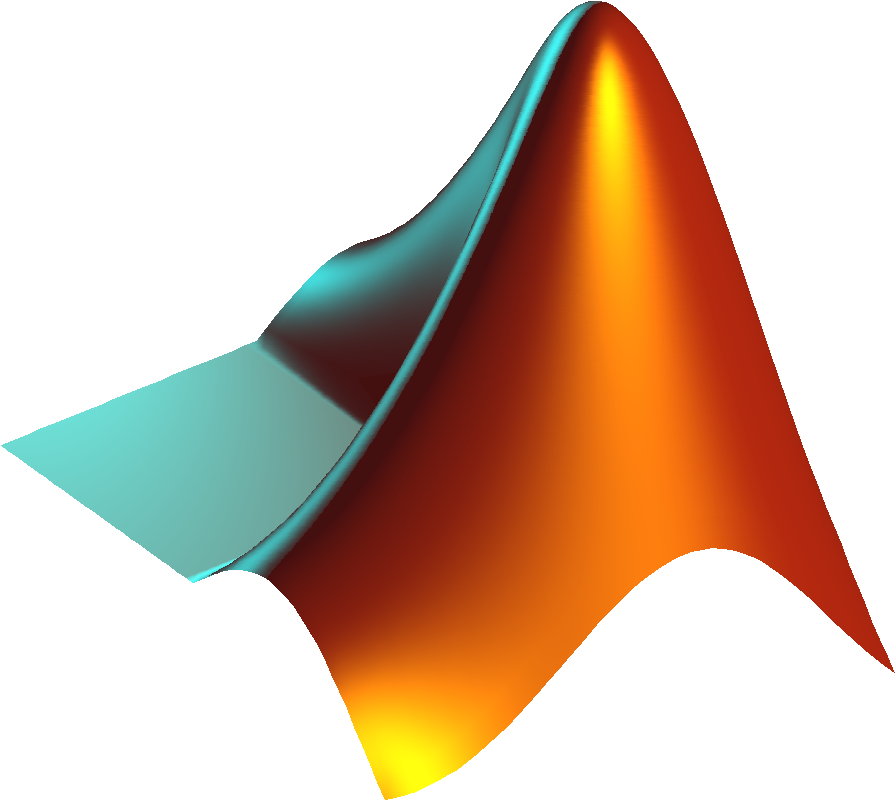
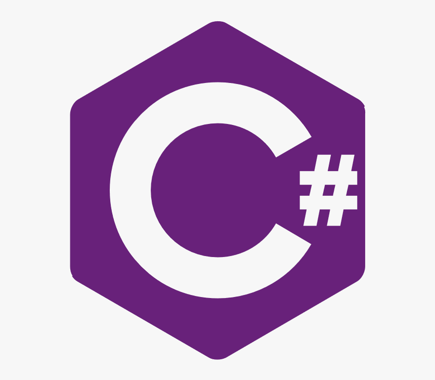
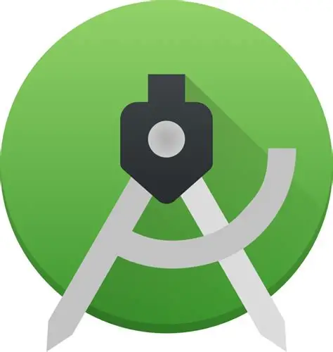
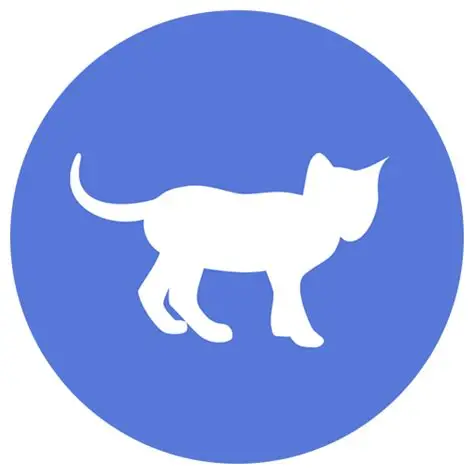

  
# Websites

This article showcases 166 websites bookmarked by abc202306.

Keywords: awesome list, website, github repo

## table-of-contents

> 1. [site\-item](<#site-item>)
> 2. [site\-category](<#site-category>)
> 3. [categories](<#categories>)
> 4. [tags](<#tags>)

## site-item

1. [Apache Subversion](<#site-item-svn>) | [📄](<site/site-item/site-item-svn.md>) | [🔗](<https://subversion.apache.org/>)
2. [Git](<#site-item-git>) | [📄](<site/site-item/site-item-git.md>) | [🔗](<https://git-scm.com/>)
3. [CSS \- Wikipedia](<#site-item-css>) | [📄](<site/site-item/site-item-css.md>) | [🔗](<https://en.wikipedia.org/wiki/CSS>)
4. [Comma\-separated values \- Wikipedia](<#site-item-csv>) | [📄](<site/site-item/site-item-csv.md>) | [🔗](<https://en.wikipedia.org/wiki/Comma-separated_values>)
5. [INI \- Initiation File Format](<#site-item-ini>) | [📄](<site/site-item/site-item-ini.md>) | [🔗](<https://docs.fileformat.com/system/ini/>)
6. [\- YAML Ain't Markup Language](<#site-item-yaml>) | [📄](<site/site-item/site-item-yaml.md>) | [🔗](<https://yaml.org/>)
7. [JSON](<#site-item-json>) | [📄](<site/site-item/site-item-json.md>) | [🔗](<https://www.json.org/json-en.html>)
8. [opml\.org home](<#site-item-opml>) | [📄](<site/site-item/site-item-opml.md>) | [🔗](<https://opml.org/>)
9. [HTML: HyperText Markup Language | MDN](<#site-item-html>) | [📄](<site/site-item/site-item-html.md>) | [🔗](<https://developer.mozilla.org/en-US/docs/Web/HTML>)
10. [Extensible Markup Language \(XML\)](<#site-item-xml>) | [📄](<site/site-item/site-item-xml.md>) | [🔗](<https://www.w3.org/XML/>)
11. [LaTeX \- A document preparation system](<#site-item-latex>) | [📄](<site/site-item/site-item-latex.md>) | [🔗](<https://www.latex-project.org/>)
12. [Org mode for GNU Emacs](<#site-item-org-mode>) | [📄](<site/site-item/site-item-org-mode.md>) | [🔗](<https://orgmode.org/>)
13. [Help:Wikitext \- Wikipedia](<#site-item-wikitext>) | [📄](<site/site-item/site-item-wikitext.md>) | [🔗](<https://en.wikipedia.org/wiki/Help:Wikitext>)
14. [AsciiDoc](<#site-item-asciidoc>) | [📄](<site/site-item/site-item-asciidoc.md>) | [🔗](<https://asciidoc.org/>)
15. [Markdown Guide](<#site-item-markdown>) | [📄](<site/site-item/site-item-markdown.md>) | [🔗](<https://www.markdownguide.org/>)
16. [Japanese language \- Wikipedia](<#site-item-japanese-language>) | [📄](<site/site-item/site-item-japanese-language.md>) | [🔗](<https://en.wikipedia.org/wiki/Japanese_language>)
17. [Chinese language \- Wikipedia](<#site-item-chinese-language>) | [📄](<site/site-item/site-item-chinese-language.md>) | [🔗](<https://en.wikipedia.org/wiki/Chinese_language>)
18. [English language \- Wikipedia](<#site-item-english-language>) | [📄](<site/site-item/site-item-english-language.md>) | [🔗](<https://en.wikipedia.org/wiki/English_language>)
19. [Bash \- GNU Project \- Free Software Foundation](<#site-item-bash>) | [📄](<site/site-item/site-item-bash.md>) | [🔗](<https://www.gnu.org/software/bash/>)
20. [What is PowerShell? \- PowerShell | Microsoft Learn](<#site-item-powershell>) | [📄](<site/site-item/site-item-powershell.md>) | [🔗](<https://learn.microsoft.com/en-us/powershell/scripting/overview?view=powershell-7.5>)
21. [Windows commands | Microsoft Learn](<#site-item-cmd>) | [📄](<site/site-item/site-item-cmd.md>) | [🔗](<https://learn.microsoft.com/en-us/windows-server/administration/windows-commands/windows-commands>)
22. [The Fortran Programming Language — Fortran Programming Language](<#site-item-fortran>) | [📄](<site/site-item/site-item-fortran.md>) | [🔗](<https://fortran-lang.org/>)
23. [Haskell Language](<#site-item-haskell>) | [📄](<site/site-item/site-item-haskell.md>) | [🔗](<https://www.haskell.org/>)
24. [Lean Programming Language](<#site-item-lean>) | [📄](<site/site-item/site-item-lean.md>) | [🔗](<https://lean-lang.org/>)
25. [SWI\-Prolog](<#site-item-prolog>) | [📄](<site/site-item/site-item-prolog.md>) | [🔗](<https://www.swi-prolog.org/>)
26. [Common Lisp](<#site-item-lisp>) | [📄](<site/site-item/site-item-lisp.md>) | [🔗](<https://lisp-lang.org/>)
27. [Visual Basic docs \- get started, tutorials, reference\. \- Visual Basic | Microsoft Learn](<#site-item-visual-basic>) | [📄](<site/site-item/site-item-visual-basic.md>) | [🔗](<https://learn.microsoft.com/en-us/dotnet/visual-basic/>)
28. [Base SAS Software | SAS](<#site-item-sas>) | [📄](<site/site-item/site-item-sas.md>) | [🔗](<https://www.sas.com/en_us/software/base-sas.html>)
29. [Wolfram Language: Programming Language \+ Built\-In Knowledge](<#site-item-wolfram-language>) | [📄](<site/site-item/site-item-wolfram-language.md>) | [🔗](<https://www.wolfram.com/language/>)
30. [R: The R Project for Statistical Computing](<#site-item-r-project>) | [📄](<site/site-item/site-item-r-project.md>) | [🔗](<https://www.r-project.org/>)
31. [MATLAB](<#site-item-matlab>) | [📄](<site/site-item/site-item-matlab.md>) | [🔗](<https://www.mathworks.com/products/matlab.html>)
32. [SQL \- Wikipedia](<#site-item-sql>) | [📄](<site/site-item/site-item-sql.md>) | [🔗](<https://en.wikipedia.org/wiki/SQL>)
33. [The Programming Language Lua](<#site-item-lua>) | [📄](<site/site-item/site-item-lua.md>) | [🔗](<https://www.lua.org/>)
34. [PHP](<#site-item-php>) | [📄](<site/site-item/site-item-php.md>) | [🔗](<https://www.php.net/>)
35. [Ruby Programming Language](<#site-item-ruby>) | [📄](<site/site-item/site-item-ruby.md>) | [🔗](<https://www.ruby-lang.org/en/>)
36. [TypeScript: JavaScript With Syntax For Types\.](<#site-item-typescript>) | [📄](<site/site-item/site-item-typescript.md>) | [🔗](<https://www.typescriptlang.org/>)
37. [JavaScript | MDN](<#site-item-javascript>) | [📄](<site/site-item/site-item-javascript.md>) | [🔗](<https://developer.mozilla.org/en-US/docs/Web/JavaScript>)
38. [Welcome to Python\.org](<#site-item-python>) | [📄](<site/site-item/site-item-python.md>) | [🔗](<https://www.python.org/>)
39. [Kotlin Programming Language](<#site-item-kotlin>) | [📄](<site/site-item/site-item-kotlin.md>) | [🔗](<https://kotlinlang.org/>)
40. [rust](<#site-item-rust>) | [📄](<site/site-item/site-item-rust.md>) | [🔗](<https://rust-lang.org/>)
41. [The Go Programming Language](<#site-item-go>) | [📄](<site/site-item/site-item-go.md>) | [🔗](<https://go.dev/>)
42. [Java | Oracle](<#site-item-java>) | [📄](<site/site-item/site-item-java.md>) | [🔗](<https://www.java.com/en/>)
43. [C\# \- a modern, open\-source programming language | \.NET](<#site-item-c-sharp>) | [📄](<site/site-item/site-item-c-sharp.md>) | [🔗](<https://dotnet.microsoft.com/en-us/languages/csharp>)
44. [Standard C\+\+](<#site-item-cpp>) | [📄](<site/site-item/site-item-cpp.md>) | [🔗](<https://isocpp.org/>)
45. [C language](<#site-item-c-language>) | [📄](<site/site-item/site-item-c-language.md>) | [🔗](<https://www.c-language.org/>)
46. [Assembly language \- Wikipedia](<#site-item-assembly-language>) | [📄](<site/site-item/site-item-assembly-language.md>) | [🔗](<https://en.wikipedia.org/wiki/Assembly_language>)
47. [Machine code \- Wikipedia](<#site-item-machine-code>) | [📄](<site/site-item/site-item-machine-code.md>) | [🔗](<https://en.wikipedia.org/wiki/Machine_code>)
48. [QQ浏览器官网\_QQ浏览器手机版\_QQ浏览器Windows版\_QQ浏览器MAC版](<#site-item-qq-browser>) | [📄](<site/site-item/site-item-qq-browser.md>) | [🔗](<https://browser.qq.com/>)
49. [华为浏览器 \- 华为官网](<#site-item-huawei-browser>) | [📄](<site/site-item/site-item-huawei-browser.md>) | [🔗](<https://consumer.huawei.com/cn/mobileservices/browser/>)
50. [Via浏览器官网 \- 崇尚速度与简约的手机浏览器，Via官方网站](<#site-item-via-browser>) | [📄](<site/site-item/site-item-via-browser.md>) | [🔗](<https://viayoo.com/zh-cn/>)
51. [X浏览器 | 内建支持油猴，按需扩展功能](<#site-item-x-browser>) | [📄](<site/site-item/site-item-x-browser.md>) | [🔗](<https://www.xbext.com/>)
52. [GitHub · Change is constant\. GitHub keeps you ahead\.](<#site-item-github>) | [📄](<site/site-item/site-item-github.md>) | [🔗](<https://github.com/home>)
53. [GNU Emacs \- GNU Project](<#site-item-emacs>) | [📄](<site/site-item/site-item-emacs.md>) | [🔗](<https://www.gnu.org/software/emacs/>)
54. [360手机助手](<#site-item-360-appstore>) | [📄](<site/site-item/site-item-360-appstore.md>) | [🔗](<https://sj.360.cn/index.html>)
55. [应用宝官网\-全网最新最热手机应用游戏下载](<#site-item-tencent-appstore>) | [📄](<site/site-item/site-item-tencent-appstore.md>) | [🔗](<https://sj.qq.com/>)
56. [F\-Droid \- Free and Open Source Android App Repository](<#site-item-f-driod>) | [📄](<site/site-item/site-item-f-driod.md>) | [🔗](<https://f-droid.org/>)
57. [Android Apps on Google Play](<#site-item-google-play>) | [📄](<site/site-item/site-item-google-play.md>) | [🔗](<https://play.google.com/store/games?device=windows>)
58. [Aurora](<#site-item-arora-store>) | [📄](<site/site-item/site-item-arora-store.md>) | [🔗](<https://auroraoss.com/aurora-store>)
59. [APKPure: Download APK on Android with Free APK Downloader](<#site-item-apkpure>) | [📄](<site/site-item/site-item-apkpure.md>) | [🔗](<https://apkpure.com/>)
60. [应用商店\-火绒安全](<#site-item-huorong-app-store>) | [📄](<site/site-item/site-item-huorong-app-store.md>) | [🔗](<https://www.huorong.cn/app_store.html>)
61. [Microsoft Store \- Download apps, games & more for your Windows PC](<#site-item-microsoft-store>) | [📄](<site/site-item/site-item-microsoft-store.md>) | [🔗](<https://apps.microsoft.com/home?hl=en-US&gl=US>)
62. [kuaiwan\-快玩\-快玩游戏\-快玩网页游戏\-最齐全的网页游戏大全\-我电脑里的全能网页游戏机](<#site-item-kuaiwan>) | [📄](<site/site-item/site-item-kuaiwan.md>) | [🔗](<https://www.kuaiwan.com/>)
63. [QQ游戏\_QQ游戏大全\_游戏下载\_QQ游戏官网](<#site-item-qqgame>) | [📄](<site/site-item/site-item-qqgame.md>) | [🔗](<https://qqgame.qq.com/>)
64. [Welcome to Steam](<#site-item-steam>) | [📄](<site/site-item/site-item-steam.md>) | [🔗](<https://store.steampowered.com/>)
65. [TapTap \- 发现好游戏](<#site-item-taptap>) | [📄](<site/site-item/site-item-taptap.md>) | [🔗](<https://www.taptap.cn/>)
66. [快手](<#site-item-kuaishou>) | [📄](<site/site-item/site-item-kuaishou.md>) | [🔗](<https://www.kuaishou.com/new-reco>)
67. [抖音\-记录美好生活](<#site-item-douyin>) | [📄](<site/site-item/site-item-douyin.md>) | [🔗](<https://www.douyin.com/>)
68. [Hanime1\.me \- H動漫/裏番/線上看](<#site-item-hanime>) | [📄](<site/site-item/site-item-hanime.md>) | [🔗](<https://hanime1.me/>)
69. [Iwara\.tv will return](<#site-item-iwara>) | [📄](<site/site-item/site-item-iwara.md>) | [🔗](<https://iwara.tv/>)
70. [Android Open Source Project](<#site-item-android>) | [📄](<site/site-item/site-item-android.md>) | [🔗](<https://source.android.com/>)
71. [OS \- iOS 26 \- Apple](<#site-item-ios>) | [📄](<site/site-item/site-item-ios.md>) | [🔗](<https://www.apple.com/os/ios/>)
72. [Download Linux | Linux\.org](<#site-item-linux>) | [📄](<site/site-item/site-item-linux.md>) | [🔗](<https://www.linux.org/pages/download/>)
73. [OS \- macOS Tahoe \- Apple](<#site-item-macos>) | [📄](<site/site-item/site-item-macos.md>) | [🔗](<https://www.apple.com/os/macos/>)
74. [Experience the Power of AI with Windows 11 OS, Computers, & Apps | Microsoft Windows](<#site-item-windows-os>) | [📄](<site/site-item/site-item-windows-os.md>) | [🔗](<https://www.microsoft.com/en-us/windows/>)
75. [Nekogram | Open\-source third\-party Telegram client with few but useful mods](<#site-item-nekogram>) | [📄](<site/site-item/site-item-nekogram.md>) | [🔗](<https://nekogram.app/>)
76. [腾讯会议官方——腾讯会议 会开会](<#site-item-tencent-meeting>) | [📄](<site/site-item/site-item-tencent-meeting.md>) | [🔗](<https://meeting.tencent.com/>)
77. [DingTalk, Make It Happen](<#site-item-dingtalk>) | [📄](<site/site-item/site-item-dingtalk.md>) | [🔗](<https://www.dingtalk.com/en>)
78. [Slack | AI Work Platform & Productivity Tools](<#site-item-slack>) | [📄](<site/site-item/site-item-slack.md>) | [🔗](<https://slack.com/>)
79. [Discord \- Group Chat That’s All Fun & Games](<#site-item-discord>) | [📄](<site/site-item/site-item-discord.md>) | [🔗](<https://discord.com/>)
80. [Potato](<#site-item-potato>) | [📄](<site/site-item/site-item-potato.md>) | [🔗](<https://www.potato.im/>)
81. [About messenger | TamTam](<#site-item-tamtam>) | [📄](<site/site-item/site-item-tamtam.md>) | [🔗](<https://about.tamtam.chat/en/>)
82. [Session | Send Messages, Not Metadata\. | Private Messenger](<#site-item-session>) | [📄](<site/site-item/site-item-session.md>) | [🔗](<https://getsession.org/>)
83. [SimpleX Chat: private and secure messenger without any user IDs \(not even random\)](<#site-item-simplex>) | [📄](<site/site-item/site-item-simplex.md>) | [🔗](<https://simplex.chat/>)
84. [TRAE \- The Real AI Engineer | TRAE \- The Real AI Engineer](<#site-item-trae>) | [📄](<site/site-item/site-item-trae.md>) | [🔗](<https://www.trae.cn/>)
85. [Cursor](<#site-item-cursor>) | [📄](<site/site-item/site-item-cursor.md>) | [🔗](<https://cursor.com/>)
86. [HBuilderX \- a superpowered IDE for Vue](<#site-item-hbuilder>) | [📄](<site/site-item/site-item-hbuilder.md>) | [🔗](<https://www.dcloud.io/hbuilderx.html>)
87. [Download Android Studio & App Tools \- Android Developers](<#site-item-android-studio>) | [📄](<site/site-item/site-item-android-studio.md>) | [🔗](<https://developer.android.com/studio>)
88. [WebStorm: The JavaScript and TypeScript IDE, by JetBrains](<#site-item-webstorm>) | [📄](<site/site-item/site-item-webstorm.md>) | [🔗](<https://www.jetbrains.com/webstorm/>)
89. [PyCharm: The only Python IDE you need](<#site-item-pycharm>) | [📄](<site/site-item/site-item-pycharm.md>) | [🔗](<https://www.jetbrains.com/pycharm/>)
90. [The Leading IDE for Professional Java and Kotlin Development](<#site-item-intellij-idea>) | [📄](<site/site-item/site-item-intellij-idea.md>) | [🔗](<https://www.jetbrains.com/idea/>)
91. [welcome home : vim online](<#site-item-vim>) | [📄](<site/site-item/site-item-vim.md>) | [🔗](<https://www.vim.org/>)
92. [Visual Studio: IDE and Code Editor for Software Development](<#site-item-visual-studio>) | [📄](<site/site-item/site-item-visual-studio.md>) | [🔗](<https://visualstudio.microsoft.com/>)
93. [Visual Studio Code \- The open source AI code editor](<#site-item-visual-studio-code>) | [📄](<site/site-item/site-item-visual-studio-code.md>) | [🔗](<https://code.visualstudio.com/>)
94. [Kimi \- K2长思考上线](<#site-item-kimi>) | [📄](<site/site-item/site-item-kimi.md>) | [🔗](<https://www.kimi.com/>)
95. [Bohrium | AI for Science with Global Scientists](<#site-item-bohrium>) | [📄](<site/site-item/site-item-bohrium.md>) | [🔗](<https://www.bohrium.com/>)
96. [千问\-Qwen最新模型体验\-通义千问](<#site-item-qianwen>) | [📄](<site/site-item/site-item-qianwen.md>) | [🔗](<https://www.qianwen.com/>)
97. [豆包 \- 字节跳动旗下 AI 智能助手](<#site-item-doubao>) | [📄](<site/site-item/site-item-doubao.md>) | [🔗](<https://www.doubao.com/chat/>)
98. [元宝\-体验DeepSeek全新版\-高效AI助手](<#site-item-tencent-yuanbao>) | [📄](<site/site-item/site-item-tencent-yuanbao.md>) | [🔗](<https://yuanbao.tencent.com/>)
99. [GitHub Copilot · Your AI pair programmer](<#site-item-github-copilot>) | [📄](<site/site-item/site-item-github-copilot.md>) | [🔗](<https://github.com/features/copilot>)
100. [Claude](<#site-item-claude>) | [📄](<site/site-item/site-item-claude.md>) | [🔗](<https://claude.ai/onboarding>)
101. [Google Gemini](<#site-item-gemini>) | [📄](<site/site-item/site-item-gemini.md>) | [🔗](<https://gemini.google.com/app>)
102. [ChatGPT](<#site-item-chatgpt>) | [📄](<site/site-item/site-item-chatgpt.md>) | [🔗](<https://chatgpt.com/>)
103. [Microsoft Copilot: Your AI companion](<#site-item-microsoft-copilot>) | [📄](<site/site-item/site-item-microsoft-copilot.md>) | [🔗](<https://copilot.microsoft.com/>)
104. [DeepSeek | 深度求索](<#site-item-deepseek>) | [📄](<site/site-item/site-item-deepseek.md>) | [🔗](<https://www.deepseek.com/>)
105. [Typora — simple yet powerful Markdown reader\.](<#site-item-typora>) | [📄](<site/site-item/site-item-typora.md>) | [🔗](<https://typora.io/>)
106. [WeChat \- Free messaging and calling app](<#site-item-tencent-wechat>) | [📄](<site/site-item/site-item-tencent-wechat.md>) | [🔗](<https://www.wechat.com/>)
107. [百度网盘](<#site-item-baidu-netdisk>) | [📄](<site/site-item/site-item-baidu-netdisk.md>) | [🔗](<https://pan.baidu.com/disk/main#/index?category=all>)
108. [Home \- OneDrive](<#site-item-onedrive>) | [📄](<site/site-item/site-item-onedrive.md>) | [🔗](<https://onedrive.live.com/>)
109. [哔哩哔哩 \(゜\-゜\)つロ 干杯~\-bilibili](<#site-item-bilibili>) | [📄](<site/site-item/site-item-bilibili.md>) | [🔗](<https://www.bilibili.com/>)
110. [YouTube](<#site-item-youtube>) | [📄](<site/site-item/site-item-youtube.md>) | [🔗](<https://www.youtube.com/>)
111. [插畫、漫畫、小說作品交流服務 \[pixiv\]](<#site-item-pixiv>) | [📄](<site/site-item/site-item-pixiv.md>) | [🔗](<https://www.pixiv.net/>)
112. [百度贴吧——全球领先的中文社区](<#site-item-tieba>) | [📄](<site/site-item/site-item-tieba.md>) | [🔗](<https://tieba.baidu.com/>)
113. [Reddit \- The heart of the internet](<#site-item-reddit>) | [📄](<site/site-item/site-item-reddit.md>) | [🔗](<https://www.reddit.com/>)
114. [知乎 \- 有问题，就会有答案](<#site-item-zhihu>) | [📄](<site/site-item/site-item-zhihu.md>) | [🔗](<https://www.zhihu.com/>)
115. [Quora](<#site-item-quora>) | [📄](<site/site-item/site-item-quora.md>) | [🔗](<https://www.quora.com/>)
116. [网易免费邮箱 \- 你的专业电子邮局](<#site-item-netease-mail>) | [📄](<site/site-item/site-item-netease-mail.md>) | [🔗](<https://email.163.com/>)
117. [登录QQ邮箱](<#site-item-qq-mail>) | [📄](<site/site-item/site-item-qq-mail.md>) | [🔗](<https://wx.mail.qq.com/>)
118. [Mail: Почта, Облако, Календарь, Заметки, Покупки — сервисы для работы и жизни](<#site-item-mail-ru>) | [📄](<site/site-item/site-item-mail-ru.md>) | [🔗](<https://mail.ru/>)
119. [What is Outlook? \- Microsoft Support](<#site-item-outlook-com>) | [📄](<site/site-item/site-item-outlook-com.md>) | [🔗](<https://support.microsoft.com/en-us/office/what-is-outlook-10f1fa35-f33a-4cb7-838c-a7f3e6228b20>)
120. [Gmail: Private and secure email at no cost | Google Workspace](<#site-item-gmail>) | [📄](<site/site-item/site-item-gmail.md>) | [🔗](<https://workspace.google.com/gmail/>)
121. [にじみす\.moe](<#site-item-nijimiss>) | [📄](<site/site-item/site-item-nijimiss.md>) | [🔗](<https://nijimiss.moe/>)
122. [Misskey Hub – Official website of the Misskey Project](<#site-item-misskey>) | [📄](<site/site-item/site-item-misskey.md>) | [🔗](<https://misskey-hub.net/en/>)
123. [About X | Our company and priorities](<#site-item-twitter>) | [📄](<site/site-item/site-item-twitter.md>) | [🔗](<https://about.x.com/en>)
124. [QQ\-轻松做自己](<#site-item-tencent-qq>) | [📄](<site/site-item/site-item-tencent-qq.md>) | [🔗](<https://im.qq.com/index/>)
125. [Telegram Messenger](<#site-item-telegram>) | [📄](<site/site-item/site-item-telegram.md>) | [🔗](<https://telegram.org/>)
126. [夸克\_阿里AI旗舰应用官网](<#site-item-quark-browser>) | [📄](<site/site-item/site-item-quark-browser.md>) | [🔗](<https://www.quark.cn/>)
127. [UC Browser](<#site-item-uc-browser>) | [📄](<site/site-item/site-item-uc-browser.md>) | [🔗](<https://www.ucweb.com/index.shtml>)
128. [Tor Project | Download](<#site-item-tor-browser>) | [📄](<site/site-item/site-item-tor-browser.md>) | [🔗](<https://www.torproject.la/en/download/>)
129. [Get Firefox for desktop — Firefox \(US\)](<#site-item-mozilla-firefox>) | [📄](<site/site-item/site-item-mozilla-firefox.md>) | [🔗](<https://www.firefox.com/en-US/>)
130. [Download Microsoft Edge: Windows, macOS, iOS & Android](<#site-item-microsoft-edge>) | [📄](<site/site-item/site-item-microsoft-edge.md>) | [🔗](<https://www.microsoft.com/en-us/edge/download?form=MA13FJ>)
131. [Google Chrome – Download the fast, secure browser from Google](<#site-item-google-chrome>) | [📄](<site/site-item/site-item-google-chrome.md>) | [🔗](<https://www.google.com/intl/en_uk/chrome/>)
132. [Google Authenticator \- Apps on Google Play](<#site-item-google-authenticator>) | [📄](<site/site-item/site-item-google-authenticator.md>) | [🔗](<https://play.google.com/store/apps/details?id=com.google.android.apps.authenticator2&hl=en_US>)
133. [Microsoft Authenticator \- Apps on Google Play](<#site-item-microsoft-authenticator>) | [📄](<site/site-item/site-item-microsoft-authenticator.md>) | [🔗](<https://play.google.com/store/apps/details?id=com.azure.authenticator&hl=en_US>)
134. [Best Password Manager for Business, Enterprise & Personall \- Bitwarden](<#site-item-bitwardon>) | [📄](<site/site-item/site-item-bitwardon.md>) | [🔗](<https://bitwarden.com/>)
135. [Password Manager & Extended Access Management \- 1Password \- 1Password](<#site-item-1password>) | [📄](<site/site-item/site-item-1password.md>) | [🔗](<https://1password.com/>)
136. [KeePass Password Safe](<#site-item-keepass>) | [📄](<site/site-item/site-item-keepass.md>) | [🔗](<https://keepass.info/>)
137. [搜图Bot酱](<#site-item-soutubot-search>) | [📄](<site/site-item/site-item-soutubot-search.md>) | [🔗](<https://soutubot.moe/>)
138. [About SauceNAO](<#site-item-saucenao-search>) | [📄](<site/site-item/site-item-saucenao-search.md>) | [🔗](<https://saucenao.com/about.html>)
139. [虫部落 \- 让搜索更简单](<#site-item-chongbuluo-search>) | [📄](<site/site-item/site-item-chongbuluo-search.md>) | [🔗](<https://www.chongbuluo.com/>)
140. [Yandex — fast Internet search](<#site-item-yandex-search>) | [📄](<site/site-item/site-item-yandex-search.md>) | [🔗](<https://yandex.com>)
141. [Search \- Microsoft Bing](<#site-item-bing-search>) | [📄](<site/site-item/site-item-bing-search.md>) | [🔗](<https://www.bing.com/>)
142. [百度一下，你就知道](<#site-item-baidu-search>) | [📄](<site/site-item/site-item-baidu-search.md>) | [🔗](<https://www.baidu.com/>)
143. [Google](<#site-item-google-search>) | [📄](<site/site-item/site-item-google-search.md>) | [🔗](<https://www.google.com>)
144. [The AI workspace that works for you\. | Notion](<#site-item-notion>) | [📄](<site/site-item/site-item-notion.md>) | [🔗](<https://www.notion.com/product>)
145. [anytype — the everything app](<#site-item-anytype>) | [📄](<site/site-item/site-item-anytype.md>) | [🔗](<https://anytype.io/>)
146. [SiYuan \- Privacy\-first personal knowledge management system that supports Markdown, block\-level ref, and bidirectional links](<#site-item-siyuan>) | [📄](<site/site-item/site-item-siyuan.md>) | [🔗](<https://b3log.org/siyuan/en/>)
147. [TiddlyWiki  v5\.3\.8](<#site-item-tiddlywiki>) | [📄](<site/site-item/site-item-tiddlywiki.md>) | [🔗](<https://tiddlywiki.com/>)
148. [Logseq: A privacy\-first, open\-source knowledge base](<#site-item-logseq>) | [📄](<site/site-item/site-item-logseq.md>) | [🔗](<https://logseq.com/>)
149. [Obsidian \- Sharpen your thinking](<#site-item-obsidian>) | [📄](<site/site-item/site-item-obsidian.md>) | [🔗](<https://obsidian.md/>)
150. [NoteApps\.info: 41 best note taking apps analyzed over 343 features](<#site-item-noteapps-info>) | [📄](<site/site-item/site-item-noteapps-info.md>) | [🔗](<https://noteapps.info/>)
151. [MBA智库百科，全球专业中文经管百科](<#site-item-mbalib-wiki>) | [📄](<site/site-item/site-item-mbalib-wiki.md>) | [🔗](<https://wiki.mbalib.com/wiki/%E9%A6%96%E9%A1%B5>)
152. [wikiHow: How\-to instructions you can trust\.](<#site-item-wikihow>) | [📄](<site/site-item/site-item-wikihow.md>) | [🔗](<https://www.wikihow.com/Main-Page>)
153. [H萌娘:关于 \- H萌娘](<#site-item-hmoegirl>) | [📄](<site/site-item/site-item-hmoegirl.md>) | [🔗](<https://hmoegirl.cyou/zh-hans/H%E8%90%8C%E5%A8%98:%E5%85%B3%E4%BA%8E>)
154. [萌娘百科 万物皆可萌的百科全书 \- zh\.moegirl\.org\.cn](<#site-item-moegirl>) | [📄](<site/site-item/site-item-moegirl.md>) | [🔗](<https://mzh.moegirl.org.cn/Mainpage#/topics>)
155. [百度百科\_全球领先的中文百科全书](<#site-item-baidu-baike>) | [📄](<site/site-item/site-item-baidu-baike.md>) | [🔗](<https://baike.baidu.com/>)
156. [Wikipedia](<#site-item-wikipedia>) | [📄](<site/site-item/site-item-wikipedia.md>) | [🔗](<https://www.wikipedia.org/>)
157. [Difegue/LANraragi: Web application for archival and reading of manga/doujinshi\. Lightweight and Docker\-ready for NAS/servers\.](<#site-item-lanraragi>) | [📄](<site/site-item/site-item-lanraragi.md>) | [🔗](<https://github.com/Difegue/LANraragi>)
158. [Home | Mihon](<#site-item-mihon>) | [📄](<site/site-item/site-item-mihon.md>) | [🔗](<https://mihon.app/>)
159. [漫画人 \- 为爱漫画的人而生](<#site-item-manhuaren>) | [📄](<site/site-item/site-item-manhuaren.md>) | [🔗](<https://www.manhuaren.com/>)
160. [嗶咔漫畫](<#site-item-picaacg>) | [📄](<site/site-item/site-item-picaacg.md>) | [🔗](<https://www.picacomic.com/>)
161. [免費A漫 \- 禁漫天堂](<#site-item-jmcomic>) | [📄](<site/site-item/site-item-jmcomic.md>) | [🔗](<https://18comic.vip/>)
162. [nhentai: hentai doujinshi and manga](<#site-item-nhentai>) | [📄](<site/site-item/site-item-nhentai.md>) | [🔗](<https://nhentai.net/>)
163. [E\-Hentai Galleries \- The Free Hentai Doujinshi, Manga and Image Gallery System](<#site-item-e-hentai>) | [📄](<site/site-item/site-item-e-hentai.md>) | [🔗](<https://e-hentai.org/>)
164. [MyAnimeList\.net \- Anime and Manga Database and Community](<#site-item-myanimelist>) | [📄](<site/site-item/site-item-myanimelist.md>) | [🔗](<https://myanimelist.net/>)
165. [AniDB](<#site-item-anidb>) | [📄](<site/site-item/site-item-anidb.md>) | [🔗](<https://anidb.net/>)
166. [囧次元](<#site-item-jiong-ci-yuan>) | [📄](<site/site-item/site-item-jiong-ci-yuan.md>) | [🔗](<https://jcyapp.org/>)

### site-item-svn

[Apache Subversion](<#site-item-svn>) | [📄](<site/site-item/site-item-svn.md>) | [🔗](<https://subversion.apache.org/>)

Welcome to subversion.apache.org, the online home of the Apache® Subversion® software project. Subversion is an open source version control system. Founded in 2000 by CollabNet, Inc., the Subversion project and software have seen incredible success over the past decade. Subversion has enjoyed and continues to enjoy widespread adoption in both the open source arena and the corporate world.

[\#version\-control](<site/site-category/site-category-version-control.md>)

Created at: 2026-01-28T03:21:14+08:00

> No comment

|  |  |
| --- | --- |
| up | [collection\-site\-item](<collection/collection-site-item.md>) |
| title-slugified | svn |
| aliases | svn |
| mtime | 2026-01-28T03:21:14+08:00 |

### site-item-git

[Git](<#site-item-git>) | [📄](<site/site-item/site-item-git.md>) | [🔗](<https://git-scm.com/>)

Git is a free and open source distributed version control system designed to handle everything from small to very large projects with speed and efficiency.

[\#version\-control](<site/site-category/site-category-version-control.md>)

Created at: 2026-01-28T03:17:48+08:00

> No comment

|  |  |
| --- | --- |
| up | [collection\-site\-item](<collection/collection-site-item.md>) |
| title-slugified | git |
| aliases | git |
| mtime | 2026-01-28T03:17:48+08:00 |

### site-item-css

[CSS \- Wikipedia](<#site-item-css>) | [📄](<site/site-item/site-item-css.md>) | [🔗](<https://en.wikipedia.org/wiki/CSS>)

Cascading Style Sheets (CSS) is a style sheet language used for specifying the presentation and styling of a document written in a markup language, such as HTML or XML (including XML dialects such as SVG, MathML, or XHTML). CSS is a cornerstone technology of the World Wide Web, alongside HTML and JavaScript.

[\#style\-sheet\-language](<site/site-category/site-category-style-sheet-language.md>)

Created at: 2026-01-28T02:55:14+08:00

> No comment

|  |  |
| --- | --- |
| up | [collection\-site\-item](<collection/collection-site-item.md>) |
| title-slugified | css |
| aliases | css |
| mtime | 2026-01-28T02:55:14+08:00 |

### site-item-csv

[Comma\-separated values \- Wikipedia](<#site-item-csv>) | [📄](<site/site-item/site-item-csv.md>) | [🔗](<https://en.wikipedia.org/wiki/Comma-separated_values>)

Comma-separated values (CSV) is a plain text data format for storing tabular data where the fields (values) of a record are separated by a comma and each record is a line (i.e. newline separated). CSV is commonly-used in software that generally deals with tabular data such as a database or a spreadsheet. Benefits cited for using CSV include simplicity of use and human readability. CSV is a form of delimiter-separated values. A CSV file is a file that contains CSV-formatted data.

[\#table\-data\-file\-format](<site/site-category/site-category-table-data-file-format.md>)

Created at: 2026-01-28T02:52:40+08:00

> No comment

|  |  |
| --- | --- |
| up | [collection\-site\-item](<collection/collection-site-item.md>) |
| title-slugified | csv |
| aliases | csv |
| mtime | 2026-01-28T02:52:40+08:00 |

### site-item-ini

[INI \- Initiation File Format](<#site-item-ini>) | [📄](<site/site-item/site-item-ini.md>) | [🔗](<https://docs.fileformat.com/system/ini/>)

An INI file is a message configuration document for computer programs that contain public keys for characteristics and sections that organize the attributes in a framework and grammar. These system file format configuration documents get their name from the MS-DOS operating system’s directory extension INI, which stands for initiation. It popularised this form of software setup. Many programs on other software applications use various file name additions, such as CONF and CFG, although the format has established an unofficial standard in many situations of configuration.

[\#config\-file\-format](<site/site-category/site-category-config-file-format.md>)

Created at: 2026-01-28T02:41:13+08:00

> No comment

|  |  |
| --- | --- |
| up | [collection\-site\-item](<collection/collection-site-item.md>) |
| title-slugified | ini |
| aliases | ini |
| mtime | 2026-01-28T02:41:13+08:00 |

### site-item-yaml

[\- YAML Ain't Markup Language](<#site-item-yaml>) | [📄](<site/site-item/site-item-yaml.md>) | [🔗](<https://yaml.org/>)

YAML Ain't Markup Language

[\#config\-file\-format](<site/site-category/site-category-config-file-format.md>)

Created at: 2026-01-28T02:37:01+08:00

> No comment

|  |  |
| --- | --- |
| up | [collection\-site\-item](<collection/collection-site-item.md>) |
| title-slugified | yaml |
| aliases | yaml |
| mtime | 2026-01-28T02:37:01+08:00 |

### site-item-json

[JSON](<#site-item-json>) | [📄](<site/site-item/site-item-json.md>) | [🔗](<https://www.json.org/json-en.html>)

JSON (JavaScript Object Notation) is a lightweight data-interchange format. It is easy for humans to read and write. It is easy for machines to parse and generate. It is based on a subset of the JavaScript Programming Language Standard ECMA-262 3rd Edition - December 1999. JSON is a text format that is completely language independent but uses conventions that are familiar to programmers of the C-family of languages, including C, C++, C#, Java, JavaScript, Perl, Python, and many others. These properties make JSON an ideal data-interchange language.

[\#config\-file\-format](<site/site-category/site-category-config-file-format.md>)

Created at: 2026-01-28T02:33:03+08:00

> No comment

|  |  |
| --- | --- |
| up | [collection\-site\-item](<collection/collection-site-item.md>) |
| title-slugified | json |
| aliases | json |
| mtime | 2026-01-28T02:33:03+08:00 |

### site-item-opml

[opml\.org home](<#site-item-opml>) | [📄](<site/site-item/site-item-opml.md>) | [🔗](<https://opml.org/>)

OPML is an established standard for interop between outliners and RSS readers.

[\#markup\-language](<site/site-category/site-category-markup-language.md>)

Created at: 2026-01-28T02:25:33+08:00

> No comment

|  |  |
| --- | --- |
| up | [collection\-site\-item](<collection/collection-site-item.md>) |
| title-slugified | opml |
| aliases | opml |
| mtime | 2026-01-28T02:25:33+08:00 |

### site-item-html

[HTML: HyperText Markup Language | MDN](<#site-item-html>) | [📄](<site/site-item/site-item-html.md>) | [🔗](<https://developer.mozilla.org/en-US/docs/Web/HTML>)

HTML (HyperText Markup Language) is the most basic building block of the Web. It defines the meaning and structure of web content. Other technologies besides HTML are generally used to describe a web page's appearance/presentation (CSS) or functionality/behavior (JavaScript).

[\#markup\-language](<site/site-category/site-category-markup-language.md>)

Created at: 2026-01-28T02:22:48+08:00

> No comment

|  |  |
| --- | --- |
| up | [collection\-site\-item](<collection/collection-site-item.md>) |
| title-slugified | html |
| aliases | html |
| mtime | 2026-01-28T02:22:48+08:00 |

### site-item-xml

[Extensible Markup Language \(XML\)](<#site-item-xml>) | [📄](<site/site-item/site-item-xml.md>) | [🔗](<https://www.w3.org/XML/>)

Extensible Markup Language (XML) is a simple, very flexible text format derived from SGML (ISO 8879). Originally designed to meet the challenges of large-scale electronic publishing, XML is also playing an increasingly important role in the exchange of a wide variety of data on the Web and elsewhere.

[\#markup\-language](<site/site-category/site-category-markup-language.md>)

Created at: 2026-01-28T02:19:12+08:00

> No comment

|  |  |
| --- | --- |
| up | [collection\-site\-item](<collection/collection-site-item.md>) |
| title-slugified | xml |
| aliases | xml |
| mtime | 2026-01-28T02:19:12+08:00 |

### site-item-latex

[LaTeX \- A document preparation system](<#site-item-latex>) | [📄](<site/site-item/site-item-latex.md>) | [🔗](<https://www.latex-project.org/>)

LaTeX is a high-quality typesetting system; it includes features designed for the production of technical and scientific documentation.

[\#markup\-language](<site/site-category/site-category-markup-language.md>)

Created at: 2026-01-28T02:15:33+08:00

> No comment

|  |  |
| --- | --- |
| up | [collection\-site\-item](<collection/collection-site-item.md>) |
| title-slugified | latex |
| aliases | latex |
| mtime | 2026-01-28T02:15:33+08:00 |

### site-item-org-mode

[Org mode for GNU Emacs](<#site-item-org-mode>) | [📄](<site/site-item/site-item-org-mode.md>) | [🔗](<https://orgmode.org/>)

A GNU Emacs major mode for keeping notes, authoring documents, computational notebooks, literate programming, maintaining to-do lists, planning projects, and more — in a fast and effective plain text system.

[\#markup\-language](<site/site-category/site-category-markup-language.md>)

Created at: 2026-01-28T02:11:18+08:00

> No comment

|  |  |
| --- | --- |
| up | [collection\-site\-item](<collection/collection-site-item.md>) |
| title-slugified | org\-mode |
| aliases | org\-mode |
| mtime | 2026-01-28T02:11:18+08:00 |

### site-item-wikitext

[Help:Wikitext \- Wikipedia](<#site-item-wikitext>) | [📄](<site/site-item/site-item-wikitext.md>) | [🔗](<https://en.wikipedia.org/wiki/Help:Wikitext>)

Wikitext, also known as wiki markup or wikicode, is the markup language used by the MediaWiki software to format pages. (Note the use of lowercase spelling for these terms.)

[\#markup\-language](<site/site-category/site-category-markup-language.md>)

Created at: 2026-01-28T02:07:48+08:00

> No comment

|  |  |
| --- | --- |
| up | [collection\-site\-item](<collection/collection-site-item.md>) |
| title-slugified | wikitext |
| aliases | wikitext |
| mtime | 2026-01-28T02:07:48+08:00 |

### site-item-asciidoc

[AsciiDoc](<#site-item-asciidoc>) | [📄](<site/site-item/site-item-asciidoc.md>) | [🔗](<https://asciidoc.org/>)

AsciiDoc is a plain text markup language for writing technical content. It’s packed with semantic elements and equipped with features to modularize and reuse content. AsciiDoc content can be composed using a text editor, managed in a version control system, and published to multiple output formats.

[\#markup\-language](<site/site-category/site-category-markup-language.md>)

Created at: 2026-01-28T02:00:58+08:00

> No comment

|  |  |
| --- | --- |
| up | [collection\-site\-item](<collection/collection-site-item.md>) |
| title-slugified | asciidoc |
| aliases | asciidoc |
| mtime | 2026-01-28T02:00:58+08:00 |

### site-item-markdown

[Markdown Guide](<#site-item-markdown>) | [📄](<site/site-item/site-item-markdown.md>) | [🔗](<https://www.markdownguide.org/>)

The Markdown Guide is a free and open-source reference guide that explains how to use Markdown, the simple and easy-to-use markup language you can use to format virtually any document.

[\#markup\-language](<site/site-category/site-category-markup-language.md>)

Created at: 2026-01-28T01:55:27+08:00

> No comment

|  |  |
| --- | --- |
| up | [collection\-site\-item](<collection/collection-site-item.md>) |
| title-slugified | markdown |
| aliases | markdown |
| mtime | 2026-01-28T01:55:27+08:00 |

### site-item-japanese-language

[Japanese language \- Wikipedia](<#site-item-japanese-language>) | [📄](<site/site-item/site-item-japanese-language.md>) | [🔗](<https://en.wikipedia.org/wiki/Japanese_language>)

Japanese (日本語, Nihongo; [ɲihoŋɡo] ⓘ) is the principal language of the Japonic language family spoken by the Japanese people. It has around 123 million speakers, primarily in Japan, the only country where it is the national language, and within the Japanese diaspora worldwide.

[\#natural\-language](<site/site-category/site-category-natural-language.md>)

Created at: 2026-01-28T01:25:12+08:00

> No comment

|  |  |
| --- | --- |
| up | [collection\-site\-item](<collection/collection-site-item.md>) |
| title-slugified | japanese\-language |
| aliases | japanese\-language |
| mtime | 2026-01-28T01:25:12+08:00 |

### site-item-chinese-language

[Chinese language \- Wikipedia](<#site-item-chinese-language>) | [📄](<site/site-item/site-item-chinese-language.md>) | [🔗](<https://en.wikipedia.org/wiki/Chinese_language>)

Chinese (spoken: simplified Chinese: 汉语; traditional Chinese: 漢語; pinyin: Hànyǔ, written: 中文; Zhōngwén) is an umbrella term for all Sinitic languages, widely recognized as a collection of language varieties, spoken natively by the ethnic Han Chinese majority and many minority ethnic groups in Greater China, as well as by various communities of the Chinese diaspora. Approximately 1.39 billion people, or 17% of the global population, speak one of the varieties of Chinese as their first language.

[\#natural\-language](<site/site-category/site-category-natural-language.md>)

Created at: 2026-01-28T01:20:38+08:00

> No comment

|  |  |
| --- | --- |
| up | [collection\-site\-item](<collection/collection-site-item.md>) |
| title-slugified | chinese\-language |
| aliases | chinese\-language |
| mtime | 2026-01-28T01:20:38+08:00 |

### site-item-english-language

[English language \- Wikipedia](<#site-item-english-language>) | [📄](<site/site-item/site-item-english-language.md>) | [🔗](<https://en.wikipedia.org/wiki/English_language>)

English is a West Germanic language that emerged in early medieval England and has since become a global lingua franca. The namesake of the language is the Angles, one of the Germanic peoples who migrated to Britain after the end of Roman rule. English is the most spoken language in the world, primarily due to the global influences of the former British Empire (succeeded by the Commonwealth of Nations) and the United States. It is the most widely learned second language in the world, with more second-language speakers than native speakers. However, English is only the third-most spoken native language, after Mandarin Chinese and Spanish.

[\#natural\-language](<site/site-category/site-category-natural-language.md>)

Created at: 2026-01-28T01:17:04+08:00

> No comment

|  |  |
| --- | --- |
| up | [collection\-site\-item](<collection/collection-site-item.md>) |
| title-slugified | english\-language |
| aliases | english\-language |
| mtime | 2026-01-28T01:17:04+08:00 |

### site-item-bash

[Bash \- GNU Project \- Free Software Foundation](<#site-item-bash>) | [📄](<site/site-item/site-item-bash.md>) | [🔗](<https://www.gnu.org/software/bash/>)

Bash is the GNU Project's shell—the Bourne Again SHell. This is an sh-compatible shell that incorporates useful features from the Korn shell (ksh) and the C shell (csh). It is intended to conform to the IEEE POSIX P1003.2/ISO 9945.2 Shell and Tools standard. It offers functional improvements over sh for both programming and interactive use. In addition, most sh scripts can be run by Bash without modification.

[\#command\-line\-shell](<site/site-category/site-category-command-line-shell.md>)

Created at: 2026-01-27T23:44:59+08:00

> No comment

|  |  |
| --- | --- |
| up | [collection\-site\-item](<collection/collection-site-item.md>) |
| title-slugified | bash |
| aliases | bash |
| mtime | 2026-01-27T23:44:59+08:00 |

### site-item-powershell

[What is PowerShell? \- PowerShell | Microsoft Learn](<#site-item-powershell>) | [📄](<site/site-item/site-item-powershell.md>) | [🔗](<https://learn.microsoft.com/en-us/powershell/scripting/overview?view=powershell-7.5>)

PowerShell is a cross-platform task automation solution made up of a command-line shell, a scripting language, and a configuration management framework. PowerShell runs on Windows, Linux, and macOS.

[\#command\-line\-shell](<site/site-category/site-category-command-line-shell.md>)

Created at: 2026-01-27T23:39:55+08:00

> No comment

|  |  |
| --- | --- |
| up | [collection\-site\-item](<collection/collection-site-item.md>) |
| title-slugified | powershell |
| aliases | powershell |
| mtime | 2026-01-27T23:39:55+08:00 |

### site-item-cmd

[Windows commands | Microsoft Learn](<#site-item-cmd>) | [📄](<site/site-item/site-item-cmd.md>) | [🔗](<https://learn.microsoft.com/en-us/windows-server/administration/windows-commands/windows-commands>)

The Command shell was the first shell built into Windows to automate routine tasks, like user account management or nightly backups, with batch (.bat) files. With Windows Script Host, you could run more sophisticated scripts in the Command shell. For more information, see cscript or wscript. You can perform operations more efficiently by using scripts than you can by using the user interface. Scripts accept all commands that are available at the command line.

[\#command\-line\-shell](<site/site-category/site-category-command-line-shell.md>)

Created at: 2026-01-27T23:38:37+08:00

> No comment

|  |  |
| --- | --- |
| up | [collection\-site\-item](<collection/collection-site-item.md>) |
| title-slugified | cmd |
| aliases | cmd |
| mtime | 2026-01-27T23:38:37+08:00 |

### site-item-fortran

[The Fortran Programming Language — Fortran Programming Language](<#site-item-fortran>) | [📄](<site/site-item/site-item-fortran.md>) | [🔗](<https://fortran-lang.org/>)

Fortran : High-performance parallel programming language  {"keyword":"High-performance, parallel, programming_language"}

[\#programming\-language](<site/site-category/site-category-programming-language.md>), #High-performance, #parallel, #programming_language

Created at: 2026-01-27T22:00:28+08:00

> No comment

|  |  |
| --- | --- |
| up | [collection\-site\-item](<collection/collection-site-item.md>) |
| title-slugified | fortran |
| aliases | fortran |
| mtime | 2026-01-27T22:00:28+08:00 |

### site-item-haskell

[Haskell Language](<#site-item-haskell>) | [📄](<site/site-item/site-item-haskell.md>) | [🔗](<https://www.haskell.org/>)

The Haskell purely functional programming language home page.  {"keywords":"haskell,functional,pure,programming,lazy"}

[\#programming\-language](<site/site-category/site-category-programming-language.md>), #haskell, #functional, #pure, #programming, #lazy

Created at: 2026-01-27T21:57:10+08:00

> No comment

|  |  |
| --- | --- |
| up | [collection\-site\-item](<collection/collection-site-item.md>) |
| title-slugified | haskell |
| aliases | haskell |
| mtime | 2026-01-27T21:57:10+08:00 |

### site-item-lean

[Lean Programming Language](<#site-item-lean>) | [📄](<site/site-item/site-item-lean.md>) | [🔗](<https://lean-lang.org/>)

Lean is an open-source programming language and proof assistant that enables correct, maintainable, and formally verified code

[\#programming\-language](<site/site-category/site-category-programming-language.md>)

Created at: 2026-01-27T21:53:57+08:00

> No comment

|  |  |
| --- | --- |
| up | [collection\-site\-item](<collection/collection-site-item.md>) |
| title-slugified | lean |
| aliases | lean |
| mtime | 2026-01-27T21:53:57+08:00 |

### site-item-prolog

[SWI\-Prolog](<#site-item-prolog>) | [📄](<site/site-item/site-item-prolog.md>) | [🔗](<https://www.swi-prolog.org/>)

SWI-Prolog offers a comprehensive free Prolog environment. Since its start in 1987, SWI-Prolog development has been driven by the needs of real world applications. SWI-Prolog is widely used in research and education as well as commercial applications. Join over a million users who have downloaded SWI-Prolog. more ...

[\#programming\-language](<site/site-category/site-category-programming-language.md>)

Created at: 2026-01-27T21:51:26+08:00

> No comment

|  |  |
| --- | --- |
| up | [collection\-site\-item](<collection/collection-site-item.md>) |
| title-slugified | prolog |
| aliases | prolog |
| mtime | 2026-01-27T21:51:26+08:00 |

### site-item-lisp

[Common Lisp](<#site-item-lisp>) | [📄](<site/site-item/site-item-lisp.md>) | [🔗](<https://lisp-lang.org/>)

Common Lisp

[\#programming\-language](<site/site-category/site-category-programming-language.md>)

Created at: 2026-01-27T21:48:07+08:00

> No comment

|  |  |
| --- | --- |
| up | [collection\-site\-item](<collection/collection-site-item.md>) |
| title-slugified | lisp |
| aliases | lisp |
| mtime | 2026-01-27T21:48:07+08:00 |

### site-item-visual-basic

[Visual Basic docs \- get started, tutorials, reference\. \- Visual Basic | Microsoft Learn](<#site-item-visual-basic>) | [📄](<site/site-item/site-item-visual-basic.md>) | [🔗](<https://learn.microsoft.com/en-us/dotnet/visual-basic/>)

Visual Basic is an object-oriented programming language developed by Microsoft. Using Visual Basic makes it fast and easy to create type-safe .NET apps.

[\#programming\-language](<site/site-category/site-category-programming-language.md>)

Created at: 2026-01-27T21:45:23+08:00

> No comment

|  |  |
| --- | --- |
| up | [collection\-site\-item](<collection/collection-site-item.md>) |
| title-slugified | visual\-basic |
| aliases | visual\-basic |
| mtime | 2026-01-27T21:45:23+08:00 |

### site-item-sas

[Base SAS Software | SAS](<#site-item-sas>) | [📄](<site/site-item/site-item-sas.md>) | [🔗](<https://www.sas.com/en_us/software/base-sas.html>)

Base SAS Software is an easy-to-learn fourth-generation programming language for data access, transformation and reporting. It provides a web-based interface, programs for data manipulation, information storage and retrieval, descriptive statistics and reporting, a centralized metadata repository, and a macro facility.

[\#programming\-language](<site/site-category/site-category-programming-language.md>)

Created at: 2026-01-27T21:40:37+08:00

> No comment

|  |  |
| --- | --- |
| up | [collection\-site\-item](<collection/collection-site-item.md>) |
| title-slugified | sas |
| aliases | sas |
| mtime | 2026-01-27T21:40:37+08:00 |

### site-item-wolfram-language

[Wolfram Language: Programming Language \+ Built\-In Knowledge](<#site-item-wolfram-language>) | [📄](<site/site-item/site-item-wolfram-language.md>) | [🔗](<https://www.wolfram.com/language/>)

Wolfram Language is a symbolic language, deliberately designed with the breadth and unity needed to develop powerful programs quickly. By integrating high-level forms—like Image, GeoPolygon or Molecule—along with advanced superfunctions—such as ImageIdentify or ApplyReaction—Wolfram Language makes it possible to quickly express complex ideas in computational form.

[\#programming\-language](<site/site-category/site-category-programming-language.md>)

Created at: 2026-01-27T21:37:00+08:00

> No comment

|  |  |
| --- | --- |
| up | [collection\-site\-item](<collection/collection-site-item.md>) |
| title-slugified | wolfram\-language |
| aliases | wolfram\-language |
| mtime | 2026-01-27T21:37:00+08:00 |

### site-item-r-project

[R: The R Project for Statistical Computing](<#site-item-r-project>) | [📄](<site/site-item/site-item-r-project.md>) | [🔗](<https://www.r-project.org/>)

R is a free software environment for statistical computing and graphics. It compiles and runs on a wide variety of UNIX platforms, Windows and MacOS. To download R, please choose your preferred CRAN mirror.

[\#programming\-language](<site/site-category/site-category-programming-language.md>)

Created at: 2026-01-27T21:33:33+08:00

> No comment

|  |  |
| --- | --- |
| up | [collection\-site\-item](<collection/collection-site-item.md>) |
| title-slugified | r\-project |
| aliases | r\-project |
| mtime | 2026-01-27T21:33:33+08:00 |

### site-item-matlab

[MATLAB](<#site-item-matlab>) | [📄](<site/site-item/site-item-matlab.md>) | [🔗](<https://www.mathworks.com/products/matlab.html>)

MATLAB is a programming and numeric computing platform used by millions of engineers and scientists to analyze data, develop algorithms, and create models.

[\#programming\-language](<site/site-category/site-category-programming-language.md>)

Created at: 2026-01-27T21:27:22+08:00

> No comment

|  |  |
| --- | --- |
| up | [collection\-site\-item](<collection/collection-site-item.md>) |
| title-slugified | matlab |
| aliases | matlab |
| mtime | 2026-01-27T21:27:22+08:00 |

### site-item-sql

[SQL \- Wikipedia](<#site-item-sql>) | [📄](<site/site-item/site-item-sql.md>) | [🔗](<https://en.wikipedia.org/wiki/SQL>)

Structured Query Language (SQL) (pronounced /ˌɛsˌkjuˈɛl/ S-Q-L; or alternatively as /ˈsiːkwəl/ ⓘ "sequel") is a domain-specific language used to manage data, especially in a relational database management system (RDBMS). It is particularly useful in handling structured data, i.e., data incorporating relations among entities and variables.

[\#programming\-language](<site/site-category/site-category-programming-language.md>)

Created at: 2026-01-27T21:24:08+08:00

> No comment

|  |  |
| --- | --- |
| up | [collection\-site\-item](<collection/collection-site-item.md>) |
| title-slugified | sql |
| aliases | sql |
| mtime | 2026-01-27T21:24:08+08:00 |

### site-item-lua

[The Programming Language Lua](<#site-item-lua>) | [📄](<site/site-item/site-item-lua.md>) | [🔗](<https://www.lua.org/>)

Official website of the Lua language  {"keywords":"lua, language, extension, embedding, configuration, scripting, rapid_prototyping, free, source, portable"}

[\#programming\-language](<site/site-category/site-category-programming-language.md>), #lua, #language, #extension, #embedding, #configuration, #scripting, #rapid_prototyping, #free, #source, #portable

Created at: 2026-01-27T21:20:23+08:00

> No comment

|  |  |
| --- | --- |
| up | [collection\-site\-item](<collection/collection-site-item.md>) |
| title-slugified | lua |
| aliases | lua |
| mtime | 2026-01-27T21:20:23+08:00 |

### site-item-php

[PHP](<#site-item-php>) | [📄](<site/site-item/site-item-php.md>) | [🔗](<https://www.php.net/>)

PHP is a popular general-purpose scripting language that powers everything from your blog to the most popular websites in the world.

[\#programming\-language](<site/site-category/site-category-programming-language.md>)

Created at: 2026-01-27T21:16:43+08:00

> No comment

|  |  |
| --- | --- |
| up | [collection\-site\-item](<collection/collection-site-item.md>) |
| title-slugified | php |
| aliases | php |
| mtime | 2026-01-27T21:16:43+08:00 |

### site-item-ruby

[Ruby Programming Language](<#site-item-ruby>) | [📄](<site/site-item/site-item-ruby.md>) | [🔗](<https://www.ruby-lang.org/en/>)

A Programmer's Best Friend

[\#programming\-language](<site/site-category/site-category-programming-language.md>)

Created at: 2026-01-27T21:13:35+08:00

> No comment

|  |  |
| --- | --- |
| up | [collection\-site\-item](<collection/collection-site-item.md>) |
| title-slugified | ruby |
| aliases | ruby |
| mtime | 2026-01-27T21:13:35+08:00 |

### site-item-typescript

[TypeScript: JavaScript With Syntax For Types\.](<#site-item-typescript>) | [📄](<site/site-item/site-item-typescript.md>) | [🔗](<https://www.typescriptlang.org/>)

TypeScript extends JavaScript by adding types to the language. TypeScript speeds up your development experience by catching errors and providing fixes before you even run your code.

[\#programming\-language](<site/site-category/site-category-programming-language.md>)

Created at: 2026-01-27T21:10:54+08:00

> No comment

|  |  |
| --- | --- |
| up | [collection\-site\-item](<collection/collection-site-item.md>) |
| title-slugified | typescript |
| aliases | typescript |
| mtime | 2026-01-27T21:10:54+08:00 |

### site-item-javascript

[JavaScript | MDN](<#site-item-javascript>) | [📄](<site/site-item/site-item-javascript.md>) | [🔗](<https://developer.mozilla.org/en-US/docs/Web/JavaScript>)

JavaScript (JS) is a lightweight interpreted (or just-in-time compiled) programming language with first-class functions. While it is most well-known as the scripting language for Web pages, many non-browser environments also use it, such as Node.js, Apache CouchDB and Adobe Acrobat. JavaScript is a prototype-based, garbage-collected, dynamic language, supporting multiple paradigms such as imperative, functional, and object-oriented.

[\#programming\-language](<site/site-category/site-category-programming-language.md>)

Created at: 2026-01-27T21:07:34+08:00

> No comment

|  |  |
| --- | --- |
| up | [collection\-site\-item](<collection/collection-site-item.md>) |
| title-slugified | javascript |
| aliases | javascript |
| mtime | 2026-01-27T21:07:34+08:00 |

### site-item-python

[Welcome to Python\.org](<#site-item-python>) | [📄](<site/site-item/site-item-python.md>) | [🔗](<https://www.python.org/>)

The official home of the Python Programming Language

[\#programming\-language](<site/site-category/site-category-programming-language.md>)

Created at: 2026-01-27T21:04:12+08:00

> No comment

|  |  |
| --- | --- |
| up | [collection\-site\-item](<collection/collection-site-item.md>) |
| title-slugified | python |
| aliases | python |
| mtime | 2026-01-27T21:04:12+08:00 |

### site-item-kotlin

[Kotlin Programming Language](<#site-item-kotlin>) | [📄](<site/site-item/site-item-kotlin.md>) | [🔗](<https://kotlinlang.org/>)

Kotlin is a concise and multiplatform programming language by JetBrains. Enjoy coding and build server-side, mobile, web, and desktop applications efficiently.

[\#programming\-language](<site/site-category/site-category-programming-language.md>)

Created at: 2026-01-27T20:57:58+08:00

> No comment

|  |  |
| --- | --- |
| up | [collection\-site\-item](<collection/collection-site-item.md>) |
| title-slugified | kotlin |
| aliases | kotlin |
| mtime | 2026-01-27T20:57:58+08:00 |

### site-item-rust

[rust](<#site-item-rust>) | [📄](<site/site-item/site-item-rust.md>) | [🔗](<https://rust-lang.org/>)

A language empowering everyone to build reliable and efficient software.

[\#programming\-language](<site/site-category/site-category-programming-language.md>)

Created at: 2026-01-27T20:55:13+08:00

> No comment

|  |  |
| --- | --- |
| up | [collection\-site\-item](<collection/collection-site-item.md>) |
| title-slugified | Rust Programming Language |
| aliases | rust |
| mtime | 2026-01-27T20:55:13+08:00 |

### site-item-go

[The Go Programming Language](<#site-item-go>) | [📄](<site/site-item/site-item-go.md>) | [🔗](<https://go.dev/>)

Go is an open source programming language that makes it simple to build secure, scalable systems.

[\#programming\-language](<site/site-category/site-category-programming-language.md>)

Created at: 2026-01-27T20:49:29+08:00

> No comment

|  |  |
| --- | --- |
| up | [collection\-site\-item](<collection/collection-site-item.md>) |
| title-slugified | go |
| aliases | go |
| mtime | 2026-01-27T20:49:29+08:00 |

### site-item-java

[Java | Oracle](<#site-item-java>) | [📄](<site/site-item/site-item-java.md>) | [🔗](<https://www.java.com/en/>)

Oracle Java is the #1 programming language and development platform. It reduces costs, shortens development timeframes, drives innovation, and improves application services. Java continues to be the development platform of choice for enterprises and developers.  {"keywords":"java, downloads, software, java_runtime, jre, java_download, download_java"}

[\#programming\-language](<site/site-category/site-category-programming-language.md>), #java, #downloads, #software, #java_runtime, #jre, #java_download, #download_java

Created at: 2026-01-27T20:41:49+08:00

> No comment

|  |  |
| --- | --- |
| up | [collection\-site\-item](<collection/collection-site-item.md>) |
| title-slugified | java |
| aliases | java |
| mtime | 2026-01-27T20:41:49+08:00 |

### site-item-c-sharp

[C\# \- a modern, open\-source programming language | \.NET](<#site-item-c-sharp>) | [📄](<site/site-item/site-item-c-sharp.md>) | [🔗](<https://dotnet.microsoft.com/en-us/languages/csharp>)

C# is the modern, open-source, cross-platform object-oriented programming language for the .NET developer platform with free tools for Linux, macOS, and Windows.

[\#programming\-language](<site/site-category/site-category-programming-language.md>)

Created at: 2026-01-27T20:35:12+08:00

> No comment

|  |  |
| --- | --- |
| up | [collection\-site\-item](<collection/collection-site-item.md>) |
| title-slugified | c\-sharp |
| aliases | c\-sharp |
| mtime | 2026-01-27T20:35:12+08:00 |

### site-item-cpp

[Standard C\+\+](<#site-item-cpp>) | [📄](<site/site-item/site-item-cpp.md>) | [🔗](<https://isocpp.org/>)

The home of Standard C++ on the web — news, status and discussion about the C++ standard on all compilers and platforms.

[\#programming\-language](<site/site-category/site-category-programming-language.md>)

Created at: 2026-01-27T20:32:03+08:00

> No comment

|  |  |
| --- | --- |
| up | [collection\-site\-item](<collection/collection-site-item.md>) |
| title-slugified | cpp |
| aliases | cpp |
| mtime | 2026-01-27T20:32:03+08:00 |

### site-item-c-language

[C language](<#site-item-c-language>) | [📄](<site/site-item/site-item-c-language.md>) | [🔗](<https://www.c-language.org/>)

The homepage of the C programming language  {"keywords": "c,programming,language,lingua,franca","author":"[Jorenar](https://jorenar.com)"}

[\#programming\-language](<site/site-category/site-category-programming-language.md>), #c, #programming, #language, #lingua, #franca

Created at: 2026-01-27T19:15:53+08:00

> No comment

|  |  |
| --- | --- |
| up | [collection\-site\-item](<collection/collection-site-item.md>) |
| title-slugified | c\-language |
| aliases | c\-language |
| mtime | 2026-01-27T19:15:53+08:00 |
| author | [Jorenar](<https://jorenar.com>) |

### site-item-assembly-language

[Assembly language \- Wikipedia](<#site-item-assembly-language>) | [📄](<site/site-item/site-item-assembly-language.md>) | [🔗](<https://en.wikipedia.org/wiki/Assembly_language>)

In computing, assembly language (alternatively assembler language or symbolic machine code), often referred to simply as assembly and commonly abbreviated as ASM or asm, is any low-level programming language with a very strong correspondence between the instructions in the language and the architecture's machine code instructions. Assembly language usually has one statement per machine code instruction (1:1), but constants, comments, assembler directives, symbolic labels of, e.g., memory locations, registers, and macros are generally also supported.

[\#programming\-language](<site/site-category/site-category-programming-language.md>)

Created at: 2026-01-27T19:08:35+08:00

> No comment

|  |  |
| --- | --- |
| up | [collection\-site\-item](<collection/collection-site-item.md>) |
| title-slugified | assembly\-language |
| aliases | assembly\-language |
| mtime | 2026-01-27T19:08:35+08:00 |

### site-item-machine-code

[Machine code \- Wikipedia](<#site-item-machine-code>) | [📄](<site/site-item/site-item-machine-code.md>) | [🔗](<https://en.wikipedia.org/wiki/Machine_code>)

In computing, machine code is data encoded and structured to control a computer's central processing unit (CPU) via its programmable interface. A computer program consists primarily of sequences of machine-code instructions. Machine code is classified as native with respect to its host CPU since it is the language that the CPU interprets directly. Some software interpreters translate the programming language that they interpret into a virtual machine code (bytecode) and process it with a P-code machine.

[\#programming\-language](<site/site-category/site-category-programming-language.md>)

Created at: 2026-01-27T18:54:28+08:00

> No comment

|  |  |
| --- | --- |
| up | [collection\-site\-item](<collection/collection-site-item.md>) |
| title-slugified | machine\-code |
| aliases | machine\-code |
| mtime | 2026-01-27T18:54:28+08:00 |

### site-item-qq-browser

[QQ浏览器官网\_QQ浏览器手机版\_QQ浏览器Windows版\_QQ浏览器MAC版](<#site-item-qq-browser>) | [📄](<site/site-item/site-item-qq-browser.md>) | [🔗](<https://browser.qq.com/>)

QQ浏览器是腾讯公司开发的一款极速浏览器，现已全面升级为AI浏览器。新版本以极简框架为基础，带来极致流畅的使用体验。“AI + 小窗” 整合常用AI功能，让信息获取更高效；工作台、分屏、智能标签、万能格式打开，助力办公学习提速；更有多个智能 Agent，一句话就能搞定下载、订阅、报考、更新追踪等复杂任务。  {"keywords":"QQ浏览器,AI浏览器,浏览器,电脑浏览器,PC浏览器,windows浏览器,腾讯AI浏览器，高速浏览器,qq浏览器下载,双核浏览器,chrome,ie,网页兼容模式,下载助理,更新助理,AI高考通,Agent,AI视频,AI办公,实时字幕,网页分屏浏览,视频小窗,老板键,电脑截图,截长图,网页标签分组"}

[\#browser](<site/site-category/site-category-browser.md>), #QQ浏览器, #AI浏览器, #浏览器, #电脑浏览器, #PC浏览器, #windows浏览器, #腾讯AI浏览器，高速浏览器, #qq浏览器下载, #双核浏览器, #chrome, #ie, #网页兼容模式, #下载助理, #更新助理, #AI高考通, #Agent, #AI视频, #AI办公, #实时字幕, #网页分屏浏览, #视频小窗, #老板键, #电脑截图, #截长图, #网页标签分组

Created at: 2026-01-19T06:02:18+08:00

> No comment

|  |  |
| --- | --- |
| up | [collection\-site\-item](<collection/collection-site-item.md>) |
| title-slugified | qq\-browser |
| aliases | qq\-browser |
| mtime | 2026-01-19T06:02:18+08:00 |

### site-item-huawei-browser

[华为浏览器 \- 华为官网](<#site-item-huawei-browser>) | [📄](<site/site-item/site-item-huawei-browser.md>) | [🔗](<https://consumer.huawei.com/cn/mobileservices/browser/>)

华为浏览器为用户提供集搜索、智能资讯推荐、导航、快应用服务于一体的优质服务体验：通过汇聚众多媒体伙伴，带来可信专业的资讯，同时会根据用户偏好，个性化地呈现更多元丰富的内容；强大的安全隐私保护，为用户提供安全无忧的浏览体验；同时支持用户自行组合、使用快应用功能，获得定制化服务体验。

[\#browser](<site/site-category/site-category-browser.md>)

Created at: 2026-01-19T05:57:39+08:00

> No comment

|  |  |
| --- | --- |
| up | [collection\-site\-item](<collection/collection-site-item.md>) |
| title-slugified | huawei\-browser |
| aliases | huawei\-browser |
| mtime | 2026-01-19T05:57:39+08:00 |

### site-item-via-browser

[Via浏览器官网 \- 崇尚速度与简约的手机浏览器，Via官方网站](<#site-item-via-browser>) | [📄](<site/site-item/site-item-via-browser.md>) | [🔗](<https://viayoo.com/zh-cn/>)

Via浏览器，让你享用简洁清爽、快速高效的手机浏览器。充分发挥广告拦截、脚本等先进技术，达到”简单””好用”的设计初衷。

[\#browser](<site/site-category/site-category-browser.md>)

Created at: 2026-01-19T05:54:41+08:00

> No comment

|  |  |
| --- | --- |
| up | [collection\-site\-item](<collection/collection-site-item.md>) |
| title-slugified | via\-browser |
| aliases | via\-browser |
| mtime | 2026-01-19T05:54:41+08:00 |

### site-item-x-browser

[X浏览器 | 内建支持油猴，按需扩展功能](<#site-item-x-browser>) | [📄](<site/site-item/site-item-x-browser.md>) | [🔗](<https://www.xbext.com/>)

一款极简快速的手机浏览器，内建支持油猴脚本，按需增强功能

[\#browser](<site/site-category/site-category-browser.md>)

Created at: 2026-01-19T05:51:11+08:00

> No comment

|  |  |
| --- | --- |
| up | [collection\-site\-item](<collection/collection-site-item.md>) |
| title-slugified | x\-browser |
| aliases | x\-browser |
| mtime | 2026-01-19T05:51:11+08:00 |

### site-item-github

[GitHub · Change is constant\. GitHub keeps you ahead\.](<#site-item-github>) | [📄](<site/site-item/site-item-github.md>) | [🔗](<https://github.com/home>)

Join the world's most widely adopted, AI-powered developer platform where millions of developers, businesses, and the largest open source community build software that advances humanity.

[\#web\-hosting](<site/site-category/site-category-web-hosting.md>), [\#version\-control](<site/site-category/site-category-version-control.md>)

Created at: 2026-01-11T16:30:33+08:00

> No comment

|  |  |
| --- | --- |
| up | [collection\-site\-item](<collection/collection-site-item.md>) |
| title-slugified | github |
| aliases | github |
| mtime | 2026-01-11T16:30:33+08:00 |

### site-item-emacs

[GNU Emacs \- GNU Project](<#site-item-emacs>) | [📄](<site/site-item/site-item-emacs.md>) | [🔗](<https://www.gnu.org/software/emacs/>)

An extensible, customizable, free/libre text editor — and more. At its core is an interpreter for Emacs Lisp, a dialect of the Lisp programming language with extensions to support text editing.

[\#editor](<site/site-category/site-category-editor.md>)

Created at: 2026-01-11T16:12:56+08:00

> No comment

|  |  |
| --- | --- |
| up | [collection\-site\-item](<collection/collection-site-item.md>) |
| title-slugified | emacs |
| aliases | emacs |
| mtime | 2026-01-11T16:12:56+08:00 |

### site-item-360-appstore

[360手机助手](<#site-item-360-appstore>) | [📄](<site/site-item/site-item-360-appstore.md>) | [🔗](<https://sj.360.cn/index.html>)

360手机助手，8亿用户使用的安卓应用分发平台，年轻人都爱玩的手机助手。

[\#appstore](<site/site-category/site-category-appstore.md>)

Created at: 2026-01-10T23:29:10+08:00

> No comment

|  |  |
| --- | --- |
| up | [collection\-site\-item](<collection/collection-site-item.md>) |
| title-slugified | 360\-appstore |
| aliases | 360\-appstore |
| mtime | 2026-01-10T23:29:10+08:00 |

### site-item-tencent-appstore

[应用宝官网\-全网最新最热手机应用游戏下载](<#site-item-tencent-appstore>) | [📄](<site/site-item/site-item-tencent-appstore.md>) | [🔗](<https://sj.qq.com/>)

应用宝是腾讯旗下官方手机app应用商店，致力于为您提供海量、优质、安全、最新的安卓应用游戏下载！

[\#appstore](<site/site-category/site-category-appstore.md>)

Created at: 2026-01-10T23:26:27+08:00

> No comment

|  |  |
| --- | --- |
| up | [collection\-site\-item](<collection/collection-site-item.md>) |
| title-slugified | tencent\-appstore |
| aliases | tencent\-appstore |
| mtime | 2026-01-10T23:26:27+08:00 |

### site-item-f-driod

[F\-Droid \- Free and Open Source Android App Repository](<#site-item-f-driod>) | [📄](<site/site-item/site-item-f-driod.md>) | [🔗](<https://f-droid.org/>)

F-Droid is an installable catalogue of FOSS (Free and Open Source Software) applications for the Android platform. The client makes it easy to browse, install, and keep track of updates on your device.

[\#appstore](<site/site-category/site-category-appstore.md>)

Created at: 2026-01-10T23:23:50+08:00

> No comment

|  |  |
| --- | --- |
| up | [collection\-site\-item](<collection/collection-site-item.md>) |
| title-slugified | f\-driod |
| aliases | f\-driod |
| mtime | 2026-01-10T23:23:50+08:00 |

### site-item-google-play

[Android Apps on Google Play](<#site-item-google-play>) | [📄](<site/site-item/site-item-google-play.md>) | [🔗](<https://play.google.com/store/games?device=windows>)

Enjoy millions of the latest Android apps, games, music, movies, TV, books, magazines & more. Anytime, anywhere, across your devices.

[\#appstore](<site/site-category/site-category-appstore.md>)

Created at: 2026-01-10T23:21:13+08:00

> No comment

|  |  |
| --- | --- |
| up | [collection\-site\-item](<collection/collection-site-item.md>) |
| title-slugified | google\-play |
| aliases | google\-play |
| mtime | 2026-01-10T23:21:13+08:00 |

### site-item-arora-store

[Aurora](<#site-item-arora-store>) | [📄](<site/site-item/site-item-arora-store.md>) | [🔗](<https://auroraoss.com/aurora-store>)

Aurora OSS - Abode of opensource android apps

[\#appstore](<site/site-category/site-category-appstore.md>)

Created at: 2026-01-10T23:18:40+08:00

> No comment

|  |  |
| --- | --- |
| up | [collection\-site\-item](<collection/collection-site-item.md>) |
| title-slugified | arora\-store |
| aliases | arora\-store |
| mtime | 2026-01-10T23:18:40+08:00 |

### site-item-apkpure

[APKPure: Download APK on Android with Free APK Downloader](<#site-item-apkpure>) | [📄](<site/site-item/site-item-apkpure.md>) | [🔗](<https://apkpure.com/>)

APKPure is a free APK downloader for Android. It is safe, reliable, and virus-free. Use APKPure to easily download trending apps and games, and install APK/XAPK files to your Android device.

[\#appstore](<site/site-category/site-category-appstore.md>)

Created at: 2026-01-10T23:15:45+08:00

> No comment

|  |  |
| --- | --- |
| up | [collection\-site\-item](<collection/collection-site-item.md>) |
| title-slugified | apkpure |
| aliases | apkpure |
| mtime | 2026-01-10T23:15:45+08:00 |

### site-item-huorong-app-store

[应用商店\-火绒安全](<#site-item-huorong-app-store>) | [📄](<site/site-item/site-item-huorong-app-store.md>) | [🔗](<https://www.huorong.cn/app_store.html>)

火绒应用商店是一款由火绒安全团队推出的一站式应用软件管理平台，秉持 “安全下载，绿色体验” 的理念，为用户提供干净、安全、可靠的应用下载管理服务。

[\#appstore](<site/site-category/site-category-appstore.md>)

Created at: 2026-01-10T23:12:20+08:00

> No comment

|  |  |
| --- | --- |
| up | [collection\-site\-item](<collection/collection-site-item.md>) |
| title-slugified | huorong\-app\-store |
| aliases | huorong\-app\-store |
| mtime | 2026-01-10T23:12:20+08:00 |

### site-item-microsoft-store

[Microsoft Store \- Download apps, games & more for your Windows PC](<#site-item-microsoft-store>) | [📄](<site/site-item/site-item-microsoft-store.md>) | [🔗](<https://apps.microsoft.com/home?hl=en-US&gl=US>)

Explore the Microsoft Store for apps and games on Windows. Enjoy exclusive deals, new releases, and your favorite content all in one place.

[\#appstore](<site/site-category/site-category-appstore.md>)

Created at: 2026-01-10T23:10:18+08:00

> No comment

|  |  |
| --- | --- |
| up | [collection\-site\-item](<collection/collection-site-item.md>) |
| title-slugified | microsoft\-store |
| aliases | microsoft\-store |
| mtime | 2026-01-10T23:10:18+08:00 |

### site-item-kuaiwan

[kuaiwan\-快玩\-快玩游戏\-快玩网页游戏\-最齐全的网页游戏大全\-我电脑里的全能网页游戏机](<#site-item-kuaiwan>) | [📄](<site/site-item/site-item-kuaiwan.md>) | [🔗](<https://www.kuaiwan.com/>)

快玩网页游戏是最齐全的网页游戏大全，这里有最好玩的网页游戏，以及最新网页游戏开服信息，凡人修真2，神曲，王者召唤，神魔仙界，武林叁，醉西游，大侠传，神仙道，龙将，热血海贼王，斗破苍穹2，侠武英雄传，英雄远征，英雄王座，梦幻飞仙，百炼成仙，梦幻修仙，

[\#gamestore](<site/site-category/site-category-gamestore.md>)

Created at: 2026-01-10T23:07:08+08:00

> No comment

|  |  |
| --- | --- |
| up | [collection\-site\-item](<collection/collection-site-item.md>) |
| title-slugified | kuaiwan |
| aliases | kuaiwan |
| mtime | 2026-01-10T23:07:08+08:00 |

### site-item-qqgame

[QQ游戏\_QQ游戏大全\_游戏下载\_QQ游戏官网](<#site-item-qqgame>) | [📄](<site/site-item/site-item-qqgame.md>) | [🔗](<https://qqgame.qq.com/>)

QQ游戏大厅官网，下载QQ游戏大厅，玩QQ游戏全游戏；

[\#gamestore](<site/site-category/site-category-gamestore.md>)

Created at: 2026-01-10T23:04:44+08:00

> No comment

|  |  |
| --- | --- |
| up | [collection\-site\-item](<collection/collection-site-item.md>) |
| title-slugified | qqgame |
| aliases | qqgame |
| mtime | 2026-01-10T23:04:44+08:00 |

### site-item-steam

[Welcome to Steam](<#site-item-steam>) | [📄](<site/site-item/site-item-steam.md>) | [🔗](<https://store.steampowered.com/>)

Steam is the ultimate destination for playing, discussing, and creating games.

[\#gamestore](<site/site-category/site-category-gamestore.md>)

Created at: 2026-01-10T23:02:31+08:00

> No comment

|  |  |
| --- | --- |
| up | [collection\-site\-item](<collection/collection-site-item.md>) |
| title-slugified | steam |
| aliases | steam |
| mtime | 2026-01-10T23:02:31+08:00 |

### site-item-taptap

[TapTap \- 发现好游戏](<#site-item-taptap>) | [📄](<site/site-item/site-item-taptap.md>) | [🔗](<https://www.taptap.cn/>)

TapTap 专为中国手游玩家打造的推荐高品质手游的分享社区。我们拥有超过 2 万款可玩游戏，超过 1 亿玩家在我们平台上完成了 30 亿次游戏下载，发布了超过 3500 万条真实客观的游戏评价，并为玩家提供了 50 万篇优质内容。目前已有超过 10 万个游戏开发者入驻了 TapTap 玩家社区。立即下载 TapTap，与我们一起体验最顶级的手游乐趣吧！

[\#gamestore](<site/site-category/site-category-gamestore.md>)

Created at: 2026-01-10T23:00:05+08:00

> No comment

|  |  |
| --- | --- |
| up | [collection\-site\-item](<collection/collection-site-item.md>) |
| title-slugified | taptap |
| aliases | taptap |
| mtime | 2026-01-10T23:00:05+08:00 |

### site-item-kuaishou

[快手](<#site-item-kuaishou>) | [📄](<site/site-item/site-item-kuaishou.md>) | [🔗](<https://www.kuaishou.com/new-reco>)

快手是一款国民级短视频App，了解真实世界，认识有趣的人，记录真实而有趣的自己，拥抱每一种生活。

[\#video\-streaming](<site/site-category/site-category-video-streaming.md>)

Created at: 2026-01-10T22:57:08+08:00

> No comment

|  |  |
| --- | --- |
| up | [collection\-site\-item](<collection/collection-site-item.md>) |
| title-slugified | kuaishou |
| aliases | kuaishou |
| mtime | 2026-01-10T22:57:08+08:00 |

### site-item-douyin

[抖音\-记录美好生活](<#site-item-douyin>) | [📄](<site/site-item/site-item-douyin.md>) | [🔗](<https://www.douyin.com/>)

海量优质视频内容，涵盖游戏、二次元、美食、音乐、知识、体育运动、旅行、生活等各类题材，系列合集内容连续看，有用又有趣，无论是休闲解压、消遣下饭，还是发现爱好、获取知识，你想要的好内容，都在抖音精选。

[\#video\-streaming](<site/site-category/site-category-video-streaming.md>)

Created at: 2026-01-10T22:53:46+08:00

> No comment

|  |  |
| --- | --- |
| up | [collection\-site\-item](<collection/collection-site-item.md>) |
| title-slugified | douyin |
| aliases | douyin |
| mtime | 2026-01-10T22:53:46+08:00 |

### site-item-hanime

[Hanime1\.me \- H動漫/裏番/線上看](<#site-item-hanime>) | [📄](<site/site-item/site-item-hanime.md>) | [🔗](<https://hanime1.me/>)

Hanime1.me 帶給你最完美的H動漫、H動畫、裏番、里番、成人色情卡通片的線上看體驗，絕對沒有天殺的片頭廣告！

[\#video\-streaming](<site/site-category/site-category-video-streaming.md>), [\#acg](<site/site-category/site-category-acg.md>), [\#hentai](<site/site-category/site-category-hentai.md>)

Created at: 2026-01-10T22:50:32+08:00

> No comment

|  |  |
| --- | --- |
| up | [collection\-site\-item](<collection/collection-site-item.md>) |
| title-slugified | hanime |
| aliases | hanime |
| mtime | 2026-01-10T22:50:32+08:00 |

### site-item-iwara

[Iwara\.tv will return](<#site-item-iwara>) | [📄](<site/site-item/site-item-iwara.md>) | [🔗](<https://iwara.tv/>)

Iwara.tv is niche website for MMD (MikuMikuDance) and R18 models.

[\#video\-streaming](<site/site-category/site-category-video-streaming.md>), [\#acg](<site/site-category/site-category-acg.md>), [\#hentai](<site/site-category/site-category-hentai.md>)

Created at: 2026-01-10T22:46:46+08:00

> No comment

|  |  |
| --- | --- |
| up | [collection\-site\-item](<collection/collection-site-item.md>) |
| title-slugified | iwara |
| aliases | iwara |
| mtime | 2026-01-10T22:46:46+08:00 |

### site-item-android

[Android Open Source Project](<#site-item-android>) | [📄](<site/site-item/site-item-android.md>) | [🔗](<https://source.android.com/>)

Android unites the world! Use the open source Android operating system to power your device.

[\#operating\-system](<site/site-category/site-category-operating-system.md>)

Created at: 2026-01-10T22:38:28+08:00

> No comment

|  |  |
| --- | --- |
| up | [collection\-site\-item](<collection/collection-site-item.md>) |
| title-slugified | android |
| aliases | android |
| mtime | 2026-01-10T22:38:28+08:00 |

### site-item-ios

[OS \- iOS 26 \- Apple](<#site-item-ios>) | [📄](<site/site-item/site-item-ios.md>) | [🔗](<https://www.apple.com/os/ios/>)

iOS 26 for iPhone with a new design, more helpful Apple Intelligence, polls and backgrounds in Messages, and features that make every day effortless.

[\#operating\-system](<site/site-category/site-category-operating-system.md>)

Created at: 2026-01-10T22:36:06+08:00

> No comment

|  |  |
| --- | --- |
| up | [collection\-site\-item](<collection/collection-site-item.md>) |
| title-slugified | ios |
| aliases | ios |
| mtime | 2026-01-10T22:36:06+08:00 |

### site-item-linux

[Download Linux | Linux\.org](<#site-item-linux>) | [📄](<site/site-item/site-item-linux.md>) | [🔗](<https://www.linux.org/pages/download/>)

Links to popular distribution download pages

[\#operating\-system](<site/site-category/site-category-operating-system.md>)

Created at: 2026-01-10T22:33:32+08:00

> No comment

|  |  |
| --- | --- |
| up | [collection\-site\-item](<collection/collection-site-item.md>) |
| title-slugified | linux |
| aliases | linux |
| mtime | 2026-01-10T22:33:32+08:00 |

### site-item-macos

[OS \- macOS Tahoe \- Apple](<#site-item-macos>) | [📄](<site/site-item/site-item-macos.md>) | [🔗](<https://www.apple.com/os/macos/>)

macOS Tahoe with a new design, more ways to work seamlessly across devices, and new features to turbocharge productivity every day.

[\#operating\-system](<site/site-category/site-category-operating-system.md>)

Created at: 2026-01-10T22:31:08+08:00

> No comment

|  |  |
| --- | --- |
| up | [collection\-site\-item](<collection/collection-site-item.md>) |
| title-slugified | macos |
| aliases | macos |
| mtime | 2026-01-10T22:31:08+08:00 |

### site-item-windows-os

[Experience the Power of AI with Windows 11 OS, Computers, & Apps | Microsoft Windows](<#site-item-windows-os>) | [📄](<site/site-item/site-item-windows-os.md>) | [🔗](<https://www.microsoft.com/en-us/windows/>)

Experience the latest Microsoft Windows 11 features. Learn how our latest Windows OS gives you more ways to work, play, and create.

[\#operating\-system](<site/site-category/site-category-operating-system.md>)

Created at: 2026-01-10T22:28:50+08:00

> No comment

|  |  |
| --- | --- |
| up | [collection\-site\-item](<collection/collection-site-item.md>) |
| title-slugified | windows\-os |
| aliases | windows\-os |
| mtime | 2026-01-10T22:28:50+08:00 |

### site-item-nekogram

[Nekogram | Open\-source third\-party Telegram client with few but useful mods](<#site-item-nekogram>) | [📄](<site/site-item/site-item-nekogram.md>) | [🔗](<https://nekogram.app/>)

Open-source third-party Telegram client with few but useful mods

[\#instant\-messaging](<site/site-category/site-category-instant-messaging.md>)

Created at: 2026-01-10T22:26:02+08:00

> No comment

|  |  |
| --- | --- |
| up | [collection\-site\-item](<collection/collection-site-item.md>) |
| title-slugified | nekogram |
| aliases | nekogram |
| mtime | 2026-01-10T22:26:02+08:00 |

### site-item-tencent-meeting

[腾讯会议官方——腾讯会议 会开会](<#site-item-tencent-meeting>) | [📄](<site/site-item/site-item-tencent-meeting.md>) | [🔗](<https://meeting.tencent.com/>)

基于腾讯20多年音视频通讯经验，腾讯会议提供一站式音视频会议解决方案，让您能随时随地体验高清流畅的会议以及会议协作。

[\#instant\-messaging](<site/site-category/site-category-instant-messaging.md>)

Created at: 2026-01-10T22:22:51+08:00

> No comment

|  |  |
| --- | --- |
| up | [collection\-site\-item](<collection/collection-site-item.md>) |
| title-slugified | tencent\-meeting |
| aliases | tencent\-meeting |
| mtime | 2026-01-10T22:22:51+08:00 |

### site-item-dingtalk

[DingTalk, Make It Happen](<#site-item-dingtalk>) | [📄](<site/site-item/site-item-dingtalk.md>) | [🔗](<https://www.dingtalk.com/en>)

DingTalk — The AI Workplace Platform for Teams; DingTalk is an AI-powered collaboration platform trusted by over 700 million users and 26 million organizations worldwide.

[\#instant\-messaging](<site/site-category/site-category-instant-messaging.md>)

Created at: 2026-01-10T22:19:22+08:00

> No comment

|  |  |
| --- | --- |
| up | [collection\-site\-item](<collection/collection-site-item.md>) |
| aliases | dingtalk |
| mtime | 2026-01-10T22:19:22+08:00 |

### site-item-slack

[Slack | AI Work Platform & Productivity Tools](<#site-item-slack>) | [📄](<site/site-item/site-item-slack.md>) | [🔗](<https://slack.com/>)

Boost productivity and save time with Slack‌ — ‌the AI work platform for managing projects, automating workflows, and connecting teams securely. Start working smarter today.

[\#instant\-messaging](<site/site-category/site-category-instant-messaging.md>)

Created at: 2026-01-10T22:16:41+08:00

> No comment

|  |  |
| --- | --- |
| up | [collection\-site\-item](<collection/collection-site-item.md>) |
| title-slugified | slack |
| aliases | slack |
| mtime | 2026-01-10T22:16:41+08:00 |

### site-item-discord

[Discord \- Group Chat That’s All Fun & Games](<#site-item-discord>) | [📄](<site/site-item/site-item-discord.md>) | [🔗](<https://discord.com/>)

Discord is great for playing games and chilling with friends, or even building a worldwide community. Customize your own space to talk, play, and hang out.

[\#instant\-messaging](<site/site-category/site-category-instant-messaging.md>)

Created at: 2026-01-10T22:14:29+08:00

> No comment

|  |  |
| --- | --- |
| up | [collection\-site\-item](<collection/collection-site-item.md>) |
| title-slugified | discord |
| aliases | discord |
| mtime | 2026-01-10T22:14:29+08:00 |

### site-item-potato

[Potato](<#site-item-potato>) | [📄](<site/site-item/site-item-potato.md>) | [🔗](<https://www.potato.im/>)

Potato is an instant messenger focused on security. It is faster, more secure, more open and completely free. Available on IOS, Android, Windows , MacOS and Linux. You can create super groups with 200,000 members, super channels, support voice and video calls, send photos, send videos, stickers and Gifs, and there is no file size limit, etc. It provides you with full privacy settings and the most secure and stable chat environment. Moreover, Potato is an expert in protecting your digital currency.

[\#instant\-messaging](<site/site-category/site-category-instant-messaging.md>)

Created at: 2026-01-10T22:11:26+08:00

> No comment

|  |  |
| --- | --- |
| up | [collection\-site\-item](<collection/collection-site-item.md>) |
| title-slugified | potato |
| aliases | potato |
| mtime | 2026-01-10T22:11:26+08:00 |

### site-item-tamtam

[About messenger | TamTam](<#site-item-tamtam>) | [📄](<site/site-item/site-item-tamtam.md>) | [🔗](<https://about.tamtam.chat/en/>)

General info about TamTam messenger

[\#instant\-messaging](<site/site-category/site-category-instant-messaging.md>)

Created at: 2026-01-10T22:08:48+08:00

> No comment

|  |  |
| --- | --- |
| up | [collection\-site\-item](<collection/collection-site-item.md>) |
| title-slugified | tamtam |
| aliases | tamtam |
| mtime | 2026-01-10T22:08:48+08:00 |

### site-item-session

[Session | Send Messages, Not Metadata\. | Private Messenger](<#site-item-session>) | [📄](<site/site-item/site-item-session.md>) | [🔗](<https://getsession.org/>)

Session is a private messenger that aims to remove any chance of metadata collection by routing all messages through an onion routing network.

[\#instant\-messaging](<site/site-category/site-category-instant-messaging.md>)

Created at: 2026-01-10T22:04:51+08:00

> No comment

|  |  |
| --- | --- |
| up | [collection\-site\-item](<collection/collection-site-item.md>) |
| title-slugified | session |
| aliases | session |
| mtime | 2026-01-10T22:04:51+08:00 |

### site-item-simplex

[SimpleX Chat: private and secure messenger without any user IDs \(not even random\)](<#site-item-simplex>) | [📄](<site/site-item/site-item-simplex.md>) | [🔗](<https://simplex.chat/>)

SimpleX Chat - a private and encrypted messenger without any user IDs (not even random ones)! Make a private connection via link / QR code to send messages and make calls.

[\#instant\-messaging](<site/site-category/site-category-instant-messaging.md>)

Created at: 2026-01-10T22:00:44+08:00

> No comment

|  |  |
| --- | --- |
| up | [collection\-site\-item](<collection/collection-site-item.md>) |
| title-slugified | simplex |
| aliases | simplex |
| mtime | 2026-01-10T22:00:44+08:00 |

### site-item-trae

[TRAE \- The Real AI Engineer | TRAE \- The Real AI Engineer](<#site-item-trae>) | [📄](<site/site-item/site-item-trae.md>) | [🔗](<https://www.trae.cn/>)

TRAE AI IDE | 国内首款 AI 原生集成开发环境，深度集成 Doubao-1.5-pro 与 DeepSeek 模型，支持中文自然语言一键生成完整代码框架，实时预览前端效果并智能修复 BUG。首创 Builder 模式实现需求到代码的自动化开发，兼容 Windows/macOS 系统，官网下载即用。

[\#editor](<site/site-category/site-category-editor.md>)

Created at: 2026-01-10T21:36:41+08:00

> No comment

|  |  |
| --- | --- |
| up | [collection\-site\-item](<collection/collection-site-item.md>) |
| title-slugified | trae |
| aliases | trae |
| mtime | 2026-01-10T21:36:41+08:00 |

### site-item-cursor

[Cursor](<#site-item-cursor>) | [📄](<site/site-item/site-item-cursor.md>) | [🔗](<https://cursor.com/>)

Built to make you extraordinarily productive, Cursor is the best way to code with AI.

[\#editor](<site/site-category/site-category-editor.md>)

Created at: 2026-01-10T21:33:11+08:00

> No comment

|  |  |
| --- | --- |
| up | [collection\-site\-item](<collection/collection-site-item.md>) |
| title-slugified | cursor |
| aliases | cursor |
| mtime | 2026-01-10T21:33:11+08:00 |

### site-item-hbuilder

[HBuilderX \- a superpowered IDE for Vue](<#site-item-hbuilder>) | [📄](<site/site-item/site-item-hbuilder.md>) | [🔗](<https://www.dcloud.io/hbuilderx.html>)

HBuilderX is the fastest HTML development tool. Powerful code assistant helps you complete development quickly. The complete syntax library and browser compatibility function will improve your development efficiency.

[\#editor](<site/site-category/site-category-editor.md>)

Created at: 2026-01-10T21:27:27+08:00

> No comment

|  |  |
| --- | --- |
| up | [collection\-site\-item](<collection/collection-site-item.md>) |
| title-slugified | hbuilder |
| aliases | hbuilder |
| mtime | 2026-01-10T21:27:27+08:00 |

### site-item-android-studio

[Download Android Studio & App Tools \- Android Developers](<#site-item-android-studio>) | [📄](<site/site-item/site-item-android-studio.md>) | [🔗](<https://developer.android.com/studio>)

Android Studio provides app builders with an integrated development environment (IDE) optimized for Android apps. Download Android Studio today.

[\#editor](<site/site-category/site-category-editor.md>)

Created at: 2026-01-10T21:22:43+08:00

> No comment

|  |  |
| --- | --- |
| up | [collection\-site\-item](<collection/collection-site-item.md>) |
| title-slugified | android\-studio |
| aliases | android\-studio |
| mtime | 2026-01-10T21:22:43+08:00 |

### site-item-webstorm

[WebStorm: The JavaScript and TypeScript IDE, by JetBrains](<#site-item-webstorm>) | [📄](<site/site-item/site-item-webstorm.md>) | [🔗](<https://www.jetbrains.com/webstorm/>)

Make development more productive and enjoyable with WebStorm, the IDE for JavaScript and related technologies.

[\#editor](<site/site-category/site-category-editor.md>)

Created at: 2026-01-10T21:19:59+08:00

> No comment

|  |  |
| --- | --- |
| up | [collection\-site\-item](<collection/collection-site-item.md>) |
| title-slugified | webstorm |
| aliases | webstorm |
| mtime | 2026-01-10T21:19:59+08:00 |

### site-item-pycharm

[PyCharm: The only Python IDE you need](<#site-item-pycharm>) | [📄](<site/site-item/site-item-pycharm.md>) | [🔗](<https://www.jetbrains.com/pycharm/>)

Built for web, data, and AI/ML professionals. Supercharged with an AI-enhanced IDE experience.

[\#editor](<site/site-category/site-category-editor.md>)

Created at: 2026-01-10T21:17:42+08:00

> No comment

|  |  |
| --- | --- |
| up | [collection\-site\-item](<collection/collection-site-item.md>) |
| title-slugified | pycharm |
| aliases | pycharm |
| mtime | 2026-01-10T21:17:42+08:00 |

### site-item-intellij-idea

[The Leading IDE for Professional Java and Kotlin Development](<#site-item-intellij-idea>) | [📄](<site/site-item/site-item-intellij-idea.md>) | [🔗](<https://www.jetbrains.com/idea/>)

IntelliJ IDEA is the JetBrains IDE for pro development in Java and Kotlin. Built for your comfort, it unlocks productivity, ensures quality code, supports cutting-edge tech, and protects your privacy.

[\#editor](<site/site-category/site-category-editor.md>)

Created at: 2026-01-10T21:14:03+08:00

> No comment

|  |  |
| --- | --- |
| up | [collection\-site\-item](<collection/collection-site-item.md>) |
| title-slugified | intellij\-idea |
| aliases | intellij\-idea |
| mtime | 2026-01-10T21:14:03+08:00 |

### site-item-vim

[welcome home : vim online](<#site-item-vim>) | [📄](<site/site-item/site-item-vim.md>) | [🔗](<https://www.vim.org/>)

Vim is a highly configurable text editor built to make creating and changing any kind of text very efficient. It is included as "vi" with most UNIX systems and with Apple OS X.

[\#editor](<site/site-category/site-category-editor.md>)

Created at: 2026-01-10T21:11:35+08:00

> No comment

|  |  |
| --- | --- |
| up | [collection\-site\-item](<collection/collection-site-item.md>) |
| title-slugified | vim |
| aliases | vim |
| mtime | 2026-01-10T21:11:35+08:00 |

### site-item-visual-studio

[Visual Studio: IDE and Code Editor for Software Development](<#site-item-visual-studio>) | [📄](<site/site-item/site-item-visual-studio.md>) | [🔗](<https://visualstudio.microsoft.com/>)

Visual Studio dev tools & services make app development easy for any developer, on any platform & language. Develop with our code editor or IDE anywhere for free.

[\#editor](<site/site-category/site-category-editor.md>)

Created at: 2026-01-10T21:07:35+08:00

> No comment

|  |  |
| --- | --- |
| up | [collection\-site\-item](<collection/collection-site-item.md>) |
| title-slugified | visual\-studio |
| aliases | visual\-studio |
| mtime | 2026-01-10T21:07:35+08:00 |

### site-item-visual-studio-code

[Visual Studio Code \- The open source AI code editor](<#site-item-visual-studio-code>) | [📄](<site/site-item/site-item-visual-studio-code.md>) | [🔗](<https://code.visualstudio.com/>)

Visual Studio Code redefines AI-powered coding with GitHub Copilot for building and debugging modern web and cloud applications. Visual Studio Code is free and available on your favorite platform - Linux, macOS, and Windows.

[\#editor](<site/site-category/site-category-editor.md>)

Created at: 2026-01-10T21:02:38+08:00

> No comment

|  |  |
| --- | --- |
| up | [collection\-site\-item](<collection/collection-site-item.md>) |
| title-slugified | vscode |
| aliases | vscode |
| mtime | 2026-01-10T21:02:38+08:00 |

### site-item-kimi

[Kimi \- K2长思考上线](<#site-item-kimi>) | [📄](<site/site-item/site-item-kimi.md>) | [🔗](<https://www.kimi.com/>)

Kimi K2长思考模式来了！支持多轮工具调用与思考，擅长数理逻辑难题，让搜索更广更准，帮你把想法化为清晰、富于创意、可用性高的文字与代码

[\#ai\-chatbot](<site/site-category/site-category-ai-chatbot.md>)

Created at: 2026-01-10T20:58:37+08:00

> No comment

|  |  |
| --- | --- |
| up | [collection\-site\-item](<collection/collection-site-item.md>) |
| title-slugified | kimi |
| aliases | kimi |
| mtime | 2026-01-10T20:58:37+08:00 |

### site-item-bohrium

[Bohrium | AI for Science with Global Scientists](<#site-item-bohrium>) | [📄](<site/site-item/site-item-bohrium.md>) | [🔗](<https://www.bohrium.com/>)

Bohrium — AI for Science with global scientists. An AI-powered all-in-one research hub offering powerful academic search, comprehensive resources, and collaborative tools for reproducible research.

[\#ai\-chatbot](<site/site-category/site-category-ai-chatbot.md>)

Created at: 2026-01-10T20:55:29+08:00

> No comment

|  |  |
| --- | --- |
| up | [collection\-site\-item](<collection/collection-site-item.md>) |
| title-slugified | bohrium |
| aliases | bohrium |
| mtime | 2026-01-10T20:55:29+08:00 |

### site-item-qianwen

[千问\-Qwen最新模型体验\-通义千问](<#site-item-qianwen>) | [📄](<site/site-item/site-item-qianwen.md>) | [🔗](<https://www.qianwen.com/>)

千问是阿里通义千问大模型打造的AI对话助手，通义千问支持问答、写作、代码、翻译、录音、PPT创作、文档处理、音视频速读。

[\#ai\-chatbot](<site/site-category/site-category-ai-chatbot.md>)

Created at: 2026-01-10T20:50:13+08:00

> No comment

|  |  |
| --- | --- |
| up | [collection\-site\-item](<collection/collection-site-item.md>) |
| title-slugified | qianwen |
| aliases | qianwen |
| mtime | 2026-01-10T20:50:13+08:00 |

### site-item-doubao

[豆包 \- 字节跳动旗下 AI 智能助手](<#site-item-doubao>) | [📄](<site/site-item/site-item-doubao.md>) | [🔗](<https://www.doubao.com/chat/>)

豆包是你的 AI 聊天智能对话问答助手，写作文案翻译编程全能工具。豆包为你答疑解惑，提供灵感，辅助创作，也可以和你畅聊任何你感兴趣的话题。

[\#ai\-chatbot](<site/site-category/site-category-ai-chatbot.md>)

Created at: 2026-01-10T20:47:12+08:00

> No comment

|  |  |
| --- | --- |
| up | [collection\-site\-item](<collection/collection-site-item.md>) |
| title-slugified | doubao |
| aliases | doubao |
| mtime | 2026-01-10T20:47:12+08:00 |

### site-item-tencent-yuanbao

[元宝\-体验DeepSeek全新版\-高效AI助手](<#site-item-tencent-yuanbao>) | [📄](<site/site-item/site-item-tencent-yuanbao.md>) | [🔗](<https://yuanbao.tencent.com/>)

来元宝，感受「DeepSeek+」智能新体验！联网搜索公众号、视频号等优质腾讯生态信源，搜得更准、答得更全；智能识图、拍题答疑等丰富能力，让工作学习生活更轻松高效

[\#ai\-chatbot](<site/site-category/site-category-ai-chatbot.md>)

Created at: 2026-01-10T20:42:43+08:00

> No comment

|  |  |
| --- | --- |
| up | [collection\-site\-item](<collection/collection-site-item.md>) |
| title-slugified | tencent\-yuanbao |
| aliases | tencent\-yuanbao |
| mtime | 2026-01-10T20:42:43+08:00 |

### site-item-github-copilot

[GitHub Copilot · Your AI pair programmer](<#site-item-github-copilot>) | [📄](<site/site-item/site-item-github-copilot.md>) | [🔗](<https://github.com/features/copilot>)

GitHub Copilot works alongside you directly in your editor, suggesting whole lines or entire functions for you.

[\#ai\-chatbot](<site/site-category/site-category-ai-chatbot.md>)

Created at: 2026-01-10T20:30:46+08:00

> No comment

|  |  |
| --- | --- |
| up | [collection\-site\-item](<collection/collection-site-item.md>) |
| title-slugified | github\-copilot |
| aliases | github\-copilot |
| mtime | 2026-01-10T20:30:46+08:00 |

### site-item-claude

[Claude](<#site-item-claude>) | [📄](<site/site-item/site-item-claude.md>) | [🔗](<https://claude.ai/onboarding>)

Talk with Claude, an AI assistant from Anthropic

[\#ai\-chatbot](<site/site-category/site-category-ai-chatbot.md>)

Created at: 2026-01-10T20:26:52+08:00

> No comment

|  |  |
| --- | --- |
| up | [collection\-site\-item](<collection/collection-site-item.md>) |
| title-slugified | claude |
| aliases | claude |
| mtime | 2026-01-10T20:26:52+08:00 |

### site-item-gemini

[Google Gemini](<#site-item-gemini>) | [📄](<site/site-item/site-item-gemini.md>) | [🔗](<https://gemini.google.com/app>)

Meet Gemini, Google’s AI assistant. Get help with writing, planning, brainstorming, and more. Experience the power of generative AI.

[\#ai\-chatbot](<site/site-category/site-category-ai-chatbot.md>)

Created at: 2026-01-10T20:18:06+08:00

> No comment

|  |  |
| --- | --- |
| up | [collection\-site\-item](<collection/collection-site-item.md>) |
| title-slugified | gemini |
| aliases | gemini |
| mtime | 2026-01-10T20:18:06+08:00 |

### site-item-chatgpt

[ChatGPT](<#site-item-chatgpt>) | [📄](<site/site-item/site-item-chatgpt.md>) | [🔗](<https://chatgpt.com/>)

ChatGPT helps you get answers, find inspiration, and be more productive.

[\#ai\-chatbot](<site/site-category/site-category-ai-chatbot.md>)

Created at: 2026-01-10T20:11:49+08:00

> No comment

|  |  |
| --- | --- |
| up | [collection\-site\-item](<collection/collection-site-item.md>) |
| title-slugified | chatgpt |
| aliases | chatgpt |
| mtime | 2026-01-10T20:11:49+08:00 |

### site-item-microsoft-copilot

[Microsoft Copilot: Your AI companion](<#site-item-microsoft-copilot>) | [📄](<site/site-item/site-item-microsoft-copilot.md>) | [🔗](<https://copilot.microsoft.com/>)

Microsoft Copilot is your companion to inform, entertain and inspire. Get advice, feedback and straightforward answers. Try Copilot now.

[\#ai\-chatbot](<site/site-category/site-category-ai-chatbot.md>)

Created at: 2026-01-10T20:01:47+08:00

> No comment

|  |  |
| --- | --- |
| up | [collection\-site\-item](<collection/collection-site-item.md>) |
| title-slugified | microsoft\-copilot |
| aliases | microsoft\-copilot |
| mtime | 2026-01-10T20:01:47+08:00 |

### site-item-deepseek

[DeepSeek | 深度求索](<#site-item-deepseek>) | [📄](<site/site-item/site-item-deepseek.md>) | [🔗](<https://www.deepseek.com/>)

深度求索（DeepSeek），成立于2023年，专注于研究世界领先的通用人工智能底层模型与技术，挑战人工智能前沿性难题。基于自研训练框架、自建智算集群和万卡算力等资源，深度求索团队仅用半年时间便已发布并开源多个百亿级参数大模型，如DeepSeek-LLM通用大语言模型、DeepSeek-Coder代码大模型，并在2024年1月率先开源国内首个MoE大模型（DeepSeek-MoE），各大模型在公开评测榜单及真实样本外的泛化效果均有超越同级别模型的出色表现。和 DeepSeek AI 对话，轻松接入 API。

[\#ai\-chatbot](<site/site-category/site-category-ai-chatbot.md>)

Created at: 2026-01-10T19:57:01+08:00

> No comment

|  |  |
| --- | --- |
| up | [collection\-site\-item](<collection/collection-site-item.md>) |
| title-slugified | deepseek |
| aliases | deepseek |
| mtime | 2026-01-10T19:57:01+08:00 |

### site-item-typora

[Typora — simple yet powerful Markdown reader\.](<#site-item-typora>) | [📄](<site/site-item/site-item-typora.md>) | [🔗](<https://typora.io/>)

Typora is a cross-platform minimal markdown editor, providing seamless experience for both markdown readers and writers.

[\#editor](<site/site-category/site-category-editor.md>)

Created at: 2026-01-10T19:51:32+08:00

> No comment

|  |  |
| --- | --- |
| up | [collection\-site\-item](<collection/collection-site-item.md>) |
| title-slugified | typora |
| aliases | typora |
| mtime | 2026-01-10T19:51:32+08:00 |

### site-item-tencent-wechat

[WeChat \- Free messaging and calling app](<#site-item-tencent-wechat>) | [📄](<site/site-item/site-item-tencent-wechat.md>) | [🔗](<https://www.wechat.com/>)

Available for all kinds of platforms; enjoy group chat; support voice, photo, video and text messages.

[\#instant\-messaging](<site/site-category/site-category-instant-messaging.md>)

Created at: 2026-01-10T14:52:01+08:00

> No comment

|  |  |
| --- | --- |
| up | [collection\-site\-item](<collection/collection-site-item.md>) |
| title-slugified | tencent\-wechat |
| aliases | tencent\-wechat |
| mtime | 2026-01-10T14:52:01+08:00 |

### site-item-baidu-netdisk

[百度网盘](<#site-item-baidu-netdisk>) | [📄](<site/site-item/site-item-baidu-netdisk.md>) | [🔗](<https://pan.baidu.com/disk/main#/index?category=all>)

百度网盘为您提供文件的网络备份、同步和分享服务。空间大、速度快、安全稳固，支持教育网加速，支持手机端。注册使用百度网盘即可享受免费存储空间

[\#cloud\-disk](<site/site-category/site-category-cloud-disk.md>)

Created at: 2026-01-10T14:35:19+08:00

> No comment

|  |  |
| --- | --- |
| up | [collection\-site\-item](<collection/collection-site-item.md>) |
| title-slugified | baidu\-netdisk |
| aliases | baidu\-netdisk |
| mtime | 2026-01-10T14:35:19+08:00 |

### site-item-onedrive

[Home \- OneDrive](<#site-item-onedrive>) | [📄](<site/site-item/site-item-onedrive.md>) | [🔗](<https://onedrive.live.com/>)

Microsoft OneDrive is a file-hosting service operated by Microsoft. First released as SkyDrive in August 2007, it allows registered users to store, share, back-up and synchronize their files. OneDrive also works as the storage backend of the web version of Microsoft 365. OneDrive offers 5 gigabytes of storage space free of charge, with 100 GB, 1 TB, and 6 TB storage options available, either separately or with Microsoft 365 subscriptions.

[\#cloud\-disk](<site/site-category/site-category-cloud-disk.md>)

Created at: 2026-01-10T14:33:28+08:00

> No comment

|  |  |
| --- | --- |
| up | [collection\-site\-item](<collection/collection-site-item.md>) |
| title-slugified | onedrive |
| aliases | onedrive |
| mtime | 2026-01-10T14:33:28+08:00 |

### site-item-bilibili

[哔哩哔哩 \(゜\-゜\)つロ 干杯~\-bilibili](<#site-item-bilibili>) | [📄](<site/site-item/site-item-bilibili.md>) | [🔗](<https://www.bilibili.com/>)

哔哩哔哩（bilibili.com)是国内知名的视频弹幕网站，这里有及时的动漫新番，活跃的ACG氛围，有创意的Up主。大家可以在这里找到许多欢乐。

[\#video\-streaming](<site/site-category/site-category-video-streaming.md>)

Created at: 2026-01-10T14:31:27+08:00

> No comment

|  |  |
| --- | --- |
| up | [collection\-site\-item](<collection/collection-site-item.md>) |
| title-slugified | bilibili |
| aliases | bilibili |
| mtime | 2026-01-10T14:31:27+08:00 |

### site-item-youtube

[YouTube](<#site-item-youtube>) | [📄](<site/site-item/site-item-youtube.md>) | [🔗](<https://www.youtube.com/>)

Enjoy the videos and music you love, upload original content, and share it all with friends, family, and the world on YouTube.

[\#video\-streaming](<site/site-category/site-category-video-streaming.md>)

Created at: 2026-01-10T14:29:56+08:00

> No comment

|  |  |
| --- | --- |
| up | [collection\-site\-item](<collection/collection-site-item.md>) |
| title-slugified | youtube |
| aliases | youtube |
| mtime | 2026-01-10T14:29:56+08:00 |

### site-item-pixiv

[插畫、漫畫、小說作品交流服務 \[pixiv\]](<#site-item-pixiv>) | [📄](<site/site-item/site-item-pixiv.md>) | [🔗](<https://www.pixiv.net/>)

Pixiv[a] (Japanese: ピクシブ, Hepburn: Pikushibu) is a Japanese online community for artists.

[\#acg](<site/site-category/site-category-acg.md>), [\#community](<site/site-category/site-category-community.md>)

Created at: 2026-01-10T14:26:53+08:00

> No comment

|  |  |
| --- | --- |
| up | [collection\-site\-item](<collection/collection-site-item.md>) |
| title-slugified | pixiv |
| aliases | pixiv |
| mtime | 2026-01-10T14:26:53+08:00 |

### site-item-tieba

[百度贴吧——全球领先的中文社区](<#site-item-tieba>) | [📄](<site/site-item/site-item-tieba.md>) | [🔗](<https://tieba.baidu.com/>)

百度贴吧——全球领先的中文社区。贴吧的使命是让志同道合的人相聚。不论是大众话题还是小众话题，都能精准地聚集大批同好网友，展示自我风采，结交知音，搭建别具特色的“兴趣主题“互动平台。贴吧目录涵盖游戏、地区、文学、动漫、娱乐明星、生活、体育、电脑数码等方方面面，是全球领先的中文交流平台，它为人们提供一个表达和交流思想的自由网络空间，并以此汇集志同道合的网友。

[\#forum](<site/site-category/site-category-forum.md>)

Created at: 2026-01-10T14:24:03+08:00

> No comment

|  |  |
| --- | --- |
| up | [collection\-site\-item](<collection/collection-site-item.md>) |
| title-slugified | tieba |
| aliases | tieba |
| mtime | 2026-01-10T14:24:03+08:00 |

### site-item-reddit

[Reddit \- The heart of the internet](<#site-item-reddit>) | [📄](<site/site-item/site-item-reddit.md>) | [🔗](<https://www.reddit.com/>)

Reddit is where millions of people gather for conversations about the things they care about, in over 100,000 subreddit communities.

[\#forum](<site/site-category/site-category-forum.md>)

Created at: 2026-01-10T14:21:46+08:00

> No comment

|  |  |
| --- | --- |
| up | [collection\-site\-item](<collection/collection-site-item.md>) |
| title-slugified | reddit |
| aliases | reddit |
| mtime | 2026-01-10T14:21:46+08:00 |

### site-item-zhihu

[知乎 \- 有问题，就会有答案](<#site-item-zhihu>) | [📄](<site/site-item/site-item-zhihu.md>) | [🔗](<https://www.zhihu.com/>)

知乎，中文互联网高质量的问答社区和创作者聚集的原创内容平台，于 2011 年 1 月正式上线，以「让人们更好的分享知识、经验和见解，找到自己的解答」为品牌使命。知乎凭借认真、专业、友善的社区氛围、独特的产品机制以及结构化和易获得的优质内容，聚集了中文互联网科技、商业、影视、时尚、文化等领域最具创造力的人群，已成为综合性、全品类、在诸多领域具有关键影响力的知识分享社区和创作者聚集的原创内容平台，建立起了以社区驱动的内容变现商业模式。

[\#qa\-system](<site/site-category/site-category-qa-system.md>)

Created at: 2026-01-10T14:19:52+08:00

> No comment

|  |  |
| --- | --- |
| up | [collection\-site\-item](<collection/collection-site-item.md>) |
| title-slugified | zhihu |
| aliases | zhihu |
| mtime | 2026-01-10T14:19:52+08:00 |

### site-item-quora

[Quora](<#site-item-quora>) | [📄](<site/site-item/site-item-quora.md>) | [🔗](<https://www.quora.com/>)

Quora is an American social question-and-answer website and online knowledge market headquartered in Mountain View, California. It was founded on June 25, 2009, and made available to the public on June 21, 2010. Users can post questions, answer questions, and comment on answers that have been submitted by other users. As of 2020, the website was visited by 300 million users a month.

[\#qa\-system](<site/site-category/site-category-qa-system.md>)

Created at: 2026-01-10T14:17:05+08:00

> No comment

|  |  |
| --- | --- |
| up | [collection\-site\-item](<collection/collection-site-item.md>) |
| title-slugified | quora |
| aliases | quora |
| mtime | 2026-01-10T14:17:05+08:00 |

### site-item-netease-mail

[网易免费邮箱 \- 你的专业电子邮局](<#site-item-netease-mail>) | [📄](<site/site-item/site-item-netease-mail.md>) | [🔗](<https://email.163.com/>)

网易免费邮箱，你的专业电子邮局，提供以 @163.com、@126.com和@yeah.net 为后缀的免费邮箱。超过20年邮箱运营经验，系统快速稳定安全，支持超大附件和网盘服务。网易邮箱官方App“邮箱大师”帮您高效处理邮件，支持所有邮箱，并可在手机、Windows和Mac上多端协同使用。

[\#email](<site/site-category/site-category-email.md>)

Created at: 2026-01-10T14:15:20+08:00

> No comment

|  |  |
| --- | --- |
| up | [collection\-site\-item](<collection/collection-site-item.md>) |
| title-slugified | netease\-mail |
| aliases | netease\-mail |
| mtime | 2026-01-10T14:15:20+08:00 |

### site-item-qq-mail

[登录QQ邮箱](<#site-item-qq-mail>) | [📄](<site/site-item/site-item-qq-mail.md>) | [🔗](<https://wx.mail.qq.com/>)

QQ邮箱，提供qq.com、foxmail.com后缀的安全、稳定、快速、便捷的免费电子邮箱。强大的反垃圾邮件过滤，10G超大附件发送，便捷记事和日历功能，轻松管理所有电子发票，尽在QQ邮箱。

[\#email](<site/site-category/site-category-email.md>)

Created at: 2026-01-10T14:13:39+08:00

> No comment

|  |  |
| --- | --- |
| up | [collection\-site\-item](<collection/collection-site-item.md>) |
| title-slugified | qq\-mail |
| aliases | qq\-mail |
| mtime | 2026-01-10T14:13:39+08:00 |

### site-item-mail-ru

[Mail: Почта, Облако, Календарь, Заметки, Покупки — сервисы для работы и жизни](<#site-item-mail-ru>) | [📄](<site/site-item/site-item-mail-ru.md>) | [🔗](<https://mail.ru/>)

Mail — безопасные сервисы для жизни и работы: бесплатная Почта, память для всего в Облаке, лёгкое планирование в Календаре и быстрые записи в Заметках. Мобильная версия и приложение — используйте, как удобно

[\#email](<site/site-category/site-category-email.md>)

Created at: 2026-01-10T14:11:13+08:00

> No comment

|  |  |
| --- | --- |
| up | [collection\-site\-item](<collection/collection-site-item.md>) |
| title-slugified | mail\-ru |
| aliases | mail\-ru |
| mtime | 2026-01-10T14:11:13+08:00 |

### site-item-outlook-com

[What is Outlook? \- Microsoft Support](<#site-item-outlook-com>) | [📄](<site/site-item/site-item-outlook-com.md>) | [🔗](<https://support.microsoft.com/en-us/office/what-is-outlook-10f1fa35-f33a-4cb7-838c-a7f3e6228b20>)

With Outlook on your PC, Mac or mobile device, you can:<ul><li>Organize email to let you focus on the messages that matter most.</li><li>Manage and share your calendar to schedule meetings with ease.</li><li>Share files from the cloud so recipients always have the latest version.</li><li>Stay connected and productive wherever you are.</li></ul>

[\#email](<site/site-category/site-category-email.md>)

Created at: 2026-01-10T14:09:02+08:00

> No comment

|  |  |
| --- | --- |
| up | [collection\-site\-item](<collection/collection-site-item.md>) |
| title-slugified | outlook\-com |
| aliases | outlook\-com |
| mtime | 2026-01-10T14:09:02+08:00 |

### site-item-gmail

[Gmail: Private and secure email at no cost | Google Workspace](<#site-item-gmail>) | [📄](<site/site-item/site-item-gmail.md>) | [🔗](<https://workspace.google.com/gmail/>)

Discover how Gmail keeps your account & emails encrypted, private and under your control with the largest secure email service in the world.

[\#email](<site/site-category/site-category-email.md>)

Created at: 2026-01-10T14:06:52+08:00

> No comment

|  |  |
| --- | --- |
| up | [collection\-site\-item](<collection/collection-site-item.md>) |
| title-slugified | gmail |
| aliases | gmail |
| mtime | 2026-01-10T14:06:52+08:00 |

### site-item-nijimiss

[にじみす\.moe](<#site-item-nijimiss>) | [📄](<site/site-item/site-item-nijimiss.md>) | [🔗](<https://nijimiss.moe/>)

💞あらゆる好きが交差する💞  好きを語れるオープンコミュニティ  好きなことを堂々と胸を張って好きといえる空間を作りたい。 そういった思いから生まれたSNSです。

[\#microblogging](<site/site-category/site-category-microblogging.md>)

Created at: 2026-01-10T14:04:08+08:00

> No comment

|  |  |
| --- | --- |
| up | [collection\-site\-item](<collection/collection-site-item.md>) |
| title-slugified | nijimiss |
| aliases | nijimiss |
| mtime | 2026-01-10T14:04:08+08:00 |

### site-item-misskey

[Misskey Hub – Official website of the Misskey Project](<#site-item-misskey>) | [📄](<site/site-item/site-item-misskey.md>) | [🔗](<https://misskey-hub.net/en/>)

This is the official site for Misskey, a decentralized social networking software. Find out how to get started, a list of servers, and lots more information about Misskey!

[\#microblogging](<site/site-category/site-category-microblogging.md>)

Created at: 2026-01-10T14:02:21+08:00

> No comment

|  |  |
| --- | --- |
| up | [collection\-site\-item](<collection/collection-site-item.md>) |
| title-slugified | misskey |
| aliases | misskey |
| mtime | 2026-01-10T14:02:21+08:00 |

### site-item-twitter

[About X | Our company and priorities](<#site-item-twitter>) | [📄](<site/site-item/site-item-twitter.md>) | [🔗](<https://about.x.com/en>)

We serve the public conversation. Learn more about X the company, and how we ensure people have a free and safe place to talk.

[\#microblogging](<site/site-category/site-category-microblogging.md>)

Created at: 2026-01-10T13:58:48+08:00

> No comment

|  |  |
| --- | --- |
| up | [collection\-site\-item](<collection/collection-site-item.md>) |
| title-slugified | twitter |
| aliases | twitter |
| mtime | 2026-01-10T13:58:48+08:00 |

### site-item-tencent-qq

[QQ\-轻松做自己](<#site-item-tencent-qq>) | [📄](<site/site-item/site-item-tencent-qq.md>) | [🔗](<https://im.qq.com/index/>)

腾讯QQ，全新版本QQ9上线了！ QQ9，不仅是轻松聊天，更是兴趣社区的聚集地。欢迎下载体验最新版本QQ，体验最新功能！欢迎访问QQ官网，下载新版QQ，了解QQ最新功能就在im.qq.com。

[\#instant\-messaging](<site/site-category/site-category-instant-messaging.md>)

Created at: 2026-01-10T13:56:42+08:00

> No comment

|  |  |
| --- | --- |
| up | [collection\-site\-item](<collection/collection-site-item.md>) |
| title-slugified | tencent\-qq |
| aliases | tencent\-qq |
| mtime | 2026-01-10T13:56:42+08:00 |

### site-item-telegram

[Telegram Messenger](<#site-item-telegram>) | [📄](<site/site-item/site-item-telegram.md>) | [🔗](<https://telegram.org/>)

Fast. Secure. Powerful.

[\#instant\-messaging](<site/site-category/site-category-instant-messaging.md>)

Created at: 2026-01-10T13:54:14+08:00

> No comment

|  |  |
| --- | --- |
| up | [collection\-site\-item](<collection/collection-site-item.md>) |
| title-slugified | telegram |
| aliases | telegram |
| mtime | 2026-01-10T13:54:14+08:00 |

### site-item-quark-browser

[夸克\_阿里AI旗舰应用官网](<#site-item-quark-browser>) | [📄](<site/site-item/site-item-quark-browser.md>) | [🔗](<https://www.quark.cn/>)

夸克pc/app为你带来极速、智能、安全、高效的搜索体验,找答案,找资料,找工具,办公,学习,工作必备应用。夸克提供浏览器搜索引擎、网盘、AI扫描王工具及小说阅读等高效功能，为你提供稳定,安全,流畅的浏览环境和优质的产品服务体验

[\#browser](<site/site-category/site-category-browser.md>), [\#ai\-chatbot](<site/site-category/site-category-ai-chatbot.md>)

Created at: 2026-01-09T23:37:34+08:00

> No comment

|  |  |
| --- | --- |
| up | [collection\-site\-item](<collection/collection-site-item.md>) |
| title-slugified | quark\-browser |
| aliases | quark\-browser |
| mtime | 2026-01-09T23:37:34+08:00 |

### site-item-uc-browser

[UC Browser](<#site-item-uc-browser>) | [📄](<site/site-item/site-item-uc-browser.md>) | [🔗](<https://www.ucweb.com/index.shtml>)

Download UC Browser today and enjoy a faster, safer, and more private online experience. With built-in VPN protection and advanced ad blocking, we set a new standard for secure browsing.

[\#browser](<site/site-category/site-category-browser.md>)

Created at: 2026-01-09T23:36:00+08:00

> No comment

|  |  |
| --- | --- |
| up | [collection\-site\-item](<collection/collection-site-item.md>) |
| title-slugified | uc\-browser |
| aliases | uc\-browser |
| mtime | 2026-01-09T23:36:00+08:00 |

### site-item-tor-browser

[Tor Project | Download](<#site-item-tor-browser>) | [📄](<site/site-item/site-item-tor-browser.md>) | [🔗](<https://www.torproject.la/en/download/>)

Download | Defend yourself against tracking and surveillance. Circumvent censorship.

[\#browser](<site/site-category/site-category-browser.md>)

Created at: 2026-01-09T23:33:54+08:00

> No comment

|  |  |
| --- | --- |
| up | [collection\-site\-item](<collection/collection-site-item.md>) |
| title-slugified | tor\-browser |
| aliases | tor\-browser |
| mtime | 2026-01-09T23:33:54+08:00 |

### site-item-mozilla-firefox

[Get Firefox for desktop — Firefox \(US\)](<#site-item-mozilla-firefox>) | [📄](<site/site-item/site-item-mozilla-firefox.md>) | [🔗](<https://www.firefox.com/en-US/>)

Mozilla Firefox, or simply Firefox, is a free and open source[12] web browser developed by the Mozilla Foundation and its subsidiary, the Mozilla Corporation.

[\#browser](<site/site-category/site-category-browser.md>)

Created at: 2026-01-09T23:32:23+08:00

> No comment

|  |  |
| --- | --- |
| up | [collection\-site\-item](<collection/collection-site-item.md>) |
| title-slugified | mozilla\-firefox |
| aliases | mozilla\-firefox |
| mtime | 2026-01-09T23:32:23+08:00 |

### site-item-microsoft-edge

[Download Microsoft Edge: Windows, macOS, iOS & Android](<#site-item-microsoft-edge>) | [📄](<site/site-item/site-item-microsoft-edge.md>) | [🔗](<https://www.microsoft.com/en-us/edge/download?form=MA13FJ>)

Download Microsoft Edge for your computer or smartphone. Experience the cutting-edge AI Edge browser on your Windows, macOS, iOS, and Android device.

[\#browser](<site/site-category/site-category-browser.md>)

Created at: 2026-01-09T23:30:45+08:00

> No comment

|  |  |
| --- | --- |
| up | [collection\-site\-item](<collection/collection-site-item.md>) |
| title-slugified | microsoft\-edge |
| aliases | microsoft\-edge |
| mtime | 2026-01-09T23:30:45+08:00 |

### site-item-google-chrome

[Google Chrome – Download the fast, secure browser from Google](<#site-item-google-chrome>) | [📄](<site/site-item/site-item-google-chrome.md>) | [🔗](<https://www.google.com/intl/en_uk/chrome/>)

Get more done with the new Google Chrome. A more simple, secure and faster web browser than ever, with Google’s smarts built in. Download now.

[\#browser](<site/site-category/site-category-browser.md>)

Created at: 2026-01-09T23:28:26+08:00

> No comment

|  |  |
| --- | --- |
| up | [collection\-site\-item](<collection/collection-site-item.md>) |
| title-slugified | google\-chrome |
| aliases | google\-chrome |
| mtime | 2026-01-09T23:28:26+08:00 |

### site-item-google-authenticator

[Google Authenticator \- Apps on Google Play](<#site-item-google-authenticator>) | [📄](<site/site-item/site-item-google-authenticator.md>) | [🔗](<https://play.google.com/store/apps/details?id=com.google.android.apps.authenticator2&hl=en_US>)

Safety starts with understanding how developers collect and share your data. Data privacy and security practices may vary based on your use, region, and age. The developer provided this information and may update it over time.

[\#authenticator](<site/site-category/site-category-authenticator.md>)

Created at: 2026-01-09T23:25:27+08:00

> No comment

|  |  |
| --- | --- |
| up | [collection\-site\-item](<collection/collection-site-item.md>) |
| title-slugified | google\-authenticator |
| aliases | google\-authenticator |
| mtime | 2026-01-09T23:25:27+08:00 |

### site-item-microsoft-authenticator

[Microsoft Authenticator \- Apps on Google Play](<#site-item-microsoft-authenticator>) | [📄](<site/site-item/site-item-microsoft-authenticator.md>) | [🔗](<https://play.google.com/store/apps/details?id=com.azure.authenticator&hl=en_US>)

Safety starts with understanding how developers collect and share your data. Data privacy and security practices may vary based on your use, region, and age. The developer provided this information and may update it over time.

[\#authenticator](<site/site-category/site-category-authenticator.md>)

Created at: 2026-01-09T23:23:24+08:00

> No comment

|  |  |
| --- | --- |
| up | [collection\-site\-item](<collection/collection-site-item.md>) |
| title-slugified | microsoft\-authenticator |
| aliases | microsoft\-authenticator |
| mtime | 2026-01-09T23:23:24+08:00 |

### site-item-bitwardon

[Best Password Manager for Business, Enterprise & Personall \- Bitwarden](<#site-item-bitwardon>) | [📄](<site/site-item/site-item-bitwardon.md>) | [🔗](<https://bitwarden.com/>)

Bitwarden is the most trusted password manager for passwords and passkeys at home or at work, on any browser or device. Start with a free trial.

[\#password\-manager](<site/site-category/site-category-password-manager.md>)

Created at: 2026-01-09T23:20:59+08:00

> No comment

|  |  |
| --- | --- |
| up | [collection\-site\-item](<collection/collection-site-item.md>) |
| title-slugified | bitwardon |
| aliases | bitwardon |
| mtime | 2026-01-09T23:20:59+08:00 |

### site-item-1password

[Password Manager & Extended Access Management \- 1Password \- 1Password](<#site-item-1password>) | [📄](<site/site-item/site-item-1password.md>) | [🔗](<https://1password.com/>)

More than a password manager and leader in Extended Access Management. Secure all sign-ins to every application from any device with 1Password.

[\#password\-manager](<site/site-category/site-category-password-manager.md>)

Created at: 2026-01-09T23:19:09+08:00

> No comment

|  |  |
| --- | --- |
| up | [collection\-site\-item](<collection/collection-site-item.md>) |
| title-slugified | 1password |
| aliases | 1password |
| mtime | 2026-01-09T23:19:09+08:00 |

### site-item-keepass

[KeePass Password Safe](<#site-item-keepass>) | [📄](<site/site-item/site-item-keepass.md>) | [🔗](<https://keepass.info/>)

KeePass is a free open source password manager. Passwords can be stored in an encrypted database, which can be unlocked with one master key.

[\#password\-manager](<site/site-category/site-category-password-manager.md>)

Created at: 2026-01-09T23:17:12+08:00

> No comment

|  |  |
| --- | --- |
| up | [collection\-site\-item](<collection/collection-site-item.md>) |
| title-slugified | keepass |
| aliases | keepass |
| mtime | 2026-01-09T23:17:12+08:00 |

### site-item-soutubot-search

[搜图Bot酱](<#site-item-soutubot-search>) | [📄](<site/site-item/site-item-soutubot-search.md>) | [🔗](<https://soutubot.moe/>)

大家好（ﾉ>ω<)ﾉ这里是搜图bot酱网页版~ 可局部搜图NH内的本子，欢迎大家来测试~  如果大家觉得好用的话就请麻烦宣传和赞助一下吧~

[\#search\-engine](<site/site-category/site-category-search-engine.md>)

Created at: 2026-01-09T23:14:30+08:00

> No comment

|  |  |
| --- | --- |
| up | [collection\-site\-item](<collection/collection-site-item.md>) |
| title-slugified | soutubot\-search |
| aliases | soutubot\-search |
| mtime | 2026-01-09T23:14:30+08:00 |

### site-item-saucenao-search

[About SauceNAO](<#site-item-saucenao-search>) | [📄](<site/site-item/site-item-saucenao-search.md>) | [🔗](<https://saucenao.com/about.html>)

SauceNAO is a reverse image search engine. The name 'SauceNAO' is derived from a slang form of "Need to know the source of this Now!" which has found common usage on image boards and other similar sites.

[\#search\-engine](<site/site-category/site-category-search-engine.md>)

Created at: 2026-01-09T23:11:58+08:00

> No comment

|  |  |
| --- | --- |
| up | [collection\-site\-item](<collection/collection-site-item.md>) |
| title-slugified | saucenao\-search |
| aliases | saucenao\-search |
| mtime | 2026-01-09T23:11:58+08:00 |

### site-item-chongbuluo-search

[虫部落 \- 让搜索更简单](<#site-item-chongbuluo-search>) | [📄](<site/site-item/site-item-chongbuluo-search.md>) | [🔗](<https://www.chongbuluo.com/>)

虫部落是一个纯粹的搜索知识、技术和经验分享平台，虫部落快搜、虫部落学术搜索等搜索聚合工具均为虫部落原创出品，搜索世界的乐趣，就在虫部落！

[\#search\-engine](<site/site-category/site-category-search-engine.md>)

Created at: 2026-01-09T23:08:42+08:00

> No comment

|  |  |
| --- | --- |
| up | [collection\-site\-item](<collection/collection-site-item.md>) |
| title-slugified | chongbuluo\-search |
| aliases | chongbuluo\-search |
| mtime | 2026-01-09T23:08:42+08:00 |

### site-item-yandex-search

[Yandex — fast Internet search](<#site-item-yandex-search>) | [📄](<site/site-item/site-item-yandex-search.md>) | [🔗](<https://yandex.com>)

Yandex is a technology company that builds intelligent products and services powered by machine learning.

[\#search\-engine](<site/site-category/site-category-search-engine.md>)

Created at: 2026-01-09T23:06:38+08:00

> No comment

|  |  |
| --- | --- |
| up | [collection\-site\-item](<collection/collection-site-item.md>) |
| title-slugified | yandex\-search |
| aliases | yandex\-search |
| mtime | 2026-01-09T23:06:38+08:00 |

### site-item-bing-search

[Search \- Microsoft Bing](<#site-item-bing-search>) | [📄](<site/site-item/site-item-bing-search.md>) | [🔗](<https://www.bing.com/>)

Search with Microsoft Bing and use the power of AI to find information, explore webpages, images, videos, maps, and more. A smart search engine for the forever curious.

[\#search\-engine](<site/site-category/site-category-search-engine.md>)

Created at: 2026-01-09T23:04:41+08:00

> No comment

|  |  |
| --- | --- |
| up | [collection\-site\-item](<collection/collection-site-item.md>) |
| title-slugified | bing\-search |
| aliases | bing\-search |
| mtime | 2026-01-09T23:04:41+08:00 |

### site-item-baidu-search

[百度一下，你就知道](<#site-item-baidu-search>) | [📄](<site/site-item/site-item-baidu-search.md>) | [🔗](<https://www.baidu.com/>)

全球领先的中文搜索引擎、致力于让网民更便捷地获取信息，找到所求。百度超过千亿的中文网页数据库，可以瞬间找到相关的搜索结果。

[\#search\-engine](<site/site-category/site-category-search-engine.md>)

Created at: 2026-01-09T23:02:58+08:00

> No comment

|  |  |
| --- | --- |
| up | [collection\-site\-item](<collection/collection-site-item.md>) |
| title-slugified | baidu\-search |
| aliases | baidu\-search |
| mtime | 2026-01-09T23:02:58+08:00 |

### site-item-google-search

[Google](<#site-item-google-search>) | [📄](<site/site-item/site-item-google-search.md>) | [🔗](<https://www.google.com>)

Google Search (also known simply as Google or Google.com) is a search engine operated by Google. It allows users to search for information on the Internet by entering keywords or phrases. Google Search uses algorithms to analyze and rank websites based on their relevance to the search query. It is the most popular search engine worldwide.

[\#search\-engine](<site/site-category/site-category-search-engine.md>)

Created at: 2026-01-09T22:59:27+08:00

> No comment

|  |  |
| --- | --- |
| up | [collection\-site\-item](<collection/collection-site-item.md>) |
| title-slugified | google\-search |
| aliases | google\-search |
| mtime | 2026-01-09T22:59:27+08:00 |

### site-item-notion

[The AI workspace that works for you\. | Notion](<#site-item-notion>) | [📄](<site/site-item/site-item-notion.md>) | [🔗](<https://www.notion.com/product>)

Build custom agents, search across all your apps, and automate busywork. The AI workspace where teams get more done, faster.

[\#note\-taking](<site/site-category/site-category-note-taking.md>)

Created at: 2026-01-09T22:55:08+08:00

> No comment

|  |  |
| --- | --- |
| up | [collection\-site\-item](<collection/collection-site-item.md>) |
| title-slugified | notion |
| aliases | notion |
| mtime | 2026-01-09T22:55:08+08:00 |

### site-item-anytype

[anytype — the everything app](<#site-item-anytype>) | [📄](<site/site-item/site-item-anytype.md>) | [🔗](<https://anytype.io/>)

for those who celebrate trust & autonomy.

[\#note\-taking](<site/site-category/site-category-note-taking.md>)

Created at: 2026-01-09T22:53:27+08:00

> No comment

|  |  |
| --- | --- |
| up | [collection\-site\-item](<collection/collection-site-item.md>) |
| title-slugified | anytype |
| aliases | anytype |
| mtime | 2026-01-09T22:53:27+08:00 |

### site-item-siyuan

[SiYuan \- Privacy\-first personal knowledge management system that supports Markdown, block\-level ref, and bidirectional links](<#site-item-siyuan>) | [📄](<site/site-item/site-item-siyuan.md>) | [🔗](<https://b3log.org/siyuan/en/>)

SiYuan - Privacy-first personal knowledge management system that supports Markdown, block-level ref, and bidirectional links

[\#note\-taking](<site/site-category/site-category-note-taking.md>)

Created at: 2026-01-09T22:51:20+08:00

> No comment

|  |  |
| --- | --- |
| up | [collection\-site\-item](<collection/collection-site-item.md>) |
| title-slugified | siyuan |
| aliases | siyuan |
| mtime | 2026-01-09T22:51:20+08:00 |

### site-item-tiddlywiki

[TiddlyWiki  v5\.3\.8](<#site-item-tiddlywiki>) | [📄](<site/site-item/site-item-tiddlywiki.md>) | [🔗](<https://tiddlywiki.com/>)

a non-linear personal web notebook

[\#note\-taking](<site/site-category/site-category-note-taking.md>)

Created at: 2026-01-09T22:49:25+08:00

> No comment

|  |  |
| --- | --- |
| up | [collection\-site\-item](<collection/collection-site-item.md>) |
| title-slugified | tiddlywiki |
| aliases | tiddlywiki |
| mtime | 2026-01-09T22:49:25+08:00 |

### site-item-logseq

[Logseq: A privacy\-first, open\-source knowledge base](<#site-item-logseq>) | [📄](<site/site-item/site-item-logseq.md>) | [🔗](<https://logseq.com/>)

A privacy-first, open-source platform for knowledge management and collaboration.

[\#note\-taking](<site/site-category/site-category-note-taking.md>)

Created at: 2026-01-09T22:47:14+08:00

> No comment

|  |  |
| --- | --- |
| up | [collection\-site\-item](<collection/collection-site-item.md>) |
| title-slugified | logseq |
| aliases | logseq |
| mtime | 2026-01-09T22:47:14+08:00 |

### site-item-obsidian

[Obsidian \- Sharpen your thinking](<#site-item-obsidian>) | [📄](<site/site-item/site-item-obsidian.md>) | [🔗](<https://obsidian.md/>)

The free and flexible app for your private thoughts.

[\#note\-taking](<site/site-category/site-category-note-taking.md>)

Created at: 2026-01-09T22:43:34+08:00

> No comment

|  |  |
| --- | --- |
| up | [collection\-site\-item](<collection/collection-site-item.md>) |
| title-slugified | obsidian |
| aliases | obsidian |
| mtime | 2026-01-09T22:43:34+08:00 |

### site-item-noteapps-info

[NoteApps\.info: 41 best note taking apps analyzed over 343 features](<#site-item-noteapps-info>) | [📄](<site/site-item/site-item-noteapps-info.md>) | [🔗](<https://noteapps.info/>)

Encyclopedia of note taking apps: Screenshots, feature lists, and pricing for popular note taking apps.

[\#encyclopedia](<site/site-category/site-category-encyclopedia.md>)

Created at: 2026-01-09T22:38:00+08:00

> No comment

|  |  |
| --- | --- |
| up | [collection\-site\-item](<collection/collection-site-item.md>) |
| title-slugified | noteapps\-info |
| aliases | noteapps\-info |
| mtime | 2026-01-09T22:38:00+08:00 |

### site-item-mbalib-wiki

[MBA智库百科，全球专业中文经管百科](<#site-item-mbalib-wiki>) | [📄](<site/site-item/site-item-mbalib-wiki.md>) | [🔗](<https://wiki.mbalib.com/wiki/%E9%A6%96%E9%A1%B5>)

MBA智库百科，专注于经济管理领域知识的创建与分享。包括企业管理、市场营销、管理咨询、人力资源、战略管理、MBA案例、财务会计、广告、品牌、经济、金融、法律、博弈论、证券、股票以及公司企业、商学院、经管人物等介绍。  {"keywords":"首页,2023年诺贝尔经济学奖,2024年《福布斯》全球亿万富豪排行榜,5W2H分析法,GTD,INFJ,Warren Buffett,东方甄选“小作文”事件,乔尔·莫基尔,价值共创,传统能源,MBA,MBA智库,管理,营销,经济,金融,人力资源,管理咨询,广告,财务,会计,品牌,证券,股票,物流,贸易,商学院,法律,人物"}

[\#encyclopedia](<site/site-category/site-category-encyclopedia.md>), #首页, #2023年诺贝尔经济学奖, #2024年《福布斯》全球亿万富豪排行榜, #5W2H分析法, #GTD, #INFJ, #Warren_Buffett, #东方甄选_小作文_事件, #乔尔·莫基尔, #价值共创, #传统能源, #MBA, #MBA智库, #管理, #营销, #经济, #金融, #人力资源, #管理咨询, #广告, #财务, #会计, #品牌, #证券, #股票, #物流, #贸易, #商学院, #法律, #人物

Created at: 2026-01-09T22:36:29+08:00

> No comment

|  |  |
| --- | --- |
| up | [collection\-site\-item](<collection/collection-site-item.md>) |
| title-slugified | mbalib\-wiki |
| aliases | mbalib\-wiki |
| mtime | 2026-01-09T22:36:29+08:00 |

### site-item-wikihow

[wikiHow: How\-to instructions you can trust\.](<#site-item-wikihow>) | [📄](<site/site-item/site-item-wikihow.md>) | [🔗](<https://www.wikihow.com/Main-Page>)

Learn how to do anything with wikiHow, the world's most popular how-to website. Easy, well-researched, and trustworthy instructions for everything you want to know.

[\#encyclopedia](<site/site-category/site-category-encyclopedia.md>)

Created at: 2026-01-09T22:34:15+08:00

> No comment

|  |  |
| --- | --- |
| up | [collection\-site\-item](<collection/collection-site-item.md>) |
| title-slugified | wikihow |
| aliases | wikihow |
| mtime | 2026-01-09T22:34:15+08:00 |

### site-item-hmoegirl

[H萌娘:关于 \- H萌娘](<#site-item-hmoegirl>) | [📄](<site/site-item/site-item-hmoegirl.md>) | [🔗](<https://hmoegirl.cyou/zh-hans/H%E8%90%8C%E5%A8%98:%E5%85%B3%E4%BA%8E>)

H萌娘是一个关于H萌的wiki。  H萌娘的收录的条目要满足两点：既属于**H**（hentai/エロ）又属于**萌**（二次元）。  目前主要由 User:BakeWater 为H萌娘提供服务器方面的支持。

[\#encyclopedia](<site/site-category/site-category-encyclopedia.md>), [\#acg](<site/site-category/site-category-acg.md>)

Created at: 2026-01-09T22:32:42+08:00

> No comment

|  |  |
| --- | --- |
| up | [collection\-site\-item](<collection/collection-site-item.md>) |
| title-slugified | hmoegirl |
| aliases | hmoegirl |
| mtime | 2026-01-09T22:32:42+08:00 |

### site-item-moegirl

[萌娘百科 万物皆可萌的百科全书 \- zh\.moegirl\.org\.cn](<#site-item-moegirl>) | [📄](<site/site-item/site-item-moegirl.md>) | [🔗](<https://mzh.moegirl.org.cn/Mainpage#/topics>)

{"keywords":"萌娘,百科,wiki,梗,娘化,萝莉,动画,漫画,动漫,游戏,音乐,宅腐,ACG,anime,comic,game,GalGame"}

[\#encyclopedia](<site/site-category/site-category-encyclopedia.md>), [\#acg](<site/site-category/site-category-acg.md>), #萌娘, #百科, #wiki, #梗, #娘化, #萝莉, #动画, #漫画, #动漫, #游戏, #音乐, #宅腐, #ACG, #anime, #comic, #game, #GalGame

Created at: 2026-01-09T22:31:10+08:00

> No comment

|  |  |
| --- | --- |
| up | [collection\-site\-item](<collection/collection-site-item.md>) |
| title-slugified | moegirl |
| aliases | moegirl |
| mtime | 2026-01-09T22:31:10+08:00 |

### site-item-baidu-baike

[百度百科\_全球领先的中文百科全书](<#site-item-baidu-baike>) | [📄](<site/site-item/site-item-baidu-baike.md>) | [🔗](<https://baike.baidu.com/>)

百度百科是一部内容开放、自由的网络百科全书，旨在创造一个涵盖所有领域知识，服务所有互联网用户的中文知识性百科全书。在这里你可以参与词条编辑，分享贡献你的知识。  {"keywords":"百科, 百度百科, 中文百科, 百科全书"}

[\#encyclopedia](<site/site-category/site-category-encyclopedia.md>), #百科, #百度百科, #中文百科, #百科全书

Created at: 2026-01-09T22:28:11+08:00

> No comment

|  |  |
| --- | --- |
| up | [collection\-site\-item](<collection/collection-site-item.md>) |
| title-slugified | baidu\-baike |
| aliases | baidu\-baike |
| mtime | 2026-01-09T22:28:11+08:00 |

### site-item-wikipedia

[Wikipedia](<#site-item-wikipedia>) | [📄](<site/site-item/site-item-wikipedia.md>) | [🔗](<https://www.wikipedia.org/>)

Wikipedia is a free online encyclopedia, created and edited by volunteers around the world and hosted by the Wikimedia Foundation.

[\#encyclopedia](<site/site-category/site-category-encyclopedia.md>)

Created at: 2026-01-09T22:25:54+08:00

> No comment

|  |  |
| --- | --- |
| up | [collection\-site\-item](<collection/collection-site-item.md>) |
| title-slugified | wikipedia |
| aliases | wikipedia |
| mtime | 2026-01-09T22:25:54+08:00 |

### site-item-lanraragi

[Difegue/LANraragi: Web application for archival and reading of manga/doujinshi\. Lightweight and Docker\-ready for NAS/servers\.](<#site-item-lanraragi>) | [📄](<site/site-item/site-item-lanraragi.md>) | [🔗](<https://github.com/Difegue/LANraragi>)

application for archival and reading of manga/doujinshi. Lightweight and Docker-ready for NAS/servers.  {"link":"lrr.tvc-16.science","Topics": "docker server perl management manga comics reader mojolicious opds doujinshi nas hacktoberfest sadpanda"}

[\#acg](<site/site-category/site-category-acg.md>), [\#reader](<site/site-category/site-category-reader.md>), #docker, #server, #perl, #management, #manga, #comics, #reader, #mojolicious, #opds, #doujinshi, #nas, #hacktoberfest, #sadpanda

Created at: 2026-01-09T22:19:24+08:00

> No comment

|  |  |
| --- | --- |
| up | [collection\-site\-item](<collection/collection-site-item.md>) |
| title-slugified | lanraragi |
| aliases | lanraragi |
| mtime | 2026-01-09T22:19:24+08:00 |
| link | lrr\.tvc\-16\.science |

### site-item-mihon

[Home | Mihon](<#site-item-mihon>) | [📄](<site/site-item/site-item-mihon.md>) | [🔗](<https://mihon.app/>)

Discover and read manga, webtoons, comics, and more – easier than ever on your Android device.

[\#acg](<site/site-category/site-category-acg.md>), [\#reader](<site/site-category/site-category-reader.md>)

Created at: 2026-01-09T22:16:32+08:00

> No comment

|  |  |
| --- | --- |
| up | [collection\-site\-item](<collection/collection-site-item.md>) |
| title-slugified | mihon |
| aliases | mihon |
| mtime | 2026-01-09T22:16:32+08:00 |

### site-item-manhuaren

[漫画人 \- 为爱漫画的人而生](<#site-item-manhuaren>) | [📄](<site/site-item/site-item-manhuaren.md>) | [🔗](<https://www.manhuaren.com/>)

漫画人：给你最好的掌上漫画应用体验，速度最快、最专业的漫画应用。  {"author":"[漫画人:为爱漫画的人而生](https://manhuaren.com)","keywords":"漫画人：最好的掌上漫画应用"}

[\#acg](<site/site-category/site-category-acg.md>), [\#gallery](<site/site-category/site-category-gallery.md>), #漫画人：最好的掌上漫画应用

Created at: 2026-01-09T22:11:30+08:00

> No comment

|  |  |
| --- | --- |
| up | [collection\-site\-item](<collection/collection-site-item.md>) |
| title-slugified | manhuaren |
| aliases | manhuaren |
| mtime | 2026-01-09T22:11:30+08:00 |
| author | [漫画人:为爱漫画的人而生](<https://manhuaren.com>) |

### site-item-picaacg

[嗶咔漫畫](<#site-item-picaacg>) | [📄](<site/site-item/site-item-picaacg.md>) | [🔗](<https://www.picacomic.com/>)

嗶咔漫畫讓你可以輕鬆看到不同的本子，介面美觀易用，分類齊全，每天更新，紳士必備！

[\#acg](<site/site-category/site-category-acg.md>), [\#archive](<site/site-category/site-category-archive.md>), [\#gallery](<site/site-category/site-category-gallery.md>), [\#hentai](<site/site-category/site-category-hentai.md>)

Created at: 2026-01-09T22:06:44+08:00

> No comment

|  |  |
| --- | --- |
| up | [collection\-site\-item](<collection/collection-site-item.md>) |
| title-slugified | picaacg |
| aliases | picaacg |
| mtime | 2026-01-09T22:06:44+08:00 |

### site-item-jmcomic

[免費A漫 \- 禁漫天堂](<#site-item-jmcomic>) | [📄](<site/site-item/site-item-jmcomic.md>) | [🔗](<https://18comic.vip/>)

免費A漫 - 免費成人H漫線上看

[\#acg](<site/site-category/site-category-acg.md>), [\#archive](<site/site-category/site-category-archive.md>), [\#gallery](<site/site-category/site-category-gallery.md>), [\#hentai](<site/site-category/site-category-hentai.md>)

Created at: 2026-01-09T22:00:52+08:00

> No comment

|  |  |
| --- | --- |
| up | [collection\-site\-item](<collection/collection-site-item.md>) |
| title-slugified | jmcomic |
| aliases | jmcomic |
| mtime | 2026-01-09T22:00:52+08:00 |

### site-item-nhentai

[nhentai: hentai doujinshi and manga](<#site-item-nhentai>) | [📄](<site/site-item/site-item-nhentai.md>) | [🔗](<https://nhentai.net/>)

nhentai is a free hentai manga and doujinshi reader with over 575,000 galleries to read and download. 

[\#acg](<site/site-category/site-category-acg.md>), [\#archive](<site/site-category/site-category-archive.md>), [\#gallery](<site/site-category/site-category-gallery.md>), [\#hentai](<site/site-category/site-category-hentai.md>)

Created at: 2026-01-09T21:55:33+08:00

> No comment

|  |  |
| --- | --- |
| up | [collection\-site\-item](<collection/collection-site-item.md>) |
| title-slugified | nhentai |
| aliases | nhentai |
| mtime | 2026-01-09T21:55:33+08:00 |

### site-item-e-hentai

[E\-Hentai Galleries \- The Free Hentai Doujinshi, Manga and Image Gallery System](<#site-item-e-hentai>) | [📄](<site/site-item/site-item-e-hentai.md>) | [🔗](<https://e-hentai.org/>)

With more than a million absolutely free hentai doujinshi, manga, cosplay and CG galleries, E-Hentai Galleries is the world's largest free Hentai archive.

[\#acg](<site/site-category/site-category-acg.md>), [\#archive](<site/site-category/site-category-archive.md>), [\#gallery](<site/site-category/site-category-gallery.md>), [\#hentai](<site/site-category/site-category-hentai.md>)

Created at: 2026-01-09T21:48:40+08:00

> No comment

|  |  |
| --- | --- |
| up | [collection\-site\-item](<collection/collection-site-item.md>) |
| title-slugified | e\-hentai |
| aliases | e\-hentai exhentai |
| mtime | 2026-01-09T21:48:40+08:00 |

### site-item-myanimelist

[MyAnimeList\.net \- Anime and Manga Database and Community](<#site-item-myanimelist>) | [📄](<site/site-item/site-item-myanimelist.md>) | [🔗](<https://myanimelist.net/>)

Welcome to MyAnimeList, the world's most active online anime and manga community and database. Join the online community, create your anime and manga list, read reviews, explore the forums, follow news, and so much more!   {"keywords":"anime, myanimelist, anime_news, manga"}

[\#acg](<site/site-category/site-category-acg.md>), [\#database](<site/site-category/site-category-database.md>), #anime, #myanimelist, #anime_news, #manga

Created at: 2026-01-09T21:42:14+08:00

> No comment

|  |  |
| --- | --- |
| up | [collection\-site\-item](<collection/collection-site-item.md>) |
| title-slugified | myanimelist |
| aliases | myanimelist |
| mtime | 2026-01-09T21:42:14+08:00 |

### site-item-anidb

[AniDB](<#site-item-anidb>) | [📄](<site/site-item/site-item-anidb.md>) | [🔗](<https://anidb.net/>)

Looking for information about Anime? AniDB is the right place for you. AniDB is a not-for-profit anime database providing you with all information reg...

[\#acg](<site/site-category/site-category-acg.md>), [\#database](<site/site-category/site-category-database.md>)

Created at: 2026-01-09T21:34:12+08:00

> No comment

|  |  |
| --- | --- |
| up | [collection\-site\-item](<collection/collection-site-item.md>) |
| title-slugified | anidb |
| aliases | anidb |
| mtime | 2026-01-09T21:34:12+08:00 |

### site-item-jiong-ci-yuan

[囧次元](<#site-item-jiong-ci-yuan>) | [📄](<site/site-item/site-item-jiong-ci-yuan.md>) | [🔗](<https://jcyapp.org/>)

Jiongciyuan (囧次元) is an Android video streaming app focused on Japanese animation, allowing for real-time comments and interaction.  You can avoid frequent ads by watching free advertisements to earn temporary membership.

[\#acg](<site/site-category/site-category-acg.md>), [\#video\-streaming](<site/site-category/site-category-video-streaming.md>)

Created at: 2026-01-09T21:24:35+08:00

> No comment

|  |  |
| --- | --- |
| up | [collection\-site\-item](<collection/collection-site-item.md>) |
| title-slugified | jiong\-ci\-yuan |
| aliases | jiong\-ci\-yuan |
| mtime | 2026-01-09T21:24:35+08:00 |

## site-category

1. [style\-sheet\-language](<#site-category-style-sheet-language>) | [📄](<site/site-category/site-category-style-sheet-language.md>) | [🔗](<undefined>)
2. [table\-data\-file\-format](<#site-category-table-data-file-format>) | [📄](<site/site-category/site-category-table-data-file-format.md>) | [🔗](<undefined>)
3. [config\-file\-format](<#site-category-config-file-format>) | [📄](<site/site-category/site-category-config-file-format.md>) | [🔗](<undefined>)
4. [markup\-language](<#site-category-markup-language>) | [📄](<site/site-category/site-category-markup-language.md>) | [🔗](<undefined>)
5. [natural\-language](<#site-category-natural-language>) | [📄](<site/site-category/site-category-natural-language.md>) | [🔗](<undefined>)
6. [command\-line\-shell](<#site-category-command-line-shell>) | [📄](<site/site-category/site-category-command-line-shell.md>) | [🔗](<undefined>)
7. [programming\-language](<#site-category-programming-language>) | [📄](<site/site-category/site-category-programming-language.md>) | [🔗](<undefined>)
8. [version\-control](<#site-category-version-control>) | [📄](<site/site-category/site-category-version-control.md>) | [🔗](<undefined>)
9. [web\-hosting](<#site-category-web-hosting>) | [📄](<site/site-category/site-category-web-hosting.md>) | [🔗](<undefined>)
10. [appstore](<#site-category-appstore>) | [📄](<site/site-category/site-category-appstore.md>) | [🔗](<undefined>)
11. [gamestore](<#site-category-gamestore>) | [📄](<site/site-category/site-category-gamestore.md>) | [🔗](<undefined>)
12. [operating\-system](<#site-category-operating-system>) | [📄](<site/site-category/site-category-operating-system.md>) | [🔗](<undefined>)
13. [editor](<#site-category-editor>) | [📄](<site/site-category/site-category-editor.md>) | [🔗](<undefined>)
14. [ai\-chatbot](<#site-category-ai-chatbot>) | [📄](<site/site-category/site-category-ai-chatbot.md>) | [🔗](<undefined>)
15. [cloud\-disk](<#site-category-cloud-disk>) | [📄](<site/site-category/site-category-cloud-disk.md>) | [🔗](<undefined>)
16. [community](<#site-category-community>) | [📄](<site/site-category/site-category-community.md>) | [🔗](<undefined>)
17. [forum](<#site-category-forum>) | [📄](<site/site-category/site-category-forum.md>) | [🔗](<undefined>)
18. [qa\-system](<#site-category-qa-system>) | [📄](<site/site-category/site-category-qa-system.md>) | [🔗](<undefined>)
19. [email](<#site-category-email>) | [📄](<site/site-category/site-category-email.md>) | [🔗](<undefined>)
20. [microblogging](<#site-category-microblogging>) | [📄](<site/site-category/site-category-microblogging.md>) | [🔗](<undefined>)
21. [instant\-messaging](<#site-category-instant-messaging>) | [📄](<site/site-category/site-category-instant-messaging.md>) | [🔗](<undefined>)
22. [browser](<#site-category-browser>) | [📄](<site/site-category/site-category-browser.md>) | [🔗](<undefined>)
23. [authenticator](<#site-category-authenticator>) | [📄](<site/site-category/site-category-authenticator.md>) | [🔗](<undefined>)
24. [password\-manager](<#site-category-password-manager>) | [📄](<site/site-category/site-category-password-manager.md>) | [🔗](<undefined>)
25. [search\-engine](<#site-category-search-engine>) | [📄](<site/site-category/site-category-search-engine.md>) | [🔗](<undefined>)
26. [note\-taking](<#site-category-note-taking>) | [📄](<site/site-category/site-category-note-taking.md>) | [🔗](<undefined>)
27. [encyclopedia](<#site-category-encyclopedia>) | [📄](<site/site-category/site-category-encyclopedia.md>) | [🔗](<undefined>)
28. [reader](<#site-category-reader>) | [📄](<site/site-category/site-category-reader.md>) | [🔗](<undefined>)
29. [archive](<#site-category-archive>) | [📄](<site/site-category/site-category-archive.md>) | [🔗](<undefined>)
30. [gallery](<#site-category-gallery>) | [📄](<site/site-category/site-category-gallery.md>) | [🔗](<undefined>)
31. [hentai](<#site-category-hentai>) | [📄](<site/site-category/site-category-hentai.md>) | [🔗](<undefined>)
32. [database](<#site-category-database>) | [📄](<site/site-category/site-category-database.md>) | [🔗](<undefined>)
33. [acg](<#site-category-acg>) | [📄](<site/site-category/site-category-acg.md>) | [🔗](<undefined>)
34. [video\-streaming](<#site-category-video-streaming>) | [📄](<site/site-category/site-category-video-streaming.md>) | [🔗](<undefined>)

### site-category-style-sheet-language

[style\-sheet\-language](<#site-category-style-sheet-language>) | [📄](<site/site-category/site-category-style-sheet-language.md>) | [🔗](<undefined>)

No description

No tags

No image

Created at: 2026-01-28T02:56:17+08:00

> No comment

|  |  |
| --- | --- |
| up | [collection\-site\-category](<collection/collection-site-category.md>) |
| subpages | [css](<site/site-item/site-item-css.md>) |
| aliases | style\-sheet\-language |
| mtime | 2026-01-28T02:56:17+08:00 |

### site-category-table-data-file-format

[table\-data\-file\-format](<#site-category-table-data-file-format>) | [📄](<site/site-category/site-category-table-data-file-format.md>) | [🔗](<undefined>)

No description

No tags

No image

Created at: 2026-01-28T02:54:32+08:00

> No comment

|  |  |
| --- | --- |
| up | [collection\-site\-category](<collection/collection-site-category.md>) |
| subpages | [csv](<site/site-item/site-item-csv.md>) |
| aliases | table\-data\-file\-format |
| mtime | 2026-01-28T02:54:32+08:00 |

### site-category-config-file-format

[config\-file\-format](<#site-category-config-file-format>) | [📄](<site/site-category/site-category-config-file-format.md>) | [🔗](<undefined>)

No description

No tags

No image

Created at: 2026-01-28T02:32:46+08:00

> No comment

|  |  |
| --- | --- |
| up | [collection\-site\-category](<collection/collection-site-category.md>) |
| subpages | [json](<site/site-item/site-item-json.md>) [yaml](<site/site-item/site-item-yaml.md>) [ini](<site/site-item/site-item-ini.md>) |
| aliases | config\-file\-format |
| mtime | 2026-01-28T02:32:46+08:00 |

### site-category-markup-language

[markup\-language](<#site-category-markup-language>) | [📄](<site/site-category/site-category-markup-language.md>) | [🔗](<undefined>)

No description

No tags

No image

Created at: 2026-01-28T01:53:55+08:00

> No comment

|  |  |
| --- | --- |
| up | [collection\-site\-category](<collection/collection-site-category.md>) |
| subpages | [markdown](<site/site-item/site-item-markdown.md>) [asciidoc](<site/site-item/site-item-asciidoc.md>) [wikitext](<site/site-item/site-item-wikitext.md>) [org\-mode](<site/site-item/site-item-org-mode.md>) [latex](<site/site-item/site-item-latex.md>) [xml](<site/site-item/site-item-xml.md>) [html](<site/site-item/site-item-html.md>) [opml](<site/site-item/site-item-opml.md>) |
| aliases | markup\-language |
| mtime | 2026-01-28T01:53:55+08:00 |

### site-category-natural-language

[natural\-language](<#site-category-natural-language>) | [📄](<site/site-category/site-category-natural-language.md>) | [🔗](<undefined>)

No description

No tags

No image

Created at: 2026-01-28T01:18:26+08:00

> No comment

|  |  |
| --- | --- |
| up | [collection\-site\-category](<collection/collection-site-category.md>) |
| subpages | [english\-language](<site/site-item/site-item-english-language.md>) [chinese\-language](<site/site-item/site-item-chinese-language.md>) [japanese\-language](<site/site-item/site-item-japanese-language.md>) |
| aliases | natural\-language |
| mtime | 2026-01-28T01:18:26+08:00 |

### site-category-command-line-shell

[command\-line\-shell](<#site-category-command-line-shell>) | [📄](<site/site-category/site-category-command-line-shell.md>) | [🔗](<undefined>)

No description

No tags

No image

Created at: 2026-01-27T23:35:56+08:00

> No comment

|  |  |
| --- | --- |
| up | [collection\-site\-category](<collection/collection-site-category.md>) |
| subpages | [cmd](<site/site-item/site-item-cmd.md>) [powershell](<site/site-item/site-item-powershell.md>) [bash](<site/site-item/site-item-bash.md>) |
| aliases | command\-line\-shell |
| mtime | 2026-01-27T23:35:56+08:00 |

### site-category-programming-language

[programming\-language](<#site-category-programming-language>) | [📄](<site/site-category/site-category-programming-language.md>) | [🔗](<undefined>)

No description

No tags

No image

Created at: 2026-01-27T18:50:09+08:00

> No comment

|  |  |
| --- | --- |
| up | [collection\-site\-category](<collection/collection-site-category.md>) |
| subpages | [machine\-code](<site/site-item/site-item-machine-code.md>) [assembly\-language](<site/site-item/site-item-assembly-language.md>) [c\-language](<site/site-item/site-item-c-language.md>) [cpp](<site/site-item/site-item-cpp.md>) [c\-sharp](<site/site-item/site-item-c-sharp.md>) [java](<site/site-item/site-item-java.md>) [go](<site/site-item/site-item-go.md>) [rust](<site/site-item/site-item-rust.md>) [kotlin](<site/site-item/site-item-kotlin.md>) [fortran](<site/site-item/site-item-fortran.md>) [python](<site/site-item/site-item-python.md>) [javascript](<site/site-item/site-item-javascript.md>) [typescript](<site/site-item/site-item-typescript.md>) [ruby](<site/site-item/site-item-ruby.md>) [php](<site/site-item/site-item-php.md>) [lua](<site/site-item/site-item-lua.md>) [sql](<site/site-item/site-item-sql.md>) [matlab](<site/site-item/site-item-matlab.md>) [r\-project](<site/site-item/site-item-r-project.md>) [wolfram\-language](<site/site-item/site-item-wolfram-language.md>) [sas](<site/site-item/site-item-sas.md>) [visual\-basic](<site/site-item/site-item-visual-basic.md>) [lisp](<site/site-item/site-item-lisp.md>) [prolog](<site/site-item/site-item-prolog.md>) [lean](<site/site-item/site-item-lean.md>) [haskell](<site/site-item/site-item-haskell.md>) |
| aliases | programming\-language |
| mtime | 2026-01-27T18:50:09+08:00 |

### site-category-version-control

[version\-control](<#site-category-version-control>) | [📄](<site/site-category/site-category-version-control.md>) | [🔗](<undefined>)

No description

No tags

No image

Created at: 2026-01-11T16:30:13+08:00

> No comment

|  |  |
| --- | --- |
| up | [collection\-site\-category](<collection/collection-site-category.md>) |
| subpages | [github](<site/site-item/site-item-github.md>) [git](<site/site-item/site-item-git.md>) [svn](<site/site-item/site-item-svn.md>) |
| aliases | version\-control |
| mtime | 2026-01-11T16:30:13+08:00 |

### site-category-web-hosting

[web\-hosting](<#site-category-web-hosting>) | [📄](<site/site-category/site-category-web-hosting.md>) | [🔗](<undefined>)

No description

No tags

No image

Created at: 2026-01-11T16:29:47+08:00

> No comment

|  |  |
| --- | --- |
| up | [collection\-site\-category](<collection/collection-site-category.md>) |
| subpages | [github](<site/site-item/site-item-github.md>) |
| aliases | web\-hosting |
| mtime | 2026-01-11T16:29:47+08:00 |

### site-category-appstore

[appstore](<#site-category-appstore>) | [📄](<site/site-category/site-category-appstore.md>) | [🔗](<undefined>)

No description

No tags

No image

Created at: 2026-01-10T23:09:49+08:00

> No comment

|  |  |
| --- | --- |
| up | [collection\-site\-category](<collection/collection-site-category.md>) |
| subpages | [microsoft\-store](<site/site-item/site-item-microsoft-store.md>) [huorong\-app\-store](<site/site-item/site-item-huorong-app-store.md>) [apkpure](<site/site-item/site-item-apkpure.md>) [arora\-store](<site/site-item/site-item-arora-store.md>) [google\-play](<site/site-item/site-item-google-play.md>) [f\-driod](<site/site-item/site-item-f-driod.md>) [tencent\-appstore](<site/site-item/site-item-tencent-appstore.md>) [360\-appstore](<site/site-item/site-item-360-appstore.md>) |
| aliases | appstore |
| mtime | 2026-01-10T23:09:49+08:00 |

### site-category-gamestore

[gamestore](<#site-category-gamestore>) | [📄](<site/site-category/site-category-gamestore.md>) | [🔗](<undefined>)

No description

No tags

No image

Created at: 2026-01-10T23:01:29+08:00

> No comment

|  |  |
| --- | --- |
| up | [collection\-site\-category](<collection/collection-site-category.md>) |
| subpages | [taptap](<site/site-item/site-item-taptap.md>) [steam](<site/site-item/site-item-steam.md>) [qqgame](<site/site-item/site-item-qqgame.md>) [kuaiwan](<site/site-item/site-item-kuaiwan.md>) |
| aliases | gamestore |
| mtime | 2026-01-10T23:01:29+08:00 |

### site-category-operating-system

[operating\-system](<#site-category-operating-system>) | [📄](<site/site-category/site-category-operating-system.md>) | [🔗](<undefined>)

No description

No tags

No image

Created at: 2026-01-10T22:28:33+08:00

> No comment

|  |  |
| --- | --- |
| up | [collection\-site\-category](<collection/collection-site-category.md>) |
| subpages | [windows\-os](<site/site-item/site-item-windows-os.md>) [macos](<site/site-item/site-item-macos.md>) [linux](<site/site-item/site-item-linux.md>) [ios](<site/site-item/site-item-ios.md>) [android](<site/site-item/site-item-android.md>) |
| aliases | operating\-system |
| mtime | 2026-01-10T22:28:33+08:00 |

### site-category-editor

[editor](<#site-category-editor>) | [📄](<site/site-category/site-category-editor.md>) | [🔗](<undefined>)

No description

No tags

No image

Created at: 2026-01-10T19:47:53+08:00

> No comment

|  |  |
| --- | --- |
| up | [collection\-site\-category](<collection/collection-site-category.md>) |
| subpages | [vscode](<site/site-item/site-item-visual-studio-code.md>) [visual\-studio](<site/site-item/site-item-visual-studio.md>) [intellij\-idea](<site/site-item/site-item-intellij-idea.md>) [pycharm](<site/site-item/site-item-pycharm.md>) [webstorm](<site/site-item/site-item-webstorm.md>) [android\-studio](<site/site-item/site-item-android-studio.md>) [hbuilder](<site/site-item/site-item-hbuilder.md>) [cursor](<site/site-item/site-item-cursor.md>) [trae](<site/site-item/site-item-trae.md>) [vim](<site/site-item/site-item-vim.md>) [emacs](<site/site-item/site-item-emacs.md>) [typora](<site/site-item/site-item-typora.md>) |
| aliases | editor |
| mtime | 2026-01-10T19:47:53+08:00 |

### site-category-ai-chatbot

[ai\-chatbot](<#site-category-ai-chatbot>) | [📄](<site/site-category/site-category-ai-chatbot.md>) | [🔗](<undefined>)

No description

No tags

No image

Created at: 2026-01-10T19:47:09+08:00

> No comment

|  |  |
| --- | --- |
| up | [collection\-site\-category](<collection/collection-site-category.md>) |
| subpages | [deepseek](<site/site-item/site-item-deepseek.md>) [microsoft\-copilot](<site/site-item/site-item-microsoft-copilot.md>) [chatgpt](<site/site-item/site-item-chatgpt.md>) [gemini](<site/site-item/site-item-gemini.md>) [claude](<site/site-item/site-item-claude.md>) [github\-copilot](<site/site-item/site-item-github-copilot.md>) [quark\-browser](<site/site-item/site-item-quark-browser.md>) [tencent\-yuanbao](<site/site-item/site-item-tencent-yuanbao.md>) [doubao](<site/site-item/site-item-doubao.md>) [qianwen](<site/site-item/site-item-qianwen.md>) [bohrium](<site/site-item/site-item-bohrium.md>) [kimi](<site/site-item/site-item-kimi.md>) |
| aliases | ai\-chatbot |
| mtime | 2026-01-10T19:47:09+08:00 |

### site-category-cloud-disk

[cloud\-disk](<#site-category-cloud-disk>) | [📄](<site/site-category/site-category-cloud-disk.md>) | [🔗](<undefined>)

No description

No tags

No image

Created at: 2026-01-10T14:33:05+08:00

> No comment

|  |  |
| --- | --- |
| up | [collection\-site\-category](<collection/collection-site-category.md>) |
| subpages | [onedrive](<site/site-item/site-item-onedrive.md>) [baidu\-netdisk](<site/site-item/site-item-baidu-netdisk.md>) |
| aliases | cloud\-disk |
| mtime | 2026-01-10T14:33:05+08:00 |

### site-category-community

[community](<#site-category-community>) | [📄](<site/site-category/site-category-community.md>) | [🔗](<undefined>)

No description

No tags

No image

Created at: 2026-01-10T14:26:32+08:00

> No comment

|  |  |
| --- | --- |
| up | [collection\-site\-category](<collection/collection-site-category.md>) |
| subpages | [pixiv](<site/site-item/site-item-pixiv.md>) |
| aliases | community |
| mtime | 2026-01-10T14:26:32+08:00 |

### site-category-forum

[forum](<#site-category-forum>) | [📄](<site/site-category/site-category-forum.md>) | [🔗](<undefined>)

No description

No tags

No image

Created at: 2026-01-10T14:21:28+08:00

> No comment

|  |  |
| --- | --- |
| up | [collection\-site\-category](<collection/collection-site-category.md>) |
| subpages | [reddit](<site/site-item/site-item-reddit.md>) [tieba](<site/site-item/site-item-tieba.md>) |
| aliases | forum |
| mtime | 2026-01-10T14:21:28+08:00 |

### site-category-qa-system

[qa\-system](<#site-category-qa-system>) | [📄](<site/site-category/site-category-qa-system.md>) | [🔗](<undefined>)

No description

No tags

No image

Created at: 2026-01-10T14:18:11+08:00

> No comment

|  |  |
| --- | --- |
| up | [collection\-site\-category](<collection/collection-site-category.md>) |
| subpages | [quora](<site/site-item/site-item-quora.md>) [zhihu](<site/site-item/site-item-zhihu.md>) |
| aliases | qa\-system |
| mtime | 2026-01-10T14:18:11+08:00 |

### site-category-email

[email](<#site-category-email>) | [📄](<site/site-category/site-category-email.md>) | [🔗](<undefined>)

No description

No tags

No image

Created at: 2026-01-10T14:06:26+08:00

> No comment

|  |  |
| --- | --- |
| up | [collection\-site\-category](<collection/collection-site-category.md>) |
| subpages | [gmail](<site/site-item/site-item-gmail.md>) [outlook\-com](<site/site-item/site-item-outlook-com.md>) [mail\-ru](<site/site-item/site-item-mail-ru.md>) [qq\-mail](<site/site-item/site-item-qq-mail.md>) [netease\-mail](<site/site-item/site-item-netease-mail.md>) |
| aliases | email |
| mtime | 2026-01-10T14:06:26+08:00 |

### site-category-microblogging

[microblogging](<#site-category-microblogging>) | [📄](<site/site-category/site-category-microblogging.md>) | [🔗](<undefined>)

No description

No tags

No image

Created at: 2026-01-10T14:00:50+08:00

> No comment

|  |  |
| --- | --- |
| up | [collection\-site\-category](<collection/collection-site-category.md>) |
| subpages | [twitter](<site/site-item/site-item-twitter.md>) [misskey](<site/site-item/site-item-misskey.md>) [nijimiss](<site/site-item/site-item-nijimiss.md>) |
| aliases | microblogging |
| mtime | 2026-01-10T14:00:50+08:00 |

### site-category-instant-messaging

[instant\-messaging](<#site-category-instant-messaging>) | [📄](<site/site-category/site-category-instant-messaging.md>) | [🔗](<undefined>)

No description

No tags

No image

Created at: 2026-01-10T13:53:07+08:00

> No comment

|  |  |
| --- | --- |
| up | [collection\-site\-category](<collection/collection-site-category.md>) |
| subpages | [telegram](<site/site-item/site-item-telegram.md>) [tencent\-qq](<site/site-item/site-item-tencent-qq.md>) [tencent\-wechat](<site/site-item/site-item-tencent-wechat.md>) [simplex](<site/site-item/site-item-simplex.md>) [session](<site/site-item/site-item-session.md>) [tamtam](<site/site-item/site-item-tamtam.md>) [potato](<site/site-item/site-item-potato.md>) [discord](<site/site-item/site-item-discord.md>) [slack](<site/site-item/site-item-slack.md>) [dingtalk](<site/site-item/site-item-dingtalk.md>) [tencent\-meeting](<site/site-item/site-item-tencent-meeting.md>) [nekogram](<site/site-item/site-item-nekogram.md>) |
| aliases | instant\-messaging |
| mtime | 2026-01-10T13:53:07+08:00 |

### site-category-browser

[browser](<#site-category-browser>) | [📄](<site/site-category/site-category-browser.md>) | [🔗](<undefined>)

No description

No tags

No image

Created at: 2026-01-09T23:27:43+08:00

> No comment

|  |  |
| --- | --- |
| up | [collection\-site\-category](<collection/collection-site-category.md>) |
| subpages | [google\-chrome](<site/site-item/site-item-google-chrome.md>) [microsoft\-edge](<site/site-item/site-item-microsoft-edge.md>) [mozilla\-firefox](<site/site-item/site-item-mozilla-firefox.md>) [tor\-browser](<site/site-item/site-item-tor-browser.md>) [uc\-browser](<site/site-item/site-item-uc-browser.md>) [quark\-browser](<site/site-item/site-item-quark-browser.md>) [x\-browser](<site/site-item/site-item-x-browser.md>) [via\-browser](<site/site-item/site-item-via-browser.md>) [huawei\-browser](<site/site-item/site-item-huawei-browser.md>) [qq\-browser](<site/site-item/site-item-qq-browser.md>) |
| aliases | browser |
| mtime | 2026-01-09T23:27:43+08:00 |

### site-category-authenticator

[authenticator](<#site-category-authenticator>) | [📄](<site/site-category/site-category-authenticator.md>) | [🔗](<undefined>)

No description

No tags

No image

Created at: 2026-01-09T23:22:50+08:00

> No comment

|  |  |
| --- | --- |
| up | [collection\-site\-category](<collection/collection-site-category.md>) |
| subpages | [microsoft\-authenticator](<site/site-item/site-item-microsoft-authenticator.md>) [google\-authenticator](<site/site-item/site-item-google-authenticator.md>) |
| aliases | authenticator |
| mtime | 2026-01-09T23:22:50+08:00 |

### site-category-password-manager

[password\-manager](<#site-category-password-manager>) | [📄](<site/site-category/site-category-password-manager.md>) | [🔗](<undefined>)

No description

No tags

No image

Created at: 2026-01-09T23:16:40+08:00

> No comment

|  |  |
| --- | --- |
| up | [collection\-site\-category](<collection/collection-site-category.md>) |
| subpages | [keepass](<site/site-item/site-item-keepass.md>) [1password](<site/site-item/site-item-1password.md>) [bitwardon](<site/site-item/site-item-bitwardon.md>) |
| aliases | password\-manager |
| mtime | 2026-01-09T23:16:40+08:00 |

### site-category-search-engine

[search\-engine](<#site-category-search-engine>) | [📄](<site/site-category/site-category-search-engine.md>) | [🔗](<undefined>)

No description

No tags

No image

Created at: 2026-01-09T23:01:09+08:00

> No comment

|  |  |
| --- | --- |
| up | [collection\-site\-category](<collection/collection-site-category.md>) |
| subpages | [google\-search](<site/site-item/site-item-google-search.md>) [baidu\-search](<site/site-item/site-item-baidu-search.md>) [bing\-search](<site/site-item/site-item-bing-search.md>) [yandex\-search](<site/site-item/site-item-yandex-search.md>) [chongbuluo\-search](<site/site-item/site-item-chongbuluo-search.md>) [saucenao\-search](<site/site-item/site-item-saucenao-search.md>) [soutubot\-search](<site/site-item/site-item-soutubot-search.md>) |
| aliases | search\-engine |
| mtime | 2026-01-09T23:01:09+08:00 |

### site-category-note-taking

[note\-taking](<#site-category-note-taking>) | [📄](<site/site-category/site-category-note-taking.md>) | [🔗](<undefined>)

No description

No tags

No image

Created at: 2026-01-09T22:45:32+08:00

> No comment

|  |  |
| --- | --- |
| up | [collection\-site\-category](<collection/collection-site-category.md>) |
| subpages | [obsidian](<site/site-item/site-item-obsidian.md>) [logseq](<site/site-item/site-item-logseq.md>) [tiddlywiki](<site/site-item/site-item-tiddlywiki.md>) [siyuan](<site/site-item/site-item-siyuan.md>) [anytype](<site/site-item/site-item-anytype.md>) [notion](<site/site-item/site-item-notion.md>) |
| aliases | note\-taking |
| mtime | 2026-01-09T22:45:32+08:00 |

### site-category-encyclopedia

[encyclopedia](<#site-category-encyclopedia>) | [📄](<site/site-category/site-category-encyclopedia.md>) | [🔗](<undefined>)

No description

No tags

No image

Created at: 2026-01-09T22:22:48+08:00

> No comment

|  |  |
| --- | --- |
| up | [collection\-site\-category](<collection/collection-site-category.md>) |
| subpages | [wikipedia](<site/site-item/site-item-wikipedia.md>) [baidu\-baike](<site/site-item/site-item-baidu-baike.md>) [moegirl](<site/site-item/site-item-moegirl.md>) [hmoegirl](<site/site-item/site-item-hmoegirl.md>) [wikihow](<site/site-item/site-item-wikihow.md>) [mbalib\-wiki](<site/site-item/site-item-mbalib-wiki.md>) [noteapps\-info](<site/site-item/site-item-noteapps-info.md>) |
| aliases | encyclopedia |
| mtime | 2026-01-09T22:22:48+08:00 |

### site-category-reader

[reader](<#site-category-reader>) | [📄](<site/site-category/site-category-reader.md>) | [🔗](<undefined>)

No description

No tags

No image

Created at: 2026-01-09T22:15:40+08:00

> No comment

|  |  |
| --- | --- |
| up | [collection\-site\-category](<collection/collection-site-category.md>) |
| subpages | [mihon](<site/site-item/site-item-mihon.md>) [lanraragi](<site/site-item/site-item-lanraragi.md>) |
| aliases | reader |
| mtime | 2026-01-09T22:15:40+08:00 |

### site-category-archive

[archive](<#site-category-archive>) | [📄](<site/site-category/site-category-archive.md>) | [🔗](<undefined>)

No description

No tags

No image

Created at: 2026-01-09T21:52:03+08:00

> No comment

|  |  |
| --- | --- |
| up | [collection\-site\-category](<collection/collection-site-category.md>) |
| subpages | [e\-hentai](<site/site-item/site-item-e-hentai.md>) [nhentai](<site/site-item/site-item-nhentai.md>) [jmcomic](<site/site-item/site-item-jmcomic.md>) [picaacg](<site/site-item/site-item-picaacg.md>) |
| aliases | archive |
| mtime | 2026-01-09T21:52:03+08:00 |

### site-category-gallery

[gallery](<#site-category-gallery>) | [📄](<site/site-category/site-category-gallery.md>) | [🔗](<undefined>)

No description

No tags

No image

Created at: 2026-01-09T21:51:27+08:00

> No comment

|  |  |
| --- | --- |
| up | [collection\-site\-category](<collection/collection-site-category.md>) |
| subpages | [e\-hentai](<site/site-item/site-item-e-hentai.md>) [nhentai](<site/site-item/site-item-nhentai.md>) [jmcomic](<site/site-item/site-item-jmcomic.md>) [picaacg](<site/site-item/site-item-picaacg.md>) [manhuaren](<site/site-item/site-item-manhuaren.md>) |
| aliases | gallery |
| mtime | 2026-01-09T21:51:27+08:00 |

### site-category-hentai

[hentai](<#site-category-hentai>) | [📄](<site/site-category/site-category-hentai.md>) | [🔗](<undefined>)

No description

No tags

No image

Created at: 2026-01-09T21:51:00+08:00

> No comment

|  |  |
| --- | --- |
| up | [collection\-site\-category](<collection/collection-site-category.md>) |
| subpages | [e\-hentai](<site/site-item/site-item-e-hentai.md>) [nhentai](<site/site-item/site-item-nhentai.md>) [jmcomic](<site/site-item/site-item-jmcomic.md>) [picaacg](<site/site-item/site-item-picaacg.md>) [iwara](<site/site-item/site-item-iwara.md>) [hanime](<site/site-item/site-item-hanime.md>) |
| aliases | hentai |
| mtime | 2026-01-09T21:51:00+08:00 |

### site-category-database

[database](<#site-category-database>) | [📄](<site/site-category/site-category-database.md>) | [🔗](<undefined>)

No description

No tags

No image

Created at: 2026-01-09T21:32:14+08:00

> No comment

|  |  |
| --- | --- |
| up | [collection\-site\-category](<collection/collection-site-category.md>) |
| subpages | [anidb](<site/site-item/site-item-anidb.md>) [myanimelist](<site/site-item/site-item-myanimelist.md>) |
| aliases | database |
| mtime | 2026-01-09T21:32:14+08:00 |

### site-category-acg

[acg](<#site-category-acg>) | [📄](<site/site-category/site-category-acg.md>) | [🔗](<undefined>)

No description

No tags

No image

Created at: 2026-01-09T21:30:33+08:00

> No comment

|  |  |
| --- | --- |
| up | [collection\-site\-category](<collection/collection-site-category.md>) |
| subpages | [jiong\-ci\-yuan](<site/site-item/site-item-jiong-ci-yuan.md>) [anidb](<site/site-item/site-item-anidb.md>) [myanimelist](<site/site-item/site-item-myanimelist.md>) [e\-hentai](<site/site-item/site-item-e-hentai.md>) [nhentai](<site/site-item/site-item-nhentai.md>) [jmcomic](<site/site-item/site-item-jmcomic.md>) [picaacg](<site/site-item/site-item-picaacg.md>) [manhuaren](<site/site-item/site-item-manhuaren.md>) [mihon](<site/site-item/site-item-mihon.md>) [lanraragi](<site/site-item/site-item-lanraragi.md>) [moegirl](<site/site-item/site-item-moegirl.md>) [hmoegirl](<site/site-item/site-item-hmoegirl.md>) [pixiv](<site/site-item/site-item-pixiv.md>) [iwara](<site/site-item/site-item-iwara.md>) [hanime](<site/site-item/site-item-hanime.md>) |
| aliases | acg |
| mtime | 2026-01-09T21:30:33+08:00 |

### site-category-video-streaming

[video\-streaming](<#site-category-video-streaming>) | [📄](<site/site-category/site-category-video-streaming.md>) | [🔗](<undefined>)

No description

No tags

No image

Created at: 2026-01-09T21:27:20+08:00

> No comment

|  |  |
| --- | --- |
| up | [collection\-site\-category](<collection/collection-site-category.md>) |
| subpages | [jiong\-ci\-yuan](<site/site-item/site-item-jiong-ci-yuan.md>) [youtube](<site/site-item/site-item-youtube.md>) [bilibili](<site/site-item/site-item-bilibili.md>) [iwara](<site/site-item/site-item-iwara.md>) [hanime](<site/site-item/site-item-hanime.md>) [douyin](<site/site-item/site-item-douyin.md>) [kuaishou](<site/site-item/site-item-kuaishou.md>) |
| aliases | video\-streaming |
| mtime | 2026-01-09T21:27:20+08:00 |

## categories

1. [site\-category\-acg](<#idx-category-site-category-acg>) | 15
2. [site\-category\-ai\-chatbot](<#idx-category-site-category-ai-chatbot>) | 12
3. [site\-category\-appstore](<#idx-category-site-category-appstore>) | 8
4. [site\-category\-archive](<#idx-category-site-category-archive>) | 4
5. [site\-category\-authenticator](<#idx-category-site-category-authenticator>) | 2
6. [site\-category\-browser](<#idx-category-site-category-browser>) | 10
7. [site\-category\-cloud\-disk](<#idx-category-site-category-cloud-disk>) | 2
8. [site\-category\-command\-line\-shell](<#idx-category-site-category-command-line-shell>) | 3
9. [site\-category\-community](<#idx-category-site-category-community>) | 1
10. [site\-category\-config\-file\-format](<#idx-category-site-category-config-file-format>) | 3
11. [site\-category\-database](<#idx-category-site-category-database>) | 2
12. [site\-category\-editor](<#idx-category-site-category-editor>) | 12
13. [site\-category\-email](<#idx-category-site-category-email>) | 5
14. [site\-category\-encyclopedia](<#idx-category-site-category-encyclopedia>) | 7
15. [site\-category\-forum](<#idx-category-site-category-forum>) | 2
16. [site\-category\-gallery](<#idx-category-site-category-gallery>) | 5
17. [site\-category\-gamestore](<#idx-category-site-category-gamestore>) | 4
18. [site\-category\-hentai](<#idx-category-site-category-hentai>) | 6
19. [site\-category\-instant\-messaging](<#idx-category-site-category-instant-messaging>) | 12
20. [site\-category\-markup\-language](<#idx-category-site-category-markup-language>) | 8
21. [site\-category\-microblogging](<#idx-category-site-category-microblogging>) | 3
22. [site\-category\-natural\-language](<#idx-category-site-category-natural-language>) | 3
23. [site\-category\-note\-taking](<#idx-category-site-category-note-taking>) | 6
24. [site\-category\-operating\-system](<#idx-category-site-category-operating-system>) | 5
25. [site\-category\-password\-manager](<#idx-category-site-category-password-manager>) | 3
26. [site\-category\-programming\-language](<#idx-category-site-category-programming-language>) | 26
27. [site\-category\-qa\-system](<#idx-category-site-category-qa-system>) | 2
28. [site\-category\-reader](<#idx-category-site-category-reader>) | 2
29. [site\-category\-search\-engine](<#idx-category-site-category-search-engine>) | 7
30. [site\-category\-style\-sheet\-language](<#idx-category-site-category-style-sheet-language>) | 1
31. [site\-category\-table\-data\-file\-format](<#idx-category-site-category-table-data-file-format>) | 1
32. [site\-category\-version\-control](<#idx-category-site-category-version-control>) | 3
33. [site\-category\-video\-streaming](<#idx-category-site-category-video-streaming>) | 7
34. [site\-category\-web\-hosting](<#idx-category-site-category-web-hosting>) | 1

### idx-category-site-category-acg

1. [Hanime1\.me \- H動漫/裏番/線上看](<#site-item-hanime>) | [📄](<site/site-item/site-item-hanime.md>) | [🔗](<https://hanime1.me/>)
2. [Iwara\.tv will return](<#site-item-iwara>) | [📄](<site/site-item/site-item-iwara.md>) | [🔗](<https://iwara.tv/>)
3. [插畫、漫畫、小說作品交流服務 \[pixiv\]](<#site-item-pixiv>) | [📄](<site/site-item/site-item-pixiv.md>) | [🔗](<https://www.pixiv.net/>)
4. [H萌娘:关于 \- H萌娘](<#site-item-hmoegirl>) | [📄](<site/site-item/site-item-hmoegirl.md>) | [🔗](<https://hmoegirl.cyou/zh-hans/H%E8%90%8C%E5%A8%98:%E5%85%B3%E4%BA%8E>)
5. [萌娘百科 万物皆可萌的百科全书 \- zh\.moegirl\.org\.cn](<#site-item-moegirl>) | [📄](<site/site-item/site-item-moegirl.md>) | [🔗](<https://mzh.moegirl.org.cn/Mainpage#/topics>)
6. [Difegue/LANraragi: Web application for archival and reading of manga/doujinshi\. Lightweight and Docker\-ready for NAS/servers\.](<#site-item-lanraragi>) | [📄](<site/site-item/site-item-lanraragi.md>) | [🔗](<https://github.com/Difegue/LANraragi>)
7. [Home | Mihon](<#site-item-mihon>) | [📄](<site/site-item/site-item-mihon.md>) | [🔗](<https://mihon.app/>)
8. [漫画人 \- 为爱漫画的人而生](<#site-item-manhuaren>) | [📄](<site/site-item/site-item-manhuaren.md>) | [🔗](<https://www.manhuaren.com/>)
9. [嗶咔漫畫](<#site-item-picaacg>) | [📄](<site/site-item/site-item-picaacg.md>) | [🔗](<https://www.picacomic.com/>)
10. [免費A漫 \- 禁漫天堂](<#site-item-jmcomic>) | [📄](<site/site-item/site-item-jmcomic.md>) | [🔗](<https://18comic.vip/>)
11. [nhentai: hentai doujinshi and manga](<#site-item-nhentai>) | [📄](<site/site-item/site-item-nhentai.md>) | [🔗](<https://nhentai.net/>)
12. [E\-Hentai Galleries \- The Free Hentai Doujinshi, Manga and Image Gallery System](<#site-item-e-hentai>) | [📄](<site/site-item/site-item-e-hentai.md>) | [🔗](<https://e-hentai.org/>)
13. [MyAnimeList\.net \- Anime and Manga Database and Community](<#site-item-myanimelist>) | [📄](<site/site-item/site-item-myanimelist.md>) | [🔗](<https://myanimelist.net/>)
14. [AniDB](<#site-item-anidb>) | [📄](<site/site-item/site-item-anidb.md>) | [🔗](<https://anidb.net/>)
15. [囧次元](<#site-item-jiong-ci-yuan>) | [📄](<site/site-item/site-item-jiong-ci-yuan.md>) | [🔗](<https://jcyapp.org/>)

### idx-category-site-category-ai-chatbot

1. [Kimi \- K2长思考上线](<#site-item-kimi>) | [📄](<site/site-item/site-item-kimi.md>) | [🔗](<https://www.kimi.com/>)
2. [Bohrium | AI for Science with Global Scientists](<#site-item-bohrium>) | [📄](<site/site-item/site-item-bohrium.md>) | [🔗](<https://www.bohrium.com/>)
3. [千问\-Qwen最新模型体验\-通义千问](<#site-item-qianwen>) | [📄](<site/site-item/site-item-qianwen.md>) | [🔗](<https://www.qianwen.com/>)
4. [豆包 \- 字节跳动旗下 AI 智能助手](<#site-item-doubao>) | [📄](<site/site-item/site-item-doubao.md>) | [🔗](<https://www.doubao.com/chat/>)
5. [元宝\-体验DeepSeek全新版\-高效AI助手](<#site-item-tencent-yuanbao>) | [📄](<site/site-item/site-item-tencent-yuanbao.md>) | [🔗](<https://yuanbao.tencent.com/>)
6. [GitHub Copilot · Your AI pair programmer](<#site-item-github-copilot>) | [📄](<site/site-item/site-item-github-copilot.md>) | [🔗](<https://github.com/features/copilot>)
7. [Claude](<#site-item-claude>) | [📄](<site/site-item/site-item-claude.md>) | [🔗](<https://claude.ai/onboarding>)
8. [Google Gemini](<#site-item-gemini>) | [📄](<site/site-item/site-item-gemini.md>) | [🔗](<https://gemini.google.com/app>)
9. [ChatGPT](<#site-item-chatgpt>) | [📄](<site/site-item/site-item-chatgpt.md>) | [🔗](<https://chatgpt.com/>)
10. [Microsoft Copilot: Your AI companion](<#site-item-microsoft-copilot>) | [📄](<site/site-item/site-item-microsoft-copilot.md>) | [🔗](<https://copilot.microsoft.com/>)
11. [DeepSeek | 深度求索](<#site-item-deepseek>) | [📄](<site/site-item/site-item-deepseek.md>) | [🔗](<https://www.deepseek.com/>)
12. [夸克\_阿里AI旗舰应用官网](<#site-item-quark-browser>) | [📄](<site/site-item/site-item-quark-browser.md>) | [🔗](<https://www.quark.cn/>)

### idx-category-site-category-appstore

1. [360手机助手](<#site-item-360-appstore>) | [📄](<site/site-item/site-item-360-appstore.md>) | [🔗](<https://sj.360.cn/index.html>)
2. [应用宝官网\-全网最新最热手机应用游戏下载](<#site-item-tencent-appstore>) | [📄](<site/site-item/site-item-tencent-appstore.md>) | [🔗](<https://sj.qq.com/>)
3. [F\-Droid \- Free and Open Source Android App Repository](<#site-item-f-driod>) | [📄](<site/site-item/site-item-f-driod.md>) | [🔗](<https://f-droid.org/>)
4. [Android Apps on Google Play](<#site-item-google-play>) | [📄](<site/site-item/site-item-google-play.md>) | [🔗](<https://play.google.com/store/games?device=windows>)
5. [Aurora](<#site-item-arora-store>) | [📄](<site/site-item/site-item-arora-store.md>) | [🔗](<https://auroraoss.com/aurora-store>)
6. [APKPure: Download APK on Android with Free APK Downloader](<#site-item-apkpure>) | [📄](<site/site-item/site-item-apkpure.md>) | [🔗](<https://apkpure.com/>)
7. [应用商店\-火绒安全](<#site-item-huorong-app-store>) | [📄](<site/site-item/site-item-huorong-app-store.md>) | [🔗](<https://www.huorong.cn/app_store.html>)
8. [Microsoft Store \- Download apps, games & more for your Windows PC](<#site-item-microsoft-store>) | [📄](<site/site-item/site-item-microsoft-store.md>) | [🔗](<https://apps.microsoft.com/home?hl=en-US&gl=US>)

### idx-category-site-category-archive

1. [嗶咔漫畫](<#site-item-picaacg>) | [📄](<site/site-item/site-item-picaacg.md>) | [🔗](<https://www.picacomic.com/>)
2. [免費A漫 \- 禁漫天堂](<#site-item-jmcomic>) | [📄](<site/site-item/site-item-jmcomic.md>) | [🔗](<https://18comic.vip/>)
3. [nhentai: hentai doujinshi and manga](<#site-item-nhentai>) | [📄](<site/site-item/site-item-nhentai.md>) | [🔗](<https://nhentai.net/>)
4. [E\-Hentai Galleries \- The Free Hentai Doujinshi, Manga and Image Gallery System](<#site-item-e-hentai>) | [📄](<site/site-item/site-item-e-hentai.md>) | [🔗](<https://e-hentai.org/>)

### idx-category-site-category-authenticator

1. [Google Authenticator \- Apps on Google Play](<#site-item-google-authenticator>) | [📄](<site/site-item/site-item-google-authenticator.md>) | [🔗](<https://play.google.com/store/apps/details?id=com.google.android.apps.authenticator2&hl=en_US>)
2. [Microsoft Authenticator \- Apps on Google Play](<#site-item-microsoft-authenticator>) | [📄](<site/site-item/site-item-microsoft-authenticator.md>) | [🔗](<https://play.google.com/store/apps/details?id=com.azure.authenticator&hl=en_US>)

### idx-category-site-category-browser

1. [QQ浏览器官网\_QQ浏览器手机版\_QQ浏览器Windows版\_QQ浏览器MAC版](<#site-item-qq-browser>) | [📄](<site/site-item/site-item-qq-browser.md>) | [🔗](<https://browser.qq.com/>)
2. [华为浏览器 \- 华为官网](<#site-item-huawei-browser>) | [📄](<site/site-item/site-item-huawei-browser.md>) | [🔗](<https://consumer.huawei.com/cn/mobileservices/browser/>)
3. [Via浏览器官网 \- 崇尚速度与简约的手机浏览器，Via官方网站](<#site-item-via-browser>) | [📄](<site/site-item/site-item-via-browser.md>) | [🔗](<https://viayoo.com/zh-cn/>)
4. [X浏览器 | 内建支持油猴，按需扩展功能](<#site-item-x-browser>) | [📄](<site/site-item/site-item-x-browser.md>) | [🔗](<https://www.xbext.com/>)
5. [夸克\_阿里AI旗舰应用官网](<#site-item-quark-browser>) | [📄](<site/site-item/site-item-quark-browser.md>) | [🔗](<https://www.quark.cn/>)
6. [UC Browser](<#site-item-uc-browser>) | [📄](<site/site-item/site-item-uc-browser.md>) | [🔗](<https://www.ucweb.com/index.shtml>)
7. [Tor Project | Download](<#site-item-tor-browser>) | [📄](<site/site-item/site-item-tor-browser.md>) | [🔗](<https://www.torproject.la/en/download/>)
8. [Get Firefox for desktop — Firefox \(US\)](<#site-item-mozilla-firefox>) | [📄](<site/site-item/site-item-mozilla-firefox.md>) | [🔗](<https://www.firefox.com/en-US/>)
9. [Download Microsoft Edge: Windows, macOS, iOS & Android](<#site-item-microsoft-edge>) | [📄](<site/site-item/site-item-microsoft-edge.md>) | [🔗](<https://www.microsoft.com/en-us/edge/download?form=MA13FJ>)
10. [Google Chrome – Download the fast, secure browser from Google](<#site-item-google-chrome>) | [📄](<site/site-item/site-item-google-chrome.md>) | [🔗](<https://www.google.com/intl/en_uk/chrome/>)

### idx-category-site-category-cloud-disk

1. [百度网盘](<#site-item-baidu-netdisk>) | [📄](<site/site-item/site-item-baidu-netdisk.md>) | [🔗](<https://pan.baidu.com/disk/main#/index?category=all>)
2. [Home \- OneDrive](<#site-item-onedrive>) | [📄](<site/site-item/site-item-onedrive.md>) | [🔗](<https://onedrive.live.com/>)

### idx-category-site-category-command-line-shell

1. [Bash \- GNU Project \- Free Software Foundation](<#site-item-bash>) | [📄](<site/site-item/site-item-bash.md>) | [🔗](<https://www.gnu.org/software/bash/>)
2. [What is PowerShell? \- PowerShell | Microsoft Learn](<#site-item-powershell>) | [📄](<site/site-item/site-item-powershell.md>) | [🔗](<https://learn.microsoft.com/en-us/powershell/scripting/overview?view=powershell-7.5>)
3. [Windows commands | Microsoft Learn](<#site-item-cmd>) | [📄](<site/site-item/site-item-cmd.md>) | [🔗](<https://learn.microsoft.com/en-us/windows-server/administration/windows-commands/windows-commands>)

### idx-category-site-category-community

1. [插畫、漫畫、小說作品交流服務 \[pixiv\]](<#site-item-pixiv>) | [📄](<site/site-item/site-item-pixiv.md>) | [🔗](<https://www.pixiv.net/>)

### idx-category-site-category-config-file-format

1. [INI \- Initiation File Format](<#site-item-ini>) | [📄](<site/site-item/site-item-ini.md>) | [🔗](<https://docs.fileformat.com/system/ini/>)
2. [\- YAML Ain't Markup Language](<#site-item-yaml>) | [📄](<site/site-item/site-item-yaml.md>) | [🔗](<https://yaml.org/>)
3. [JSON](<#site-item-json>) | [📄](<site/site-item/site-item-json.md>) | [🔗](<https://www.json.org/json-en.html>)

### idx-category-site-category-database

1. [MyAnimeList\.net \- Anime and Manga Database and Community](<#site-item-myanimelist>) | [📄](<site/site-item/site-item-myanimelist.md>) | [🔗](<https://myanimelist.net/>)
2. [AniDB](<#site-item-anidb>) | [📄](<site/site-item/site-item-anidb.md>) | [🔗](<https://anidb.net/>)

### idx-category-site-category-editor

1. [GNU Emacs \- GNU Project](<#site-item-emacs>) | [📄](<site/site-item/site-item-emacs.md>) | [🔗](<https://www.gnu.org/software/emacs/>)
2. [TRAE \- The Real AI Engineer | TRAE \- The Real AI Engineer](<#site-item-trae>) | [📄](<site/site-item/site-item-trae.md>) | [🔗](<https://www.trae.cn/>)
3. [Cursor](<#site-item-cursor>) | [📄](<site/site-item/site-item-cursor.md>) | [🔗](<https://cursor.com/>)
4. [HBuilderX \- a superpowered IDE for Vue](<#site-item-hbuilder>) | [📄](<site/site-item/site-item-hbuilder.md>) | [🔗](<https://www.dcloud.io/hbuilderx.html>)
5. [Download Android Studio & App Tools \- Android Developers](<#site-item-android-studio>) | [📄](<site/site-item/site-item-android-studio.md>) | [🔗](<https://developer.android.com/studio>)
6. [WebStorm: The JavaScript and TypeScript IDE, by JetBrains](<#site-item-webstorm>) | [📄](<site/site-item/site-item-webstorm.md>) | [🔗](<https://www.jetbrains.com/webstorm/>)
7. [PyCharm: The only Python IDE you need](<#site-item-pycharm>) | [📄](<site/site-item/site-item-pycharm.md>) | [🔗](<https://www.jetbrains.com/pycharm/>)
8. [The Leading IDE for Professional Java and Kotlin Development](<#site-item-intellij-idea>) | [📄](<site/site-item/site-item-intellij-idea.md>) | [🔗](<https://www.jetbrains.com/idea/>)
9. [welcome home : vim online](<#site-item-vim>) | [📄](<site/site-item/site-item-vim.md>) | [🔗](<https://www.vim.org/>)
10. [Visual Studio: IDE and Code Editor for Software Development](<#site-item-visual-studio>) | [📄](<site/site-item/site-item-visual-studio.md>) | [🔗](<https://visualstudio.microsoft.com/>)
11. [Visual Studio Code \- The open source AI code editor](<#site-item-visual-studio-code>) | [📄](<site/site-item/site-item-visual-studio-code.md>) | [🔗](<https://code.visualstudio.com/>)
12. [Typora — simple yet powerful Markdown reader\.](<#site-item-typora>) | [📄](<site/site-item/site-item-typora.md>) | [🔗](<https://typora.io/>)

### idx-category-site-category-email

1. [网易免费邮箱 \- 你的专业电子邮局](<#site-item-netease-mail>) | [📄](<site/site-item/site-item-netease-mail.md>) | [🔗](<https://email.163.com/>)
2. [登录QQ邮箱](<#site-item-qq-mail>) | [📄](<site/site-item/site-item-qq-mail.md>) | [🔗](<https://wx.mail.qq.com/>)
3. [Mail: Почта, Облако, Календарь, Заметки, Покупки — сервисы для работы и жизни](<#site-item-mail-ru>) | [📄](<site/site-item/site-item-mail-ru.md>) | [🔗](<https://mail.ru/>)
4. [What is Outlook? \- Microsoft Support](<#site-item-outlook-com>) | [📄](<site/site-item/site-item-outlook-com.md>) | [🔗](<https://support.microsoft.com/en-us/office/what-is-outlook-10f1fa35-f33a-4cb7-838c-a7f3e6228b20>)
5. [Gmail: Private and secure email at no cost | Google Workspace](<#site-item-gmail>) | [📄](<site/site-item/site-item-gmail.md>) | [🔗](<https://workspace.google.com/gmail/>)

### idx-category-site-category-encyclopedia

1. [NoteApps\.info: 41 best note taking apps analyzed over 343 features](<#site-item-noteapps-info>) | [📄](<site/site-item/site-item-noteapps-info.md>) | [🔗](<https://noteapps.info/>)
2. [MBA智库百科，全球专业中文经管百科](<#site-item-mbalib-wiki>) | [📄](<site/site-item/site-item-mbalib-wiki.md>) | [🔗](<https://wiki.mbalib.com/wiki/%E9%A6%96%E9%A1%B5>)
3. [wikiHow: How\-to instructions you can trust\.](<#site-item-wikihow>) | [📄](<site/site-item/site-item-wikihow.md>) | [🔗](<https://www.wikihow.com/Main-Page>)
4. [H萌娘:关于 \- H萌娘](<#site-item-hmoegirl>) | [📄](<site/site-item/site-item-hmoegirl.md>) | [🔗](<https://hmoegirl.cyou/zh-hans/H%E8%90%8C%E5%A8%98:%E5%85%B3%E4%BA%8E>)
5. [萌娘百科 万物皆可萌的百科全书 \- zh\.moegirl\.org\.cn](<#site-item-moegirl>) | [📄](<site/site-item/site-item-moegirl.md>) | [🔗](<https://mzh.moegirl.org.cn/Mainpage#/topics>)
6. [百度百科\_全球领先的中文百科全书](<#site-item-baidu-baike>) | [📄](<site/site-item/site-item-baidu-baike.md>) | [🔗](<https://baike.baidu.com/>)
7. [Wikipedia](<#site-item-wikipedia>) | [📄](<site/site-item/site-item-wikipedia.md>) | [🔗](<https://www.wikipedia.org/>)

### idx-category-site-category-forum

1. [百度贴吧——全球领先的中文社区](<#site-item-tieba>) | [📄](<site/site-item/site-item-tieba.md>) | [🔗](<https://tieba.baidu.com/>)
2. [Reddit \- The heart of the internet](<#site-item-reddit>) | [📄](<site/site-item/site-item-reddit.md>) | [🔗](<https://www.reddit.com/>)

### idx-category-site-category-gallery

1. [漫画人 \- 为爱漫画的人而生](<#site-item-manhuaren>) | [📄](<site/site-item/site-item-manhuaren.md>) | [🔗](<https://www.manhuaren.com/>)
2. [嗶咔漫畫](<#site-item-picaacg>) | [📄](<site/site-item/site-item-picaacg.md>) | [🔗](<https://www.picacomic.com/>)
3. [免費A漫 \- 禁漫天堂](<#site-item-jmcomic>) | [📄](<site/site-item/site-item-jmcomic.md>) | [🔗](<https://18comic.vip/>)
4. [nhentai: hentai doujinshi and manga](<#site-item-nhentai>) | [📄](<site/site-item/site-item-nhentai.md>) | [🔗](<https://nhentai.net/>)
5. [E\-Hentai Galleries \- The Free Hentai Doujinshi, Manga and Image Gallery System](<#site-item-e-hentai>) | [📄](<site/site-item/site-item-e-hentai.md>) | [🔗](<https://e-hentai.org/>)

### idx-category-site-category-gamestore

1. [kuaiwan\-快玩\-快玩游戏\-快玩网页游戏\-最齐全的网页游戏大全\-我电脑里的全能网页游戏机](<#site-item-kuaiwan>) | [📄](<site/site-item/site-item-kuaiwan.md>) | [🔗](<https://www.kuaiwan.com/>)
2. [QQ游戏\_QQ游戏大全\_游戏下载\_QQ游戏官网](<#site-item-qqgame>) | [📄](<site/site-item/site-item-qqgame.md>) | [🔗](<https://qqgame.qq.com/>)
3. [Welcome to Steam](<#site-item-steam>) | [📄](<site/site-item/site-item-steam.md>) | [🔗](<https://store.steampowered.com/>)
4. [TapTap \- 发现好游戏](<#site-item-taptap>) | [📄](<site/site-item/site-item-taptap.md>) | [🔗](<https://www.taptap.cn/>)

### idx-category-site-category-hentai

1. [Hanime1\.me \- H動漫/裏番/線上看](<#site-item-hanime>) | [📄](<site/site-item/site-item-hanime.md>) | [🔗](<https://hanime1.me/>)
2. [Iwara\.tv will return](<#site-item-iwara>) | [📄](<site/site-item/site-item-iwara.md>) | [🔗](<https://iwara.tv/>)
3. [嗶咔漫畫](<#site-item-picaacg>) | [📄](<site/site-item/site-item-picaacg.md>) | [🔗](<https://www.picacomic.com/>)
4. [免費A漫 \- 禁漫天堂](<#site-item-jmcomic>) | [📄](<site/site-item/site-item-jmcomic.md>) | [🔗](<https://18comic.vip/>)
5. [nhentai: hentai doujinshi and manga](<#site-item-nhentai>) | [📄](<site/site-item/site-item-nhentai.md>) | [🔗](<https://nhentai.net/>)
6. [E\-Hentai Galleries \- The Free Hentai Doujinshi, Manga and Image Gallery System](<#site-item-e-hentai>) | [📄](<site/site-item/site-item-e-hentai.md>) | [🔗](<https://e-hentai.org/>)

### idx-category-site-category-instant-messaging

1. [Nekogram | Open\-source third\-party Telegram client with few but useful mods](<#site-item-nekogram>) | [📄](<site/site-item/site-item-nekogram.md>) | [🔗](<https://nekogram.app/>)
2. [腾讯会议官方——腾讯会议 会开会](<#site-item-tencent-meeting>) | [📄](<site/site-item/site-item-tencent-meeting.md>) | [🔗](<https://meeting.tencent.com/>)
3. [DingTalk, Make It Happen](<#site-item-dingtalk>) | [📄](<site/site-item/site-item-dingtalk.md>) | [🔗](<https://www.dingtalk.com/en>)
4. [Slack | AI Work Platform & Productivity Tools](<#site-item-slack>) | [📄](<site/site-item/site-item-slack.md>) | [🔗](<https://slack.com/>)
5. [Discord \- Group Chat That’s All Fun & Games](<#site-item-discord>) | [📄](<site/site-item/site-item-discord.md>) | [🔗](<https://discord.com/>)
6. [Potato](<#site-item-potato>) | [📄](<site/site-item/site-item-potato.md>) | [🔗](<https://www.potato.im/>)
7. [About messenger | TamTam](<#site-item-tamtam>) | [📄](<site/site-item/site-item-tamtam.md>) | [🔗](<https://about.tamtam.chat/en/>)
8. [Session | Send Messages, Not Metadata\. | Private Messenger](<#site-item-session>) | [📄](<site/site-item/site-item-session.md>) | [🔗](<https://getsession.org/>)
9. [SimpleX Chat: private and secure messenger without any user IDs \(not even random\)](<#site-item-simplex>) | [📄](<site/site-item/site-item-simplex.md>) | [🔗](<https://simplex.chat/>)
10. [WeChat \- Free messaging and calling app](<#site-item-tencent-wechat>) | [📄](<site/site-item/site-item-tencent-wechat.md>) | [🔗](<https://www.wechat.com/>)
11. [QQ\-轻松做自己](<#site-item-tencent-qq>) | [📄](<site/site-item/site-item-tencent-qq.md>) | [🔗](<https://im.qq.com/index/>)
12. [Telegram Messenger](<#site-item-telegram>) | [📄](<site/site-item/site-item-telegram.md>) | [🔗](<https://telegram.org/>)

### idx-category-site-category-markup-language

1. [opml\.org home](<#site-item-opml>) | [📄](<site/site-item/site-item-opml.md>) | [🔗](<https://opml.org/>)
2. [HTML: HyperText Markup Language | MDN](<#site-item-html>) | [📄](<site/site-item/site-item-html.md>) | [🔗](<https://developer.mozilla.org/en-US/docs/Web/HTML>)
3. [Extensible Markup Language \(XML\)](<#site-item-xml>) | [📄](<site/site-item/site-item-xml.md>) | [🔗](<https://www.w3.org/XML/>)
4. [LaTeX \- A document preparation system](<#site-item-latex>) | [📄](<site/site-item/site-item-latex.md>) | [🔗](<https://www.latex-project.org/>)
5. [Org mode for GNU Emacs](<#site-item-org-mode>) | [📄](<site/site-item/site-item-org-mode.md>) | [🔗](<https://orgmode.org/>)
6. [Help:Wikitext \- Wikipedia](<#site-item-wikitext>) | [📄](<site/site-item/site-item-wikitext.md>) | [🔗](<https://en.wikipedia.org/wiki/Help:Wikitext>)
7. [AsciiDoc](<#site-item-asciidoc>) | [📄](<site/site-item/site-item-asciidoc.md>) | [🔗](<https://asciidoc.org/>)
8. [Markdown Guide](<#site-item-markdown>) | [📄](<site/site-item/site-item-markdown.md>) | [🔗](<https://www.markdownguide.org/>)

### idx-category-site-category-microblogging

1. [にじみす\.moe](<#site-item-nijimiss>) | [📄](<site/site-item/site-item-nijimiss.md>) | [🔗](<https://nijimiss.moe/>)
2. [Misskey Hub – Official website of the Misskey Project](<#site-item-misskey>) | [📄](<site/site-item/site-item-misskey.md>) | [🔗](<https://misskey-hub.net/en/>)
3. [About X | Our company and priorities](<#site-item-twitter>) | [📄](<site/site-item/site-item-twitter.md>) | [🔗](<https://about.x.com/en>)

### idx-category-site-category-natural-language

1. [Japanese language \- Wikipedia](<#site-item-japanese-language>) | [📄](<site/site-item/site-item-japanese-language.md>) | [🔗](<https://en.wikipedia.org/wiki/Japanese_language>)
2. [Chinese language \- Wikipedia](<#site-item-chinese-language>) | [📄](<site/site-item/site-item-chinese-language.md>) | [🔗](<https://en.wikipedia.org/wiki/Chinese_language>)
3. [English language \- Wikipedia](<#site-item-english-language>) | [📄](<site/site-item/site-item-english-language.md>) | [🔗](<https://en.wikipedia.org/wiki/English_language>)

### idx-category-site-category-note-taking

1. [The AI workspace that works for you\. | Notion](<#site-item-notion>) | [📄](<site/site-item/site-item-notion.md>) | [🔗](<https://www.notion.com/product>)
2. [anytype — the everything app](<#site-item-anytype>) | [📄](<site/site-item/site-item-anytype.md>) | [🔗](<https://anytype.io/>)
3. [SiYuan \- Privacy\-first personal knowledge management system that supports Markdown, block\-level ref, and bidirectional links](<#site-item-siyuan>) | [📄](<site/site-item/site-item-siyuan.md>) | [🔗](<https://b3log.org/siyuan/en/>)
4. [TiddlyWiki  v5\.3\.8](<#site-item-tiddlywiki>) | [📄](<site/site-item/site-item-tiddlywiki.md>) | [🔗](<https://tiddlywiki.com/>)
5. [Logseq: A privacy\-first, open\-source knowledge base](<#site-item-logseq>) | [📄](<site/site-item/site-item-logseq.md>) | [🔗](<https://logseq.com/>)
6. [Obsidian \- Sharpen your thinking](<#site-item-obsidian>) | [📄](<site/site-item/site-item-obsidian.md>) | [🔗](<https://obsidian.md/>)

### idx-category-site-category-operating-system

1. [Android Open Source Project](<#site-item-android>) | [📄](<site/site-item/site-item-android.md>) | [🔗](<https://source.android.com/>)
2. [OS \- iOS 26 \- Apple](<#site-item-ios>) | [📄](<site/site-item/site-item-ios.md>) | [🔗](<https://www.apple.com/os/ios/>)
3. [Download Linux | Linux\.org](<#site-item-linux>) | [📄](<site/site-item/site-item-linux.md>) | [🔗](<https://www.linux.org/pages/download/>)
4. [OS \- macOS Tahoe \- Apple](<#site-item-macos>) | [📄](<site/site-item/site-item-macos.md>) | [🔗](<https://www.apple.com/os/macos/>)
5. [Experience the Power of AI with Windows 11 OS, Computers, & Apps | Microsoft Windows](<#site-item-windows-os>) | [📄](<site/site-item/site-item-windows-os.md>) | [🔗](<https://www.microsoft.com/en-us/windows/>)

### idx-category-site-category-password-manager

1. [Best Password Manager for Business, Enterprise & Personall \- Bitwarden](<#site-item-bitwardon>) | [📄](<site/site-item/site-item-bitwardon.md>) | [🔗](<https://bitwarden.com/>)
2. [Password Manager & Extended Access Management \- 1Password \- 1Password](<#site-item-1password>) | [📄](<site/site-item/site-item-1password.md>) | [🔗](<https://1password.com/>)
3. [KeePass Password Safe](<#site-item-keepass>) | [📄](<site/site-item/site-item-keepass.md>) | [🔗](<https://keepass.info/>)

### idx-category-site-category-programming-language

1. [The Fortran Programming Language — Fortran Programming Language](<#site-item-fortran>) | [📄](<site/site-item/site-item-fortran.md>) | [🔗](<https://fortran-lang.org/>)
2. [Haskell Language](<#site-item-haskell>) | [📄](<site/site-item/site-item-haskell.md>) | [🔗](<https://www.haskell.org/>)
3. [Lean Programming Language](<#site-item-lean>) | [📄](<site/site-item/site-item-lean.md>) | [🔗](<https://lean-lang.org/>)
4. [SWI\-Prolog](<#site-item-prolog>) | [📄](<site/site-item/site-item-prolog.md>) | [🔗](<https://www.swi-prolog.org/>)
5. [Common Lisp](<#site-item-lisp>) | [📄](<site/site-item/site-item-lisp.md>) | [🔗](<https://lisp-lang.org/>)
6. [Visual Basic docs \- get started, tutorials, reference\. \- Visual Basic | Microsoft Learn](<#site-item-visual-basic>) | [📄](<site/site-item/site-item-visual-basic.md>) | [🔗](<https://learn.microsoft.com/en-us/dotnet/visual-basic/>)
7. [Base SAS Software | SAS](<#site-item-sas>) | [📄](<site/site-item/site-item-sas.md>) | [🔗](<https://www.sas.com/en_us/software/base-sas.html>)
8. [Wolfram Language: Programming Language \+ Built\-In Knowledge](<#site-item-wolfram-language>) | [📄](<site/site-item/site-item-wolfram-language.md>) | [🔗](<https://www.wolfram.com/language/>)
9. [R: The R Project for Statistical Computing](<#site-item-r-project>) | [📄](<site/site-item/site-item-r-project.md>) | [🔗](<https://www.r-project.org/>)
10. [MATLAB](<#site-item-matlab>) | [📄](<site/site-item/site-item-matlab.md>) | [🔗](<https://www.mathworks.com/products/matlab.html>)
11. [SQL \- Wikipedia](<#site-item-sql>) | [📄](<site/site-item/site-item-sql.md>) | [🔗](<https://en.wikipedia.org/wiki/SQL>)
12. [The Programming Language Lua](<#site-item-lua>) | [📄](<site/site-item/site-item-lua.md>) | [🔗](<https://www.lua.org/>)
13. [PHP](<#site-item-php>) | [📄](<site/site-item/site-item-php.md>) | [🔗](<https://www.php.net/>)
14. [Ruby Programming Language](<#site-item-ruby>) | [📄](<site/site-item/site-item-ruby.md>) | [🔗](<https://www.ruby-lang.org/en/>)
15. [TypeScript: JavaScript With Syntax For Types\.](<#site-item-typescript>) | [📄](<site/site-item/site-item-typescript.md>) | [🔗](<https://www.typescriptlang.org/>)
16. [JavaScript | MDN](<#site-item-javascript>) | [📄](<site/site-item/site-item-javascript.md>) | [🔗](<https://developer.mozilla.org/en-US/docs/Web/JavaScript>)
17. [Welcome to Python\.org](<#site-item-python>) | [📄](<site/site-item/site-item-python.md>) | [🔗](<https://www.python.org/>)
18. [Kotlin Programming Language](<#site-item-kotlin>) | [📄](<site/site-item/site-item-kotlin.md>) | [🔗](<https://kotlinlang.org/>)
19. [rust](<#site-item-rust>) | [📄](<site/site-item/site-item-rust.md>) | [🔗](<https://rust-lang.org/>)
20. [The Go Programming Language](<#site-item-go>) | [📄](<site/site-item/site-item-go.md>) | [🔗](<https://go.dev/>)
21. [Java | Oracle](<#site-item-java>) | [📄](<site/site-item/site-item-java.md>) | [🔗](<https://www.java.com/en/>)
22. [C\# \- a modern, open\-source programming language | \.NET](<#site-item-c-sharp>) | [📄](<site/site-item/site-item-c-sharp.md>) | [🔗](<https://dotnet.microsoft.com/en-us/languages/csharp>)
23. [Standard C\+\+](<#site-item-cpp>) | [📄](<site/site-item/site-item-cpp.md>) | [🔗](<https://isocpp.org/>)
24. [C language](<#site-item-c-language>) | [📄](<site/site-item/site-item-c-language.md>) | [🔗](<https://www.c-language.org/>)
25. [Assembly language \- Wikipedia](<#site-item-assembly-language>) | [📄](<site/site-item/site-item-assembly-language.md>) | [🔗](<https://en.wikipedia.org/wiki/Assembly_language>)
26. [Machine code \- Wikipedia](<#site-item-machine-code>) | [📄](<site/site-item/site-item-machine-code.md>) | [🔗](<https://en.wikipedia.org/wiki/Machine_code>)

### idx-category-site-category-qa-system

1. [知乎 \- 有问题，就会有答案](<#site-item-zhihu>) | [📄](<site/site-item/site-item-zhihu.md>) | [🔗](<https://www.zhihu.com/>)
2. [Quora](<#site-item-quora>) | [📄](<site/site-item/site-item-quora.md>) | [🔗](<https://www.quora.com/>)

### idx-category-site-category-reader

1. [Difegue/LANraragi: Web application for archival and reading of manga/doujinshi\. Lightweight and Docker\-ready for NAS/servers\.](<#site-item-lanraragi>) | [📄](<site/site-item/site-item-lanraragi.md>) | [🔗](<https://github.com/Difegue/LANraragi>)
2. [Home | Mihon](<#site-item-mihon>) | [📄](<site/site-item/site-item-mihon.md>) | [🔗](<https://mihon.app/>)

### idx-category-site-category-search-engine

1. [搜图Bot酱](<#site-item-soutubot-search>) | [📄](<site/site-item/site-item-soutubot-search.md>) | [🔗](<https://soutubot.moe/>)
2. [About SauceNAO](<#site-item-saucenao-search>) | [📄](<site/site-item/site-item-saucenao-search.md>) | [🔗](<https://saucenao.com/about.html>)
3. [虫部落 \- 让搜索更简单](<#site-item-chongbuluo-search>) | [📄](<site/site-item/site-item-chongbuluo-search.md>) | [🔗](<https://www.chongbuluo.com/>)
4. [Yandex — fast Internet search](<#site-item-yandex-search>) | [📄](<site/site-item/site-item-yandex-search.md>) | [🔗](<https://yandex.com>)
5. [Search \- Microsoft Bing](<#site-item-bing-search>) | [📄](<site/site-item/site-item-bing-search.md>) | [🔗](<https://www.bing.com/>)
6. [百度一下，你就知道](<#site-item-baidu-search>) | [📄](<site/site-item/site-item-baidu-search.md>) | [🔗](<https://www.baidu.com/>)
7. [Google](<#site-item-google-search>) | [📄](<site/site-item/site-item-google-search.md>) | [🔗](<https://www.google.com>)

### idx-category-site-category-style-sheet-language

1. [CSS \- Wikipedia](<#site-item-css>) | [📄](<site/site-item/site-item-css.md>) | [🔗](<https://en.wikipedia.org/wiki/CSS>)

### idx-category-site-category-table-data-file-format

1. [Comma\-separated values \- Wikipedia](<#site-item-csv>) | [📄](<site/site-item/site-item-csv.md>) | [🔗](<https://en.wikipedia.org/wiki/Comma-separated_values>)

### idx-category-site-category-version-control

1. [Apache Subversion](<#site-item-svn>) | [📄](<site/site-item/site-item-svn.md>) | [🔗](<https://subversion.apache.org/>)
2. [Git](<#site-item-git>) | [📄](<site/site-item/site-item-git.md>) | [🔗](<https://git-scm.com/>)
3. [GitHub · Change is constant\. GitHub keeps you ahead\.](<#site-item-github>) | [📄](<site/site-item/site-item-github.md>) | [🔗](<https://github.com/home>)

### idx-category-site-category-video-streaming

1. [快手](<#site-item-kuaishou>) | [📄](<site/site-item/site-item-kuaishou.md>) | [🔗](<https://www.kuaishou.com/new-reco>)
2. [抖音\-记录美好生活](<#site-item-douyin>) | [📄](<site/site-item/site-item-douyin.md>) | [🔗](<https://www.douyin.com/>)
3. [Hanime1\.me \- H動漫/裏番/線上看](<#site-item-hanime>) | [📄](<site/site-item/site-item-hanime.md>) | [🔗](<https://hanime1.me/>)
4. [Iwara\.tv will return](<#site-item-iwara>) | [📄](<site/site-item/site-item-iwara.md>) | [🔗](<https://iwara.tv/>)
5. [哔哩哔哩 \(゜\-゜\)つロ 干杯~\-bilibili](<#site-item-bilibili>) | [📄](<site/site-item/site-item-bilibili.md>) | [🔗](<https://www.bilibili.com/>)
6. [YouTube](<#site-item-youtube>) | [📄](<site/site-item/site-item-youtube.md>) | [🔗](<https://www.youtube.com/>)
7. [囧次元](<#site-item-jiong-ci-yuan>) | [📄](<site/site-item/site-item-jiong-ci-yuan.md>) | [🔗](<https://jcyapp.org/>)

### idx-category-site-category-web-hosting

1. [GitHub · Change is constant\. GitHub keeps you ahead\.](<#site-item-github>) | [📄](<site/site-item/site-item-github.md>) | [🔗](<https://github.com/home>)

## tags

1. [2023年诺贝尔经济学奖](<#idx-tag-2023年诺贝尔经济学奖>) | 1
2. [2024年《福布斯》全球亿万富豪排行榜](<#idx-tag-2024年《福布斯》全球亿万富豪排行榜>) | 1
3. [5W2H分析法](<#idx-tag-5W2H分析法>) | 1
4. [百度百科](<#idx-tag-百度百科>) | 1
5. [百科](<#idx-tag-百科>) | 2
6. [百科全书](<#idx-tag-百科全书>) | 1
7. [财务](<#idx-tag-财务>) | 1
8. [传统能源](<#idx-tag-传统能源>) | 1
9. [电脑截图](<#idx-tag-电脑截图>) | 1
10. [电脑浏览器](<#idx-tag-电脑浏览器>) | 1
11. [东方甄选\_小作文\_事件](<#idx-tag-东方甄选_小作文_事件>) | 1
12. [动画](<#idx-tag-动画>) | 1
13. [动漫](<#idx-tag-动漫>) | 1
14. [法律](<#idx-tag-法律>) | 1
15. [梗](<#idx-tag-梗>) | 1
16. [更新助理](<#idx-tag-更新助理>) | 1
17. [股票](<#idx-tag-股票>) | 1
18. [管理](<#idx-tag-管理>) | 1
19. [管理咨询](<#idx-tag-管理咨询>) | 1
20. [广告](<#idx-tag-广告>) | 1
21. [会计](<#idx-tag-会计>) | 1
22. [价值共创](<#idx-tag-价值共创>) | 1
23. [截长图](<#idx-tag-截长图>) | 1
24. [金融](<#idx-tag-金融>) | 1
25. [经济](<#idx-tag-经济>) | 1
26. [老板键](<#idx-tag-老板键>) | 1
27. [浏览器](<#idx-tag-浏览器>) | 1
28. [萝莉](<#idx-tag-萝莉>) | 1
29. [漫画](<#idx-tag-漫画>) | 1
30. [漫画人：最好的掌上漫画应用](<#idx-tag-漫画人：最好的掌上漫画应用>) | 1
31. [贸易](<#idx-tag-贸易>) | 1
32. [萌娘](<#idx-tag-萌娘>) | 1
33. [娘化](<#idx-tag-娘化>) | 1
34. [品牌](<#idx-tag-品牌>) | 1
35. [乔尔·莫基尔](<#idx-tag-乔尔·莫基尔>) | 1
36. [人力资源](<#idx-tag-人力资源>) | 1
37. [人物](<#idx-tag-人物>) | 1
38. [商学院](<#idx-tag-商学院>) | 1
39. [实时字幕](<#idx-tag-实时字幕>) | 1
40. [视频小窗](<#idx-tag-视频小窗>) | 1
41. [首页](<#idx-tag-首页>) | 1
42. [双核浏览器](<#idx-tag-双核浏览器>) | 1
43. [腾讯AI浏览器，高速浏览器](<#idx-tag-腾讯AI浏览器，高速浏览器>) | 1
44. [网页标签分组](<#idx-tag-网页标签分组>) | 1
45. [网页分屏浏览](<#idx-tag-网页分屏浏览>) | 1
46. [网页兼容模式](<#idx-tag-网页兼容模式>) | 1
47. [物流](<#idx-tag-物流>) | 1
48. [下载助理](<#idx-tag-下载助理>) | 1
49. [音乐](<#idx-tag-音乐>) | 1
50. [营销](<#idx-tag-营销>) | 1
51. [游戏](<#idx-tag-游戏>) | 1
52. [宅腐](<#idx-tag-宅腐>) | 1
53. [证券](<#idx-tag-证券>) | 1
54. [中文百科](<#idx-tag-中文百科>) | 1
55. [ACG](<#idx-tag-ACG>) | 1
56. [Agent](<#idx-tag-Agent>) | 1
57. [AI办公](<#idx-tag-AI办公>) | 1
58. [AI高考通](<#idx-tag-AI高考通>) | 1
59. [AI浏览器](<#idx-tag-AI浏览器>) | 1
60. [AI视频](<#idx-tag-AI视频>) | 1
61. [anime](<#idx-tag-anime>) | 2
62. [anime\_news](<#idx-tag-anime_news>) | 1
63. [c](<#idx-tag-c>) | 1
64. [chrome](<#idx-tag-chrome>) | 1
65. [comic](<#idx-tag-comic>) | 1
66. [comics](<#idx-tag-comics>) | 1
67. [configuration](<#idx-tag-configuration>) | 1
68. [docker](<#idx-tag-docker>) | 1
69. [doujinshi](<#idx-tag-doujinshi>) | 1
70. [download\_java](<#idx-tag-download_java>) | 1
71. [downloads](<#idx-tag-downloads>) | 1
72. [embedding](<#idx-tag-embedding>) | 1
73. [extension](<#idx-tag-extension>) | 1
74. [franca](<#idx-tag-franca>) | 1
75. [free](<#idx-tag-free>) | 1
76. [functional](<#idx-tag-functional>) | 1
77. [GalGame](<#idx-tag-GalGame>) | 1
78. [game](<#idx-tag-game>) | 1
79. [GTD](<#idx-tag-GTD>) | 1
80. [hacktoberfest](<#idx-tag-hacktoberfest>) | 1
81. [haskell](<#idx-tag-haskell>) | 1
82. [High\-performance](<#idx-tag-High-performance>) | 1
83. [ie](<#idx-tag-ie>) | 1
84. [INFJ](<#idx-tag-INFJ>) | 1
85. [java](<#idx-tag-java>) | 1
86. [java\_download](<#idx-tag-java_download>) | 1
87. [java\_runtime](<#idx-tag-java_runtime>) | 1
88. [jre](<#idx-tag-jre>) | 1
89. [language](<#idx-tag-language>) | 2
90. [lazy](<#idx-tag-lazy>) | 1
91. [lingua](<#idx-tag-lingua>) | 1
92. [lua](<#idx-tag-lua>) | 1
93. [management](<#idx-tag-management>) | 1
94. [manga](<#idx-tag-manga>) | 2
95. [MBA](<#idx-tag-MBA>) | 1
96. [MBA智库](<#idx-tag-MBA智库>) | 1
97. [mojolicious](<#idx-tag-mojolicious>) | 1
98. [myanimelist](<#idx-tag-myanimelist>) | 1
99. [nas](<#idx-tag-nas>) | 1
100. [opds](<#idx-tag-opds>) | 1
101. [parallel](<#idx-tag-parallel>) | 1
102. [PC浏览器](<#idx-tag-PC浏览器>) | 1
103. [perl](<#idx-tag-perl>) | 1
104. [portable](<#idx-tag-portable>) | 1
105. [programming](<#idx-tag-programming>) | 2
106. [programming\_language](<#idx-tag-programming_language>) | 1
107. [pure](<#idx-tag-pure>) | 1
108. [QQ浏览器](<#idx-tag-QQ浏览器>) | 1
109. [qq浏览器下载](<#idx-tag-qq浏览器下载>) | 1
110. [rapid\_prototyping](<#idx-tag-rapid_prototyping>) | 1
111. [reader](<#idx-tag-reader>) | 1
112. [sadpanda](<#idx-tag-sadpanda>) | 1
113. [scripting](<#idx-tag-scripting>) | 1
114. [server](<#idx-tag-server>) | 1
115. [software](<#idx-tag-software>) | 1
116. [source](<#idx-tag-source>) | 1
117. [Warren\_Buffett](<#idx-tag-Warren_Buffett>) | 1
118. [wiki](<#idx-tag-wiki>) | 1
119. [windows浏览器](<#idx-tag-windows浏览器>) | 1

### idx-tag-2023年诺贝尔经济学奖

1. [MBA智库百科，全球专业中文经管百科](<#site-item-mbalib-wiki>) | [📄](<site/site-item/site-item-mbalib-wiki.md>) | [🔗](<https://wiki.mbalib.com/wiki/%E9%A6%96%E9%A1%B5>)

### idx-tag-2024年《福布斯》全球亿万富豪排行榜

1. [MBA智库百科，全球专业中文经管百科](<#site-item-mbalib-wiki>) | [📄](<site/site-item/site-item-mbalib-wiki.md>) | [🔗](<https://wiki.mbalib.com/wiki/%E9%A6%96%E9%A1%B5>)

### idx-tag-5W2H分析法

1. [MBA智库百科，全球专业中文经管百科](<#site-item-mbalib-wiki>) | [📄](<site/site-item/site-item-mbalib-wiki.md>) | [🔗](<https://wiki.mbalib.com/wiki/%E9%A6%96%E9%A1%B5>)

### idx-tag-百度百科

1. [百度百科\_全球领先的中文百科全书](<#site-item-baidu-baike>) | [📄](<site/site-item/site-item-baidu-baike.md>) | [🔗](<https://baike.baidu.com/>)

### idx-tag-百科

1. [萌娘百科 万物皆可萌的百科全书 \- zh\.moegirl\.org\.cn](<#site-item-moegirl>) | [📄](<site/site-item/site-item-moegirl.md>) | [🔗](<https://mzh.moegirl.org.cn/Mainpage#/topics>)
2. [百度百科\_全球领先的中文百科全书](<#site-item-baidu-baike>) | [📄](<site/site-item/site-item-baidu-baike.md>) | [🔗](<https://baike.baidu.com/>)

### idx-tag-百科全书

1. [百度百科\_全球领先的中文百科全书](<#site-item-baidu-baike>) | [📄](<site/site-item/site-item-baidu-baike.md>) | [🔗](<https://baike.baidu.com/>)

### idx-tag-财务

1. [MBA智库百科，全球专业中文经管百科](<#site-item-mbalib-wiki>) | [📄](<site/site-item/site-item-mbalib-wiki.md>) | [🔗](<https://wiki.mbalib.com/wiki/%E9%A6%96%E9%A1%B5>)

### idx-tag-传统能源

1. [MBA智库百科，全球专业中文经管百科](<#site-item-mbalib-wiki>) | [📄](<site/site-item/site-item-mbalib-wiki.md>) | [🔗](<https://wiki.mbalib.com/wiki/%E9%A6%96%E9%A1%B5>)

### idx-tag-电脑截图

1. [QQ浏览器官网\_QQ浏览器手机版\_QQ浏览器Windows版\_QQ浏览器MAC版](<#site-item-qq-browser>) | [📄](<site/site-item/site-item-qq-browser.md>) | [🔗](<https://browser.qq.com/>)

### idx-tag-电脑浏览器

1. [QQ浏览器官网\_QQ浏览器手机版\_QQ浏览器Windows版\_QQ浏览器MAC版](<#site-item-qq-browser>) | [📄](<site/site-item/site-item-qq-browser.md>) | [🔗](<https://browser.qq.com/>)

### idx-tag-东方甄选_小作文_事件

1. [MBA智库百科，全球专业中文经管百科](<#site-item-mbalib-wiki>) | [📄](<site/site-item/site-item-mbalib-wiki.md>) | [🔗](<https://wiki.mbalib.com/wiki/%E9%A6%96%E9%A1%B5>)

### idx-tag-动画

1. [萌娘百科 万物皆可萌的百科全书 \- zh\.moegirl\.org\.cn](<#site-item-moegirl>) | [📄](<site/site-item/site-item-moegirl.md>) | [🔗](<https://mzh.moegirl.org.cn/Mainpage#/topics>)

### idx-tag-动漫

1. [萌娘百科 万物皆可萌的百科全书 \- zh\.moegirl\.org\.cn](<#site-item-moegirl>) | [📄](<site/site-item/site-item-moegirl.md>) | [🔗](<https://mzh.moegirl.org.cn/Mainpage#/topics>)

### idx-tag-法律

1. [MBA智库百科，全球专业中文经管百科](<#site-item-mbalib-wiki>) | [📄](<site/site-item/site-item-mbalib-wiki.md>) | [🔗](<https://wiki.mbalib.com/wiki/%E9%A6%96%E9%A1%B5>)

### idx-tag-梗

1. [萌娘百科 万物皆可萌的百科全书 \- zh\.moegirl\.org\.cn](<#site-item-moegirl>) | [📄](<site/site-item/site-item-moegirl.md>) | [🔗](<https://mzh.moegirl.org.cn/Mainpage#/topics>)

### idx-tag-更新助理

1. [QQ浏览器官网\_QQ浏览器手机版\_QQ浏览器Windows版\_QQ浏览器MAC版](<#site-item-qq-browser>) | [📄](<site/site-item/site-item-qq-browser.md>) | [🔗](<https://browser.qq.com/>)

### idx-tag-股票

1. [MBA智库百科，全球专业中文经管百科](<#site-item-mbalib-wiki>) | [📄](<site/site-item/site-item-mbalib-wiki.md>) | [🔗](<https://wiki.mbalib.com/wiki/%E9%A6%96%E9%A1%B5>)

### idx-tag-管理

1. [MBA智库百科，全球专业中文经管百科](<#site-item-mbalib-wiki>) | [📄](<site/site-item/site-item-mbalib-wiki.md>) | [🔗](<https://wiki.mbalib.com/wiki/%E9%A6%96%E9%A1%B5>)

### idx-tag-管理咨询

1. [MBA智库百科，全球专业中文经管百科](<#site-item-mbalib-wiki>) | [📄](<site/site-item/site-item-mbalib-wiki.md>) | [🔗](<https://wiki.mbalib.com/wiki/%E9%A6%96%E9%A1%B5>)

### idx-tag-广告

1. [MBA智库百科，全球专业中文经管百科](<#site-item-mbalib-wiki>) | [📄](<site/site-item/site-item-mbalib-wiki.md>) | [🔗](<https://wiki.mbalib.com/wiki/%E9%A6%96%E9%A1%B5>)

### idx-tag-会计

1. [MBA智库百科，全球专业中文经管百科](<#site-item-mbalib-wiki>) | [📄](<site/site-item/site-item-mbalib-wiki.md>) | [🔗](<https://wiki.mbalib.com/wiki/%E9%A6%96%E9%A1%B5>)

### idx-tag-价值共创

1. [MBA智库百科，全球专业中文经管百科](<#site-item-mbalib-wiki>) | [📄](<site/site-item/site-item-mbalib-wiki.md>) | [🔗](<https://wiki.mbalib.com/wiki/%E9%A6%96%E9%A1%B5>)

### idx-tag-截长图

1. [QQ浏览器官网\_QQ浏览器手机版\_QQ浏览器Windows版\_QQ浏览器MAC版](<#site-item-qq-browser>) | [📄](<site/site-item/site-item-qq-browser.md>) | [🔗](<https://browser.qq.com/>)

### idx-tag-金融

1. [MBA智库百科，全球专业中文经管百科](<#site-item-mbalib-wiki>) | [📄](<site/site-item/site-item-mbalib-wiki.md>) | [🔗](<https://wiki.mbalib.com/wiki/%E9%A6%96%E9%A1%B5>)

### idx-tag-经济

1. [MBA智库百科，全球专业中文经管百科](<#site-item-mbalib-wiki>) | [📄](<site/site-item/site-item-mbalib-wiki.md>) | [🔗](<https://wiki.mbalib.com/wiki/%E9%A6%96%E9%A1%B5>)

### idx-tag-老板键

1. [QQ浏览器官网\_QQ浏览器手机版\_QQ浏览器Windows版\_QQ浏览器MAC版](<#site-item-qq-browser>) | [📄](<site/site-item/site-item-qq-browser.md>) | [🔗](<https://browser.qq.com/>)

### idx-tag-浏览器

1. [QQ浏览器官网\_QQ浏览器手机版\_QQ浏览器Windows版\_QQ浏览器MAC版](<#site-item-qq-browser>) | [📄](<site/site-item/site-item-qq-browser.md>) | [🔗](<https://browser.qq.com/>)

### idx-tag-萝莉

1. [萌娘百科 万物皆可萌的百科全书 \- zh\.moegirl\.org\.cn](<#site-item-moegirl>) | [📄](<site/site-item/site-item-moegirl.md>) | [🔗](<https://mzh.moegirl.org.cn/Mainpage#/topics>)

### idx-tag-漫画

1. [萌娘百科 万物皆可萌的百科全书 \- zh\.moegirl\.org\.cn](<#site-item-moegirl>) | [📄](<site/site-item/site-item-moegirl.md>) | [🔗](<https://mzh.moegirl.org.cn/Mainpage#/topics>)

### idx-tag-漫画人：最好的掌上漫画应用

1. [漫画人 \- 为爱漫画的人而生](<#site-item-manhuaren>) | [📄](<site/site-item/site-item-manhuaren.md>) | [🔗](<https://www.manhuaren.com/>)

### idx-tag-贸易

1. [MBA智库百科，全球专业中文经管百科](<#site-item-mbalib-wiki>) | [📄](<site/site-item/site-item-mbalib-wiki.md>) | [🔗](<https://wiki.mbalib.com/wiki/%E9%A6%96%E9%A1%B5>)

### idx-tag-萌娘

1. [萌娘百科 万物皆可萌的百科全书 \- zh\.moegirl\.org\.cn](<#site-item-moegirl>) | [📄](<site/site-item/site-item-moegirl.md>) | [🔗](<https://mzh.moegirl.org.cn/Mainpage#/topics>)

### idx-tag-娘化

1. [萌娘百科 万物皆可萌的百科全书 \- zh\.moegirl\.org\.cn](<#site-item-moegirl>) | [📄](<site/site-item/site-item-moegirl.md>) | [🔗](<https://mzh.moegirl.org.cn/Mainpage#/topics>)

### idx-tag-品牌

1. [MBA智库百科，全球专业中文经管百科](<#site-item-mbalib-wiki>) | [📄](<site/site-item/site-item-mbalib-wiki.md>) | [🔗](<https://wiki.mbalib.com/wiki/%E9%A6%96%E9%A1%B5>)

### idx-tag-乔尔·莫基尔

1. [MBA智库百科，全球专业中文经管百科](<#site-item-mbalib-wiki>) | [📄](<site/site-item/site-item-mbalib-wiki.md>) | [🔗](<https://wiki.mbalib.com/wiki/%E9%A6%96%E9%A1%B5>)

### idx-tag-人力资源

1. [MBA智库百科，全球专业中文经管百科](<#site-item-mbalib-wiki>) | [📄](<site/site-item/site-item-mbalib-wiki.md>) | [🔗](<https://wiki.mbalib.com/wiki/%E9%A6%96%E9%A1%B5>)

### idx-tag-人物

1. [MBA智库百科，全球专业中文经管百科](<#site-item-mbalib-wiki>) | [📄](<site/site-item/site-item-mbalib-wiki.md>) | [🔗](<https://wiki.mbalib.com/wiki/%E9%A6%96%E9%A1%B5>)

### idx-tag-商学院

1. [MBA智库百科，全球专业中文经管百科](<#site-item-mbalib-wiki>) | [📄](<site/site-item/site-item-mbalib-wiki.md>) | [🔗](<https://wiki.mbalib.com/wiki/%E9%A6%96%E9%A1%B5>)

### idx-tag-实时字幕

1. [QQ浏览器官网\_QQ浏览器手机版\_QQ浏览器Windows版\_QQ浏览器MAC版](<#site-item-qq-browser>) | [📄](<site/site-item/site-item-qq-browser.md>) | [🔗](<https://browser.qq.com/>)

### idx-tag-视频小窗

1. [QQ浏览器官网\_QQ浏览器手机版\_QQ浏览器Windows版\_QQ浏览器MAC版](<#site-item-qq-browser>) | [📄](<site/site-item/site-item-qq-browser.md>) | [🔗](<https://browser.qq.com/>)

### idx-tag-首页

1. [MBA智库百科，全球专业中文经管百科](<#site-item-mbalib-wiki>) | [📄](<site/site-item/site-item-mbalib-wiki.md>) | [🔗](<https://wiki.mbalib.com/wiki/%E9%A6%96%E9%A1%B5>)

### idx-tag-双核浏览器

1. [QQ浏览器官网\_QQ浏览器手机版\_QQ浏览器Windows版\_QQ浏览器MAC版](<#site-item-qq-browser>) | [📄](<site/site-item/site-item-qq-browser.md>) | [🔗](<https://browser.qq.com/>)

### idx-tag-腾讯AI浏览器，高速浏览器

1. [QQ浏览器官网\_QQ浏览器手机版\_QQ浏览器Windows版\_QQ浏览器MAC版](<#site-item-qq-browser>) | [📄](<site/site-item/site-item-qq-browser.md>) | [🔗](<https://browser.qq.com/>)

### idx-tag-网页标签分组

1. [QQ浏览器官网\_QQ浏览器手机版\_QQ浏览器Windows版\_QQ浏览器MAC版](<#site-item-qq-browser>) | [📄](<site/site-item/site-item-qq-browser.md>) | [🔗](<https://browser.qq.com/>)

### idx-tag-网页分屏浏览

1. [QQ浏览器官网\_QQ浏览器手机版\_QQ浏览器Windows版\_QQ浏览器MAC版](<#site-item-qq-browser>) | [📄](<site/site-item/site-item-qq-browser.md>) | [🔗](<https://browser.qq.com/>)

### idx-tag-网页兼容模式

1. [QQ浏览器官网\_QQ浏览器手机版\_QQ浏览器Windows版\_QQ浏览器MAC版](<#site-item-qq-browser>) | [📄](<site/site-item/site-item-qq-browser.md>) | [🔗](<https://browser.qq.com/>)

### idx-tag-物流

1. [MBA智库百科，全球专业中文经管百科](<#site-item-mbalib-wiki>) | [📄](<site/site-item/site-item-mbalib-wiki.md>) | [🔗](<https://wiki.mbalib.com/wiki/%E9%A6%96%E9%A1%B5>)

### idx-tag-下载助理

1. [QQ浏览器官网\_QQ浏览器手机版\_QQ浏览器Windows版\_QQ浏览器MAC版](<#site-item-qq-browser>) | [📄](<site/site-item/site-item-qq-browser.md>) | [🔗](<https://browser.qq.com/>)

### idx-tag-音乐

1. [萌娘百科 万物皆可萌的百科全书 \- zh\.moegirl\.org\.cn](<#site-item-moegirl>) | [📄](<site/site-item/site-item-moegirl.md>) | [🔗](<https://mzh.moegirl.org.cn/Mainpage#/topics>)

### idx-tag-营销

1. [MBA智库百科，全球专业中文经管百科](<#site-item-mbalib-wiki>) | [📄](<site/site-item/site-item-mbalib-wiki.md>) | [🔗](<https://wiki.mbalib.com/wiki/%E9%A6%96%E9%A1%B5>)

### idx-tag-游戏

1. [萌娘百科 万物皆可萌的百科全书 \- zh\.moegirl\.org\.cn](<#site-item-moegirl>) | [📄](<site/site-item/site-item-moegirl.md>) | [🔗](<https://mzh.moegirl.org.cn/Mainpage#/topics>)

### idx-tag-宅腐

1. [萌娘百科 万物皆可萌的百科全书 \- zh\.moegirl\.org\.cn](<#site-item-moegirl>) | [📄](<site/site-item/site-item-moegirl.md>) | [🔗](<https://mzh.moegirl.org.cn/Mainpage#/topics>)

### idx-tag-证券

1. [MBA智库百科，全球专业中文经管百科](<#site-item-mbalib-wiki>) | [📄](<site/site-item/site-item-mbalib-wiki.md>) | [🔗](<https://wiki.mbalib.com/wiki/%E9%A6%96%E9%A1%B5>)

### idx-tag-中文百科

1. [百度百科\_全球领先的中文百科全书](<#site-item-baidu-baike>) | [📄](<site/site-item/site-item-baidu-baike.md>) | [🔗](<https://baike.baidu.com/>)

### idx-tag-ACG

1. [萌娘百科 万物皆可萌的百科全书 \- zh\.moegirl\.org\.cn](<#site-item-moegirl>) | [📄](<site/site-item/site-item-moegirl.md>) | [🔗](<https://mzh.moegirl.org.cn/Mainpage#/topics>)

### idx-tag-Agent

1. [QQ浏览器官网\_QQ浏览器手机版\_QQ浏览器Windows版\_QQ浏览器MAC版](<#site-item-qq-browser>) | [📄](<site/site-item/site-item-qq-browser.md>) | [🔗](<https://browser.qq.com/>)

### idx-tag-AI办公

1. [QQ浏览器官网\_QQ浏览器手机版\_QQ浏览器Windows版\_QQ浏览器MAC版](<#site-item-qq-browser>) | [📄](<site/site-item/site-item-qq-browser.md>) | [🔗](<https://browser.qq.com/>)

### idx-tag-AI高考通

1. [QQ浏览器官网\_QQ浏览器手机版\_QQ浏览器Windows版\_QQ浏览器MAC版](<#site-item-qq-browser>) | [📄](<site/site-item/site-item-qq-browser.md>) | [🔗](<https://browser.qq.com/>)

### idx-tag-AI浏览器

1. [QQ浏览器官网\_QQ浏览器手机版\_QQ浏览器Windows版\_QQ浏览器MAC版](<#site-item-qq-browser>) | [📄](<site/site-item/site-item-qq-browser.md>) | [🔗](<https://browser.qq.com/>)

### idx-tag-AI视频

1. [QQ浏览器官网\_QQ浏览器手机版\_QQ浏览器Windows版\_QQ浏览器MAC版](<#site-item-qq-browser>) | [📄](<site/site-item/site-item-qq-browser.md>) | [🔗](<https://browser.qq.com/>)

### idx-tag-anime

1. [萌娘百科 万物皆可萌的百科全书 \- zh\.moegirl\.org\.cn](<#site-item-moegirl>) | [📄](<site/site-item/site-item-moegirl.md>) | [🔗](<https://mzh.moegirl.org.cn/Mainpage#/topics>)
2. [MyAnimeList\.net \- Anime and Manga Database and Community](<#site-item-myanimelist>) | [📄](<site/site-item/site-item-myanimelist.md>) | [🔗](<https://myanimelist.net/>)

### idx-tag-anime_news

1. [MyAnimeList\.net \- Anime and Manga Database and Community](<#site-item-myanimelist>) | [📄](<site/site-item/site-item-myanimelist.md>) | [🔗](<https://myanimelist.net/>)

### idx-tag-c

1. [C language](<#site-item-c-language>) | [📄](<site/site-item/site-item-c-language.md>) | [🔗](<https://www.c-language.org/>)

### idx-tag-chrome

1. [QQ浏览器官网\_QQ浏览器手机版\_QQ浏览器Windows版\_QQ浏览器MAC版](<#site-item-qq-browser>) | [📄](<site/site-item/site-item-qq-browser.md>) | [🔗](<https://browser.qq.com/>)

### idx-tag-comic

1. [萌娘百科 万物皆可萌的百科全书 \- zh\.moegirl\.org\.cn](<#site-item-moegirl>) | [📄](<site/site-item/site-item-moegirl.md>) | [🔗](<https://mzh.moegirl.org.cn/Mainpage#/topics>)

### idx-tag-comics

1. [Difegue/LANraragi: Web application for archival and reading of manga/doujinshi\. Lightweight and Docker\-ready for NAS/servers\.](<#site-item-lanraragi>) | [📄](<site/site-item/site-item-lanraragi.md>) | [🔗](<https://github.com/Difegue/LANraragi>)

### idx-tag-configuration

1. [The Programming Language Lua](<#site-item-lua>) | [📄](<site/site-item/site-item-lua.md>) | [🔗](<https://www.lua.org/>)

### idx-tag-docker

1. [Difegue/LANraragi: Web application for archival and reading of manga/doujinshi\. Lightweight and Docker\-ready for NAS/servers\.](<#site-item-lanraragi>) | [📄](<site/site-item/site-item-lanraragi.md>) | [🔗](<https://github.com/Difegue/LANraragi>)

### idx-tag-doujinshi

1. [Difegue/LANraragi: Web application for archival and reading of manga/doujinshi\. Lightweight and Docker\-ready for NAS/servers\.](<#site-item-lanraragi>) | [📄](<site/site-item/site-item-lanraragi.md>) | [🔗](<https://github.com/Difegue/LANraragi>)

### idx-tag-download_java

1. [Java | Oracle](<#site-item-java>) | [📄](<site/site-item/site-item-java.md>) | [🔗](<https://www.java.com/en/>)

### idx-tag-downloads

1. [Java | Oracle](<#site-item-java>) | [📄](<site/site-item/site-item-java.md>) | [🔗](<https://www.java.com/en/>)

### idx-tag-embedding

1. [The Programming Language Lua](<#site-item-lua>) | [📄](<site/site-item/site-item-lua.md>) | [🔗](<https://www.lua.org/>)

### idx-tag-extension

1. [The Programming Language Lua](<#site-item-lua>) | [📄](<site/site-item/site-item-lua.md>) | [🔗](<https://www.lua.org/>)

### idx-tag-franca

1. [C language](<#site-item-c-language>) | [📄](<site/site-item/site-item-c-language.md>) | [🔗](<https://www.c-language.org/>)

### idx-tag-free

1. [The Programming Language Lua](<#site-item-lua>) | [📄](<site/site-item/site-item-lua.md>) | [🔗](<https://www.lua.org/>)

### idx-tag-functional

1. [Haskell Language](<#site-item-haskell>) | [📄](<site/site-item/site-item-haskell.md>) | [🔗](<https://www.haskell.org/>)

### idx-tag-GalGame

1. [萌娘百科 万物皆可萌的百科全书 \- zh\.moegirl\.org\.cn](<#site-item-moegirl>) | [📄](<site/site-item/site-item-moegirl.md>) | [🔗](<https://mzh.moegirl.org.cn/Mainpage#/topics>)

### idx-tag-game

1. [萌娘百科 万物皆可萌的百科全书 \- zh\.moegirl\.org\.cn](<#site-item-moegirl>) | [📄](<site/site-item/site-item-moegirl.md>) | [🔗](<https://mzh.moegirl.org.cn/Mainpage#/topics>)

### idx-tag-GTD

1. [MBA智库百科，全球专业中文经管百科](<#site-item-mbalib-wiki>) | [📄](<site/site-item/site-item-mbalib-wiki.md>) | [🔗](<https://wiki.mbalib.com/wiki/%E9%A6%96%E9%A1%B5>)

### idx-tag-hacktoberfest

1. [Difegue/LANraragi: Web application for archival and reading of manga/doujinshi\. Lightweight and Docker\-ready for NAS/servers\.](<#site-item-lanraragi>) | [📄](<site/site-item/site-item-lanraragi.md>) | [🔗](<https://github.com/Difegue/LANraragi>)

### idx-tag-haskell

1. [Haskell Language](<#site-item-haskell>) | [📄](<site/site-item/site-item-haskell.md>) | [🔗](<https://www.haskell.org/>)

### idx-tag-High-performance

1. [The Fortran Programming Language — Fortran Programming Language](<#site-item-fortran>) | [📄](<site/site-item/site-item-fortran.md>) | [🔗](<https://fortran-lang.org/>)

### idx-tag-ie

1. [QQ浏览器官网\_QQ浏览器手机版\_QQ浏览器Windows版\_QQ浏览器MAC版](<#site-item-qq-browser>) | [📄](<site/site-item/site-item-qq-browser.md>) | [🔗](<https://browser.qq.com/>)

### idx-tag-INFJ

1. [MBA智库百科，全球专业中文经管百科](<#site-item-mbalib-wiki>) | [📄](<site/site-item/site-item-mbalib-wiki.md>) | [🔗](<https://wiki.mbalib.com/wiki/%E9%A6%96%E9%A1%B5>)

### idx-tag-java

1. [Java | Oracle](<#site-item-java>) | [📄](<site/site-item/site-item-java.md>) | [🔗](<https://www.java.com/en/>)

### idx-tag-java_download

1. [Java | Oracle](<#site-item-java>) | [📄](<site/site-item/site-item-java.md>) | [🔗](<https://www.java.com/en/>)

### idx-tag-java_runtime

1. [Java | Oracle](<#site-item-java>) | [📄](<site/site-item/site-item-java.md>) | [🔗](<https://www.java.com/en/>)

### idx-tag-jre

1. [Java | Oracle](<#site-item-java>) | [📄](<site/site-item/site-item-java.md>) | [🔗](<https://www.java.com/en/>)

### idx-tag-language

1. [The Programming Language Lua](<#site-item-lua>) | [📄](<site/site-item/site-item-lua.md>) | [🔗](<https://www.lua.org/>)
2. [C language](<#site-item-c-language>) | [📄](<site/site-item/site-item-c-language.md>) | [🔗](<https://www.c-language.org/>)

### idx-tag-lazy

1. [Haskell Language](<#site-item-haskell>) | [📄](<site/site-item/site-item-haskell.md>) | [🔗](<https://www.haskell.org/>)

### idx-tag-lingua

1. [C language](<#site-item-c-language>) | [📄](<site/site-item/site-item-c-language.md>) | [🔗](<https://www.c-language.org/>)

### idx-tag-lua

1. [The Programming Language Lua](<#site-item-lua>) | [📄](<site/site-item/site-item-lua.md>) | [🔗](<https://www.lua.org/>)

### idx-tag-management

1. [Difegue/LANraragi: Web application for archival and reading of manga/doujinshi\. Lightweight and Docker\-ready for NAS/servers\.](<#site-item-lanraragi>) | [📄](<site/site-item/site-item-lanraragi.md>) | [🔗](<https://github.com/Difegue/LANraragi>)

### idx-tag-manga

1. [Difegue/LANraragi: Web application for archival and reading of manga/doujinshi\. Lightweight and Docker\-ready for NAS/servers\.](<#site-item-lanraragi>) | [📄](<site/site-item/site-item-lanraragi.md>) | [🔗](<https://github.com/Difegue/LANraragi>)
2. [MyAnimeList\.net \- Anime and Manga Database and Community](<#site-item-myanimelist>) | [📄](<site/site-item/site-item-myanimelist.md>) | [🔗](<https://myanimelist.net/>)

### idx-tag-MBA

1. [MBA智库百科，全球专业中文经管百科](<#site-item-mbalib-wiki>) | [📄](<site/site-item/site-item-mbalib-wiki.md>) | [🔗](<https://wiki.mbalib.com/wiki/%E9%A6%96%E9%A1%B5>)

### idx-tag-MBA智库

1. [MBA智库百科，全球专业中文经管百科](<#site-item-mbalib-wiki>) | [📄](<site/site-item/site-item-mbalib-wiki.md>) | [🔗](<https://wiki.mbalib.com/wiki/%E9%A6%96%E9%A1%B5>)

### idx-tag-mojolicious

1. [Difegue/LANraragi: Web application for archival and reading of manga/doujinshi\. Lightweight and Docker\-ready for NAS/servers\.](<#site-item-lanraragi>) | [📄](<site/site-item/site-item-lanraragi.md>) | [🔗](<https://github.com/Difegue/LANraragi>)

### idx-tag-myanimelist

1. [MyAnimeList\.net \- Anime and Manga Database and Community](<#site-item-myanimelist>) | [📄](<site/site-item/site-item-myanimelist.md>) | [🔗](<https://myanimelist.net/>)

### idx-tag-nas

1. [Difegue/LANraragi: Web application for archival and reading of manga/doujinshi\. Lightweight and Docker\-ready for NAS/servers\.](<#site-item-lanraragi>) | [📄](<site/site-item/site-item-lanraragi.md>) | [🔗](<https://github.com/Difegue/LANraragi>)

### idx-tag-opds

1. [Difegue/LANraragi: Web application for archival and reading of manga/doujinshi\. Lightweight and Docker\-ready for NAS/servers\.](<#site-item-lanraragi>) | [📄](<site/site-item/site-item-lanraragi.md>) | [🔗](<https://github.com/Difegue/LANraragi>)

### idx-tag-parallel

1. [The Fortran Programming Language — Fortran Programming Language](<#site-item-fortran>) | [📄](<site/site-item/site-item-fortran.md>) | [🔗](<https://fortran-lang.org/>)

### idx-tag-PC浏览器

1. [QQ浏览器官网\_QQ浏览器手机版\_QQ浏览器Windows版\_QQ浏览器MAC版](<#site-item-qq-browser>) | [📄](<site/site-item/site-item-qq-browser.md>) | [🔗](<https://browser.qq.com/>)

### idx-tag-perl

1. [Difegue/LANraragi: Web application for archival and reading of manga/doujinshi\. Lightweight and Docker\-ready for NAS/servers\.](<#site-item-lanraragi>) | [📄](<site/site-item/site-item-lanraragi.md>) | [🔗](<https://github.com/Difegue/LANraragi>)

### idx-tag-portable

1. [The Programming Language Lua](<#site-item-lua>) | [📄](<site/site-item/site-item-lua.md>) | [🔗](<https://www.lua.org/>)

### idx-tag-programming

1. [Haskell Language](<#site-item-haskell>) | [📄](<site/site-item/site-item-haskell.md>) | [🔗](<https://www.haskell.org/>)
2. [C language](<#site-item-c-language>) | [📄](<site/site-item/site-item-c-language.md>) | [🔗](<https://www.c-language.org/>)

### idx-tag-programming_language

1. [The Fortran Programming Language — Fortran Programming Language](<#site-item-fortran>) | [📄](<site/site-item/site-item-fortran.md>) | [🔗](<https://fortran-lang.org/>)

### idx-tag-pure

1. [Haskell Language](<#site-item-haskell>) | [📄](<site/site-item/site-item-haskell.md>) | [🔗](<https://www.haskell.org/>)

### idx-tag-QQ浏览器

1. [QQ浏览器官网\_QQ浏览器手机版\_QQ浏览器Windows版\_QQ浏览器MAC版](<#site-item-qq-browser>) | [📄](<site/site-item/site-item-qq-browser.md>) | [🔗](<https://browser.qq.com/>)

### idx-tag-qq浏览器下载

1. [QQ浏览器官网\_QQ浏览器手机版\_QQ浏览器Windows版\_QQ浏览器MAC版](<#site-item-qq-browser>) | [📄](<site/site-item/site-item-qq-browser.md>) | [🔗](<https://browser.qq.com/>)

### idx-tag-rapid_prototyping

1. [The Programming Language Lua](<#site-item-lua>) | [📄](<site/site-item/site-item-lua.md>) | [🔗](<https://www.lua.org/>)

### idx-tag-reader

1. [Difegue/LANraragi: Web application for archival and reading of manga/doujinshi\. Lightweight and Docker\-ready for NAS/servers\.](<#site-item-lanraragi>) | [📄](<site/site-item/site-item-lanraragi.md>) | [🔗](<https://github.com/Difegue/LANraragi>)

### idx-tag-sadpanda

1. [Difegue/LANraragi: Web application for archival and reading of manga/doujinshi\. Lightweight and Docker\-ready for NAS/servers\.](<#site-item-lanraragi>) | [📄](<site/site-item/site-item-lanraragi.md>) | [🔗](<https://github.com/Difegue/LANraragi>)

### idx-tag-scripting

1. [The Programming Language Lua](<#site-item-lua>) | [📄](<site/site-item/site-item-lua.md>) | [🔗](<https://www.lua.org/>)

### idx-tag-server

1. [Difegue/LANraragi: Web application for archival and reading of manga/doujinshi\. Lightweight and Docker\-ready for NAS/servers\.](<#site-item-lanraragi>) | [📄](<site/site-item/site-item-lanraragi.md>) | [🔗](<https://github.com/Difegue/LANraragi>)

### idx-tag-software

1. [Java | Oracle](<#site-item-java>) | [📄](<site/site-item/site-item-java.md>) | [🔗](<https://www.java.com/en/>)

### idx-tag-source

1. [The Programming Language Lua](<#site-item-lua>) | [📄](<site/site-item/site-item-lua.md>) | [🔗](<https://www.lua.org/>)

### idx-tag-Warren_Buffett

1. [MBA智库百科，全球专业中文经管百科](<#site-item-mbalib-wiki>) | [📄](<site/site-item/site-item-mbalib-wiki.md>) | [🔗](<https://wiki.mbalib.com/wiki/%E9%A6%96%E9%A1%B5>)

### idx-tag-wiki

1. [萌娘百科 万物皆可萌的百科全书 \- zh\.moegirl\.org\.cn](<#site-item-moegirl>) | [📄](<site/site-item/site-item-moegirl.md>) | [🔗](<https://mzh.moegirl.org.cn/Mainpage#/topics>)

### idx-tag-windows浏览器

1. [QQ浏览器官网\_QQ浏览器手机版\_QQ浏览器Windows版\_QQ浏览器MAC版](<#site-item-qq-browser>) | [📄](<site/site-item/site-item-qq-browser.md>) | [🔗](<https://browser.qq.com/>)
