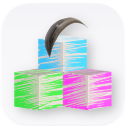

---
up:
  - "[[collection-site-item|collection-site-item]]"
title: "Difegue/LANraragi: Web application for archival and reading of manga/doujinshi. Lightweight and Docker-ready for NAS/servers."
title-slugified: lanraragi
url: https://github.com/Difegue/LANraragi
icon: "[[site-item-lanraragi.png]]"
description: 'application for archival and reading of manga/doujinshi. Lightweight and Docker-ready for NAS/servers.  `{"link":"lrr.tvc-16.science","Topics": "docker server perl management manga comics reader mojolicious opds doujinshi nas hacktoberfest sadpanda"}`'
categories:
  - "[[site-category-acg|acg]]"
  - "[[site-category-reader|reader]]"
aliases:
  - lanraragi
ctime: 2026-01-09T22:19:24+08:00
mtime: 2026-01-09T22:19:24+08:00
---

# site-item-lanraragi

> see: [Difegue/LANraragi: Web application for archival and reading of manga/doujinshi. Lightweight and Docker-ready for NAS/servers.](https://github.com/Difegue/LANraragi)

application for archival and reading of manga/doujinshi. Lightweight and Docker-ready for NAS/servers.  `{"link":"lrr.tvc-16.science","Topics": "docker server perl management manga comics reader mojolicious opds doujinshi nas hacktoberfest sadpanda"}`

