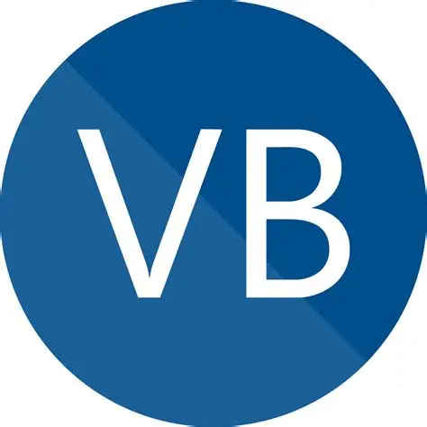

---
up:
  - "[[collection-site-item|collection-site-item]]"
title: Visual Basic docs - get started, tutorials, reference. - Visual Basic | Microsoft Learn
title-slugified: visual-basic
url: https://learn.microsoft.com/en-us/dotnet/visual-basic/
icon: "[[site-item-visual-basic.webp]]"
description: Visual Basic is an object-oriented programming language developed by Microsoft. Using Visual Basic makes it fast and easy to create type-safe .NET apps.
categories:
  - "[[site-category-programming-language|programming-language]]"
aliases:
  - visual-basic
ctime: 2026-01-27T21:45:23+08:00
mtime: 2026-01-27T21:45:23+08:00
---

# site-item-visual-basic

> see: [Visual Basic docs - get started, tutorials, reference. - Visual Basic | Microsoft Learn](https://learn.microsoft.com/en-us/dotnet/visual-basic/)

Visual Basic is an object-oriented programming language developed by Microsoft. Using Visual Basic makes it fast and easy to create type-safe .NET apps.

